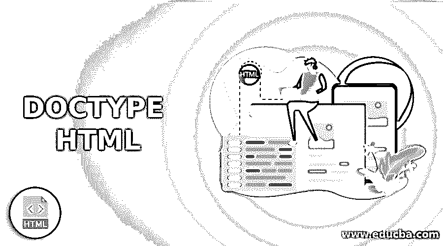
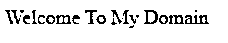
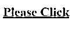
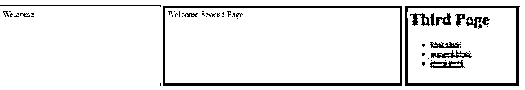

# DOCTYPE HTML

> 原文：<https://www.educba.com/doctype-html/>




## DOCTYPE HTML 简介

以下文章提供了 DOCTYPE HTML 的概要。在 html 中，文档类型用于声明用户指令，并使用 html、xml 编码本身等标记语言将数据转换到 web 浏览器中。我们已经将文档类型声明为文档的初始步骤。通常，DOCTYPE 不考虑任何标签、元素或属性；它有助于识别标记语言的版本。标签是 html 标记语言的根标签或元素。它还有助于存储和保存所有的网页内容，并且它还将告诉用户浏览器识别它是否是 html 语言，但是在相同的网页浏览器上使用<doctype>会显示用户网页文档所使用的 html 语言的版本。</doctype>

### 什么是 DOCTYPE HTML？

*   DOCTYPE 只不过是一个文档类型声明，它是一组必须与特定的 html、xml 或 sgxml web 文档相关联的指令。
*   如果开发者省略了 DOCTYPE，那么 web 浏览器将倾向于使用不同类型的呈现模式，这可能与一些浏览器规范以及用户应用不兼容。
*   它还被标记为不包含结束标记的空元素，因此我们不能在<doctype>中包含任何逻辑内容。</doctype>
*   我们在 HTML 4.01 版本中使用声明，它也指相同的文档类型声明，因为 HTML 4.01 版本是基于 SGML 的，而在 HTML5 中不是基于 SGML 语言的。

**语法:**

<small>网页开发、编程语言、软件测试&其他</small>

当我们使用 HTML 或任何标记语言时，我们对每个标签和元素都有一套语法，就像在文档类型声明中一样。

下面是在 html 文档中声明<doctype>模型的基本语法。</doctype>

```
<!DOCTYPE html>
<html>
<head>
</head>
<body>
---Some Front End logic ,codes,tags,elements---
</body>
</html>
```

### 我们为什么要用 DOCTYPE HTML？

*   因为它是 HTML 版本所需要的，并且假设如果用户应用程序在那时有任何问题，我们很容易识别出根源，因为它确实发生在 Html 版本兼容性或用户浏览器兼容性中；此外，与当前和以前的版本相比，一些 html 标记可能会被弃用。
*   因此，用户可以根据 web 应用程序工作流轻松识别问题。
*   在 html 中，W3C 是 IETF 等组织中的一员，并且每个 html 页面都有一个唯一的标签“OwnerID ”,它表示负责创建或维护基于 DTD 的文档的 HTML 实体或组织的名称。
*   DTD 也称为“公共文本类”，它是一种对象类型，也引用了 html 标记和元素，这些标记和元素必须遵循 web 和浏览器支持。
*   HTM/XHTML DTD 都支持它。

### 在 HTML 中使用 DOCTYPE 的 HTML 的不同版本？

*   如果我们使用 strict 作为 DOCTYPE，它不允许使用 html 元素编写表示属性，而我们需要 web 应用程序中的要求，并且它不支持包含 html 框架。
*   Html 4.0 既有严格的 DOCTYPE，也有过渡的 DOCTYPE。
*   在严格文档类型中，用户将使用某些 html 元素和属性，而不允许和允许它们作为严格用户在严格文档类型中使用。
*   有时候 html 4.0 版本支持 frameset，每个 html 文档都必须在网页上创建了以上三种文档类型声明。
*   如果我们使用 html strict，那么文档类型包括所有 html 元素、属性，除了不被接受的不推荐使用的元素或标记。这些标签和元素的集合将出现在一个框架集中。
*   如果我们使用 html transitional，它也支持所有的 html 元素，包括不赞成使用的标签/元素。
*   在 html 框架集中，它支持我们在 html 过渡 dtd 中使用的所有 html 元素，以及用于声明框架集的元素。
*   在 html 5 中只支持一种声明类型，我们使用这种声明只允许用于 html 5 版本，但是在 html 4 中，我们将使用不同版本的 dtd 规范。
*   在 HTML 中，DOCTYPE 是不区分大小写的，所以我们使用 DOCTYPE 声明，它将被写成小写和大写字母。

### DOCTYPE HTML 的示例

下面是一些例子:

#### 示例#1

**代码:**

```
<!DOCTYPE html>
<html>
<head>
<title>Sample</title>
</head>
<body>
<p>Welcome To My Domain
</p>
</body>
</html>
```

**输出:**




#### 实施例 2

**代码:**

```
<!DOCTYPE HTML PUBLIC "-//W3C//DTD HTML 4.01//EN"
"http://www.w3.org/TR/html4/strict.dtd">
<html>
<head>
<title> Sample Example for Strict DTD </title>
</head>
<body>
<a href><h1>Please Click </h1></a>
<marquee> Welcome To My Domain </marquee>
</body>
</html>
```

**输出:**




#### 实施例 3

**代码:**

```
<!DOCTYPE HTML PUBLIC "-//W3C//DTD HTML 4.01 Frameset//EN"
"http://www.w3.org/TR/html4/frameset.dtd">
<html>
<head>
<title> Frameset DTD Example </title>
</head>
<frameset cols="23%,*,43%">
<frame src="first.html">
<frame src="second.html">
<frame src="third.html">
</frameset>
</html>
```

**输出:**




在上面的例子中，我们将看到 html 中的样本和基本 dtd 用法。在第一个例子中，我们使用 html5 版本下的。所以我们使用普通和基本的 html 编码。在第二个例子中，我们在 html 4 版本中使用严格的 dtd，因此它将接受特定的标签和元素；在第二个示例中不允许使用不推荐使用的标签元素，但是在最后一个示例中，我们在 html 文档中使用框架集 dtd。它允许不推荐使用的元素以及我们使用的任何 html 4 过渡 dtd 元素，并且还将包括框架集标签元素。

### 结论

在 html 中将使用 DOCTYPE 作为创建基于 web 的应用程序的更好选择，并且对于网站用户浏览器来说，文档与基于 html 的文档相关联也是有帮助的。如果我们假设不会在文档内部使用 html 标记元素，那么应该用 DOCTYPE 声明，它一定必须借助 web 浏览器使用 html 标准，并且模板会检查 html 标准。

### 推荐文章

这是一个 DOCTYPE HTML 的指南。这里我们讨论引言；什么是 DOCTYPE HTML？为什么我们使用 DOCTYPE HTML？我们在 HTML 中使用 DOCTYPE 的 HTML 的不同版本？还有例子。您也可以看看以下文章，了解更多信息–

1.  [在 HTML 中链接页面](https://www.educba.com/linking-pages-in-html/)
2.  [HTML 中的框架标签](https://www.educba.com/frame-tag-in-html/)
3.  [HTML 地理定位](https://www.educba.com/html-geolocation/)
4.  [HTML 文本装饰](https://www.educba.com/html-text-decoration/)


