# 在 HTML 中移动文本

> 原文：<https://www.educba.com/moving-text-in-html/>

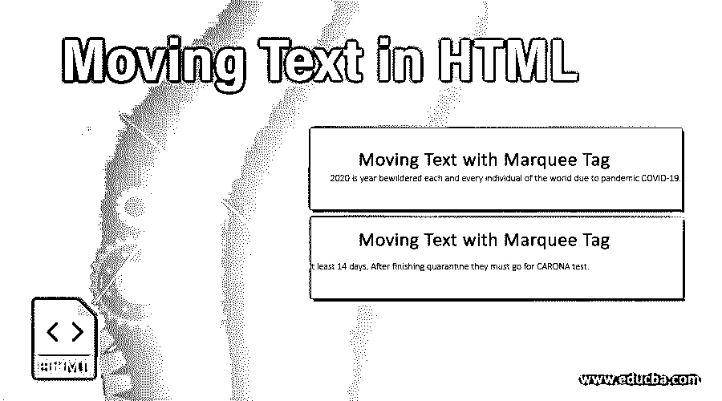


## HTML 中移动文本简介

在 HTML 中移动文本也被称为滚动文本。我们可以以一定的时间间隔向各个方向滚动文本。<marquee>标记用于进行下一步移动。有 4 个方向可以滚动文本，如向左、向右、向上和向下。通过设置行为属性在封闭区域内移动文本。</marquee>

**实时示例:**假设我们的网站上经常有重要的更新内容。如果内容总是稳定的，用户就不能关注这些内容，所以为了获得用户的注意，我们必须总是滚动更新的内容。根据用户的要求，我们可以给出方向的一面内容滚动。达到这个要求<使用的是**的字幕>标记。**

<small>网页开发、编程语言、软件测试&其他</small>

### 为什么我们在 HTML 中使用 CSS？

提供所有页面之间的公共逻辑；我们使用 CSS 文件来编写公共逻辑，而不是在每个 HTML 页面中编写相同样式的逻辑。并在每个带有<link>标签的 HTML 页面中包含这个 CSS 页面。

### HTML 中的 Marquee 标签是如何工作的？

可以通过应用<marquee>来移动内容。如果我们在 marquee 标签中设置了方向属性，那么基于方向，属性值内容将会移动。</marquee>

**语法#1**

```
<marquee>
//some text to move
</marquee>
```

**语法#2**

```
<marquee direction=”left or right or up or down”>
//some text to move
</marquee>
```

**语法#3**

```
<marquee behavior="alternate"> //it makes the text back direction by touching the border of the page.
//some text to move
</marquee>
```

**语法#4**

```
<marquee direction=”left” scrollamount="5">// scrollamount used to set the scrolling text speed
//some text to move
</marquee>
```

**Note:** Default marquee direction is right to leave if we did not provide any direction property.

### 在 HTML 中实现移动文本的例子

下面是提到的例子:

#### 示例#1

默认字幕标签

**代码:**

```
<!DOCTYPE html>
<html>
<head>
<title>Move Text</title>
<style>
body {
background-color: green;
text-align: center;
color: white;
font-family: Arial;
}
</style>
</head>
<body>
<h1>Moving Text with Marquee Tag</h1>
<marquee>
2020 is year bewildered each and every individual of the world due to pandemic COVID-19\. This disease is caused by CARONA virus. Till date there is no medicine or vaccine for this disease. So the only option in our hands is to follow instructions strictly announced by World Health Organization. Italy is affected with this virus more worsen because of there is no initial preventive measures in the country. Fight back against the virus every individual should home quarantine. Clean the hands every time if are out from the same place. Strictly say no to hand shake instead respect them back with namaskar. Do not contact any person until state and center curfew is over. Now India also greatly affected by this COVID-19 virus because of foreigners. Who ever come to India from other country they must undergone to quarantine at least 14 days. After finishing quarantine they must go for CARONA test.
</marquee>
</body>
</html>
```

**输出:**

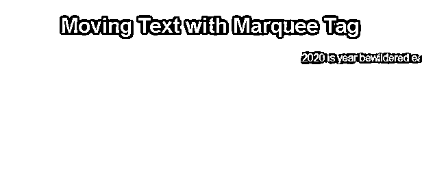


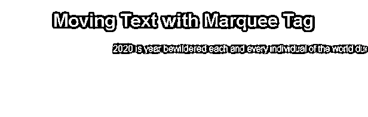


**解释:**正如你在上面的文字中看到的从右向左移动，即使我们没有提到任何方向，所以它是默认的 marquee 标签。

#### 实施例 2

正确方向上的 Marquee 标记。

**代码:**

```
<!DOCTYPE html>
<html>
<head>
<title>Move Text</title>
<style>
body {
background-color: maroon;
text-align: center;
color: white;
font-family: Arial;
}
</style>
</head>
<body>
<h1>Moving Text with Marquee Tag</h1>
<marquee direction="right">
2020 is year bewildered each and every individual of the world due to pandemic COVID-19\. This disease is caused by CARONA virus. Till date there is no medicine or vaccine for this disease. So the only option in our hands is to follow instructions strictly announced by World Health Organization. Italy is affected with this virus more worsen because of there is no initial preventive measures in the country. Fight back against the virus every individual should home quarantine. Clean the hands every time if are out from the same place. Strictly say no to hand shake instead respect them back with namaskar. Do not contact any person until state and center curfew is over. Now India also greatly affected by this COVID-19 virus because of foreigners. Who ever come to India from other country they must undergone to quarantine at least 14 days. After finishing quarantine they must go for CARONA test.
</marquee>
</body>
</html>
```

**输出:**


**解释:**从上面的文字中可以看到，通过将 direction 属性设置为右，从左向右移动。

#### 实施例 3

顶部方向的选取框

**代码:**

```
<!DOCTYPE html>
<html>
<head>
<title>Move Text</title>
<style>
body {
background-color: blue;
text-align: center;
color: white;
font-family: Arial;
}
</style>
</head>
<body>
<h1>Moving Text with Marquee Tag</h1>
<marquee direction="up">
2020 is year bewildered each and every individual of the world due to pandemic COVID-19\. This disease is caused by CARONA virus. Till date there is no medicine or vaccine for this disease. So the only option in our hands is to follow instructions strictly announced by World Health Organization. Italy is affected with this virus more worsen because of there is no initial preventive measures in the country. Fight back against the virus every individual should home quarantine. Clean the hands every time if are out from the same place. Strictly say no to hand shake instead respect them back with namaskar. Do not contact any person until state and center curfew is over. Now India also greatly affected by this COVID-19 virus because of foreigners. Who ever come to India from other country they must undergone to quarantine at least 14 days. After finishing quarantine they must go for CARONA test.
</marquee>
</body>
</html>
```

**输出:**


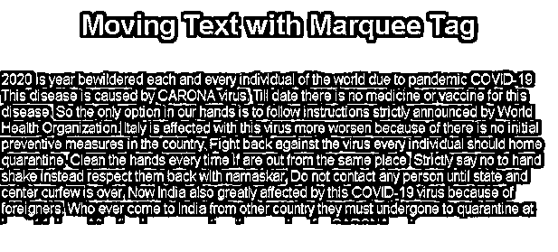


**解释:**从上面的文字中可以看到，通过将 direction 属性设置为 up，从下往上移动。

#### 实施例 4

底部方向的选取框。

**代码:**

```
<!DOCTYPE html>
<html>
<head>
<title>Move Text</title>
<style>
body {
background-color: orange;
text-align: center;
color: white;
font-family: Arial;
}
</style>
</head>
<body>
<h1>Moving Text with Marquee Tag</h1>
<marquee direction="down">
2020 is year bewildered each and every individual of the world due to pandemic COVID-19\. This disease is caused by CARONA virus. Till date there is no medicine or vaccine for this disease. So the only option in our hands is to follow instructions strictly announced by World Health Organization. Italy is affected with this virus more worsen because of there is no initial preventive measures in the country. Fight back against the virus every individual should home quarantine. Clean the hands every time if are out from the same place. Strictly say no to hand shake instead respect them back with namaskar. Do not contact any person until state and center curfew is over. Now India also greatly affected by this COVID-19 virus because of foreigners. Who ever come to India from other country they must undergone to quarantine at least 14 days. After finishing quarantine they must go for CARONA test.
</marquee>
</body>
</html>
```

**输出:**

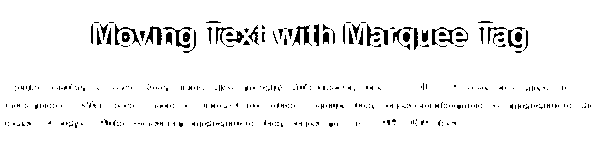


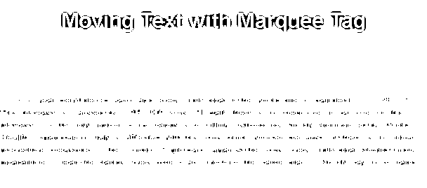


**解释:**从上面的文字中可以看到，通过将 direction 属性设置为 down，从上到下移动。

#### 实施例 5

带有行为属性的字幕。

**代码:**

```
<!DOCTYPE html>
<html>
<head>
<title>Move Text</title>
<style>
body {
background-color: lightblue;
text-align: center;
color: brown;
font-family: Arial;
border: solid 2px red;
}
</style>
</head>
<body>
<h1>Moving Text with Marquee Tag</h1>
<marquee behavior="alternate">
Hi, I am an alternate proeprty
</marquee>
</body>
</html>
```

**输出:**

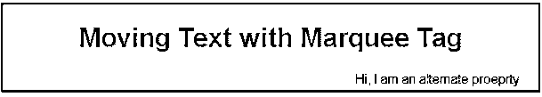


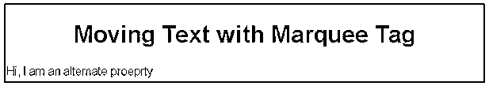


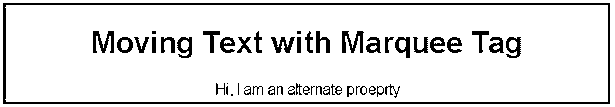


**解释:**在上面的文字中可以看到，通过将 behavior 属性设置为 alternate，通过触摸边框从左向右和从右向左移动。

#### 实施例 6

带有滚动量属性的字幕。

**代码:**

```
<!DOCTYPE html>
<html>
<head>
<title>Move Text</title>
<style>
body {
background-color: fuchsia;
text-align: center;
color: white;
font-family: Arial;
border: solid 2px red;
}
</style>
</head>
<body>
<h1>Moving Text with Marquee Tag</h1>
<marquee direction="left" scrollamount="2">
Paramesh
</marquee>
<marquee scrollamount="4">
Amardeep
</marquee>
<marquee scrollamount="6">
Harinath-Rajitha
</marquee>
</body>
</html>
```

**输出:**

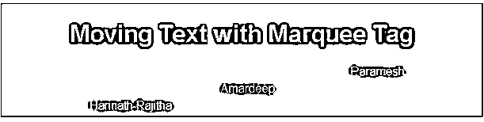


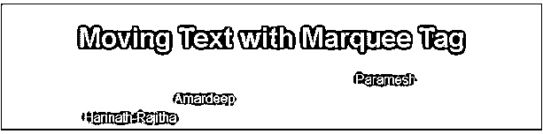


**解释:**正如你在上面的文字中看到的从右向左移动的时间不同，所以它们都在不同的位置。

### 结论

通过 marquee 标签在 HTML 中移动文本。我们可以根据需要左右上下移动文本。电视频道通常使用这种字幕功能进行定期更新，以吸引用户的注意力。

### 推荐文章

这是一个在 HTML 中移动文本的指南。这里我们讨论一个介绍，marquee 标签如何与语法和例子一起工作来实现。您也可以浏览我们的其他相关文章，了解更多信息——

1.  [HTML 地理定位](https://www.educba.com/html-geolocation/)
2.  [HTML 中的框架标签](https://www.educba.com/frame-tag-in-html/)
3.  [HTML 隐藏元素](https://www.educba.com/html-hide-element/)
4.  [HTML Tooltip](https://www.educba.com/html-tooltip/)


