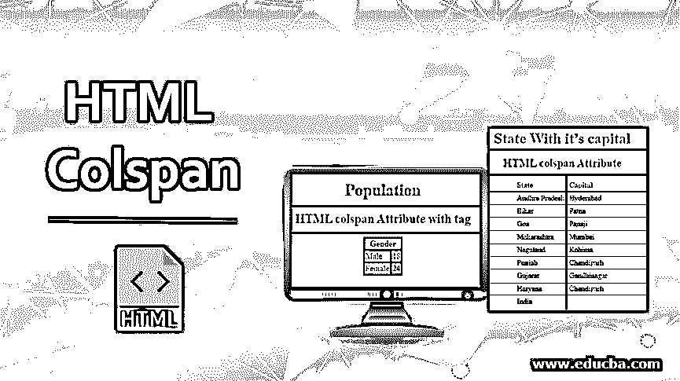
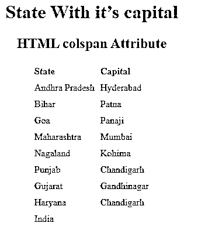
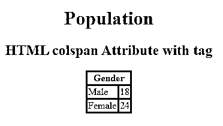
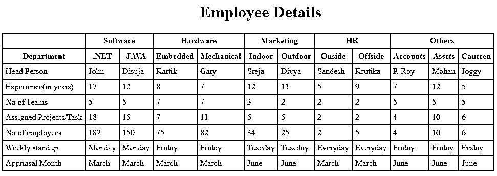
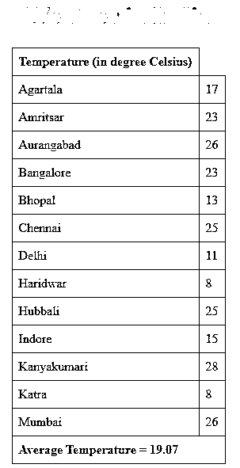
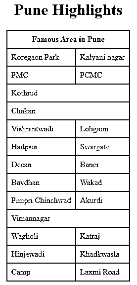

# HTML 栏跨度

> 原文：<https://www.educba.com/html-colspan/>




## HTML Colspan 简介

HTML Colspan 是表中用于将列划分到单元格中的属性。它允许用户将单个表格单元格划分为一个或多个单元格或列的宽度。[HTML 的这个属性作为一个](https://www.educba.com/html-attributes/)合并单元格选项包含在电子表格中，和 excel 一样。此属性用于描述由各个列划分的实际列数。

像and<td.>这样的表元素中使用了 colspan 表属性。我们将在 colspan 属性中定义的值必须始终是正整数。它将支持像 textarea 和 frameset 元素这样的属性。</td.>

<small>网页开发、编程语言、软件测试&其他</small>

HTML 中的 colspan 属性可以如下使用 **:**

**语法:**

```
<td colspan="value">table content…</td>
```

*   上面的语法状态是标签用来定义将要跨越的列的数量。语法中的 value 属性用于计算用于填充单元格的列数。
*   该值必须是正整数。

**语法:**

```
<th colspan="value">table content…</th>
```

*   当用户想要使用带有标签的 colspan 属性时，使用上面的语法。它定义了将要跨越的标题单元格的数量。
*   这种属性化在 HTML 代码中作为内联属性工作。
*   HTML cols 属性将支持不同的属性，如 textarea 和 frameset 元素。

**语法:**

```
<ElementName cols="value">……………….</ElementName>
```

*   在上面的语法中，ElementName 是 HTML 元素支持的一种元素。Value 是为 frameset 属性定义多长度[值的属性，而 number 是为 textarea 定义的。](https://www.educba.com/html-frameset-tag/)

### 如何在 HTML 中实现 Colspan？

下面解释 HTML 中 colspan 的代码实现。

#### 1.使用Colspan in the HTML of the tag

**代码:**

```
<!DOCTYPE html>
<html>
<head>
<title>HTML colspan Attribute with <td> tag</title>
<style>
table, th, td {
border: 2 px solid blue;
border-collapse: collapse;
padding: 5px;
text-align:left;
}
</style>
</head>
<body>
<center>
<h1 style="color: blue;">State With it’s capital </h1>
<h2>HTML colspan Attribute</h2>
<table>
<tr>
<th>State </th>
<th>Capital </th>
</tr>
<tr>
<td>Andhra Pradesh</td>
<td>Hyderabad</td>
</tr>
<tr>
<td>Bihar </td>
<td>Patna</td>
</tr>
<tr>
<td>Goa </td>
<td>Panaji</td>
</tr>
<tr>
<td>Maharashtra </td>
<td>Mumbai </td>
</tr>
<tr>
<td>Nagaland</td>
<td>Kohima </td>
</tr>
<tr>
<td>Punjab </td>
<td>Chandigarh </td>
</tr>
<tr>
<td> Gujarat</td>
<td> Gandhinagar</td>
</tr>
<tr>
<td>Haryana </td>
<td>Chandigarh </td>
</tr>
<tr>
<td colspan="2">India</td>
</tr>
</table>
</center>
</body>
</html>
```

**输出:**




#### 2.使用Colspan in the HTML of the tag

**代码:**

```
<!DOCTYPE html>
<html>
<head>
<title>HTML colspan Attribute</title>
<style>
table,
th,
td {
border: 3px solid red;
border-collapse: collapse;
}
</style>
</head>
<body>
<center>
<h1 style="color: grey;">Population</h1>
<h2>HTML colspan Attribute with <th> tag</h2>
<table>
<tr>
<th colspan="2">Gender</th>
</tr>
<tr>
<td>Male</td>
<td>18</td>
</tr>
<tr>
<td>Female</td>
<td>24</td>
</tr>
</table>
</center>
</body>
</html>
```

**输出:**




### HTML 列跨度的示例

以下是不同的例子。

#### 示例#1

这个例子说明了 colspan 属性将与表头和Labels are used together. Divide its column into two parts, as shown in the following example:

**HTML 代码:**

```
<!DOCTYPE html>
<html>
<head>
<style>
table,
th,
td {
border: 2px solid blue;
border-collapse: collapse;
padding:5px;
}
</style>
</head>
<body>
<table>
<h1 style="text-align: center;">Employee Details</h1>
<tr>
<th colspan="1"></th>
<th colspan="2">Software</th>
<th colspan="2">Hardware</th>
<th colspan="2">Marketing</th>
<th colspan="2">HR</th>
<th colspan="3">Others</th>
</tr>
<tr>
<th >Department</th>
<th>.NET</th>
<th>JAVA</th>
<th>Embedded</th>
<th>Mechanical</th>
<th>Indoor</th>
<th>Outdoor</th>
<th>Onside</th>
<th>Offside</th>
<th>Accounts</th>
<th>Assets</th>
<th>Canteen</th>
</tr>
<tr>
<td>Head Person</td>
<td>John</td>
<td>Disuja</td>
<td>Kartik</td>
<td>Gary</td>
<td>Sreja</td>
<td>Divya</td>
<td>Sandesh</td>
<td>Krutika</td>
<td>P. Roy</td>
<td>Mohan</td>
<td>Joggy</td>
</tr>
<tr>
<td>Experience(in years)</td>
<td>17</td>
<td>12</td>
<td>8</td>
<td>7</td>
<td>12</td>
<td>11</td>
<td>5</td>
<td>9</td>
<td>7</td>
<td>12</td>
<td>5</td>
</tr>
<tr>
<td>No of Teams</td>
<td>5</td>
<td>5</td>
<td>7</td>
<td>7</td>
<td>3</td>
<td>2</td>
<td>2</td>
<td>2</td>
<td>5</td>
<td>5</td>
<td>5</td>
</tr>
<tr>
<td>Assigned Projects/Task</td>
<td>18</td>
<td>15</td>
<td>7</td>
<td>11</td>
<td>5</td>
<td>5</td>
<td>2</td>
<td>2</td>
<td>4</td>
<td>10</td>
<td>6</td>
</tr>
<tr>
<td>No of employees</td>
<td>182</td>
<td>150</td>
<td>75</td>
<td>82</td>
<td>34</td>
<td>25</td>
<td>2</td>
<td>5</td>
<td>4</td>
<td>10</td>
<td>6</td>
</tr>
<tr>
<td>Weekly standup</td>
<td>Monday</td>
<td>Monday</td>
<td>Friday</td>
<td>Friday</td>
<td>Tuseday</td>
<td>Tuseday</td>
<td>Everyday</td>
<td>Everyday</td>
<td>Friday</td>
<td>Friday</td>
<td>Friday</td>
</tr>
<tr>
<td>Appriasal Month</td>
<td>March</td>
<td>March</td>
<td>March</td>
<td>March</td>
<td>June</td>
<td>June</td>
<td>March</td>
<td>March</td>
<td>June</td>
<td>June</td>
<td>June</td>
</tr>
</table>
</body>
</html>
```

**输出:**




#### 实施例 2

在本例中，我们将解释如何使用 colspan 标记来划分列，以及使用 colspan 标记的实际输出将如下所示:

**HTML 代码:**

```
<!DOCTYPE html>
<html>
<head>
<title>HTML colspan Attribute</title>
<style>
table,
th,
td {
border: 1px solid black;
border-collapse: collapse;
padding:8px;
}
</style>
</head>
<body>
<center>
<h1 style="color: greenyellow;">Weather in India</h1>
<table>
<tr>
<th> Temperature  (in degree Celsius)</th>
</tr>
<tr>
<td >Agartala</td>
<td >17</td>
</tr>
<tr>
<td>Amritsar</td>
<td>23</td>
</tr>
<tr>
<td>Aurangabad</td>
<td>26</td>
</tr>
<tr>
<td>Bangalore</td>
<td>23</td>
</tr>
<tr>
<td>Bhopal</td>
<td>13</td>
</tr>
<tr>
<td>Chennai</td>
<td>25</td>
</tr>
<tr>
<td>Delhi</td>
<td>11</td>
</tr>
<tr>
<td>Haridwar</td>
<td>8</td>
</tr>
<tr>
<td>Hubbali</td>
<td>25</td>
</tr>
<tr>
<td>Indore</td>
<td>15</td>
</tr>
<tr>
<td>Kanyakumari</td>
<td>28</td>
</tr>
<tr>
<td>Katra</td>
<td>8</td>
</tr>
<tr>
<td>Mumbai</td>
<td>26</td>
</tr>
<tr>
<td colspan="2"><b>Average Temperature = 19.07</b></td>
</tr>
</table>
</center>
</body>
</html>
```

**输出:**

**

** 

#### 实施例 3

在这个例子中，我们将在 < th >和< td >标签中使用 colspan HTML 标签。这个属性也允许同时使用两个标签。下面是示例的代码，输出将生成相同的。

**HTML 代码:**

```
<!DOCTYPE html>
<html>
<head>
<title>HTML colspan Attribute</title>
<style>
table,
th,
td {
border: 2px solid black;
border-collapse: collapse;
padding:8px;
}
</style>
</head>
<body>
<center>
<h1 style="color:deepskyblue;">Pune Highlights</h1>
<table>
<tr>
<th colspan="2"> Famous Area in Pune</th>
</tr>
<tr>
<td colspan="1">Koregaon Park</td>
<td >Kalyani nagar</td>
</tr>
<tr>
<td colspan="1">PMC</td>
<td >PCMC</td>
</tr>
<tr>
<td colspan="2">Kothrud</td>
</tr>
<tr>
<td colspan="2">Chakan</td>
</tr>
<tr>
<td colspan="1">Vishrantwadi</td>
<td >Lohgaon</td>
</tr>
<tr>
<td colspan="1">Hadpsar</td>
<td >Swargate</td>
</tr>
<tr>
<td colspan="1">Decan</td>
<td >Baner</td>
</tr>
<tr>
<td colspan="1">Bavdhan</td>
<td >Wakad</td>
</tr>
<tr>
<td colspan="1">Pimpri Chinchwad</td>
<td >Akurdi</td>
</tr>
<tr>
<td colspan="2" >Vimannagar </td>
</tr>
<tr>
<td colspan="1">Wagholi</td>
<td >Katraj</td>
</tr>
<tr>
<td colspan="1">Hinjewadi</td>
<td >Khadkwasla</td>
</tr>
<tr>
<td colspan="1">Camp</td>
<td >Laxmi Road</td>
</tr>
</table>
</center>
</body>
</html>
```

**输出:**




### 结论

*   从以上所有信息中，我们了解到 HTML colspan 是将在表格中使用的属性，以及文本区域和框架集属性。
*   它根据用户需求将表格列分成一个或多个单元格。这个属性将支持和标签。其中包含的值总是正整数。

### 推荐文章

这是一个 HTML 栏的指南。这里我们讨论一下入门以及如何实现 HTML colspan？并附有适当的例子。你也可以看看下面的文章来了解更多-

1.  [HTML 中的表格边框](https://www.educba.com/table-border-in-html/)
2.  [在 HTML 中引用标签](https://www.educba.com/cite-tag-in-html/)
3.  [HTML 格式的数据表](https://www.educba.com/datalist-in-html/)
4.  [HTML 中的 Span 标签](https://www.educba.com/span-tag-in-html/)


