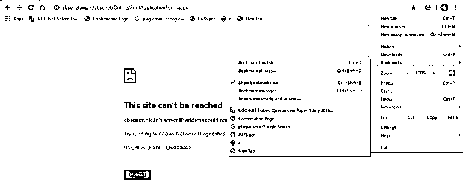
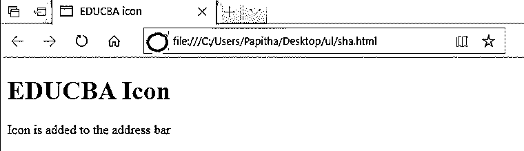

# HTML 收藏夹图标

> 原文：<https://www.educba.com/html-favicon/>


## HTML 网页图标简介

Favicon 是 favourites 图标的缩写，也称为书签图标，可以定义为带有。ico 文件扩展名，不与任何其他。bmp 或者。gif 文件通常出现在地址栏中，带有经常访问的 URL 的个性化图像，有助于广告、促销或作为标准商标，同时在像谷歌、脸书这样的网站中发挥重要作用，我们注意到地址栏左侧有一个小徽标，它具有专业的外观，并出现在用户的收藏夹书签中，也没有 favicon 图标。网站仍然是通用的网页图标，并作为收藏夹图标的快捷方式。

示例实时示例如下所示。单击书签中的收藏夹会显示典型图标。甚至一些使用 XML 和搜索引擎的 Web 服务也利用了 favicon 的独特性。

<small>网页开发、编程语言、软件测试&其他</small>




**语法:**

下面给出了链接到网页的基本 meta 标签。

```
<link rel="icon" href="image path"  type="image/icon type">
```

在上面的语法中，图像路径被替换为 favicon.ico 的实际位置，它可能位于图像目录中。最后一个值类型是 MIME 格式的文件。这里使用的图像可以是任何类型，但是 GIF 格式被声明为更高级。

### 如何创建 HTML 网页图标？

网站设计者创建自己的个性化图标，并使它们与网页相关联。这有两种方法，浏览器支持在特定浏览器的地址栏中显示一个 favicon。其次，有了选项卡式的文档界面，就显示在下一个链接中。甚至是从自己的硬盘里挑选出来的。最重要的是，图标必须使用(。ico)文件格式，很少有免费的服务来转换图像。

一旦开发者完成了网站的设计，就会添加一个图标。简单地说，它用一个正式的网页图标替换了浏览器标签上的一个空白文档图标。这有助于他更容易地创建网站或寻找网站，因为我们知道，最受欢迎的搜索引擎 google 是由用户通过其徽标主题来识别或留下印象的。由于图标太小，它应该清晰，便于用户理解。有不同的方法来创建一个图标。方法 1–使用文件管理器自动生成，方法 2:上传常规图像。

创建 favicon.ico 的步骤。这是一个简单的登陆过程:

1.  生成大小为 16×16 像素的图像(图像的识别)。在这里，可以调整大小，使图像变得很小，以便用作 favicon。
2.  转换为 favicon.ico 文件格式，以便浏览器理解。
3.  将生成的图标上传到网站。
4.  下一步是将代码添加到 HTML 中。甚至 favicon 也可以作为桌面或者苹果图标使用。

### 如何在 HTML 文件中插入 Favicon？

favicon 的创建也可以用 gif 或。png 格式。问题可能会出现，为什么我们需要一个网站图标？答案很简单，在全球范围内推广和营销我们的网站。这个小图标使网页更加专业。Favicon 以一种简单的方式添加到 HTML 文件中，并且必须具有以下特征，在任何时候，你都可以在网站上添加或更改 favicon。

*   **带有文件格式的标准名称:**一旦图像被创建并命名，默认有一个 favicon.ico (ICO 文件用 X-ICON 编辑器完成)。
*   **图像文件大小** :16 * 16，64 * 64，128 * 128 像素，并且文件不能超过 100KB。
*   颜色:也许 8 口，24 口或 32 口
*   **图片:**应为 gif 或 png 格式。

favicon 放在元素之间，它代替了一个图像位置。它使用一个链接标签来定义文件的链接。它利用了两个属性，rel 和 href。我们可以利用 photoshop 的插件和其他在线生成器将图像文件转换成。ico 格式。

图标位置路径:这是一个标准实现。

```
<link rel=" icon" ……….../>      // It installs variety of icons.
<link rel =" Shortcut icon" href=……….../>   // here in the link attribute shortcut installs its own address bar icon.
```

下一个代码用于 IOS 用户:

```
<link rel =" apple-touch -icon" sizes ="180 x 180  href=……….../>
```

下面是一个代码示例，我们可以在 HTML 代码中使用它。

**举例:**

```
<!-- HTML code demo to display an icon in an address bar-->
<!DOCTYPE html>
<html>
<head>
<meta charset = "utf-8" />
<title>
EDUCBA  icon
</title>
<link rel = "icon" href =https://favi.png  type = "image/x-icon">
</head>
<body>
<h1 style = "color:blue;">
EDUCBA Icon
</h1>
<p>
Icon is added to the address bar
</p>
</body>
</html>
```

**输出:**




**代码解释:**在上面的代码中，我已经创建了一个小的椭圆形图标，并将其转换为 favicon。需要注意的是，图标显示在 Internet Explorer 中，而在许多浏览器中，它不支持它。IE 从根目录获取图标。如果 HTML 文件中没有指定的路径，服务器响应将显示 404 错误。要做到这一点，可能有必要清空你的网站的缓存来更新图标，因为网络浏览器在持久保存缓存的图标方面非常强大。

**Note:** Although with the successful completion of the favicon creation, it is not visible in all the browser tab. The good compatibility is with Internet Explorer 5.0+, Netscape 7.0 +. Most of modern browsers support different graphical formats as their favicon. The problem arises with the situation when a server is not well configured: It is necessary to create the root has type= “image/x-icon .ico format.

### 结论

最后，favicon 徽标在网站开发中起着至关重要的作用，我们也看到了创建 favicon 的各种方法，从而实现了跨浏览器的兼容性。此图标有助于创建域名的可视化规范。将它们添加到网站非常容易，因为它们指导网站识别和品牌推广，并帮助网站设计者标记他们的专业性。

### 推荐文章

这是一个 HTML 网页图标的指南。在这里，我们讨论定义以及如何创建和插入一个 HTML favicon 以及一个不同的例子和它的代码实现。您也可以阅读以下文章，了解更多信息——

1.  [实现 HTML samp 标签的例子](https://www.educba.com/html-samp-tag/)
2.  [不同 HTML 实体概述](https://www.educba.com/html-entities/)
3.  [HTML 中的选项标签|属性|示例](https://www.educba.com/option-tag-in-html/)
4.  [HTML 居中对齐示例](https://www.educba.com/html-align-center/)


