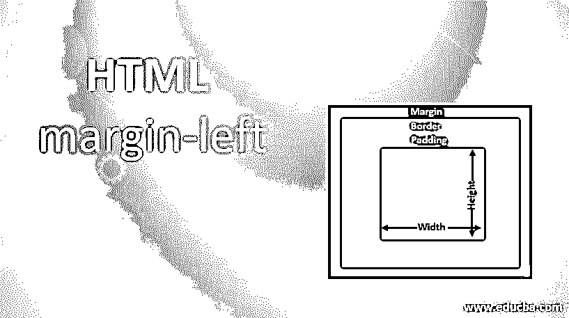
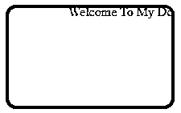
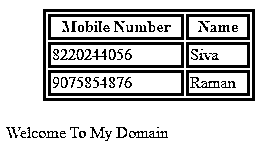
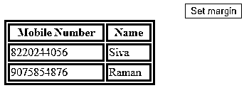
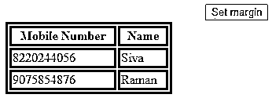

# HTML 页边距-左侧

> 原文：<https://www.educba.com/html-margin-left/>




## HTML 页边距介绍-左侧

HTML margin-left 设置元素左侧的空白区域。HTML 有许多预定义的标签，用于更有效地创建网页，此外，CSS 样式在网站中是模式高级和装饰性的。通过使用这一术语，用户将更频繁地吸引网站，因此从商业角度来看这是有帮助的。Html 边距属性是帮助创建 HTML 网页屏幕外部空间的特性之一，此外，它们还有一些不同的类型，如左边距、右边距、上边距、下边距；这些是决定网页上轮廓空间布局的一些类型。每种类型都有自己可能的长度值。

**语法** **:**

<small>网页开发、编程语言、软件测试&其他</small>

根据我们在文档中使用的位置，Html 页边距有不同的样式。如果我们使用 HTML 页边空白，CSS 样式的文档，它是用于页边空白的。

```
<html>
<head>
<style>
div
{
Margin:values;
}
</style>
</head>
</html>
```

以上代码是我们将在网页中讨论的 HTML 边距样式的基本语法。在 HTML 中，dom 模式主要用于在 codes.Html 页边距后端工作的 HTML 对象，它依赖于将应用于网页文档的具有不同页边距集合的元素。我们可以使用 javascript 函数在网页上自动设置边距。

### HTML 左边距是如何工作的？

在 HTML 和 CSS 中，边距使用 HTML 和 CSS 标准样式单位指定固定长度；甚至负值也允许出现在网页中。在此之前，我们将设置 margin-left 属性，使其具有一些我们将在文档中分配的值或默认值。缺省值是“auto”，否则我们将把这些值声明为“inherit”、“length”和“percentage”，每个指定的值以及基于的一组不同的子值将使用左边距属性值。

长度将计算 CSS 单元的长度或固定长度。根据 HTML 块计算宽度和高度的百分比；此字段也允许负值。如果假设 margin 有一个 top value 属性，用户浏览器会将该值作为宽度的百分比；它不会指定块的高度。

用户浏览器将自动计算左边距值；这取决于文档或网页外部区域的可用空间。继承值用于 HTML 内容的父子关系，主要是用值指定左边距属性的宽度。当我们计算网页中 HTML 元素的高度和宽度时，我们主要不包括计算的边距；我们包括其他 HTML 元素，如填充、其他内容区域、边框等。只计算文档的 HTML 元素 margin-size 属性的可用空间。

如果我们在 HTML 中声明了两组边距，它将会冲突；假设我们分配了一个包含右边空白的块，浮点只有右边，另一个包含左边空白的块有相同的浮点，空白的第一个较大的点保持不变，它不改变值。块的较小的空白区域将被折叠，它不会正确地显示在网页上，它可能会在网页屏幕上消失。通常，边距本质上是透明的。

当 margin 将用作速记属性来指定 margin 作为宽度，而不是我们使用集群代码的其他类型 margin 规范时，因为在开发人员区域中读取代码会很困难，如果有时我们使用与另一个 margin 类型相同的 margin-bottom 值，即)在 CSS 样式中一个类被区分为另一个类。我们可以指定每个属性的可能长度值，只要我们在 HTML 标签元素中使用长度值是相等的，并且与文本字体和元素字体的高度相关。在浏览器中，兼容版本假定 IE 版本 3 的边距对象有一个指定的值，即默认值在 IE 4 中被添加到网页中，而以后版本的边距值在 HTML 文档中是绝对的。在 IE 4 版本的 HTML 表格元素and对象中不支持 margin 属性值，但在 IE 3 版本中可以。如果我们在 IE 4 版本中使用

或

标签将边距值应用于表格单元格。

### HTML 左边距示例

以下是 HTML 左边距的示例:

#### 示例#1

**代码:**

```
<html>
<head>
<style>
{
margin: 2;
}
div {
width: 210px;
height: 130px;
background:green;
border-radius: 13px;
}
.sample {
background-color: green;
margin-left: 3%;
}
.sample1 {
background-color: yelllow;
}
.sample2 {
background-color: solid green;
margin-left: -13%;
}
</style>
</head>
<body>
<div id="sample2">
<marquee> Welcome To My Domain</marquee>
</div>
</body>
</html>
```

**输出:**




#### 实施例 2

**代码:**

```
<html>
<head>
<style>
#sample {
width: 120%;
}
table, td, th {
border: 3px solid green;
}
table {
width: 212px;
float: left;
margin: 23px 42px;
}
</style>
</head>
<div id="sample">
<table>
<tr>
<th>Mobile Number</th>
<th>Name</th>
</tr>
<tr>
<td>8220244056</td>
<td>Siva</td>
</tr>
<tr>
<td>9075854876</td>
<td>Raman</td>
</tr>
</table>
<p>
<marquee>Welcome To My Domain</marquee>
</p>
</div>
</html>
```

**输出:**




#### 实施例 3

**代码:**

```
<html>
<head>
<style>
#sample {
width: 120%;
}
table, td, th {
border: 3px solid green;
}
table {
width: 212px;
float: left;
margin: 23px 42px;
}
</style>
</head>
<div id="sample">
<table>
<tr>
<th>Mobile Number</th>
<th>Name</th>
</tr>
<tr>
<td>8220244056</td>
<td>Siva</td>
</tr>
<tr>
<td>9075854876</td>
<td>Raman</td>
</tr>
</table>
<button type="button" onclick="samples()">Set margin</button>
</div>
<script>
function samples() {
document.getElementById("sample").style.margin-left = "11px 23px 34px 47px";
}
</script>
</html>
```

**输出:**







以上三个示例将给出 margin 属性的三种不同用法，第一个示例是用于 CSS 样式和 HTML 的基本 margin 属性，第二个示例将在 HTML 中创建表格并在网页中设置 margin-left 属性值，最后一个示例与上一个示例相同，但 javascript 会自动设置 margin 值。

### 结论

在 HTML 中，我们已经看到在 HTML 中 margin 属性类型为 margin-left；在此基础上，我们改变了 HTML 表格，图像和视频；此外，我们将在 HTML 文档中将布局对齐并设置为左边距。在浏览器兼容性方面，有些元素不支持 html5。

### 推荐文章

这是一个 HTML 左边距的指南。在这里，我们讨论一个关于 HTML 左边距和它的例子的简要概述，以及它的代码实现。您也可以浏览我们推荐的其他文章，了解更多信息——

1.  [HTML 样式属性](https://www.educba.com/html-style-attribute/)
2.  [HTML 框架](https://www.educba.com/html-frames/)
3.  [HTML 布局](https://www.educba.com/html-layout/)
4.  [HTML 居中对齐](https://www.educba.com/html-align-center/)


