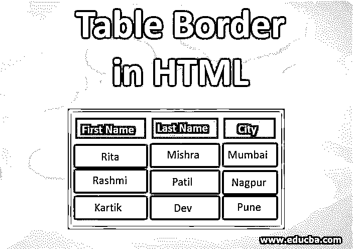
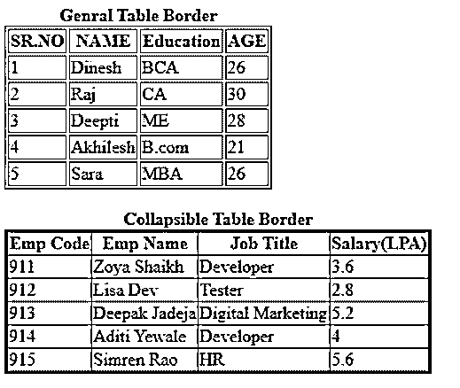
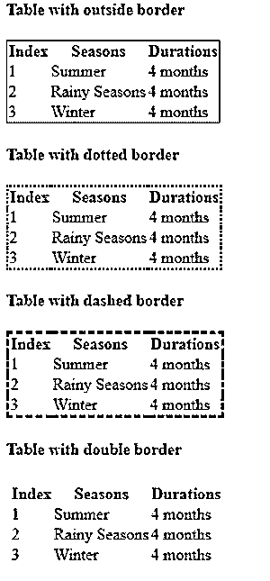
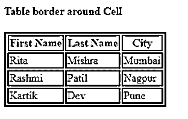

# HTML 中的表格边框

> 原文：<https://www.educba.com/table-border-in-html/>




## HTML 中表格边框的介绍

HTML 中的表格边框用于显示表格内容周围的边框。这可以在表格周围设置，方法是指定值 0 表示表格单元格周围不显示边框，而值 1 设置为在表格单元格周围显示边框。表格宽度可以用数字值来设置，以定义用户想要在他们的表格周围设置多厚的边框。可以为整个表格或特定的行或列设置边框，也可以只为表头设置边框；一切皆有可能。

### HTML 中表格边框的语法

定义表格边框有多种方法；让我们一个一个地看看它们的语法:

<small>网页开发、编程语言、软件测试&其他</small>

**1。通用表格边框:**这通常用于定义表格周围的简单边框，如:

```
<table border="1 | 0">
```

**举例:**

```
table, th, td{
border:1px solid blue;
}
```

**2。可折叠表格边框:**这个属性用于使用 border-collapse 属性在表格周围的一行中设置一个可折叠的边框。

```
table{
border-collapse: collapse;
}
```

**举例:**

```
table{
border-collapse: collapse;
}
table, th, td{
border:0px;
}
```

**3。表格周围的边框:**这个属性允许我们只在外部边缘添加表格边框，而不是添加到每个单独的表格单元格，简单地说就是:

```
table {
border : 1px;
}
```

**4。虚线表格边框:**只需使用下面的语法:

```
table{
border : 1px; dotted color-name;
}
```

**5。虚线表格边框:**和虚线一样，我们可以在表格或表格单元格周围设置虚线边框。这可以是薄的或厚的，由用户通过设置值来选择。

```
table{
border : 3px; dashed color-name;
}
```

**6。双表格边框:**如果我们想给我们的表格添加一个双轮廓，那么也可以通过在 CSS 代码中设置一个属性，给表格添加一个双边框。

```
table{
border : 1px; double color-name;
}
```

7 .**。表格单元格周围的表格边框:**这个语法帮助我们用您喜欢的颜色代码在单个单元格或任何特定的表格单元格周围给出一个边框。在这种语法中，我们希望为每个单元格分别添加边框代码值。

```
table{
border : 1px; dotted color-name;
}
th{
border : 1px; color-name;
}
td{
border : 2px; color-name;
}
```

**8。CSS 类的表格边框:**CSS 类帮助我们为表格提供公共边框代码，而不是为每个单独的表格单元格设置边框。这可以通过使用以下语法来完成:

```
<style>
table{
background-color: color-name;
}
table th{
CSS code
}
table td{
CSS code
}
</style>
```

**9。表格底部边框:**表格边框的这个属性用于在表格的 th 和 td 标签之间给出水平分隔线，如下所示:

```
th, td{
border-bottom: value color-name;
}
```

10。圆形表格边框:显示表格边框的圆角。

```
table{
border-radius: value;
border: value color-name;
}
```

### HTML 中表格边框的示例

以下是表格边框的示例

#### 示例#1

下面的示例显示了两个具有不同边框的不同表格。第一个表格显示了表格周围的正常边框，而第二个表格是可折叠表格边框格式的示例。

**HTML 代码:**

```
<html>
<head>
<style>
.collapsetable{
border-collapse: collapse;
border: 3px solid blue;
}
</style>
</head>
<body>
<table border="1">
<caption><b>Genral Table Border</b></caption>
<tr>
<th>SR.NO</th>
<th>NAME</th>
<th>Education</th>
<th>AGE</th>
</tr>
<tr>
<td>1</td>
<td>Dinesh</td>
<td>BCA</td>
<td>26</td>
</tr>
<tr>
<td>2</td>
<td>Raj</td>
<td>CA</td>
<td>30</td>
</tr>
<tr>
<td>3</td>
<td>Deepti</td>
<td>ME</td>
<td>28</td>
</tr>
<tr>
<td>4</td>
<td>Akhilesh</td>
<td>B.com</td>
<td>21</td>
</tr>
<tr>
<td>5</td>
<td>Sara</td>
<td>MBA</td>
<td>26</td>
</tr>
</table>
<br>
<table class="collapsetable" border="1">
<caption><b>Collapsible Table Border</b></caption>
<tr>
<th>Emp Code</th>
<th>Emp Name</th>
<th>Job Title</th>
<th>Salary(LPA)</th>
</tr>
<tr>
<td>911</td>
<td>Zoya Shaikh</td>
<td>Developer</td>
<td>3.6</td>
</tr>
<tr>
<td>912</td>
<td>Lisa Dev </td>
<td>Tester</td>
<td>2.8</td>
</tr>
<tr>
<td>913</td>
<td>Deepak Jadeja</td>
<td>Digital Marketing</td>
<td>5.2</td>
</tr>
<tr>
<td>914</td>
<td>Aditi Yewale</td>
<td>Developer</td>
<td>4</td>
</tr>
<tr>
<td>915</td>
<td>Simren Rao</td>
<td>HR</td>
<td>5.6</td>
</tr>
</table>
</body>
</html>
```

**输出:**




#### 实施例 2

此示例显示如何仅为具有不同表格边界类型的外部零件设置表格边界:

**HTML 代码:**

```
<head>
<style>
table{
border: 1px solid red;
border-collapse: collapse;
}
</style>
</head>
<body>
<h4>Table with outside border</h4>
<table>
<tr>
<th>Index</th>
<th>Seasons</th>
<th>Durations</th>
</tr>
<tr>
<td>1</td>
<td>Summer</td>
<td>4 months</td>
</tr>
<tr>
<td>2</td>
<td>Rainy Seasons</td>
<td>4 months</td>
</tr>
<tr>
<td>3</td>
<td>Winter</td>
<td>4 months</td>
</tr>
</table>
<h4>Table with dotted border</h4>
<table style="border:2px dotted blue;">
<tr>
<th>Index</th>
<th>Seasons</th>
<th>Durations</th>
</tr>
<tr>
<td>1</td>
<td>Summer</td>
<td>4 months</td>
</tr>
<tr>
<td>2</td>
<td>Rainy Seasons</td>
<td>4 months</td>
</tr>
<tr>
<td>3</td>
<td>Winter</td>
<td>4 months</td>
</tr>
</table>
<h4>Table with dashed border</h4>
<table style="border:3px dashed green;">
<tr>
<th>Index</th>
<th>Seasons</th>
<th>Durations</th>
</tr>
<tr>
<td>1</td>
<td>Summer</td>
<td>4 months</td>
</tr>
<tr>
<td>2</td>
<td>Rainy Seasons</td>
<td>4 months</td>
</tr>
<tr>
<td>3</td>
<td>Winter</td>
<td>4 months</td>
</tr>
</table>
<h4>Table with double border</h4>
<table style="border:4px double yellow;">
<tr>
<th>Index</th>
<th>Seasons</th>
<th>Durations</th>
</tr>
<tr>
<td>1</td>
<td>Summer</td>
<td>4 months</td>
</tr>
<tr>
<td>2</td>
<td>Rainy Seasons</td>
<td>4 months</td>
</tr>
<tr>
<td>3</td>
<td>Winter</td>
<td>4 months</td>
</tr>
</table>
</body>
```

**输出:**这个输出显示了一个表格，表格的外面有虚线和双边框。




#### 实施例 3

显示表格单元格边框颜色不同的示例如下:

**HTML 代码:**

```
<html>
<head>
<style>
table{
border: 3px solid red;
}
th{
border: 2px solid blue;
}
td{
border: 2px solid black;
}
</style>
</head>
<body>
<h4>Table border around Cell</h4>
<table>
<tr>
<th>First Name</th>
<th>Last Name</th>
<th>City</th>
</tr>
<tr>
<td>Rita</td>
<td>Mishra</td>
<td>Mumbai</td>
</tr>
<tr>
<td>Rashmi</td>
<td>Patil</td>
<td>Nagpur</td>
</tr>
<tr>
<td>Kartik</td>
<td>Dev</td>
<td>Pune</td>
</tr>
</table>
</body>
<html>
```

**输出:**




#### 实施例 4

另一个表格为圆形边框，以边框作为水平分隔线

**HTML 代码:**

```
<html>
<head>
<style>
.round{
border-radius: 15px;
border: 2px solid purple;
padding: 5px;
}
th, td {
border-bottom: 1px solid black;
}
</style>
</head>
<body>
<h4>Table border around Cell</h4>
<table class="round">
<tr>
<th>Cake</th>
<th>Weight</th>
<th>Price</th>
</tr>
<tr>
<td>Chocalate</td>
<td>1/2 kg</td>
<td>400/-</td>
</tr>
<tr>
<td>Rasmalai</td>
<td>1 kg</td>
<td>850/-</td>
</tr>
</table>
</body>
</html>
```

**输出:**


### 结论

*   HTML 中的表格边框是通过赋值 1 来设置的，以在表格周围显示边框，而赋值 0 则隐藏表格周围的边框。
*   人们可以在桌子周围设置各种类型的边框，如简单的粗边框或细边框、可折叠边框、点线边框、双边框、虚线边框。

### 推荐文章

这是一个 HTML 表格边框的指南。这里我们讨论了用各自的语法定义表格边框的多种方法，以及 HTML 中表格边框的例子。您也可以浏览我们的其他相关文章，了解更多信息——

1.  [HTML 布局](https://www.educba.com/html-layout/)
2.  [HTML 事件属性](https://www.educba.com/html-event-attributes/)
3.  [HTML onclick 按钮](https://www.educba.com/html-onclick-button/)
4.  [HTML 中没有边框的表格](https://www.educba.com/table-without-border-in-html/)


