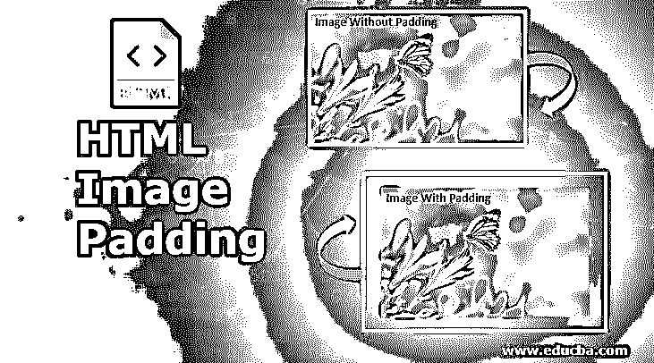
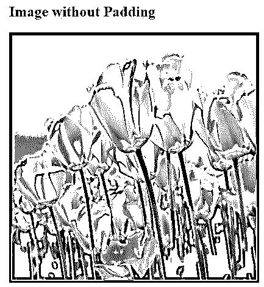
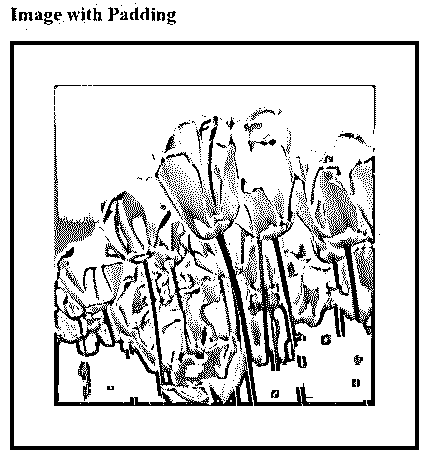
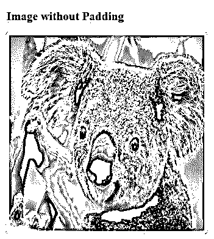
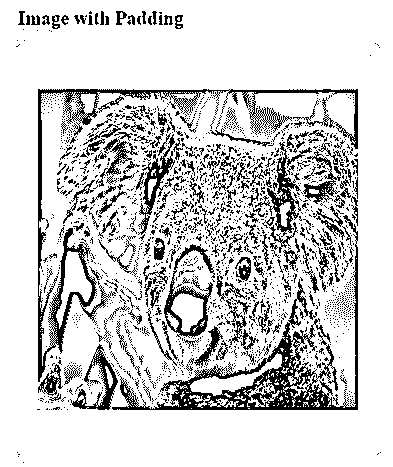
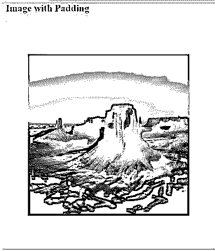
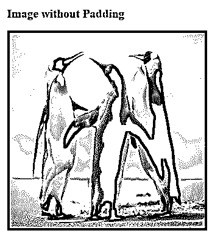

# HTML 图像填充

> 原文：<https://www.educba.com/html-image-padding/>




## HTML 图像填充介绍

html 中的 padding 属性在盒状结构的最内部元素的内容周围提供空间。html 中的 margin 属性在盒状结构的最外层元素的内容周围留出空间。填充和边距周围的空间称为边框。

您可以在下面观察到填充、边距和边框之间的差异:

<small>网页开发、编程语言、软件测试&其他</small>


*   正如我们所知，所有页面都有共同的风格，我们总是更喜欢 CSS 而不是 HTML。
*   所有的公共属性仅在 CSS 中实现。

### HTML 或 CSS 中的图像填充是如何工作的？

*   [填充总是在最里面的部分之间创建](https://www.educba.com/html-padding/)空间，无论是图像还是内容。
*   仅在 CSS 中用 img 标记定义的图像填充。

**语法 1:**

```
img
{
Padding: 10px,10px,10px,10px; //padding positions
}
```

**语法 1 解释:**

如果我们应用 4 个值的填充，那么第一个值用于顶部，第二个值用于右侧，第三个值用于底部，第四个值用于左侧。

**语法 2:**

```
img
{
Padding: 10px,10px,10px; //padding positions
}
```

**语法解释:**

如果我们应用具有 3 个值的填充，那么第一个值分别用于顶部，第二个值用于左侧和右侧，第三个值用于底部。

**语法 3:**

```
img
{
Padding: 10px,10px; //padding positions
}
```

**语法解释:**

如果我们使用 2 个值来填充，那么第一个值分别用于顶部和底部，第二个值分别用于左侧和右侧。

**语法 4:**

```
img
{
Padding: 10px; //padding positions
}
```

**语法解释:**

如果我们只应用单个值的填充，那么对所有四个边同样应用它。

### HTML 图像填充的示例

以下是 HTML 图像填充的示例:

#### 示例# 1–具有 4 个填充值的图像填充

**HTML 代码:**

```
<!DOCTYPE html>
<html>
<head>
<title>Image Padding</title>
<link rel="stylesheet" href="ImagePaddingFourSides.css"></link>
</head>
<body>
<font color="green">
<h2>Image without Padding</h2>
</font>
<p>

</p>
<font color="green">
<h2>Image with Padding</h2>
</font>
<p>

</p>
</body>
</html>
```

**CSS 代码:**

```
.noPadding
{
width:400px;
height:400px;
border: 5px solid brown;
}
.padding
{
width:400px;
height:400px;
padding: 50px 50px 50px 50px;
}
```

**输出:**

**应用填充前的输出:**




**应用填充后的输出:**




**说明:**

*   第一个图像类名，noPadding 和第二个图像类名 Padding 在上述代码中的 HTML 代码中。
*   在 CSS 代码中，noPadding 类没有用 5px 边框填充。无填充不会在图像周围留下任何空间。它严格遵守边界。你可以在上面的 1 <sup>st</sup> 图中看到。
*   填充类具有 50px 和 50px 的边框。由于图像周围的这种填充，我们已经从边界看到了一些空间。你可以在第二张<sup>和第二张</sup>图片中看到。

#### 示例# 2–具有 3 个填充值的图像填充

**HTML 代码:**

```
<!DOCTYPE html>
<html>
<head>
<title>Image Padding</title>
<link rel="stylesheet" href="ImagePaddingThreeSides.css"></link>
</head>
<body>
<font color="green">
<h2>Image without Padding</h2>
</font>
<p>

</p>
<font color="green">
<h2>Image with Padding</h2>
</font>
<p>

</p>
</body>
</html>
```

**CSS 代码:**

```
.noPadding
{
width:400px;
height:400px;
border: 5px solid yellow;
}
.padding
{
width:400px;
height:400px;
padding: 50px 20px 50px;
border: 5px solid yellow;
}
```

**输出:**

**应用填充前的输出:**




**应用填充后的输出:**




**说明:**

*   在上面的代码中，第一个图像类名 noPadding 和第二个图像类名 Padding 都是在 HTML 代码中获取的。
*   在 CSS 代码中，noPadding 类没有用 5px 边框填充。无填充不会在图像周围留下任何空间。它严格遵守边界。你可以在上面的 1 <sup>st</sup> 图中看到。
*   填充类具有填充 50px 20px 50px 和 5px 边框。由于这种填充图像顶部周围 50px，左和右 20px 和 50px 底部分别。我们从边界看到了一些空间。你可以在第二张<sup>和第一张</sup>图片中看到。

#### 示例# 3–具有 3 个填充值的图像填充

**HTML 代码:**

```
<!DOCTYPE html>
<html>
<head>
<title>Image Padding</title>
<link rel="stylesheet" href="ImagePaddingTwoSides.css"></link>
</head>
<body>
<font color="green">
<h2>Image without Padding</h2>
</font>
<p>

</p>
<font color="green">
<h2>Image with Padding</h2>
</font>
<p>

</p&gt
</body>
</html>
```

**CSS 代码:**

```
.noPadding
{
width:400px;
height:400px;
border: 5px solid yellow;
}
.padding
{
width:400px;
height:400px;
padding: 75px 50px;
border: 5px solid yellow;
}
```

**输出:**

**应用填充前的输出:**


**应用填充后的输出:**




**说明:**

*   第一个图像类名，noPadding 和第二个图像类名 Padding 在上述代码中的 HTML 代码中。
*   在 CSS 代码中，noPadding 类没有用 5px 边框填充。无填充不会在图像周围留下任何空间。它严格遵守边界。你可以在上面的 1 <sup>st</sup> 图中看到。
*   填充类具有填充 75px 50px 和 5px 边框。这是因为图像顶部和底部周围的填充分别为 50px，左侧和右侧为 50px。我们从边界看到了一些空间。你可以在第二张<sup>和第二张</sup>图片中看到。

#### 示例# 4–具有单个填充值的图像填充

**HTML 代码:**

```
<!DOCTYPE html>
<html>
<head>
<title>Image Padding</title>
<link rel="stylesheet" href="ImagePaddingSingleSides.css"></link>
</head>
<body>
<font color="green">
<h2>Image without Padding</h2>
</font>
<p>

</p>
<font color="green">
<h2>Image with Padding</h2>
</font>
<p>

</p>
</body>
</html>
```

**CSS 代码:**

```
.noPadding
{
width:400px;
height:400px;
border: 5px solid blue;
}
.padding
{
width:400px;
height:400px;
padding: 70px;
border: 5px solid blue;
}
```

**输出:**

**应用填充前的输出:**




**应用填充后的输出:**


**说明:**

*   第一个图像类名，noPadding 和第二个图像类名 Padding 在上述代码中的 HTML 代码中。
*   在 CSS 代码中，noPadding 类没有用 5px 边框填充。无填充不会在图像周围留下任何空间。它严格遵守边界。你可以在上面的 1 <sup>st</sup> 图中看到。
*   填充类具有填充 70 和 5px 边框。由于这个原因，填充图像的顶部，左侧，右侧和底部周围分别为 70px。我们从边界看到了一些空间。你可以在第二张<sup>和第二张</sup>图片中看到。

如果我们只想应用特定的侧边填充，那么 CSS 提供了预定义的属性:

*   **左填充:** 10px:在左侧应用填充 10px。
*   **填充-右侧:** 10px:在右侧应用填充 10px。
*   **填充-顶部:** 10px:将填充 10px 应用于顶部。
*   **Padding-bottom:** 10px:在底边应用 padding 10px。

**Note:** To include css file in html use <link rel=”stylesheet” href=”ImagePaddingSingleSides.css”></link> tag.

### 结论

图像填充在最里面的部分提供了空间。我们可以在 img 标签中填充一个、两个、三个和四个值。

### 推荐文章

这是一个 HTML 图像填充的指南。这里我们讨论介绍，例子，以及图像填充在 HTML 或 CSS 中是如何工作的？您也可以看看以下文章，了解更多信息–

1.  [HTML 中的 Span 标签](https://www.educba.com/span-tag-in-html/)
2.  [HTML 表格背景](https://www.educba.com/html-table-background/)
3.  [HTML 响应](https://www.educba.com/responsive-in-html/)
4.  [HTML 向左浮动](https://www.educba.com/html-float-left/)


