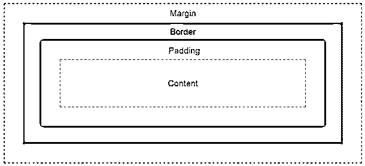
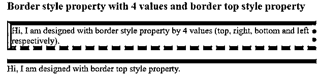
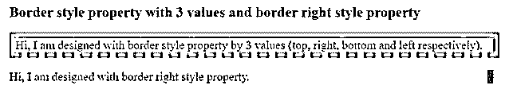
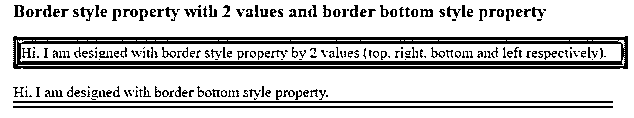
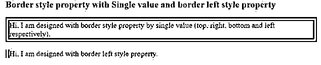

# HTML 边框样式

> 原文：<https://www.educba.com/html-border-style/>


## HTML 边框样式介绍

填充和边距周围的空间称为边框。根据需要，边框样式属性可以取 1 到 4 个值。如果一个客户希望所有的边都有相同的边框样式，可以通过一个带有边框样式属性的值来实现。如果客户想要在顶部和底部不同的边框设计，左边和右边有相同的边框样式，3 个值可以用边框样式属性来实现。如果客户端希望在顶部和底部具有相同的边框样式，并且左侧和右侧具有相同的边框类型，则可以使用 2 个边框样式值。如果一个客户端需要不同边框的所有四个边，可以通过具有边框样式属性的 4 个值来实现。我们也可以使用 border-left、border-right、border-top 和 border-bottom 属性一次只应用一种边框样式。

填充、边距和边框之间的差异。

<small>网页开发、编程语言、软件测试&其他</small>




正如我们所知，所有页面都有共同的风格，我们总是更喜欢使用 CSS 而不是 HTML。

### HTML 中的边框样式是如何工作的？

*   使用 border-style 属性**获取内容或图像周围的边框。**
*   你可以在语法下面使用 referrer 进行演示。

**语法 1:**

```
div
{
border-style: value1, value2, value3, value4; //border style values
}
```

**语法 1 解释:**

如果我们应用具有 4 个值的边框样式，那么分别应用第一个值用于顶部，第二个值用于右侧，第三个值用于底部，第四个值用于左侧。

**语法 2:**

```
div
{
border-style: value1, value2, value3; //border style values
}
```

**语法解释:**

如果我们用 3 个值应用边框样式，那么第一个值分别用于顶部，第二个值用于左侧和右侧，第三个值用于底部。

**语法 3:**

```
div
{
border-style: value1, value2; //border style values
}
```

**语法解释:**

如果我们用 2 个值应用边框样式，那么第一个值分别用于顶部和底部，第二个值分别用于左侧和右侧。

**语法 4:**

```
div
{
border-style: value//border style value
}
```

**语法解释:**

*   如果我们只使用一个单一的值来应用边框样式，那么对所有四个边都同样应用它。

如果我们想像我们在介绍中提到的那样，只在一边添加边框样式，比如上、右、下、左。你可以在下面使用语法。

**语法 1:**

```
div
{
border-top-style: value//border top side value
}
```

**语法 2:**

```
div
{
border-right-style: value//border right side value
}
```

**语法 3:**

```
div
{
border-bottom-style: value//border bottom side value
}
```

**语法 4:**

```
div
{
border-left-style: value//border left side value
}
```

### HTML 边框样式的示例

以下是 HTML 边框样式的示例:

#### 示例#1

具有 4 个值的边框样式属性和边框顶部样式属性。

**代码:**

```
<!DOCTYPE html>
<html>
<head>
<title>border style</title>
</head>
<style>
.style1
{
border-style:solid dotted dashed double;
border-color:brown;
border-width:10px;
font-size: 20px;
}
.style2
{
border-top-style:solid;
border-color:blue;
border-width:10px;
font-size:20px;
}
</style>
<body>
<font color="green"><h2>Border style property with 4 values and border
top style property</h2></font>
<p class="style1">Hi, I am designed with border style property by 4
values (top, right, bottom and left respectively).</p>
<p class="style2">Hi, I am designed with border top style property.</p>
</body>
</html>
```

**输出:**




**说明:**

*   正如你在上面的 CSS 代码中看到的，style1 类是用于 border-style 属性的，它应用于所有 4 种边框样式，分别是顶部为实线，右侧为虚线，底部为虚线，左侧为双线。
*   在 style2 类中是针对边框顶部样式的属性，它将应用于顶部边框样式的值改为纯色。

#### 实施例 2

具有 3 个值的边框样式属性和右边框样式属性。

**代码:**

```
<!DOCTYPE html>
<html>
<head>
<style>
.style1
{
border-style:solid double dashed;
border-color:aqua;
border-width:10px;
font-size: 20px;
width: 800px;
}
.style2
{
border-right-style:solid;
border-color:brown;
font-size: 20px;
border-width:10px;
width: 800px;
}
</style>
<meta charset="ISO-8859-1">
<link rel="stylesheet" href="BorderStyle3ValuesAndRight.css">
<title>border style</title>
</head>
<body>
<font color="green"><h2>Border style property with 3 values and border
right style property</h2></font>
<p class="style1">Hi, I am designed with border style property by 3
values (top, right, bottom and left respectively).</p>
<p class="style2">Hi, I am designed with border right style property.</p>
</body>
</html>
```

**输出:**




**说明:**

*   正如你在上面的 CSS 代码中看到的，style1 类是用于 border-style 属性的，它应用于所有 3 种边框样式，分别是顶部为实线，左右为双线，底部为虚线。
*   在 style2 类中，用于右边框样式属性，它将右边框样式值应用于实体。

#### 实施例 3

具有两个值的边框样式属性和边框底部样式属性。

**代码:**

```
<!DOCTYPE html>
<html>
<head>
<title>border style</title>
</head>
<style>
.style1
{
border-style:groove ridge;
border-color:teal;
border-width:10px;
font-size: 20px;
width: 800px;
}
.style2
{
border-bottom-style:double;
border-color:red;
font-size: 20px;
border-width:10px;
width: 800px;
}
</style>
<body>
<font color="green"><h2>Border style property with 2
values and border bottom style property</h2></font>
<p class="style1">Hi, I am designed with border style property by 2
values (top, right, bottom and left respectively).</p>
<p class="style2">Hi, I am designed with border bottom style
property.</p>
</body>
</html>
```

**输出:**




**说明:**

*   正如你在上面的 CSS 代码中看到的，style1 类是用于 border-style 属性的，它应用于所有 2 种边框样式，比如顶部和底部分别作为凹槽线，右侧和左侧作为脊线。
*   在 style2 类中是针对 border-bottom 样式属性的，它应用于 bottom border 样式的值为 double。

#### 实施例 4

具有单个值的边框样式属性和左边框样式属性。

**代码:**

```
<!DOCTYPE html>
<html>
<head>
<title>border style</title>
</head>
<style>
.style1
{
border-style:double;
border-color:maroon;
border-width:10px;
font-size: 20px;
width: 800px;
}
.style2
{
border-left-style:double;
border-color:purple;
font-size: 20px;
border-width:10px;
width: 800px;
}
</style>
<body>
<font color="green"><h2>Border style property with Single
value and border left style property</h2></font>
<p class="style1">Hi, I am designed with border style property by single
value (top, right, bottom and left respectively).</p>
<p class="style2">Hi, I am designed with border left style
property.</p>
</body>
</html>
```

**输出:**




**说明:**

*   正如你在上面的 CSS 代码中看到的，style1 类是用于 border-style 属性的，它将单个边框样式应用于边框，比如上、右、下和左分别作为双线。
*   在 style2 类中，对于左边框样式属性，它将左边框样式值应用到 double。

### 结论

边框样式属性可以一次应用一个、两个、三个和四个值以及边框顶部样式、边框右侧样式、边框底部样式和边框左侧样式的单个边框。

### 推荐文章

这是一个 HTML 边框样式的指南。这里我们讨论介绍，例子，以及边框样式在 HTML 中是如何工作的？您也可以看看以下文章，了解更多信息–

1.  [HTML 内嵌块](https://www.educba.com/html-inline-block/)
2.  [HTML 代码标签](https://www.educba.com/html-code-tag/)
3.  [HTML 填充](https://www.educba.com/html-padding/)
4.  [HTML 向左浮动](https://www.educba.com/html-float-left/)


