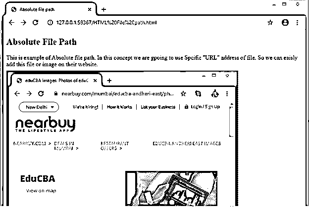
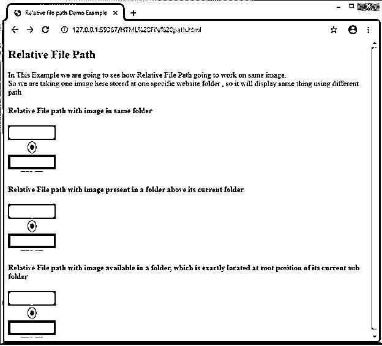
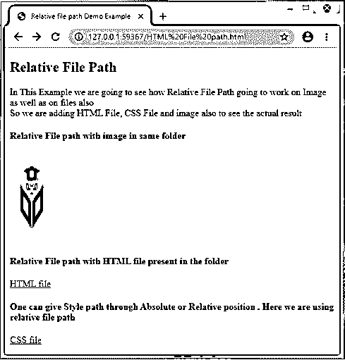

# HTML 中的文件路径

> 原文：<https://www.educba.com/file-path-in-html/>


## HTML 中的文件路径介绍

文件路径是 HTML 中使用的一个概念，用于定义文件进入相应网站文件夹结构的路径。这是专门用来从所需的文件夹中找到文件的确切位置的，这意味着它完全可以作为 web 浏览器将要调用的特定文件的指南或地址。这个概念在 HTML 中主要用于检测图像、网页、文件、CSS 文件、脚本文件、视频等媒体文件的路径。可以通过使用两个名为 src 或 href 的属性找到文件的路径。这些属性帮助我们在 HTML 文档中附加一个外部文件或源文件。

**语法**

<small>网页开发、编程语言、软件测试&其他</small>

知道网页中将要包含的文件的路径是很重要的。

下面是在网页中包含这些文件的语法，如下所示:

**语法:**

```

```

这是用来插入图像到我们的网页。

下面是一些路径的列表，其描述如下:

*   **:**当我们要使用与当前页面相同文件夹中的图像时，会用到这个选项。
*   **:**用于表示给定的图片存放在同一个网站文件夹的 image 文件夹中。
*   **:**这是用来定义各自被存放到当前 web 文件夹所在的根目录下的图像文件夹。
*   **< img src= "../img_name.jpg" > :** 这种类型告诉用户，给定的图像恰好存储在网站当前文件夹的上一级。

每当需要添加一些外部文件(如网页、图像、样式文件、脚本文件等)时，就会在代码中使用这些文件路径。

在定义文件路径时，总是需要包含准确的 URL、正确的文件名和带有正确扩展名的准确图像名。如果所有这些都被正确地包含，那么包含的文件或图像将会正确地显示在网页上。

上述语法分为两种类型。一种是基于 URL 地址的绝对文件路径。另一个是相对文件路径，我们可以定义文件和图像的地址，只需给出简单的文件名或文件夹路径就可以访问其中的内容。

我们将在下一节中详细讨论这两种类型的文件路径，在这一节中，我们将演示它实际上是如何工作的。

### HTML 中的文件路径是如何工作的？

有两种类型的文件路径:绝对文件路径和相对文件路径。

每当我们使用完整的 URL 地址来定义文件路径时，就会使用绝对文件路径。

**语法:**src = " URL "；

**示例:**下面是定义绝对文件路径代码在网站结构中如何工作的实际代码:

```
<!DOCTYPE html>
<html>
<head>
<title>Absolute file path</title>
</head>
<body>

</body>
</html>
```

而相对文件路径用于定义文件的特定路径，实际上所有图像相对于当前文件夹都位于该文件中。

**语法:**

```
src="img_folder/img_name" or
src="/img_folder/img_name" or
src=""../img_folder/img_name or
```

在这里，我们将包括一个例子，这是有所有可能的方式来显示文件路径使用相对文件路径是包括如下:

```
<!DOCTYPE html>
<html>
<head>
<title>Relative file path Demo Example</title>
</head>
<body>
<h4>Example showing file in same folder </h4>

<h4>Example showing file present in a folder above its
current   folder </h4>

<h4>Example showing file available in a folder, which is exactly located at  root   position of its current sub folder
</h4>

</body>
</html>
```

使用相对文件路径而不是绝对文件路径的概念总是被认为是一种好的做法。

### HTML 中的文件路径示例

下面举几个例子

#### 示例#1

这个例子展示了绝对文件路径是如何工作的。编码如下:

**代码:**

```
<!DOCTYPE html>
<html>
<head>
<title>Absolute file path</title>
</head>
<h2>Absolute File Path</h2>
<p> This is example of Absolute file path. In this concept we are going to use Specific "URL" address of file. So we can easily add this file or image on their website.</p>
<body>

</body>
</html>
```

**输出:**




#### 实施例 2

**代码:**

```
<!DOCTYPE html>
<html>
<head>
<title>Relative file path Demo Example</title>
</head>
<body>
<h2>Relative File Path</h2>
<p>In This Example we are going to see how Relative File Path going to work on same image.<br> So we are taking one image here stored at one specific website folder , so it will display same thing using different path</p>
<h4>Relative File path with image in same folder </h4>

<h4>Relative File path with image present in a folder above its current folder </h4>

<h4>Relative File path with image available in a folder, which is exactly located at  root   position of its current sub folder</h4>

</body>
</html>
```

**输出:**




#### 实施例 3

**代码:**

```
<!DOCTYPE html>
<html>
<head>
<title>Relative file path Demo Example</title>
</head>
<body>
<h2>Relative File Path</h2>
<p>In This Example we are going to see how Relative File Path going to work on Image as well as on files also<br> So we are adding HTML File, CSS File and image also to see the actual result</p>
<h4>Relative File path with image in same folder </h4>

<h4>Relative File path with HTML file present in the folder </h4>
<a href="index.html"> HTML file </a>
<h4>One can give Style path through Absolute or Relative position. Here we are using relative file path</h4>
<a href="main.css"> CSS file </a>
</body>
</html>
```

**输出:**




### 结论

从上面所有的信息中，我们意识到 HTML 文件是用来定义文件或图像的地址或路径，它们实际上是存储在网站结构中的。

该文件路径以两种可能的方式显示:绝对文件路径，另一种是相对文件路径，正如我们在上面的信息中看到的。

### 推荐文章

这是一个 HTML 格式的文件路径指南。这里我们讨论 HTML 中的文件路径是如何工作的，以及例子和输出。您也可以看看以下文章，了解更多信息–

1.  [HTML 块元素](https://www.educba.com/html-block-elements/)
2.  [HTML 格式的日期](https://www.educba.com/date-in-html/)
3.  [HTML 左边距](https://www.educba.com/html-margin-left/)
4.  [HTML 元音变音符](https://www.educba.com/html-umlaute/)


