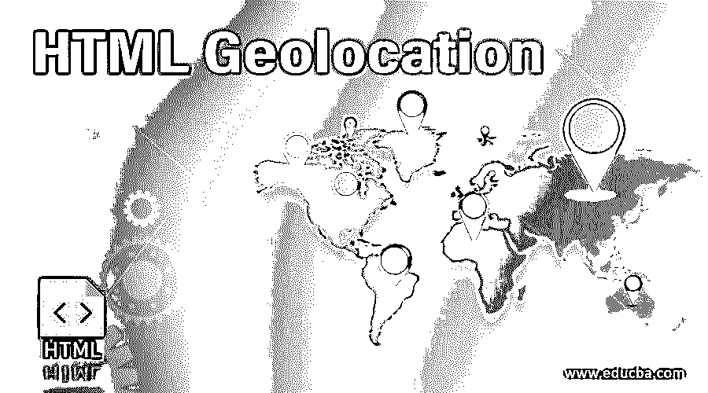
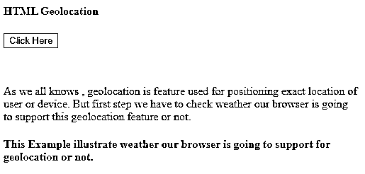
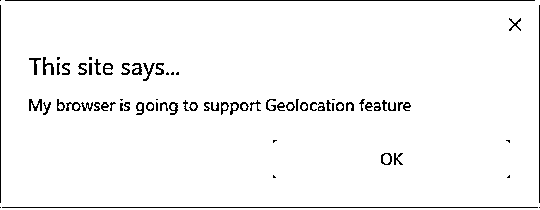
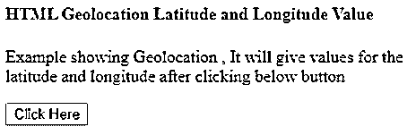
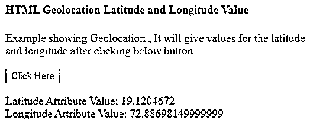
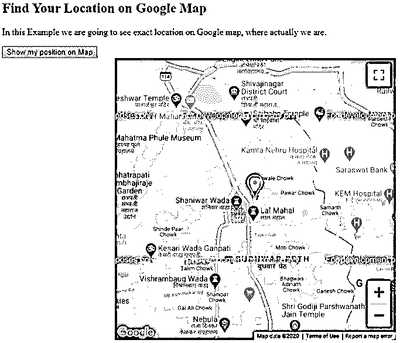

# HTML 地理定位

> 原文：<https://www.educba.com/html-geolocation/>




## HTML 地理定位简介

到目前为止，我们已经看到了许多使用 HTML 设计的功能。HTML 中包含的最新高级特性之一是地理定位。HTML 地理定位对于在地图上检测用户位置非常有用。所以这个特性是用 HTML 设计的，用来识别用户在地图上的确切位置。用户的这个位置可以通过使用特定用户位置的称为纬度和经度的属性来识别。只有当用户允许它访问该位置时，它才能检索信息。这个 HTML 特性主要用于本地商业目的，用于寻找餐馆，或者在地图上选择位置。

### 句法

HTML 地理定位的语法如下:可以使用 location API，它将使用 global navigator 对象，如下所示:

<small>网页开发、编程语言、软件测试&其他</small>

```
var locat = navigator.geolocation;
```

进入上面的语法导航器。地理定位负责用户浏览器获取他们的位置信息；定义了一个访问。浏览器可以提供设备上现有的最佳功能，因此用户可以轻松访问这些数据。

通过使用不同的方式可以有效地访问这些数据，如 getCurrentPosition，以了解用户或设备的当前位置，watchPosition，这在设备位置发生变化时很有帮助，还有一种方式如 clearWatch，有助于清除地理定位功能中的所有调用。

此功能适用于以下一些界面:

1.  地理定位:它是主类中最重要的 API 之一，包括一些帮助获取用户当前位置的方法，监视他们位置的变化等等。
2.  **地理位置:**用于定义用户的位置。每当一个成功的调用在一个地理位置中被识别，那么它将与它的对象实例协调。
3.  **地理位置坐标:**这有助于识别用户位置的坐标。
4.  **geolocationpositionerror:**这个接口被调用，因为不成功的调用被返回到 geolocation 中包含的方法中。
5.  **地理定位:**在地理定位中调用地理定位对象实例时，这很有用。因此可以从这里访问所有其他功能。

### 地理定位方法+63

在 HTML 地理定位中总共使用了 3 种方法来通过地理定位接口定义位置；这些建议如下:

1.  **getCurrentPosition()**:HTML 地理定位中的这个基本方法有助于检测设备或用户的当前地理位置及其在地图上的返回数据。这种方法适用于不同的参数，如成功、错误和选项。
2.  **watchPosition():** 当设备位置改变后，用户想要检查位置时，在编码中调用该函数来检查改变的设备位置。这个方法调用类似未知随机错误的错误回调函数。如果给定的位置信息不可用并且给定的请求位置超时，则不允许用户共享位置。
3.  clearWatch(): 通过使用这种 HTML 地理定位方法，用户可以取消之前的 watchPosition()调用，也可以取消正在进行的 watchPosition 调用

### HTML 地理定位示例

以下是 HTML 地理定位的例子

#### 示例#1

在第一个例子中，我们将看看我们的浏览器是否支持这个地理定位特性；下面是它的代码，如下所示:

**HTML 代码:**

```
<!DOCTYPE html>
<html>
<head>
<title>HTML Geolocation</title>
</head>
<body>
<h4>HTML Geolocation</h4>
<button onclick="getlocation()">Click Here</button>
<br>
<br>
<br>
<p>As we all know, geolocation is the feature used for positioning the exact location of the user or device. But the first step we have to check whether our browser is going to support this geolocation feature or not. </p>
<h4> This Example illustrates whether our browser is going to support for geolocation or not.</h4>
<div id="geolocation1"></div>
<script>
var x= document.getElementById("geolocation1");
function getlocation() {
if(navigator.geolocation){
alert("My browser is going to support Geolocation feature")
}
else
{
alert("Oops! My browser is not going to support Geolocation feature")
}
}
</script>
</body>
</html>
```

**输出:**







#### 实施例 2

在本例中，我们将使用 HTML 地理定位功能显示确切位置，因此它将使用纬度和经度的属性值显示地图上的确切位置，如下所示:

**HTML 代码:**

```
<!DOCTYPE html>
<html>
<body>
<h4>HTML Geolocation Latitude and Longitude Value</h4>
<p>Example showing Geolocation , It will give values for the latitude and longitude after clicking below button</p>
<button onclick="getLocation()">Click Here</button>
<p id="geolocation"></p>
<script>
var x = document.getElementById("geolocation");
function getLocation() {
if (navigator.geolocation) {
navigator.geolocation.getCurrentPosition(showgeolocPosition);
} else {
x.innerHTML = "This code is not supported in geolocation for your browser";
}
}
function showgeolocPosition(position) {
x.innerHTML = "Latitude Attribute Value: "     + position.coords.latitude +
"<br>Longitude Attribute Value: "  + position.coords.longitude;
}
</script>
</body>
</html>
```

**输出:**




点击按钮后，输出如下所示




#### 实施例 3

在本例中，我们将使用 HTML 地理定位功能显示确切位置，因此它将使用纬度和经度的属性值显示地图上的确切位置，如下所示:

**HTML 代码:**

```
<!DOCTYPE html>
<html>
<head>
<title>Geolocation</title>
</head>
<style>
#mapdemo{
width: 500px;
height: 500px;
margin-left: 200px;
}
</style>
<body>
<h2>Find Your Location on Google Map</h2>
<p>In this Example we are going to see exact location on Google map, where actually we are.</p>
<button onclick="getlocation();"> Show my position on Map </button>
<div id="mapdemo">
</div>
<script src="https://maps.google.com/maps/api/js?sensor=false">
</script>
<script type="text/javascript">
function getlocation(){
if(navigator.geolocation){
navigator.geolocation.getCurrentPosition(showPos, showErr);
}
else{
alert("Sorry! your Browser does not support Geolocation API")
}
}
// Current Poistion on Google Map
function showPos(position){
latt = position.coords.latitude;
long = position.coords.longitude;
var lattlong = new google.maps.LatLng(latt, long);
var myOptions = {
center: lattlong,
zoom: 15,
mapTypeControl: true,
navigationControlOptions: {style:google.maps.NavigationControlStyle.SMALL}
}
var maps = new google.maps.Map(document.getElementById("mapdemo"), myOptions);
var markers =
new google.maps.Marker({position:lattlong, map:maps, title:"Your position on map!"});
}
function showErr(error) {
switch(error.code){
case error.PERMISSION_DENIED:
alert("User or Device not allow to accept your request for Geolocation.");
break;
case error.POSITION_UNAVAILABLE:
alert("USer or Device exact location information is currently unavailable.");
break;
case error.TIMEOUT:
alert("Requested request is getting time out .");
break;
case error.UNKNOWN_ERROR:
alert("Something unknown error is accrued.");
break;
}
}        </script>
</body>
</html>
```

**输出:**




### 结论

从以上所有信息中，我们了解到 HTML 地理定位是一种用于在地图上识别设备或用户位置的功能。

它使用纬度和经度属性来识别用户的确切位置。

这个特性适用于不同的方法，比如 getCurrentPosition、watchPosition 和 clearWatch。

### 推荐文章

这是一个 HTML 地理定位指南。这里我们讨论地理定位的方法和例子，以及 HTML 代码和输出。您也可以看看以下文章，了解更多信息–

1.  [HTML 实体](https://www.educba.com/html-entities/)
2.  [HTML 元音变音符](https://www.educba.com/html-umlaute/)
3.  html 特殊字符
4.  [HTML 搜索栏](https://www.educba.com/html-search-bar/)


