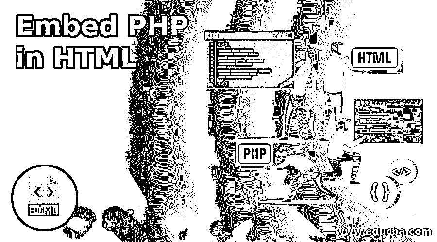

# 在 HTML 中嵌入 PHP

> 原文：<https://www.educba.com/embed-php-in-html/>




## 在 HTML 中嵌入 PHP 简介

下面的文章提供了在 HTML 中嵌入 PHP 的概要。HTML 是预定义的前端语言代码，而 php 是服务器端脚本语言；它也被称为嵌入式服务器端语言。大多数 PHP 语法代码必须遵循 c、java 和 Perl 脚本语言。它通常与其他基于 web 的动态脚本语言一起工作，在性能方面，它比其他脚本语言更好，而它与 html 代码一起用于创建基于 web 的应用程序，它是一种用于创建网站的不间断功能类型。

**语法:**

<small>网页开发、编程语言、软件测试&其他</small>

嵌入的 PHP 代码是标准的，是一个普通的 html 文档；我们已经在 html 页面上写了 PHP 代码。

**代码:**

```
<html>
<head>
<title>
</title>
<script language="php">
-----some codes----
</script>
</head>
</html>
```

上面的代码是借助

### 如何在 HTML 中使用 Embed PHP？

*   在 Php 代码中，我们还在里面写了一个嵌入式代码。它通常看起来像一个 HTML 代码，它也在普通浏览器中作为源代码运行。原始 PHP 代码在浏览器中不可见，因为 PHP 中的解释器已经通过脚本模式运行，并且它还会显示来自预期脚本结果的输出，因为用户被给予输入并获得输出作为测试用例。
*   这意味着 PHP 代码，我们已经在任何类型的 web 浏览器上用干净的 html 可视代码重现了，但是用户并不理解浏览器中的 PHP 代码。这种类型的过程将出现在服务器端脚本的概念中。简而言之，这就是为什么 PHP 在与任何类型的用户本地 PC 兼容的 web 浏览器中解释和执行。
*   一般来说，PHP 代码有一个像 html 一样的基本语法类型作为第一种文档类型。PHP 标签将在 html 代码中使用；在下面的 PHP 标签中，我们将使用 PHP 语法和语句来编写逻辑，最后，它将有用于注释目的的空格。视图部分将像普通的 html 代码一样显示，因为 PHP 代码是用脚本标记编写的。

### 在 HTML 中嵌入 PHP 重要性

*   PHP 还被用作在桌面应用程序或独立应用程序中编写的命令行代码脚本，但主要集中于基于 web 的应用程序。通常，客户端用户向服务器发送请求；请求本身有 PHP 代码，响应将是来自服务器的 xml 或 json 类型。PHP 用于创建动态网站。
*   我们可能知道 PHP 可以创建动态网站，而且与其他服务器端语言相比，PHP 非常容易学习。PHP 是开源的，它的组件可以免费使用，在开源市场上也很容易买到。因此，开源，我们将使用 PHP。免费的语法非常容易使用。PHP 运行所有类型的操作系统，如 Windows、MacoX、Linux 和 Sun Solaris 等。这是 PHP 的主要好处之一。
*   PHP 支持所有类型的 web 服务器，如 Apache Tomcat、IIS 服务器、Jetty 等。对于 PHP 应用程序开发人员来说，这种工具将更适合开发一个灵活的环境，从而节省更多的时间。与其他应用程序编程语言相比，PHP 将更容易部署，PHP 的托管公司将更多，托管公司运行 PHP 应用程序的服务器成本将更低。
*   与其他高复杂度的应用程序相比，PHP 应用程序的市场被认为是不太费力的。这是 PHP 语言最好的特性之一。在过去，web 应用程序的市场将需要更多的时间来达到市场；它在市场上变得更受欢迎的机会更少，而竞争在那个时候也更激烈。性能方面对用户来说更可靠，所以从用户的角度来看，它是一种有效的语言。
*   PHP 与其他语言如 java 相比也是一样的；它们有自己的预定义函数和库。它具有发送电子邮件，连接其他网络服务，它将产生 jpeg，gif 图像等功能。，并生成 pdf、excels 文档，用于下载应用程序中的网页内容。
*   PHP 应用程序对用户更友好，因为它容易理解，也很简单。它也是保护 web 应用程序和网站的方法之一；它有一个安全层，以防止威胁，恶意软件等相比，其他语言，它有更多的安全。它具有用于用户支持的扩展特性，并且易于集成。

### 在 HTML 中嵌入 PHP 的例子

下面是一些例子:

#### 示例#1

**代码:**

```
<html>
<title>First Application of PHP</title>
<body>
<h3>Welcome To My Domain</h3>
<?php
echo "Welcome User";
?>
</body>
</html>
```

**输出:**


#### 实施例 2

**代码:**

```
<html>
<title>Sample Application</title>
<body>
<h3>Welcome To My Domain</h3>
<?php
echo "Welcome Users.";
?>
<p>Welcome</p>
<?php
$examp = "Welcome Users";
echo " $examp.";
?>
</body>
</html>
```

**输出:**


#### 实施例 3

**代码:**

```
<html>
<title>Sample Application</title>
<h3>Welcome To My Domain</h3>
<body>
<a href="first.php">Home</a>
<?php include "first.php";
?>    <a href="second.php">contactus</a>
<?php include "second.php"
?>
</body>
</html>
```

**First.php:**

```
<?php
echo "Welcome"
?>
```

**Second.php:**

```
<?php
echo "User"
?>
```

**输出:**


上面的例子展示了 html 文档中的 PHP 代码。前两个例子，我们编写了结合 PHP 标签的基本 html 代码；它将输出显示为一个单独的网页 HTML，但是最后一个例子将在 PHP 标签中使用 include 标签；它将包括像第一和第二外部 PHP 文件。PHP 文件，它被用来从一个网页导航到另一个网页。

### 结论

在每个开源应用程序中，开发人员都可以根据需求添加和删除代码。它有一个类似 PHP 社区的团体社区来验证代码和更新更改，因为该团队有很多成员来解决用户问题。

### 推荐文章

这是一个在 HTML 中嵌入 PHP 的指南。这里我们讨论一下入门，如何在 HTML 中使用 embed PHP？重要性和例子。您也可以看看以下文章，了解更多信息–

1.  [HTML 文章标签](https://www.educba.com/html-article-tag/)
2.  [PHP 数组函数](https://www.educba.com/php-array-functions/)
3.  [PHP 版本](https://www.educba.com/php-versions/)
4.  [HTML 元音变音符](https://www.educba.com/html-umlaute/)


