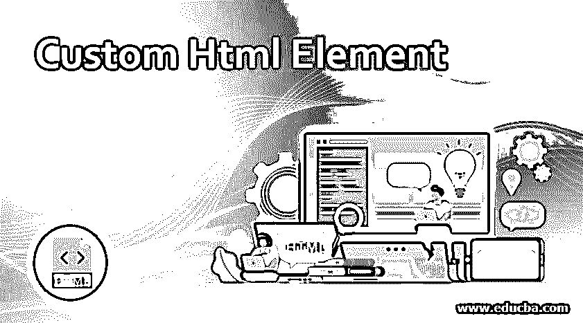
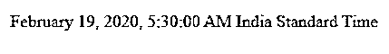
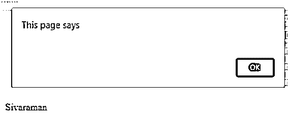
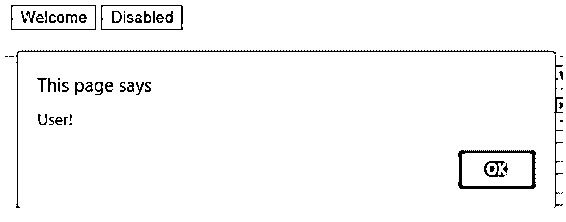

# 自定义 Html 元素

> 原文：<https://www.educba.com/custom-html-element/>




## 自定义 Html 元素介绍

以下文章提供了自定义 Html 元素的概要。在 html 中，我们有许多 web 组件的特性；有些具有创建用户定义或定制 html 元素的标准能力。它用 html 语言封装了更多的网页功能。使用一组嵌套的批处理元素需要很长时间，这些元素可以与更多的自定义网页功能相结合。一些网络浏览器支持自定义元素，如 Mozilla、firefox、google chrome 和 Microsoft Edge 浏览器；html 定制元素、safari 和 opera 支持它们；这些浏览器与 html 自定义元素不兼容；它只支持自主的用户定义元素。

**语法:**

<small>网页开发、编程语言、软件测试&其他</small>

我们将使用 javascript 来定义新的 html 元素，就像自定义元素一样，因为它是在 html 中引入新标签的全球化元素。因此，当我们使用网页元素时，语法会有所不同。

```
Class sample extends HtmlElement
{
default constructor()
{
---some user defined codes---
}
}
```

上面的代码是基于 java 的示例代码；这是创建定制元素的一般大纲，更改将受到网页的影响。

### 在哪里使用自定义 Html 元素？

通常，html 定制元素包含两种类型:自主定制元素和定制内置元素**。**每当我们在 HTML 中创建自定义元素时，它都描述类及其方法、属性和特性；有些项目也叫诸如此类。一旦定制元素被创建，并且它被定义为 html 元素，一些元素像<易标签>、<漂亮上传>等。然后，我们可以在 html 语言中使用我们定制的元素。

自主自定义元素包含所有新元素，用户定义的元素用 HtmlElement 类扩展；它将带有 java 标准规则。再者，自定义内置元素会创建内置元素，在自治自定义元素中创建一个自定义元素；我们将告诉浏览器，每当在网页上添加或删除元素时，它们是如何显示的。

自主定制元素使用具有特殊方法的类来实现上述场景。例如，一些方法是“connectedCallback()”，每当元素被添加到文档中时，该方法将用于浏览器调用。此外，如果在 html 文档中重复添加或删除元素，还可以多次调用它。" disconnectedCallback()"每当从文档中移除元素时，此方法将调用浏览器；在 html 文档中重复添加或删除元素时，也可以多次调用它。

observedAttributes()是返回属性名数组以监视反映的更改的方法之一。attributeChangedCallback(name，oldvalue，newvalue)方法在任何一个属性将被列出并被修改时调用，而“adoptedCallback()”则在元素被移动到 html 文档中的新元素时调用。现在，假设我们使用任何 html 元素。在这种情况下，他们有自己的标签，例如，<myelement>标签，我们将使用 javascript 创建<myelement>标签的实例，该实例包含 MyElement。我们已经创建了实例，使用该实例，我们将使用上述方法调用所需的方法。我们将使用 javascript 在网页中使用它们的功能。</myelement></myelement>

假设我们在 html 中使用一些默认的标签来计算日期和时间，比如 time >是时间的标签元素。尽管如此，它没有任何时间格式自动在该时间；我们将使用像 connectedCallback()这样的方法；这个方法将通过调用它的<time-formatted>选项来使用浏览器，并且元素也被添加到页面中，或者 html 解析器将帮助检测它使用 Intl 的内置。dateFormatter 中的 DateTimeFormat 选项将支持整个浏览器，这有助于很好地显示时间格式。我们还在 customElements.define(标记名，类名)中声明了新的 html 元素；这种格式有助于在脚本中创建定制元素。</time-formatted>

创建自定义元素后，还需要升级整个格式，如 PC 上的时间更新，但它会在 customElements.define 方法中的 html 元素之前更新，因为它不是错误，所以不会在脚本中使用该方法；元素显示为 unknown，就像我们说它是非标准的 html 标签；在此之后，它将在 css 样式选择器中使用类似于 **:** not(:defined)的选项。在调用 customElements.define 方法之后，它将在 connectedCallback()方法中支持的时间格式选项中升级新实例。然后，它们变成:defined 状态，类似于调用 customElements.get(name)、customelements . when defined(name)的方法，这两个方法都将名称作为参数返回。

### 自定义 Html 元素的示例

下面提到了不同的例子:

#### 示例#1

```
<html>
<head>
<script>
class sample extends HTMLElement { // (1)
connectedCallback() {
let d = new Date(this.getAttribute('datetime') || Date.now());
this.innerHTML = new Intl.DateTimeFormat("default", {
month: this.getAttribute('month') || undefined,
day: this.getAttribute('day') || undefined,
year: this.getAttribute('year') || undefined,
minute: this.getAttribute('minute') || undefined,
hour: this.getAttribute('hour') || undefined,
timeZoneName: this.getAttribute('time-zone-name') || undefined,
second: this.getAttribute('second') || undefined,
}).format(d);
}
}
customElements.define("time-formatted", sample);
</script>
</head>
<time-formatted datetime="2020-02-19"
year="numeric" month="long" day="numeric"
hour="numeric" minute="numeric" second="numeric"
time-zone-name="long">
</time-formatted>
</html>
```

**输出:**




#### 实施例 2

```
<html>
<head>
<script>
customElements.define('user-information', class extends HTMLElement {
connectedCallback() {
alert(this.innerHTML);
}
});
</script>
</head>
</html>
<user-information>Sivaraman</user-information>
```

**输出:**




#### 实施例 3

```
<html>
<head>
<script>
class Example extends HTMLButtonElement {
constructor() {
super();
this.addEventListener('click', () => alert("User!"));
}
}
customElements.define('sample-button', Example, {extends: 'button'});
</script>
<button is="sample-button">Welcome</button>
<button is="sample-button" disabled>Disabled</button>
</head>
</html>
```

**输出:**




以上三个例子将讨论 html 语言中的自定义元素；在第一个例子中，我们已经知道了使用定制标记元素的时间和日期格式输出；第二个示例显示了在执行 html 中的自定义元素后调用的基本 javascript 函数，最后一个示例将在我们单击 html 自定义标记元素时讨论相同的 javascript 函数。

### 结论

Web 组件有一些与技术连接的过程。它将用于帮助整个 web.Html 的 html 具有可重用的 Dom 组件；它将用于通过 web 传递用户级数据(包括自定义元素)以进行数据迁移。

### 推荐文章

这是一个自定义 Html 元素的指南。这里我们讨论在哪里使用定制的 Html 元素以及例子和输出。您也可以阅读以下文章，了解更多信息——

1.  [HTML 中的区域标签](https://www.educba.com/area-tag-in-html/)
2.  [HTML 填充](https://www.educba.com/html-padding/)
3.  [HTML 必需属性](https://www.educba.com/html-required-attribute/)
4.  [HTML 居中对齐](https://www.educba.com/html-align-center/)


