# HTML 中的光标

> 原文：<https://www.educba.com/cursor-in-html/>

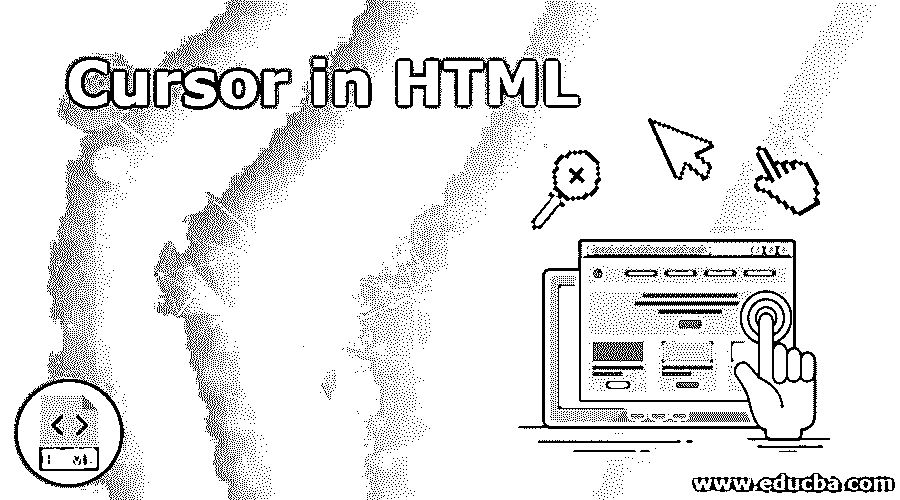


## HTML 中的光标介绍

HTML 中的光标属性通过使用特定类型的光标属性来控制光标悬停在任何 HTML 元素上时的形状或外观。这个概念仅适用于具有光标和鼠标的任何设备；如果没有，此功能可以产生任何与光标属性相关的结果。这个光标属性的目的是在任何表单上使用图像来提交按钮。每当最终用户将鼠标悬停在一个图像上时，如果这是一个提交按钮，那么它会自动给你一个提示，让你点击它，图像就像一个按钮一样工作。

### HTML 中的 Cursor 属性是如何工作的？

HTML 光标属性基于 HTML 标记内的样式属性工作。我们将研究 HTML 中一些不同的光标语法。

<small>网页开发、编程语言、软件测试&其他</small>

**语法#1**

```
auto
```

**语法#2**

```
crosshair
```

**语法#3**

```
default
```

**语法#4**

```
e-resize
```

**语法#5**

```
help
```

**语法#6**

```
move
```

**语法#7**

```
n-resize
```

**语法#8**

```
ne-resize
```

**语法#9**

```
nw-resize
```

**语法#10**

```
pointer
```

**语法#11**

```
progress
```

**语法#12**

```
s-resize
```

**语法#13**

```
se-resize
```

**语法#14**

```
sw-resize
```

**语法#15**

```
text
```

**语法#16**

```
w-resize
```

**语法#17**

```
wait
```

### 光标值及其描述表

| **类型** | **HTML 值** | **光标看起来怎么样？** | **描述** |  |
| **通用** | **自动** |  | 基于文本光标会自动改变。 |  |
| **默认** | 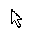


 | 默认情况下，箭头光标。 |  |
| **无** |  | 不显示光标。 |  |
| **链接&状态** | **上下文菜单** | **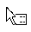

**  | 类似光标的上下文菜单 |  |
| **帮助** | **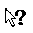

**  | 带箭头问号的帮助信息。 |  |
| **指针** | 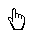


 | 指针符号有一只像光标一样的手。 |  |
| **进度** | 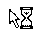


 | 表示程序正忙，可以与应用程序交互。 |  |
| **等待** | 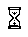


 | 表示程序正忙，无法与应用程序交互。 |  |
| **选择** | **单元格** | 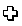


 | 可以从显示光标的表格中选择单元格。 |  |
| **十字准线** | 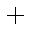


 | 用于选择的十字光标。 |  |
| **正文** | 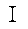


 | 用于选定文本的工字梁光标。 |  |
| **竖排文本** | 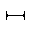


 | 用于垂直选定文本的横向工字梁光标。 |  |
| **拖动&放下** | **别名** | 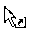


 | shortcut cursor |  |
| **复制** | 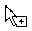


 | 复制的光标 |  |
| **移动** | 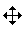


 | 可以用光标移动该元素。 |  |
| **不掉线** | 

&#124; 


 &#124;  &#124;
&#124;  &#124;

 | 项目未被放下，显示光标。 |  |
|  |
| **不允许** | 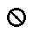


 | 请求无法继续光标操作。 |  |
| **抓取** | 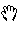


 | 抓取的光标 |  |
| **抓取** | 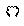


 | 光标被什么东西抓住了。 |  |
| **调整大小&滚动** | **全滚动** | 

&#124; 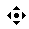


 &#124;  &#124;
&#124;  &#124;

 | 向任何特定方向滚动显示光标。 |  |
|  |
| **列大小调整** | 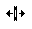


 | 可以水平调整项目/列的大小。 |  |
| **行调整大小** | 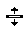


 | 可以垂直调整项目/列的大小。 |  |
| **n-调整大小** | 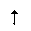


 | 显示光标的特定方向上移动的任何边。 |  |
| **e-调整大小** | 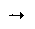


 |  |
| **s-调整大小** | 


 |  |
| **w-调整大小** | 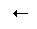


 |  |
| **无重定大小** | 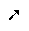


 |  |
| **西北-调整大小** | 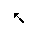


 |  |
| **se-resize** | 


 |  |
| **sw-resize** | 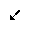


 |  |
| **ew-resize** | **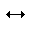

**  | 双向调整光标大小。 |  |
| **ns-调整大小** | 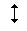


 |  |
| **nesw-resize** | 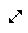


 |  |
| **nwse-调整大小** | 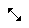


 |  |
| **变焦** | **放大** | **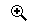

**  | 显示光标的放大和缩小 |  |
| **缩小** | 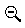


 |  |

### **HTML 中实现光标的例子**

 **下面是提到的例子:

#### 示例#1

显示光标的链接和状态。

**代码:**

```
<!DOCTYPE html>
<html>
<head>
<meta charset="ISO-8859-1">
<title>Cursors in HTML</title>
<style type="text/css">
.div2 {
border: 1px solid brown;
color: green;
width: 900px;
font-size: 20px;
}
.div3 {
border: 1px solid brown;
color: red;
width: 900px;
font-size: 20px;
}
.div4 {
border: 1px solid brown;
color: blue;
width: 900px;
font-size: 20px;
}
.div5 {
border: 1px solid brown;
color: lime;
width: 900px;
font-size: 20px;
}
</style>
</head>
<body>
<div class="div2">
<h3 style="text-align: center">Progress Cursor Demo</h3>
Cursor in HTML property controls
shape or look and feel of the cursor when it is hovering on the any
HTML element by using specific type of cursor property.
</div>
<br>
<div class="div3">
<h3 style="text-align: center">Help Cursor Demo</h3>
Cursor in HTML property controls
shape or look and feel of the cursor when it is hovering on the any
HTML element by using specific type of cursor property.
</div>
<br>
<div class="div4">
<h3 style="text-align: center">Pointer Cursor Demo</h3>
Cursor in HTML property controls
shape or look and feel of the cursor when it is hovering on the any
HTML element by using specific type of cursor property.
</div>
<br>
<div class="div5">
<h3 style="text-align: center">Wait Cursor Demo</h3>
Cursor in HTML property controls
shape or look and feel of the cursor when it is hovering on the any
HTML element by using specific type of cursor property.
</div>
</html>
```

**输出:**

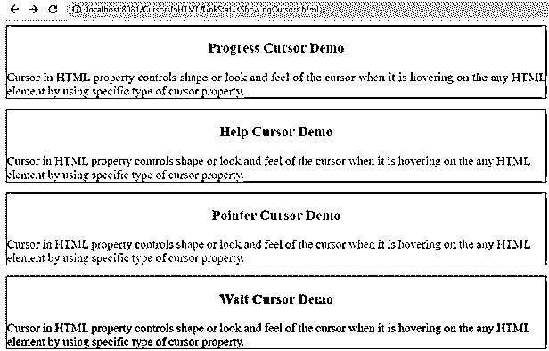


**说明:**在上面的输出中，点击任意段落，可以看到相应的光标输出。

#### 实施例 2

显示光标的选择

**代码:**

```
<!DOCTYPE html>
<html>
<head>
<meta charset="ISO-8859-1">
<title>Cursors in HTML</title>
<style type="text/css">
.div2 {
border: 1px solid blue;
color: fuchsia;
width: 900px;
font-size: 20px;
}
.div3 {
border: 1px solid blue;
color: gray;
width: 900px;
font-size: 20px;
}
.div4 {
border: 1px solid blue;
color: maroon;
width: 900px;
font-size: 20px;
}
</style>
</head>
<body>
<div class="div2">
<h3 style="text-align: center">Cross hair Cursor Demo</h3>
Cursor in HTML property controls
shape or look and feel of the cursor when it is hovering on the any
HTML element by using specific type of cursor property.
</div>
<br>
<div class="div3">
<h3 style="text-align: center">Horizontal Text Cursor Demo</h3>
Cursor in HTML property controls
shape or look and feel of the cursor when it is hovering on the any
HTML element by using specific type of cursor property.
</div>
<br>
<div class="div4">
<h3 style="text-align: center">Vertical Text Cursor Demo</h3>
Cursor in HTML property controls
shape or look and feel of the cursor when it is hovering on the any
HTML element by using specific type of cursor property.
</div>
</html>
```

**输出:**

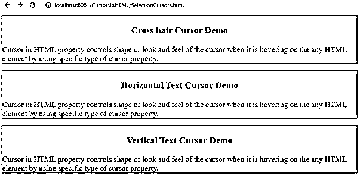


**说明:**在上面的输出中，点击任意段落，可以看到相应的光标输出。

#### 实施例 3

拖放显示光标。

**代码:**

```
<!DOCTYPE html>
<html>
<head>
<meta charset="ISO-8859-1">
<title>Cursors in HTML</title>
<style type="text/css">
.div2 {
border: 1px solid red;
color: orange;
width: 900px;
font-size: 20px;
}
.div3 {
border: 1px solid red;
color: olive;
width: 900px;
font-size: 20px;
}
.div4 {
border: 1px solid red;
color: navy;
width: 900px;
font-size: 20px;
}
.div5 {
border: 1px solid red;
color: lime;
width: 900px;
font-size: 20px;
}
.div6 {
border: 1px solid red;
color: blue;
width: 900px;
font-size: 20px;
}
.div7 {
border: 1px solid red;
color: maroon;
width: 900px;
font-size: 20px;
}
</style>
</head>
<body>
<div class="div2">
<h3 style="text-align: center">Alias Cursor Demo</h3>
Cursor in HTML property controls
shape or look and feel of the cursor when it is hovering on the any
HTML element by using specific type of cursor property.
</div>
<br>
<div class="div3">
<h3 style="text-align: center">Copy Cursor Demo</h3>
Cursor in HTML property controls
shape or look and feel of the cursor when it is hovering on the any
HTML element by using specific type of cursor property.
</div>
<br>
<div class="div4">
<h3 style="text-align: center">Move Cursor Demo</h3>
Cursor in HTML property controls
shape or look and feel of the cursor when it is hovering on the any
HTML element by using specific type of cursor property.
</div>
<br>
<div class="div5">
<h3 style="text-align: center">No-drop Cursor Demo</h3>
Cursor in HTML property controls
shape or look and feel of the cursor when it is hovering on the any
HTML element by using specific type of cursor property.
</div>
<br>
<div class="div6">
<h3 style="text-align: center">Grab Cursor Demo</h3>
Cursor in HTML property controls
shape or look and feel of the cursor when it is hovering on the any
HTML element by using specific type of cursor property.
</div>
<br>
<div class="div7">
<h3 style="text-align: center">Not-allowed Cursor Demo</h3>
Cursor in HTML property
controls shape or look and feel of the cursor when it is hovering on
the any HTML element by using specific type of cursor property.
</div>
</html>
```

**输出:**

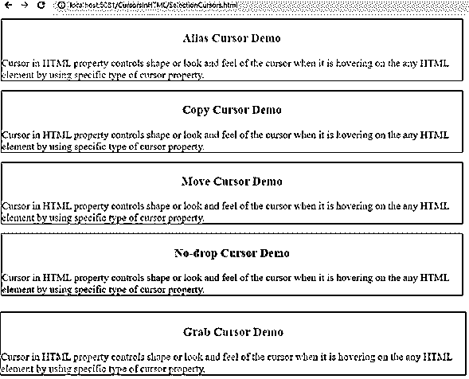


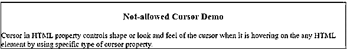


**说明:**在上面的输出中，点击任意段落，可以看到相应的光标输出。

#### 实施例 4

显示光标的选择。

**代码:**

```
<!DOCTYPE html>
<html>
<head>
<meta charset="ISO-8859-1">
<title>Cursors in HTML</title>
<style type="text/css">
.div2 {
border: 1px solid fuchsia;
color: teal;
width: 900px;
font-size: 20px;
}
.div3 {
border: 1px solid fuchsia;
color: purple;
width: 900px;
font-size: 20px;
}
</style>
</head>
<body>
<div class="div2">
<h3 style="text-align: center">Zoom-in Cursor Demo</h3>
Cursor in HTML property controls
shape or look and feel of the cursor when it is hovering on the any
HTML element by using specific type of cursor property.
</div>
<br>
<div class="div3">
<h3 style="text-align: center">Zoom-out Cursor Demo</h3>
Cursor in HTML property controls
shape or look and feel of the cursor when it is hovering on the any
HTML element by using specific type of cursor property.
</div>
</html>
```

**输出:**


**说明:**在上面的输出中，点击任意段落，可以看到相应的光标输出。

### 结论

游标属性基于赋予游标的属性值工作。根据需求，我们选择当前需要的光标动作。

### 推荐文章

这是一个 HTML 中的光标指南。这里我们讨论 HTML 中不同的光标语法，光标的类型，以及更好理解的例子。您也可以浏览我们的其他相关文章，了解更多信息——

1.  [HTML 图像填充](https://www.educba.com/html-image-padding/)
2.  [HTML 中的区域标签](https://www.educba.com/area-tag-in-html/)
3.  [HTML 框架集标签](https://www.educba.com/html-frameset-tag/)
4.  [MySQL 中的光标](https://www.educba.com/cursor-in-mysql/)


**