# HTML 表单输入类型

> 原文：<https://www.educba.com/html-form-input-type/>

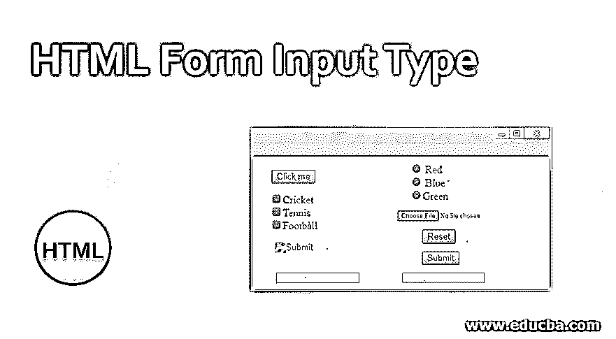


## HTML 表单输入类型介绍

HTML 中的<input>标签用于设计 web 表单中的交互控件，以接受来自用户端的数据。根据所使用的用户代理和设备，可以使用各种类型的控件和输入数据。<input>标签是所有 HTML 中使用的最重要的元素之一，因为它有大量的属性和输入类型的组合。在这个主题中，我们将学习 HTML 表单输入类型。

标签是 HTML 元素的一个重要元素。<input>标签内的“类型”属性可以是各种类型，用于定义信息字段，如<input type="”text”">提供一个文本框。<input>标签的默认类型是文本。

<small>网页开发、编程语言、软件测试&其他</small>

### HTML 中可用的“输入”类型列表

| **类型** | **描述** | **格式** | **例子** |
| 按钮 | 用于定义按钮，按钮的文本是 value 属性的值。 | 


 | 

```
<!DOCTYPE html>
<html>
<body>
<form>
<input type="button" value="Click me">
</form>
</body>
</html>
```

 |
| 检验盒 | 用于定义允许用户选择/取消选择其值的复选框。 | 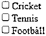


 | 

```
<!DOCTYPE html>
<html>
<body>
<form>
<input type="checkbox">Cricket<br>
<input type="checkbox">Tennis<br>
<input type="checkbox">Football<br>
</form>
</body>
</html>
```

 |
| 文件 | 用于定义本地系统上的文件上载功能，accept 属性用于限制要上载的文件类型。 | 


 | 

```
<!DOCTYPE html>
<html>
<body>
<input type="file" name="newfile">
</body>
</html>
```

 |
| 隐藏的 | 用于隐藏其值将在服务器上提交的控件。下一个专栏有个例子，但是被隐藏了！ |  |  |
| 图像 | 图形提交按钮—显示用 src 属性定义的图像。如果缺少图像 src，将显示 alt 属性。 | 


 | 

```
<!DOCTYPE html>
<html>
<body>
<form>
<input type="image" alt="Submit" src="login.png">
</form>
</body>
</html>
```

 |
| 密码 | 用于定义一个单行文本字段，其值是模糊的，如果站点不安全，它还会提醒用户 | 


 | 

```
<!DOCTYPE html>
<html>
<body>
<form>
<input type="Password" name="password"><br>
</form>
</body>
</html>
```

 |
| 收音机 | 用于定义单选按钮并从多个值中选择一个值。 | 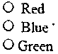


 | 

```
<!DOCTYPE html>
<html>
<body>
<form>
<input type="radio"> Red <br>
<input type="radio"> Blue <br>
<input type="radio">Green <br>
</form>
</body>
</html>
```

 |
| 重置 | 用于定义将表单值重置为默认值的按钮。 | 


 | 

```
<!DOCTYPE html>
<html>
<body>
<form>
<input type="reset" value="Reset">
</form>
</body>
</html>
```

 |
| 使服从 | 用于定义表单的提交按钮。 | 


 | 

```
<!DOCTYPE html>
<html>
<body>
<form>
<input type="submit" value="Submit">
</form>
</body>
</html>
```

 |
| 文本 | 用于定义表单中的文本字段。 | 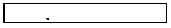


 | 

```
<!DOCTYPE html>
<html>
<body>
<form>
<input type="text"><br>
</form>
</body>
</html>
```

 |

### HTML5 中可用的“输入”类型列表

| **类型** | **描述** | **格式** | **例子** |
| 颜色 | 用于定义 HTML 表单中元素的颜色。它接受十六进制输入。 | 


 | 

```
<!DOCTYPE html>
<html>
<body>
<form>
<input type="color" name="downclick" value="#f5f5dc">
</form>
</body>
</html>
```

 |
| 日期时间-本地 | 用于定义 HTML 表单中的日期和时间元素，当在支持的浏览器中使用时，打开日期选择器或月、日和年的数字轮。 | 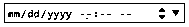


 | 

```
<!DOCTYPE html>
<html>
<body>
<form>
<input type="datetime-local">
</form>
</body>
</html>
```

 |
| 电子邮件 | 用于为电子邮件定义一个文本字段，该字段已完成检查电子邮件的所有预定义验证。 | 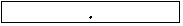


 | 

```
<!DOCTYPE html>
<html>
<body>
<form>
<input type="email">
</form>
</body>
</html>
```

 |
| 日期 | 用于为 HTML 表单定义日期选取器。 | 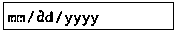


 | 

```
<!DOCTYPE html>
<html>
<body>
<form>
<input type="date">
</form>
</body>
</html>
```

 |
| 数字 | 用于在 HTML 表单中输入数字，方法是在受支持的浏览器中使用时显示微调器并添加默认验证。 | 


 | 

```
<!DOCTYPE html>
<html>
<body>
<form>
<input type="number">
</form>
</body>
</html>
```

 |
| 范围 | 用于在 HTML 表单中定义一个范围。 | 


 | 

```
<!DOCTYPE html>
<html>
<body>
<form>
<input type="range">
</form>
</body>
</html>
```

 |
| 搜查 | 用于定义输入搜索字符串的单行文本字段。 | 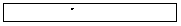


 | 

```
<!DOCTYPE html>
<html>
<body>
<form>
<input type="search">
</form>
</body>
</html>
```

 |
| 电话 | 用于在 HTML 表单中定义电话输入字段。 | 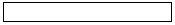


 | 

```
<!DOCTYPE html>
<html>
<body>
<form>
<input type="tel" pattern="[0-9]{3}-[0-9]{3}-[0-9]{4}">
</form>
</body>
</html>
```

 |
| 时间 | 用于定义在 HTML 表单中输入时间的字段 | 


 | 

```
<!DOCTYPE html>
<html>
<body>
<form>
<input type="time">
</form>
</body>
</html>
```

 |
| 全球资源定位器(Uniform Resource Locator) | Used to define a text field for entering a url in the HTML form with all its validations being performed automatically. | 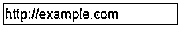


 | 

```
<!DOCTYPE html>
<html>
<body>
<form>
<input type="url" placeholder="http://example.com">
</form>
</body>
</html>
```

 |
| 周 | 用于定义一个文本字段，用于输入周-年数和不带时区的周数。 | 


 | 

```
<!DOCTYPE html>
<html>
<body>
<form>
<input type="week">
</form>
</body>
</html>
```

 |
| 日期时间 | 用于定义文本字段，以便根据 UTC 时区输入日期和时间(小时、分钟、秒和秒的小数部分)。 | 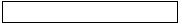


 | 

```
<!DOCTYPE html>
<html>
<body>
<form>
<input type="datetime">
</form>
</body>
</html>
```

 |

### 属性

下一节提供了一个表格，列出了所有相关属性以及简要说明。该表后面是一个列表，更详细地描述了每个属性，以及它们所关联的输入类型。对大多数或所有输入类型通用的那些在下面有更详细的定义。

| **属性** | **类型** |
| 1.接受 | 文件 |
| 2.中高音 | 图像 |
| 3.自动完成 | 全部 |
| 4.自（动）调焦装置 | 全部 |
| 5.捕获 | 文件 |
| 6.检查 | 单选，复选框 |
| 7.       dirname | 文本，搜索 |
| 8.有缺陷的 | 全部 |
| 9.形式 | 全部 |
| 10.形成作用 | 图像，提交 |
| 11.formenctype | 图像，提交 |
| 12.formmethod(形状方法) | 图像，提交 |
| 13.甲酰新戊酸盐 | 图像，提交 |
| 14.表单目标 | 图像，提交 |
| 15.高度 | 图像 |
| 16.目录 | 几乎处处 |
| 17.最大 | 数字类型 |
| 18.    maxlength | 密码，搜索，电话，文本，网址 |
| 19.部 | 数字类型 |
| 20.    minlength | 密码，搜索，电话，文本，网址 |
| 21.多个的 | 电子邮件，文件 |
| 22.名字 | 全部 |
| 23.模式 | 密码、文本、电话 |
| 24.占位符 | 密码，搜索，电话，文本，网址 |
| 25.只读的 | 几乎处处 |
| 26.需要 | 几乎处处 |
| 27.大小 | 电子邮件、密码、电话、文本 |
| 28.科学研究委员会 | 图像 |
| 29.步骤 | 数字类型 |
| 30.类型 | 全部 |
| 31.价值 | 全部 |
| 32.宽度 | 图像 |

### 结论–HTML 表单输入类型

在 HTML5 新表单输入类型的帮助下，我们可以增强用户体验，创建一个面向未来的应用程序，并使开发人员的编码变得更容易。对这些新的表单输入类型的支持非常强大，尤其是在带有键盘的移动设备中。这些输入类型对于可用性来说是安全的，也为用户提供了额外的功能。

### 推荐文章

这是一个 HTML 表单输入类型的指南。这里我们讨论 HTML 和 HTML 5 中可用的“输入”类型以及属性。您也可以看看以下文章，了解更多信息–

1.  [HTML 图片标签](https://www.educba.com/html-picture-tag/)
2.  [HTML 填充](https://www.educba.com/html-padding/)
3.  [HTML 中的 THead 标签](https://www.educba.com/thead-tag-in-html/)
4.  [HTML 显示块](https://www.educba.com/html-display-block/)


