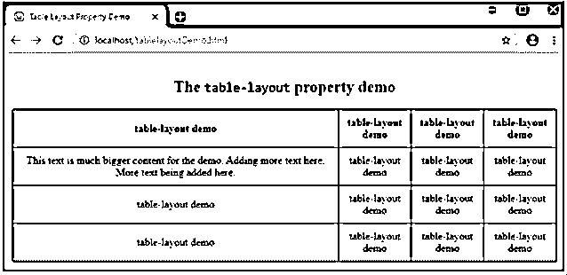
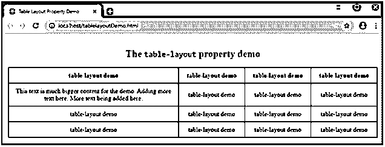
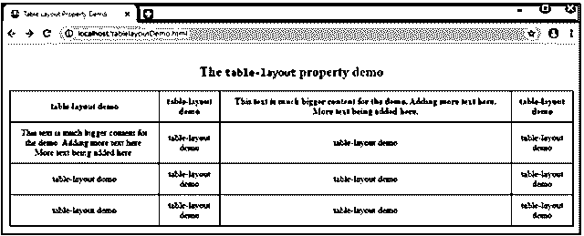
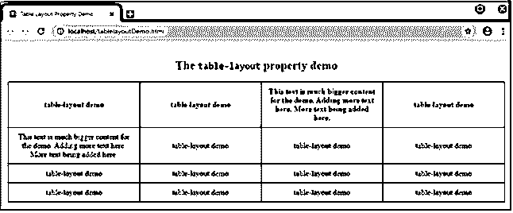

# HTML 表格布局

> 原文：<https://www.educba.com/html-table-layout/>


## HTML 表格布局介绍

可以使用 width 属性设置 HTML 文档中表格的布局，并在进程中限制表格的宽度，使其保持不变，无论单元格中的内容有多长，也无论浏览器显示设置如何。或者我们可以使用一个叫做 table-layout 的 HTML 属性。

table-layout 属性有助于为浏览器定义一组指令，浏览器在对表格以及表格的单元格和列进行布局时应该使用这些指令。

<small>网页开发、编程语言、软件测试&其他</small>

因此，简而言之，一个表格布局属性可以说是包含了一个算法，让浏览器按照这个算法来布局你的表格。表格布局属性有多种值可以设置，但这完全取决于用户的选择。如果没有使用 table-layout 属性，浏览器会自动应用一些规则，定义单元格和列的布局方式。当 table-layout 属性的值设置为“auto”时，这些规则也适用。

**语法:**

下面是表格布局属性的简单语法。

```
ObjectName
{
table-layout: auto|fixed|initial|inherit;
}
```

### HTML 表格布局值

如上所述，用于表布局属性的值完全取决于程序员对设计和品味的选择，并根据程序员的选择而变化。以下是可以与 table-layout 属性一起使用的值。

#### 1.汽车

“auto”是表格布局属性的“默认”值。也就是说，即使程序员没有定义表格布局属性，浏览器也会使用“自动”约束来定义表格以及表格的单元格和列布局。表格和表格单元格的宽度取决于单元格内的内容，即表格的宽度根据单元格内的最大内容进行调整，保持牢不可破。

下面的示例显示了值为“auto”的表格布局。

**例子**

此示例显示了一个表格，表格宽度为 100%，表格布局值设置为“自动”。

**代码:**

```
<body>
<h2>The <code>table-layout</code> property demo</h2>
<table>
<thead>
<tr>
<th>table-layout demo</th>
<th>table-layout demo</th>
<th>table-layout demo</th>
<th>table-layout demo</th>
</tr>
</thead>
<tbody>
<tr>
<td>This text is much bigger content for the demo. Adding more text here. More text being added here.</td>
<td>table-layout demo</td>
<td>table-layout demo</td>
<td>table-layout demo</td>
</tr>
<tr>
<td>table-layout demo</td>
<td>table-layout demo</td>
<td>table-layout demo</td>
<td>table-layout demo</td>
</tr>
</tbody>
<tfoot>
<tr>
<td>table-layout demo</td>
<td>table-layout demo</td>
<td>table-layout demo</td>
<td>table-layout demo</td>
</tr>
</tfoot>
</table>
</body>
```

**输出:**




请注意，表格的宽度根据单元格中的内容进行了调整，第一列根据第二行第一个单元格中的大量内容进行了调整。而其他列被平均划分，因为它们包含相同措辞的内容。

#### 2.固定的

顾名思义,“固定”值根据 col 元素(如果有)的预定义宽度和表格的宽度来定义表格及其列的宽度。值为“fixed”的该属性也可以由表格的第一行单元格的宽度来确定。单元格的其余宽度不会影响表格的宽度。

我们需要给出表格的宽度，而不是“auto”(默认值)。在下面的示例中，宽度设置为 100%。

**例#1**

使用上面创建的相同表格，但是将表格布局设置为“固定”值，表格宽度为 100%。下面给出了程序中定义的 CSS 值，HTML 代码也是一样的。

**代码:**

```
table {
width: 100%;
margin: 10px auto;
table-layout: fixed;
}
```

**输出:**


**Note #1:** The content is not deciding the table width as it did while using ‘auto’ property value according to the content. The ‘fixed’ value when used, the browser uses the width (if any) defined by the programmer. If not, the column’s widths are divided equally, no matter the length of the content in the cells. Below is one more example using table-layout: fixed property.**Note #2:** Since the width is set to 100%, the table spans across the container and divides the column’s width equally.

**例 2**

这个例子展示了当使用 table-layout 作为固定属性时，固定宽度的单元格是如何起作用的。

在这里，我们将第一个单元格的宽度设置为 400 像素，用于演示目的，以夸大显示的差异。现在观察属性值“fixed”对其他单元格没有影响，因为每个其他单元格都有相同的内容。




**例 3**

现在观察下面的例子。这个表格和上面的表格一样，在其他单元格中有一个更大的内容，宽度设置为 250 像素。

注意该属性是否设置为 auto

```
table {
width: 100%;
margin: 10px auto;
table-layout: auto;
}
```

**输出:**




但是在这里，当使用“fixed”属性时，它会相应地切换表格。

```
table {
width: 100%;
margin: 10px auto;
table-layout: fixed;
}
```

*   它不接触第一个单元格的固定宽度。




*   无论内容如何，均分表格的其余部分。[文本换行]

还有两个值是全局值。

*   **initial:** 使用该值时，将属性设置为默认初始值。
*   **inherit:** 您还可以从父元素继承表格布局设计或属性。

因为当我们使用“固定的”表格布局算法或布局方法时，一旦浏览器接收到表格的第一行并对其进行分析，就会呈现完整的表格。如果表格非常大，那么如果使用“固定”布局方法，用户将只能看到表格的第一行，这给用户带来了良好的效果，给他们一种表格加载更快的印象。

### 推荐文章

这是一个 HTML 表格布局的指南。这里我们讨论 HTML 表格布局的值，以及例子和输出。您也可以看看以下文章，了解更多信息–

1.  [HTML 文本属性](https://www.educba.com/html-text-attributes/)
2.  [HTML 框架集标签](https://www.educba.com/html-frameset-tag/)
3.  [HTML 图像填充](https://www.educba.com/html-image-padding/)
4.  [HTML 中的 THead 标签](https://www.educba.com/thead-tag-in-html/)


