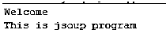
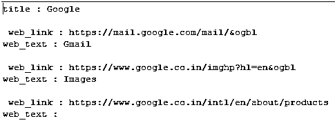
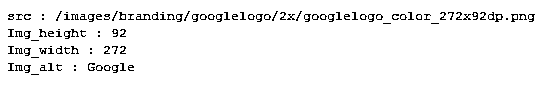
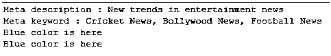

# j 组示例

> 原文：<https://www.educba.com/jsoup-example/>


## Jsoup 示例的定义

基本上，Java 向用户提供了不同类型的库，其中 jsoup maven 是 Java 提供的库之一。当我们需要处理实时 HTML 页面时，通常使用 Jsoup。Jsoup 提供了不同类型的 API 来获取不同的 URL，并根据需要借助 HTML5 DOM 和 CSS 选择器来操纵它们。通过使用 jsoup，我们可以执行不同的操作，或者我们可以说，我们可以编写不同的程序来获得网页的标题，从特定的网页获得大量的链接，从指定的网页获得大量的图像，并且我们可以获得 URL 和 HTML 文档的元数据。

### j 组概述

Jsoup 是一个开源的 Java 库，主要用于从 HTML 中分离信息。它还允许你控制和生成 HTML。它有一个一致的改进路线，非凡的文档，以及一个熟悉的和适应性强的 API。Jsoup 同样可以用来解析和构造 XML。

<small>网页开发、编程语言、软件测试&其他</small>

Jsoup 加载页面 HTML 并构造相关的 DOM 树。这个树的工作方式和程序中的 DOM 一样，提供了像 jQuery 和 vanilla JavaScript 这样的技术来选择十字、控制文本/HTML/特征和添加/删除组件。下面列出了 Jsoup 的不同组件。

*   堆叠:将 HTML 引入并解析到文档中。
*   分离:将理想的信息选择成元素并导航。
*   移除:获取集线器的属性、文本和 HTML。
*   改变:增加/改变/消除中枢，改变它们的特性。

### 所有 j 组示例

现在让我们一个接一个地看看所有的例子。

#### 示例#1

```
package demo;
import org.jsoup.Jsoup;
import org.jsoup.nodes.Document;
import org.jsoup.nodes.Element;
import org.jsoup.select.Elements;
public class jsoup {
public static void main(String[] args) {
String html_code = "<html><head><title>Welcome</title></head>"
+ "<body><p>This is jsoup program</p></body></html>";
Document docu = Jsoup.parse(html_code);
System.out.println(docu.title());
Elements para = docu.getElementsByTag("p");
for (Element paragraph : para) {
System.out.println(paragraph.text());
}
}
}
```

**解释**

这是一个简单的 Jsoup 程序，我们试图获取网页的内容，在上面的例子中，我们用 HTML 代码编写字符串，并通过使用 Jsoup 库获取该字符串，如上面的代码所示。上面程序的最终结果我们用下面的截图来说明。




现在我们来看 Jsoup 的第二个例子如下。

#### 实施例 2

```
package com.sample;
import org.jsoup.Jsoup;
import org.jsoup.nodes.Document;
import org.jsoup.nodes.Element;
import org.jsoup.select.Elements;
import java.io.IOException;
public class jsample {
public static void main(String[] args) {
Document docu;
try {
// required protocol that is http
docu = Jsoup.connect("http://google.com").get();
// title of page
String title_page = docu.title();
System.out.println("title : " + title_page);
// links
Elements links_web = docu.select("a[href]");
for (Element link : links_web) {
// href attribute
System.out.println("\n web_link : " + link.attr("href"));
System.out.println("web_text : " + link.text());
}
} catch (IOException e) {
e.printStackTrace();
}
}
}
```

**解释**

通过使用上面的代码，我们试图找出 google.com 的所有超链接。这里，我们首先导入所需的包和库，如下所示。之后，我们写的 HTTP 协议的代码，以及我们如何可以得到 google.com 的所有超链接，如图所示。上面程序的最终输出我们用下面的截图来说明。




现在让我们看看下面的图片示例。

#### 实施例 3

```
package demo;
import org.jsoup.Jsoup;
import org.jsoup.nodes.Document;
import org.jsoup.nodes.Element;
import org.jsoup.select.Elements;
import java.io.IOException;
public class jsample {
public static void main(String[] args) {
Document docu;
try {
docu = Jsoup.connect("http://google.com").get();
Elements web_images = docu.select("img[src~=(?i)\\.(png|jpe?g|gif)]");
for (Element image : web_images) {
System.out.println("\nsrc : " + image.attr("src"));
System.out.println("Img_height : " + image.attr("height"));
System.out.println("Img_width : " + image.attr("width"));
System.out.println("Img_alt : " + image.attr("alt"));
}
} catch (IOException e) {
e.printStackTrace();
}
}
}
```

**解释**

通过使用上面的例子，我们试图获取所有来源的图像，这里我们试图获取 google.com 的图像，如上面的代码所示。之后，我们编写代码来获取高度和宽度，如图所示。上面程序的最终输出我们用下面的截图来说明。




现在让我们看看如下的元数据的例子。

```
package demo;
import org.jsoup.Jsoup;
import org.jsoup.nodes.Document;
public class jsample {
public static void main(String[] args) {
StringBuffer html_code = new StringBuffer();
html_code.append("<!DOCTYPE html>");
html_code.append("<html lang=\"en\">");
html_code.append("<head>");
html_code.append("<meta charset=\"UTF-8\" />");
html_code.append("<title>Hollywood Life</title>");
html_code.append("<meta name=\"description\" content=\"New trends in entertainment news\" />");
html_code.append("<meta name=\"keywords\" content=\"Cricket News, Bollywood News, Football News\" />");
html_code.append("</head>");
html_code.append("<body>");
html_code.append("<div id='color'>Blue color is here</div> />");
html_code.append("</body>");
html_code.append("</html>");
Document docu = Jsoup.parse(html_code.toString());
//get a description of metadata content
String des = docu.select("meta[name=description]").get(0).attr("content");
System.out.println("Meta description : " + des);
//get keyword of metadata content
String keyw = docu.select("meta[name=keywords]").first().attr("content");
System.out.println("Meta keyword : " + keyw);
String color_A = docu.getElementById("color").text();
String color_B = docu.select("div#color").get(0).text();
System.out.println(color_A);
System.out.println(color_B);
}
}
```

**解释**

通过使用上述代码，我们尝试在 jsoup 中实现元数据，这里我们编写 HTML 主体和元数据，并通过使用 append 函数进行推送，如下所示。之后，我们编写元数据描述和元数据关键字的代码。上面程序的最终输出我们用下面的截图来说明。




现在让我们看看如何得到图标如下。

#### 实施例 4

```
package demo;
import org.jsoup.Jsoup;
import org.jsoup.nodes.Document;
import org.jsoup.nodes.Element;
public class jsample {
public static void main(String[] args) {
StringBuffer html_code = new StringBuffer();
html_code.append("<html lang=\"en\">");
html_code.append("<head>");
html_code.append("<link rel=\"icon\" href=\"http://specifiedurl.com/img.ico\" />");
html_code.append("</head>");
html_code.append("<body>");
html_code.append("something");
html_code.append("</body>");
html_code.append("</html>");
Document docu = Jsoup.parse(html_code.toString());
String fav = "";
Element ele = docu.head().select("link[href~=.*\\.(ico|png)]").first();
if(ele==null){
ele = docu.head().select("meta[itemprop=image]").first();
if(ele!=null){
fav = ele.attr("content");
}
}else{
fav = ele.attr("href");
}
System.out.println(fav);
}
}
```

**解释**

通过使用上面的例子，我们尝试在 Jsoup 中实现 get an icon，这里我们需要指定我们想要的网站的 URL。之后，我们还需要提到如图所示的 HTML 的链接标签。上面程序的最终输出我们用下面的截图来说明。


### 结论–小组示例

我们希望通过这篇文章，您能够了解更多关于 Jsoup 的例子。从上面的文章中，我们已经理解了 jsoup 示例的基本思想。我们也看到了 Jsoup 示例的表示和示例。从本文中，我们了解了如何以及何时使用 Jsoup 示例。

### 推荐文章

这是一个引导 Jsoup 的例子。这里我们讨论定义，概述，代码实现的例子。您也可以看看以下文章，了解更多信息–

1.  [Lua JSON](https://www.educba.com/lua-json/)
2.  [Oracle 中的 JSON](https://www.educba.com/json-in-oracle/)
3.  [釜用 JSON](https://www.educba.com/kotlin-json/)
4.  [XSLT JSON](https://www.educba.com/xslt-json/)


