# 如何安装 Apache

> 原文：<https://www.educba.com/install-apache/>

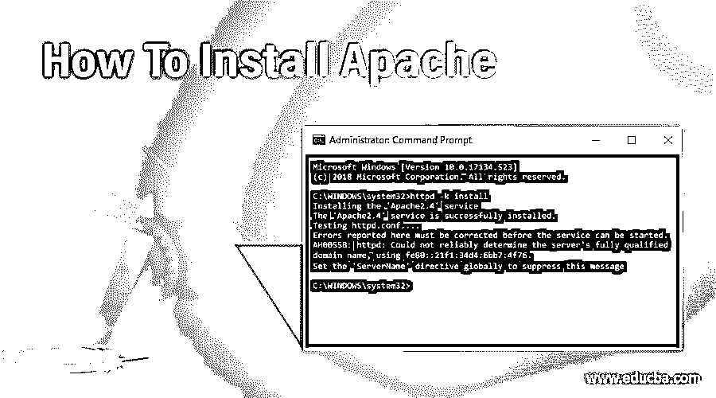

## 如何安装 Apache？

在进入如何安装 Apache 部分之前，我们将首先对 Apache 及其在数据科学中的应用有一个总体的了解。

### 什么是阿帕奇？

<small>网页开发、编程语言、软件测试&其他</small>

Apache Web 服务器是一个 HTTP 服务器，向访问您的服务器的访问者呈现网站。因此，如果您想为一个企业或您的组织部署一个网站，您最有可能使用 Apache 来完成。还有其他 HTTP 服务器，比如 IIS，但是 Apache 是大多数人使用的标准，不管他们是在 Linux、Windows 还是 Mac 上。Apache 是大多数人的默认选择，因为它众所周知，非常可靠，而且是免费的。

然而，有一点要认识到，Apache 是一个 HTTP 服务器，如果你把它安装在 Linux 或 Windows 或 Mac 上，它所能做的就是向访问你的服务器的访问者展示静态网站。因此，如果你除了 JavaScript 之外没有其他编程语言来编写一个 HTML 网站，你只需要一个 Apache 服务器就可以了。你可以将你所有的标签插入到 Apache 服务器中，并呈现给你的访问者。

### Apache 在数据科学中是如何使用的？

数据科学是当今世界最受欢迎的研究领域。数据科学家被认为是 21 世纪最性感的工作，各个学科的专业人士都想学习并成为数据科学家。Apache 在任何数据科学爱好者中扮演着至关重要的角色，因为他们需要对 Apache Hadoop 生态系统有足够的了解。

**Apache Hadoop 生态系统:**

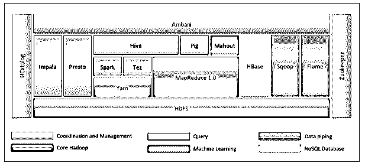

首先，Hadoop 生态系统不是一个工具。它不是一种编程语言或单一框架。它是一组工具，由不同领域的不同公司一起用于多种任务。

下面我们将逐一介绍每个工具:

*   Apache HDFS (Hadoop 分布式文件系统)是 Hadoop 的存储单元，可以存储结构化、半结构化和非结构化数据。HDFS 有元数据来维护关于存储数据的日志文件。它有两个组件——NameNode 和 DataNode。
*   Apache Yarn 是资源协商者，执行所有处理活动，如调度任务、分配资源等。它有两个服务——首先是资源管理器，负责调度运行在 Yarn 之上的应用程序。第二个是节点管理器，它监控资源的使用情况。
*   Apache Map Reduce 是 Hadoop 的数据处理组件，它使用基于 Map、Sort 和 Shuffle 以及 Reduce 函数的分布式和并行计算来处理大型数据集。映射函数过滤数据，然后进行排序和洗牌，最后，减少函数集合并总结结果。
*   Apache Pig 主要用于 ETL。它有两部分——Pig 拉丁文和 Pig 运行时。Pig Latin 是使用查询进行数据处理的语言，而 Pig runtime 是执行环境。一行猪拉丁几乎等于 100 行 Map Reduce 代码。这个过程包括首先加载数据，然后分组，排序，过滤，并存储在 HDFS。
*   Apache Hive 使用类似 SQL 的查询来分析分布式环境中的数据。它有两个组件 Hive 命令行和 JDBC/ODBC 服务器，使用的语言叫做 HiveQL。
*   Apache Mahout 是用 Java 编写的机器学习库，用于创建机器学习应用程序，如聚类、分类或回归。它为不同的用例内置了不同的算法。
*   Apache HBase 是一个用 Java 编写的 NoSQL 数据库，运行在 Hadoop 上。它基于 Google 的 BigTable 构建，能够处理所有类型的数据。
*   Apache Sqoop 是数据摄取工具之一，用于 RDBMS 和 Hadoop 之间的批量结构化数据传输[。](https://www.educba.com/hadoop-vs-rdbms/)
*   Apache Flume 是另一个数据摄取工具，用于 Hadoop 和其他数据源之间的半结构化和非结构化数据传输。
*   ZooKeeper 是协调者，确保 Hadoop 生态系统中各种工具之间的协调。
*   Apache Ambari 是一个集群管理器，负责调配、管理 Hadoop 集群，并监控它们的运行状况和状态。
*   Apache Tez 是 Hadoop 生态系统中的一个新工具，可以加速 Hadoop 的查询处理。
*   Apache Presto 是一个开源的分布式 SQL 查询引擎，支持跨平台查询功能。
*   Apache HCatalog 是 Hadoop 的元数据和表管理系统，支持跨数据处理工具的互操作性。它还帮助用户选择最适合其环境的工具。
*   Apache Spark 是数据科学家中使用最广泛、最流行的框架。它是一个高速集群计算系统，在许多迭代任务的情况下优化资源利用。它为批处理和实时数据分析提供了灵活性。

### 安装 Apache 的步骤

到目前为止，我们已经了解了 Apache，以及它对任何想要学习数据科学或大数据分析的人是如何有用的。

现在，我们将根据下面的步骤在 windows 上安装 apache。

*   转到 https://httpd.apache.org/，点击 Apache httpd 2.4.38 Released 部分下的下载链接。

*   它会带你到下一页，然后点击微软视窗文件。

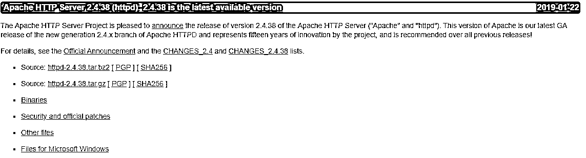

*   点击 Apache Lounge。

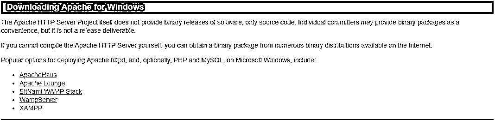

*   根据您的 windows 操作系统，您可以下载 32 位或 64 位的 zip 文件。我们将在这里下载 64 位版本。单击相应的。下载的 zip 链接。

*   现在，它需要 C++可再发行 Visual Studio 2017。所以我们会从相应的 32 位或者 64 位链接下载。

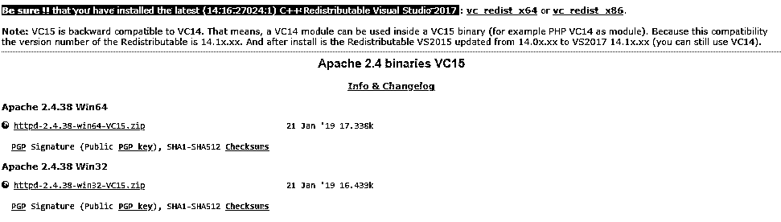

*   下载完这两个文件后，我们将转到下载位置并安装 C++可再发行 Visual Studio 2017。双击。exe 文件。

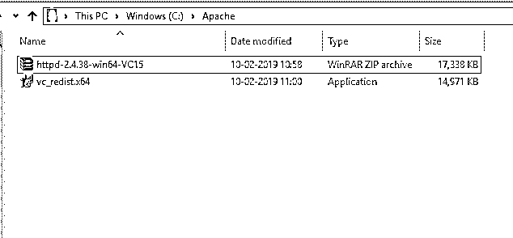

*   勾选“我同意”并点击安装。

*   Apache 的安装正在进行中。

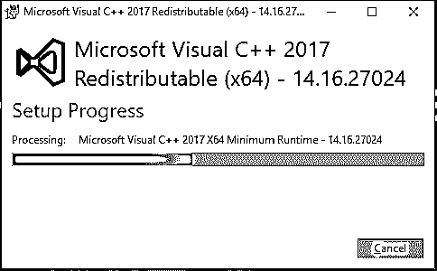

*   一旦完成，您将得到这样的消息。单击“关闭”完成安装。

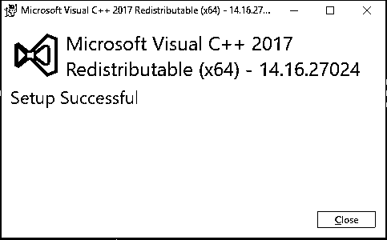

*   现在，转到下载 Apache zip 文件的文件夹。右键单击它并选择 extract here。

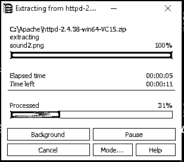

*   现在，我们将创建一个 Apache24 文件夹。将这个文件夹复制到 c 盘，然后我们将添加一个系统环境变量的路径。

进入系统属性->高级标签->点击下面的环境变量按钮。

*   在变量中，找到路径并单击编辑。

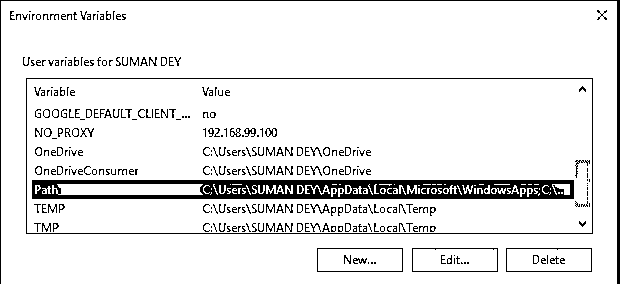

*   点击浏览->转到 c 盘 Apache24 文件夹->选择 bin 文件夹->点击确定。

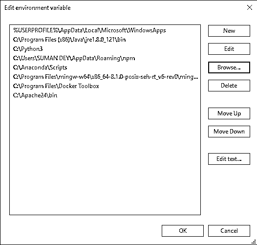

*   我们将把 Apache 安装成一个 Windows 服务。以管理员身份运行命令提示符。键入 httpd–k install 并按 enter 键。

*   我们将检查安装 Apache 服务。单击 Windows 图标并键入 services。单击服务应用程序，找到名为 Apache24 的服务。

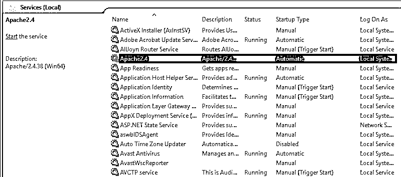

*   要启动 Apache 服务器，右键单击它并单击 start。状态将变为“正在运行”。

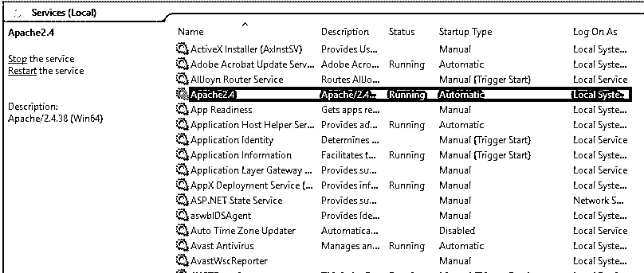

*   我们可以用浏览器测试。打开浏览器，导航到 http://localhost，然后按 enter 键。一条写着“成功了！”的信息会弹出确认 Apache 安装成功。

### 推荐文章

这是如何安装 Apache 的指南？这里我们讨论一下简介，apache 是如何在数据科学中使用的以及安装 apache 的步骤。您也可以阅读以下文章，了解更多信息——

1.  [阿帕奇面试问题](https://www.educba.com/apache-interview-questions/)
2.  [阿帕奇兴趣点](https://www.educba.com/apache-poi/)
3.  [阿帕奇兴趣点依赖关系](https://www.educba.com/apache-poi-dependency/)
4.  [阿帕奇蚂蚁](https://www.educba.com/apache-ant/)

