# 如何安装 Drupal 8？

> 原文：<https://www.educba.com/install-drupal-8/>

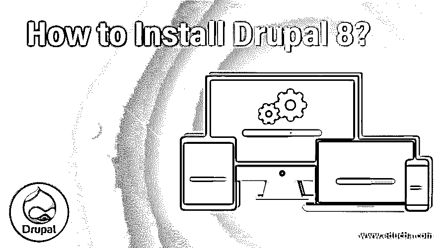

## 如何安装 Drupal 8？

下面这篇文章提供了如何安装 Drupal 8？Drupal 是一个内容管理框架。现在你会问，那是什么？因此，内容管理系统管理数字内容的创建和修改。Drupal 主要专注于基于网络的内容，如网站结构等。它是在编程语言 PHP 之上开发的。它是开源的，意味着安装和运行 Drupal 是免费的。

### 安装 Drupal 8 的先决条件

以下是安装 Drupal 8 的先决条件:

<small>网页开发、编程语言、软件测试&其他</small>

#### 1.系统需求

在继续之前，花点时间评估一下您的系统是否具备 Drupal 无故障运行所需的硬件和软件。

*   **操作系统:**Windows 7+/Linux/Unix/MAC OS/Ubuntu
*   **磁盘空间:**核心软件需要 100 MB 的空闲磁盘空间。放大器堆栈需要 1 GB 多一点。建议至少有 1 GB 的额外可用空间来容纳您的网站资源。
*   **内存:**至少 100MB 可用内存。

#### 2.开发要求

既然我们已经确定您的计算机适合安装 Drupal 8，那么开始用 Drupal 开发您的网站还有一些其他的要求。这就是众所周知的 AMP 栈(Apache MySQL PHP)。如果你的唯一目的是学习 Drupal，你可以简单地下载以上三个软件并安装 Drupal 8。本文档的下一节(安装 AMP)提供了详细说明。

但是，要更深入地了解各种兼容软件，请参见以下内容:

#### 3.浏览器要求

使用 Drupal 构建的网站兼容所有支持 [CSS 和 JavaScript](https://www.educba.com/css-vs-javascript/) 的现代浏览器。

一些推荐的浏览器有:

*   Internet Explorer 11+版本
*   火狐 5+
*   微软 Edge
*   谷歌浏览器
*   Opera 12+
*   Safari 5+

#### 4.数据库服务器要求

Drupal 网站支持与大量数据服务器的连接。您可以使用下面推荐的任何数据库服务提供商将数据托管在本地引擎或远程引擎上。

*   MySQL 5.5.3+(强烈推荐)
*   MariaDB 5.5.2+版
*   Percona 服务器 5.5.8 以上版本
*   PostgreSQL 9.1.2 以上版本
*   SQLite 3.6.8+

虽然 Drupal 也支持 MS SQL Server 和 MongoDB，但是强烈推荐使用 MySQL。这是因为 Drupal 本身运行在 MySQL 数据库服务器上，因此配置变得很容易。任何其他服务器都需要额外的数据库配置。所以，如果你是 Drupal 的初学者，建议在尝试其他数据库之前，先在 MySQL 上掌握 Drupal。

#### 5.网络服务器

Drupal 8 需要一个 web 服务器来托管您将要创建的网站。web 服务器必须托管在 Unix/Linux/OS X/Windows 上。你可以在自己的电脑上或者某个虚拟主机网站上设置一个服务器。一个快速的谷歌搜索会获得数百个虚拟主机站点。

推荐的 Web 服务器有:

*   Apache 2+(强烈推荐)
*   Nginx 0.7 以上
*   Microsoft IIS 5+
*   海华沙
*   PHP 内置 web 服务器(仅推荐用于开发)

强烈推荐 Apache，因为大量 Drupal 用户社区已经在 Drupal+Apache 组合上进行了开发和部署。这很容易解决常见错误。

安装 PHP 时，CLI 中包含 PHP 内置 web 服务器。如果你刚刚开始学习网站开发，这是最方便的方法，而托管对你来说似乎是一项艰巨的任务。但是，不要在生产环境中使用 PHP web 服务器。

#### 6.PHP 要求

Drupal 运行在 PHP 上。在安装 Drupal 8 之前，您的计算机需要安装 PHP。Drupal 推荐 PHP 7.2+版本。

#### 7.依赖性管理器要求

由于 Drupal 依赖于 web 和数据栈来平稳运行，因此管理其依赖性是必不可少的。下载的任何不兼容的软件/工具都可能导致整个网站瘫痪。Drupal 建议使用 Composer 来管理依赖项。

### 安装 AMP 的步骤

对于初学者来说，他们的目标是学习 Drupal，尽量减少主机、服务器和其他东西的麻烦，本节提供了如何将本地机器设置为服务器并开始 Drupal 开发的细节。

**第一步:** [下载](https://www.mamp.info/en/windows/)AMP 安装程序可执行文件。

**第二步:**打开 exe 文件。你将进入以下屏幕。如果需要，您可以选择其他选项。单击下一步。

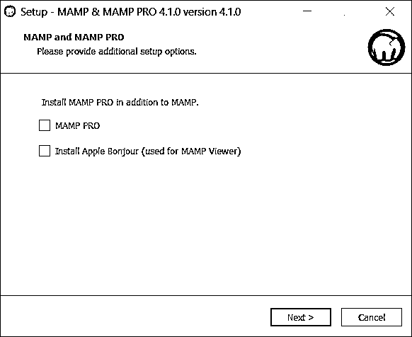

**第三步:**阅读并接受许可协议。单击下一步。

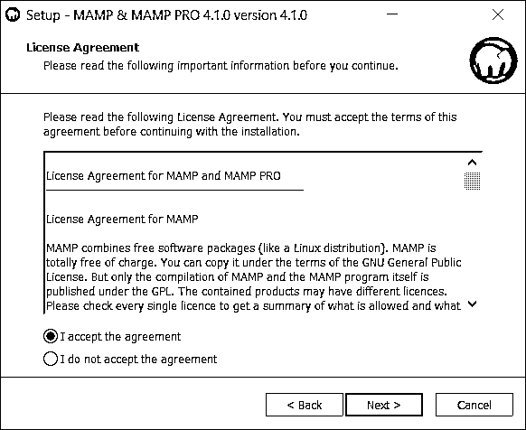

**第四步:**选择需要安装的目录，点击下一步。

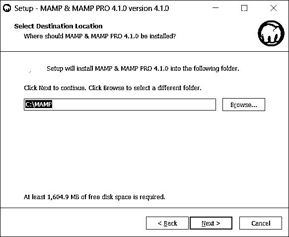

**第五步:**你到达开始菜单和桌面快捷方式偏好屏幕。让它们成为缺省值，并一直点击 Next 直到你到达 Install 按钮。单击“安装”开始安装。

确保在整个安装过程中您都有一个活动的互联网连接。

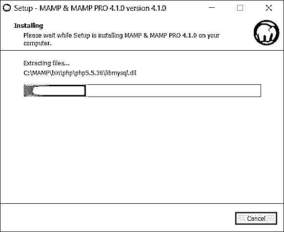

**第六步:**点击完成，完成设置。现在您的本地计算机已经安装了 Apache MySQL PHP。

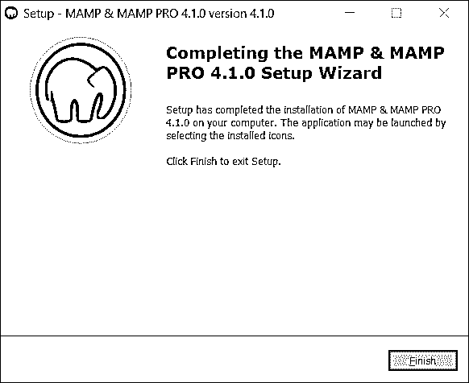

### 安装 Drupal 8 的步骤

对于初学者，建议通过安装文件下载，因为这是最简单的方法。你可以直接跳到下面的相关要点。

#### 1.托管提供商的一键式安装程序

如果你选择通过虚拟主机提供商的网站来托管你的网络服务器，你可以找一个点击式的 Drupal 安装程序。与您的主机提供商取得联系，向他们索取关于一键 Drupal 安装程序的指南或文档。

#### 2.预配置环境

有针对各种本地开发环境的预先策划的安装工具包。你可以在这里找到最适合你的。但是，在至少安装了 AMP 堆栈之后，您不太可能需要这个安装选项。

#### 3.设计者

这是强烈推荐的安装方法，因为它将安装最兼容的 Drupal 版本——基于 PHP 版本、Web 服务器和数据服务器的底层堆栈。简而言之，编写器将有效地管理依赖关系。

要下载 Drupal 核心软件，请打开 Composer 命令行并浏览到所需的安装目录。然后运行下面的命令。

**代码:**

`composer create-project drupal-composer/drupal-project:8.x-dev mydir --no-interaction`

这将在所需位置的文件夹 mydir 中安装核心文件。

#### 4.下载安装文件

或者，您也可以从 Drupal 网站下载一个可执行文件。对于处于学习 Drupal 初级阶段的人来说，这是最安全、最省事的选择。

我们将在下面一步一步地介绍这个选项。

**步骤 1:** 从 Drupal 下载最新版本的 zip 或 tar.gz 文件。

**第二步:**浏览到 MAMP 的安装目录，用下载文件的内容替换 htdocs 文件夹的内容。

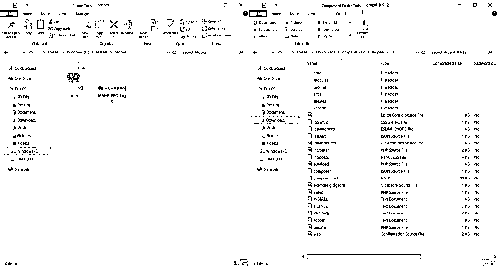

**第三步:**打开 MAMP，点击“打开网页起始页”。确保 Apache 和 MySQL 服务器正在运行。

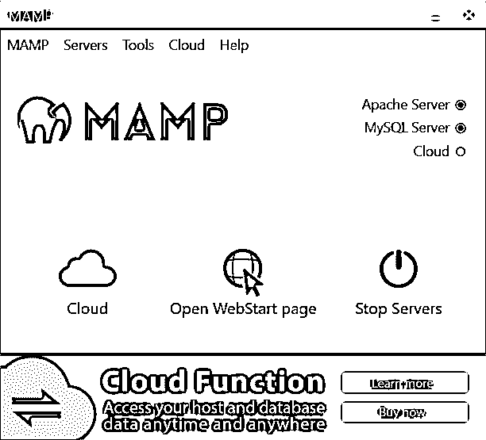

**第四步:**你会登陆下面的页面。

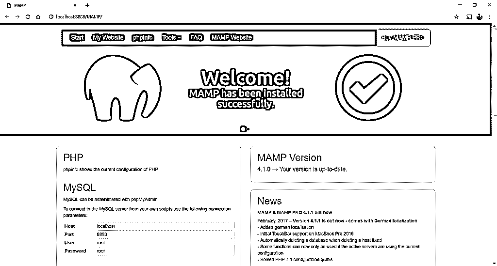

**第五步:**建立数据库。点击 phpMyAdmin。

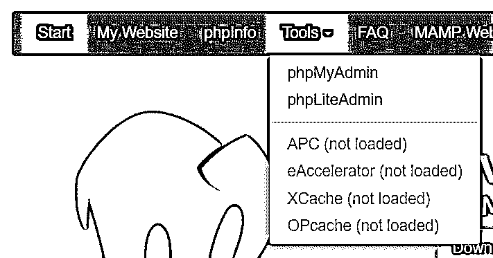

步骤 6: 这将在一个新的标签页中打开 PHP 管理页面。单击左侧面板中的 New 并输入数据库名称。点击创建。

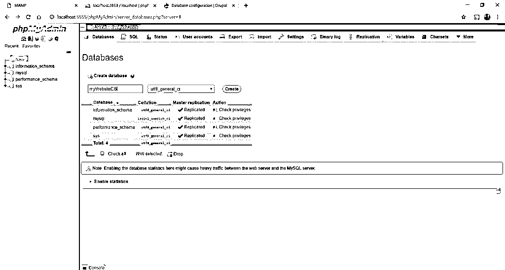

**第 7 步:**返回 MAMP 选项卡，点击“我的网站”。

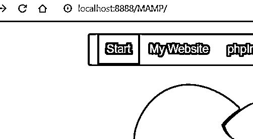

**第 8 步:**你将被带到 Drupal 默认网站安装页面。

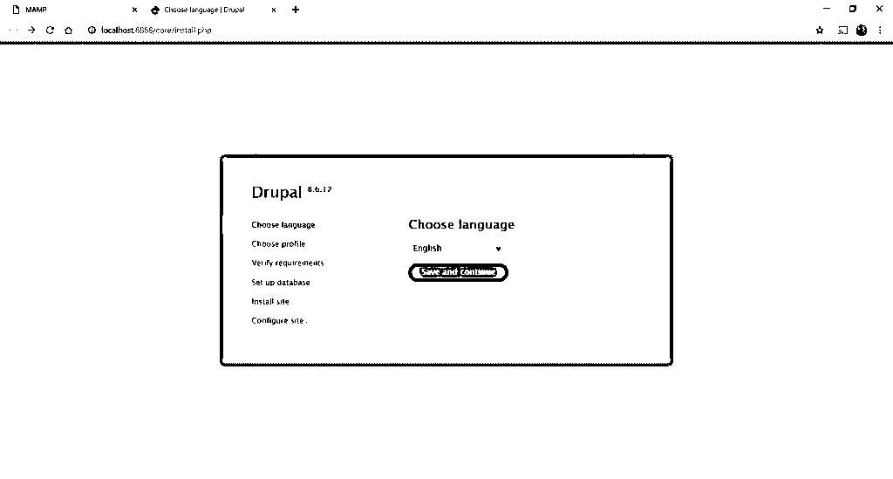

**第 9 步:**点击保存并继续，在下一屏选择标准安装。单击保存并再次继续。

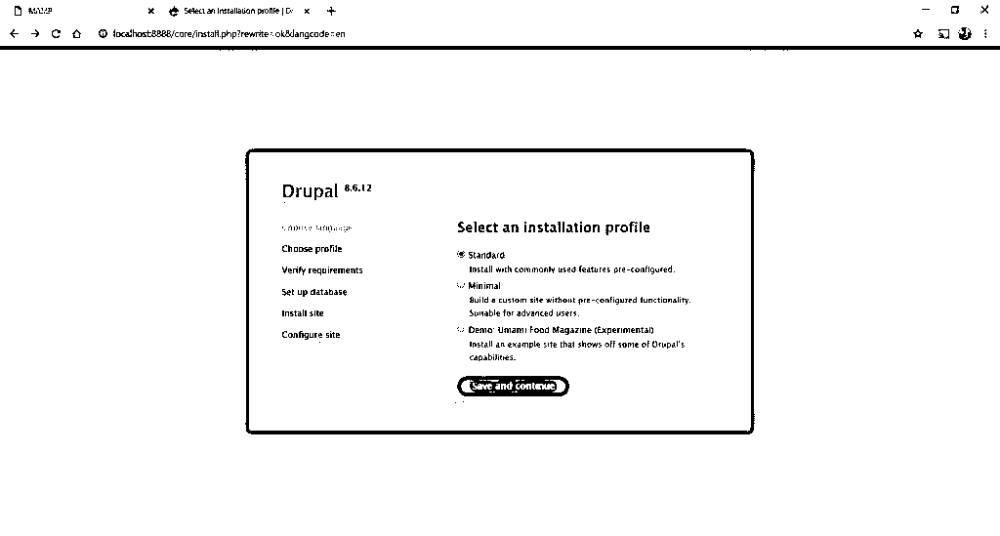

**第 10 步:**如果你到达这样一个屏幕，点击页面底部的“仍然继续”链接。

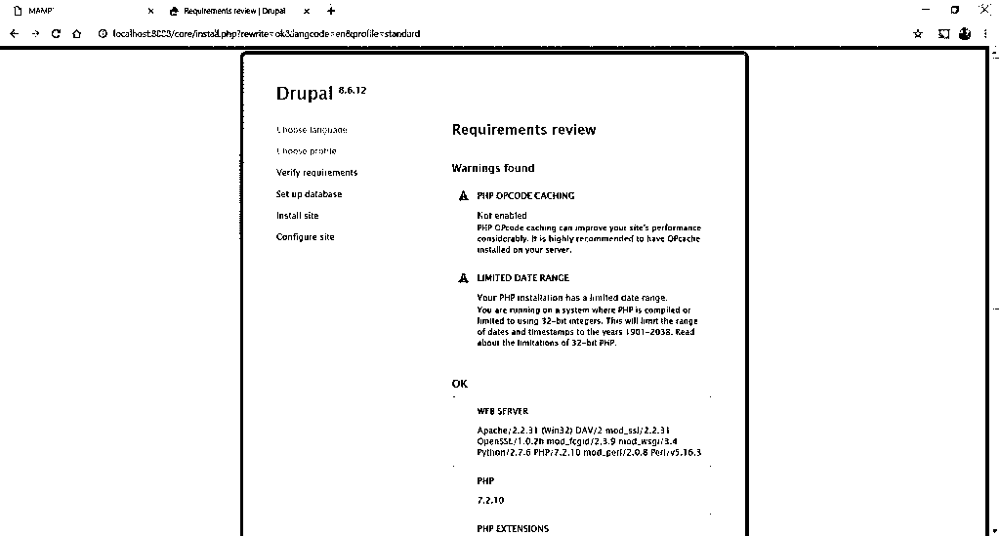

**步骤 11:** 输入数据库名称、用户名和密码。用户名和密码可以在 MAMP 登陆页面的 MySQL 部分找到。单击保存并继续。

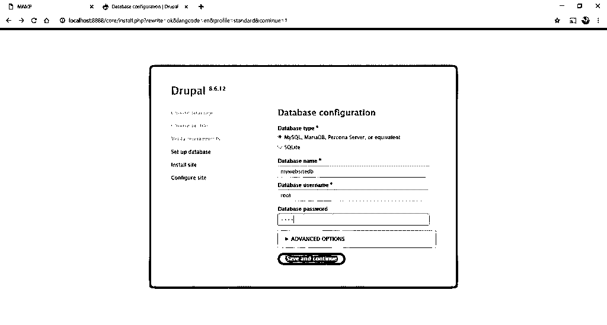

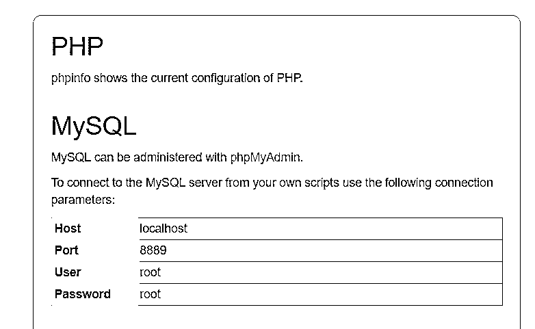

**步骤 12:** 接下来，输入你的网站名称，选择用户名和密码，点击安装。

瞧啊。你的第一个演示网站已经准备好了。使用它，进行一些小的调整，并以有趣的方式学习 Drupal。

### 有趣的事实

如果你运行的是 32 位机器，你将不能输入 1901 年之前和 2038 年之后的日期。这就是俗称的 2038 问题。

### 推荐文章

这是如何安装 Drupal 8 的指南？这里我们讨论了安装 Drupal 8 的步骤以及 AMP 的安装过程。您也可以阅读以下文章，了解更多信息——

1.  [安装 Apache](https://www.educba.com/install-apache/)
2.  [安装角度](https://www.educba.com/installing-angular/)
3.  [安装附件](https://www.educba.com/install-appium/)
4.  [安装 phpMyAdmin](https://www.educba.com/install-phpmyadmin/)

