# 怎么安装 Fedora？

> 原文：<https://www.educba.com/install-fedora/>

## 怎么安装 Fedora？

Fedora 是基于 Linux 的操作系统。最新版本 29 于 2018 年 10 月 30 日发布，内核版本为 4.18。让我们看看安装 Fedora 的步骤。打开 https://getfedora.org/的。你将被引导到 Fedora 的主页。

有 3 个选项可供选择，例如:

<small>网页开发、编程语言、软件测试&其他</small>

*   工作站
*   计算机网络服务器
*   原子的

我们将快速浏览一下每个选项为我们提供了什么:

*   Fedora Workstation: 工作站安装为我们的台式机和笔记本电脑提供了一个用户友好且功能强大的操作系统。GNOME 是默认的，SPINS 允许我们直接安装其他桌面。
*   **Fedora 服务器:**提供服务器和数据中心技术。不适合桌面安装。
*   **Fedora Atomic:** 提供了最基本的东西，用于使用 Dockers 容器在云上部署映像。

### 安装 Fedora 的步骤

让我们通过以下步骤来看看如何在我们的系统上安装 Fedora:

现在我们可以选择工作站选项来安装 Fedora。

立即下载选项将 Fedora media writer for windows 复制到本地计算机。一旦我们运行该文件，安装的完整下载就完成了，大小约为 1.8GB。

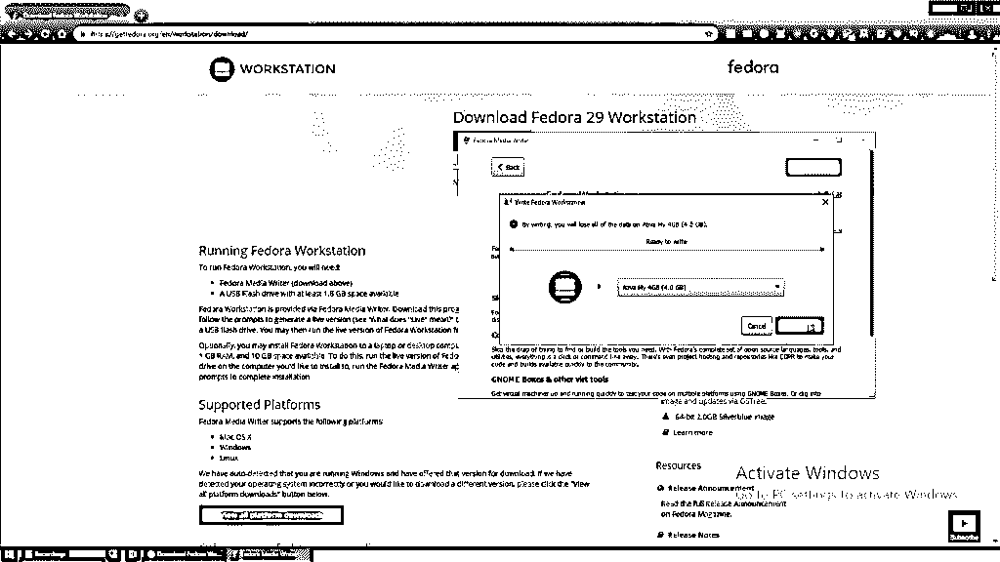

插入要将安装复制到其中的 USB，并从弹出窗口中选择写入磁盘。

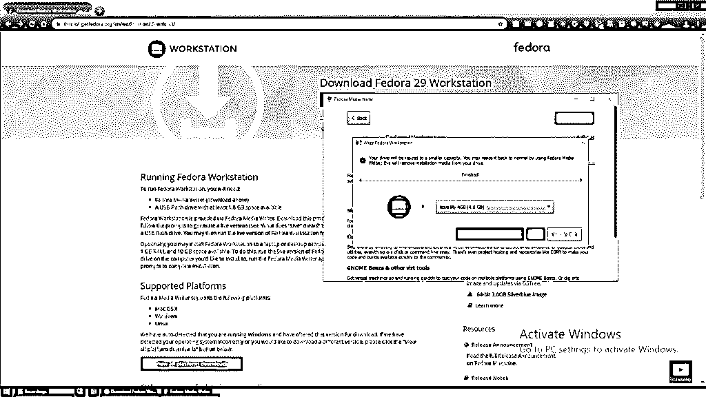

您可以将 Fedora 安装在不同的计算机或您正在使用的同一台计算机上，但是您应该知道，如果没有足够的空间对驱动器进行分区，它将删除 Windows 操作系统。换句话说，以这种方式进行安装总是有风险的。

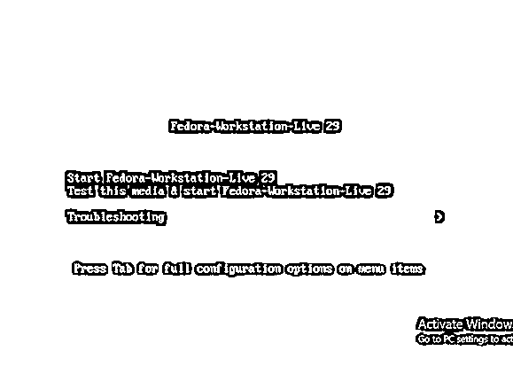

如果您希望测试媒体并浏览实时环境选项，请选择第二个选项。在 Start Fedora-Workstation-Live 29 上选择安装 Fedora。

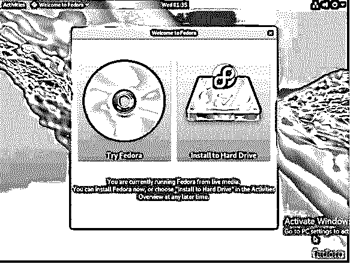

点击安装到硬盘选项，加载到安装和创建必要的分区。

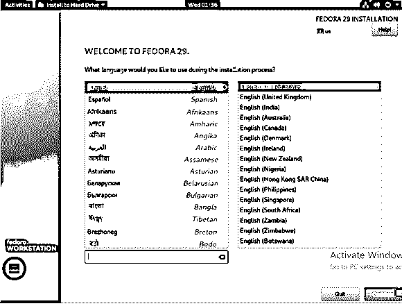

从该窗口中选择首选语言。点击继续。

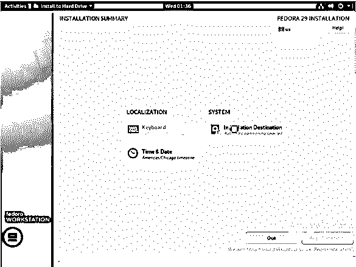

单击安装目标选项。

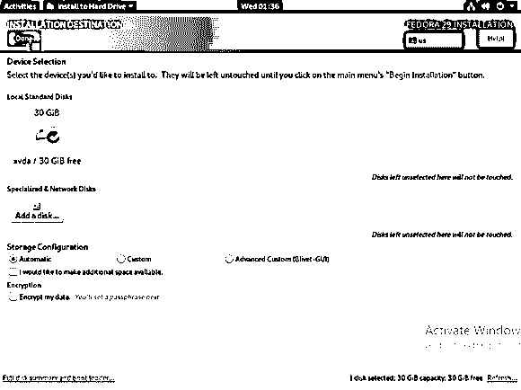

在本地标准磁盘下，您可以选择安装所需的目标硬盘。如果这是在使用现有操作系统(Windows 或 Linux)的机器上完成的，我们会得到一个回收空间的提示。完成所有检查后，单击完成。

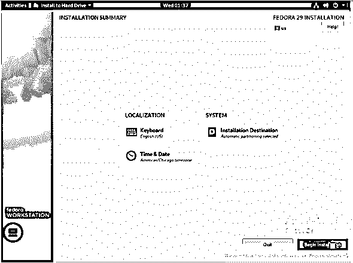

配置将被保存。现在选择选项开始安装。

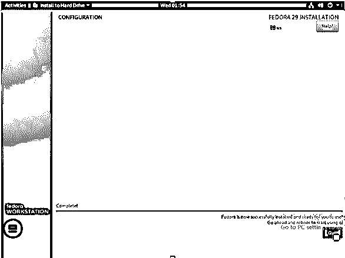

Fedora 安装完成后，点击退出。

Fedora 不提供自动重启提示。要完全安装 Fedora，需要手动重启。

当系统重新启动时，可以移除不再需要的 USB。

首次启动时会出现如下所示的欢迎屏幕:

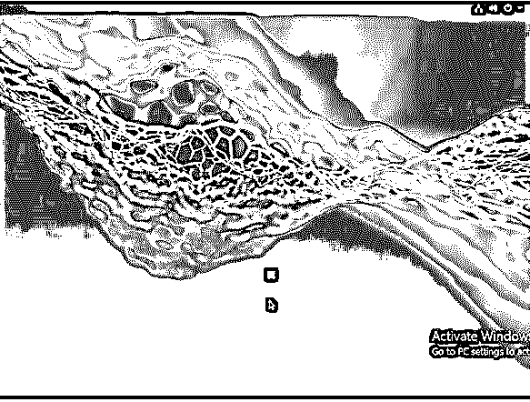

首先，我们登陆隐私页面。这里可以启用/禁用定位服务和自动问题报告**。**这些选项甚至可以在以后从系统设置中更改。单击“下一步”查看后续窗口及其提供的选项。

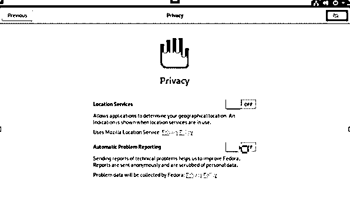

我们可以使用在线帐户页面连接谷歌，脸书，微软的其他帐户。

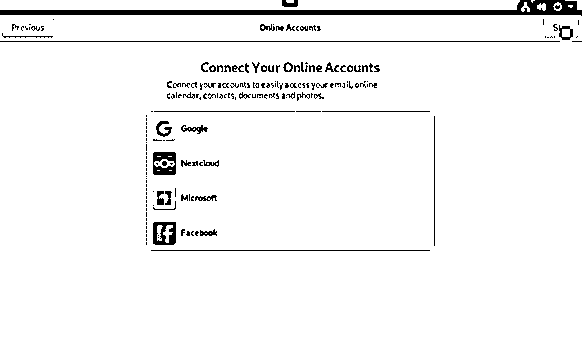

提供将用于个人文件夹的用户名，并且不能更改。也可以使用此窗口设置企业级登录。

为上一页提供的登录凭据设置密码。

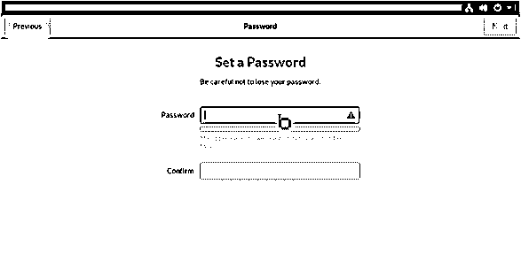

现在安装完成了，出现下面的确认窗口。

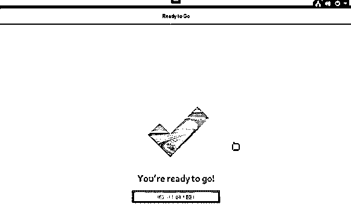

您可以利用“活动”选项来打开帮助窗口。提供了入门指南，也提供了 Gnome 帮助选项。提供了各种关于如何使用 Fedora 的教程。

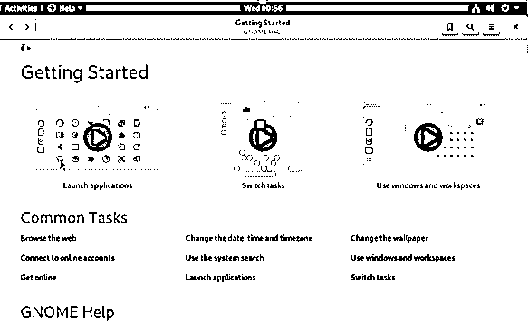

我们可以打开 Gnome 软件，找到可供下载的应用程序和更新。单击“Let's go shopping”选项，给一分钟时间进行刷新，以便我们可以检查即将发布的更新。“更新”选项卡打开，以检查是否有任何正在进行的旋转更新。更新也可以直接从终端窗口完成。

打开终端并键入。

`sudo yum update`

更新完成后，单击。是的，这需要手动重启才能完成该过程。除非是一次性安装，否则通过终端安装更新而不使用屏幕或终端等工具总是一个糟糕的主意。现在新鲜更新的 Fedora 29 上市了。

提供了实际的应用程序列表。Fedora 还支持我们启用第三方软件库。开放软件库，我们找到了谷歌 Chrome 库，这是 Fedora 的一个重大变化，它不支持专有应用程序。我们可以检查内核版本。这是最新的了。Firefox 和 Libre Office 默认可用。Fedora 的最新版本有一个非常基本的外观，Gnome 默认了 Adwaita 主题。默认情况下，它为 home 和 root 创建不同的分区。主分区与发行版是分开的，这是桌面发行版应该遵循的相当不错的默认设置。

### Fedora 的新功能

以下是 Fedora 的新功能:

*   **Fedora 模块性:**提供了一个新的选项，允许应用程序拥有不同版本的依赖关系，并同时使用它们。
*   **GNOME:** 在系统设置中可以找到霹雳装置的加入
*   **屏幕共享:**在最新版本中成为可能。
*   **内存效率:**在版本 29 中有所提高，提供了更快的系统启动和更好的整体用户体验。
*   **Power PC:** 此版本已停止支持。
*   Python，MySQL，Node 等各种包。JS 已经更新到较新的版本。

其他可用的默认应用程序有:

1.  Gnome 盒子已经安装好了，可以马上用来安装虚拟机。
2.  Cheese 用于支持网络摄像头。
3.  音乐收藏的节奏盒。

Ubuntu 主题可能会给用户带来更好的体验。这是因为 Fedora 使用了香草架构。在 Fedora 中，应该通过包安装程序来提高响应能力，

默认情况下，以开发人员为中心的发行版只提供有限的库。需要安装其他库。发行版和可用软件包的数量使 Ubuntu 成为更好的选择。

Linux 中的 Wayland 和 XORG 是显示服务器，它们构成了监视器中显示的组成部分。它们用于图形实例和远程终端之间的通信。Gnome 自带的 Wayland 会在癫痫发作时打嗝，导致只显示黑屏。这可以通过禁用 Wayland 来解决，这样 XORG 就可以接管并提供一个简单的显示问题解决方案。

### 推荐文章

这是一个安装 Fedora 的指南。这里我们已经讨论了 Fedora 的基本含义、特性和安装的不同步骤。您也可以阅读以下文章，了解更多信息——

1.  [安装卡珊德拉](https://www.educba.com/install-cassandra/)
2.  [CentOS vs Fedora](https://www.educba.com/centos-vs-fedora/)
3.  [Ubuntu vs Fedora](https://www.educba.com/ubuntu-vs-fedora/)
4.  [安装附件](https://www.educba.com/install-appium/)

