# 如何安装 FreeBSD？

> 原文：<https://www.educba.com/install-freebsd/>

## 如何安装 FreeBSD？

FreeBSD 就像一个基于 UNIX 的操作系统，可以安装在任何新的操作服务器、笔记本电脑、台式机和嵌入式系统上。它是一个自由的操作系统，是 BSD Unix 的直接后代。BSD 的第一个版本是在 1993 年发布的，现在它是广泛使用的顶级操作系统之一。它有一个许可的 BSD 许可证，可以在下进行许可。它与各种系统工具捆绑在一起，作为其基础系统。除此之外，它还提供了两种补充技术，可以用来安装任何第三方软件，例如 FreeBSD ports collection，用于从源代码安装，以及 packages，用于从预构建的二进制文件安装。上述任何一种方法都可以用于从网络或本地媒体安装软件。

### 运行 FreeBSD 的各种方法

有许多运行 FreeBSD 的方法，但主要取决于环境。这些方式是:

<small>网页开发、编程语言、软件测试&其他</small>

#### 1.虚拟机映像

通过使用虚拟机映像，可以在您选择的环境中完成下载和导入。它可以从 FreeBSD 下载页面下载。有全球支持的 Hyper-v、KVM、VMWare 和原始设备映像。这些是预配置的实例或已经创建的映像，而不是准备运行的安装映像，可以在这些映像上执行安装后任务。

#### 2.虚拟机映像

他们可以在微软 Azure Marketplace 或亚马逊 AWS marketplace，或 [GCP(谷歌云平台)](https://www.educba.com/what-is-google-cloud-platform/)运行他们的托管服务。

#### 3.SD 卡图像

这用于嵌入式系统，如 BeagleBone Black 或 Raspberry Pi，可以从 FreeBSD 页面下载。此处显示的文件必须是未压缩的，并作为原始映像显示在 SD 卡上，主板将从 sd 卡启动。

#### 4.安装图像

这些映像可用于在普通台式机、服务器系统或笔记本电脑设备的硬盘上安装 FreeBSD。一般来说，安装说明是为 AMD64 架构和 i386 架构编写的。

### 安装 FreeBSD 的步骤

让我们知道如何安装 FreeBSD 的步骤。

用于安装 FreeBSD 的测试机器是:

**1。主机名**:FreeBSD . local
T3】2。IP 地址:192 . 168 . 101 . 1/10
3。硬盘大小:30gb
T9】4。版本:10.2
T12】5。内存: 2GB

**第一步:**从 https://www.freebsd.org/where.html[下载 FreeBSD 的最新版本](https://www.freebsd.org/where/)。

*   **从一系列架构中选择:**

大多数 FreeBSD 用户将拥有适用于 i386、armv6 或 amd64 的架构硬件。今天，所有的现代计算机系统都使用 amd64，它应该被具有超过 3GB 空间的计算机使用。如果是较旧的计算机，即 32 位型号，请使用 i386。对于单板计算机和嵌入式设备，如 Beagle Bone black、Raspberry Pi、Zed 板或 panda 板，请使用 armv6 SD 卡映像，它支持 ARMv6 ARMv7 处理器。

*   **选择图像:**

此处的安装程序可以各种格式下载，包括 DVD (dvd1)、CD (disc1)和网络安装(仅引导)大小的 ISO 光盘映像，以及常规和迷你 USB 记忆棒映像。

*   **FREEBSD 部署:**

虽然它不收集部署统计数据，但适当的统计信息是必不可少的。考虑安装用于收集软件和硬件统计数据的 sysutils/bsdstats 包，从而帮助开发人员了解如何最好地集中精力。该网站显示收集的所有信息。

*   **发布:**

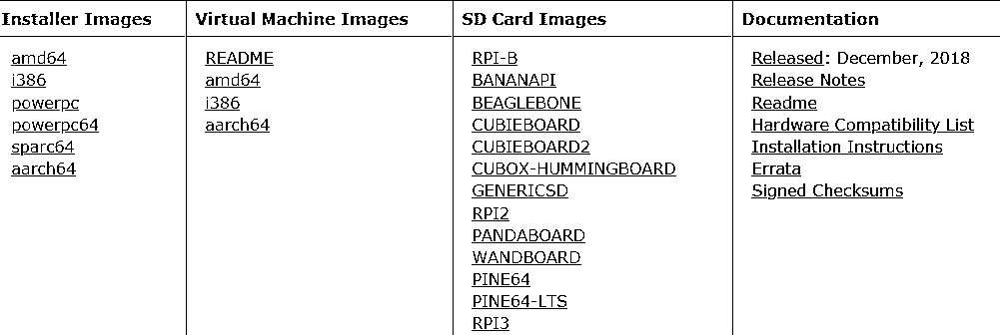

**第二步:**创建一个可启动的 USB 或 DVD，使用安装介质启动系统。

在下面的截图中，你可以看到 FreeBSD 安装菜单。按下数字 1，然后输入按钮将开始安装。

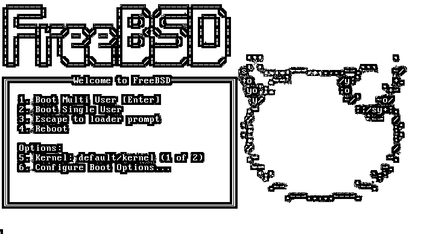

**步骤 4:** 启动完成后，我们将看到以下选项:

**1。**按回车键安装硬盘。
2**。**选择 shell 进入 CMD 模式。在 CMD 模式下，您可以在选择安装硬盘之前对其进行分区。
**3。**Live CD 选项允许您在实际安装之前试用 Live CD。

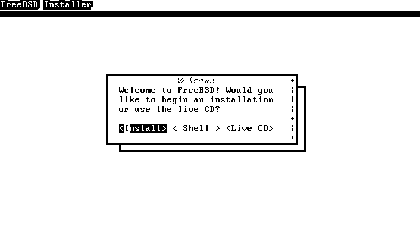

**4。**选择一个按键映射。

**5。**输入系统的主机名

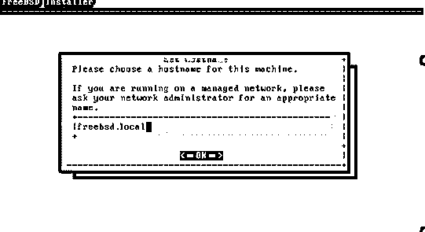

**6.** Select the system components to install

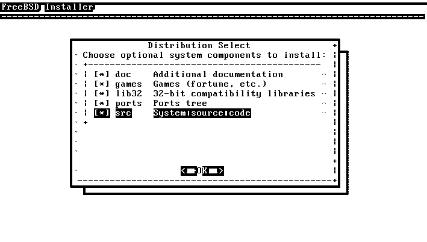

7 .**。**接下来，我们需要对我们的磁盘进行分区来安装 FreeBSD。

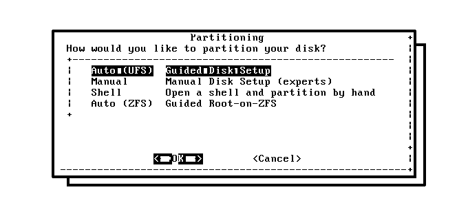

**8。**选择整个磁盘或分区

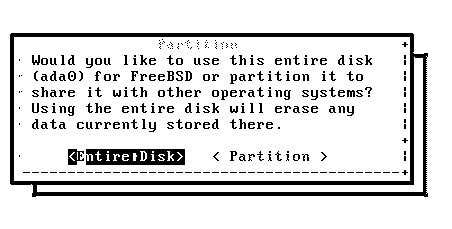

**9。**选择分区方案

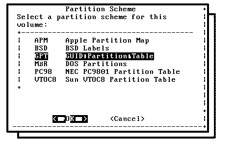

10。查看分区大小

**11。**单击 commit 确认分区设置。

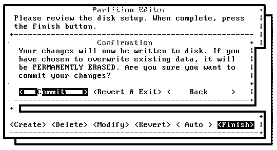

**12。**安装过程已经开始。

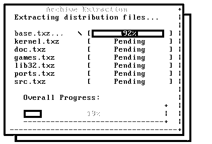

13。安装 FreeBSD 后，会要求您设置 root 用户密码。

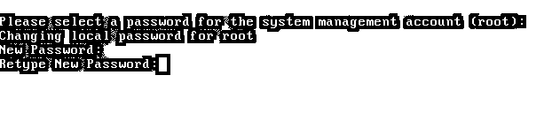

**14。**选择网络接口卡做网络配置设置。

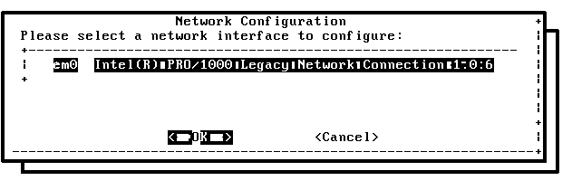

15。为 ipv4 接口选择是:

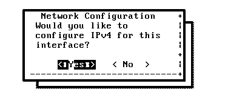

16。提供 IP 详情、网关、子网等。

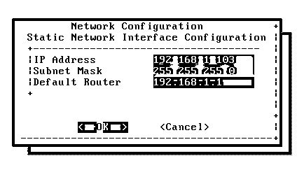

**17。**进入 DNS 服务器设置:

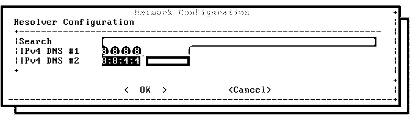

18。选择地区和国家

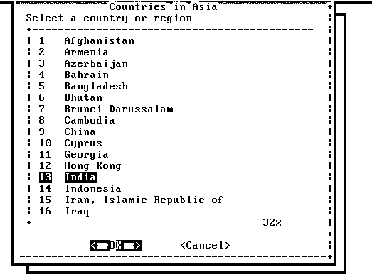

**19。**选择您希望在启动时启动的所有服务列表

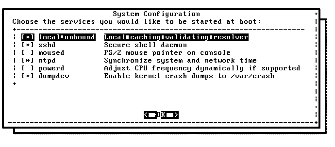

20。输入新创建用户的详细信息:

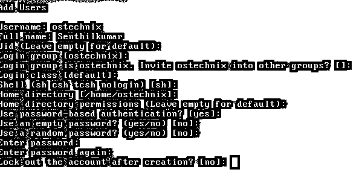

**21。**最后一个阶段包括从 FreeBSD 安装启动程序，并应用配置设置。

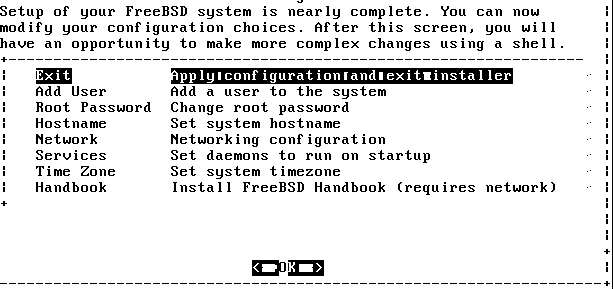

22 。很多祝贺；您已经成功安装了 FREEBSD。现在，在您开始之前，重新启动机器。在您真正选择关闭 FreeBSD 安装向导之前，安装程序将提示您进行最后的更改。如果您不想更改任何内容，只需单击“否”并继续执行这些步骤。

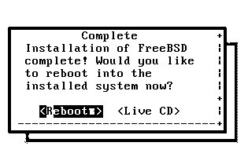

**23。**重启后，输入您在安装阶段设置的用户名字段和密码字段。一旦你通过了用户名和密码的验证，你就可以进入你自己的操作系统并享受工作的乐趣了。

### 结论

在本教程中，我们学习了 FreeBSD 的安装和兼容性以及其他与下载相关的功能。安装一开始可能看起来很繁琐，但是安装起来非常容易和方便，就像任何其他软件或操作系统一样。您只需要做出自己的首选项，安装程序会为您完成剩下的工作。

### 推荐文章

这是一个如何安装 FreeBSD 的指南。这里我们已经讨论了在我们的系统上安装 FreeBSD 的基本概念和步骤。您也可以阅读以下文章，了解更多信息——

1.  [安装 Splunk](https://www.educba.com/install-splunk/)
2.  [安装 Ruby](https://www.educba.com/install-ruby/)
3.  [安装 Tableau](https://www.educba.com/install-tableau/)
4.  [安装 Apache](https://www.educba.com/install-apache/)

