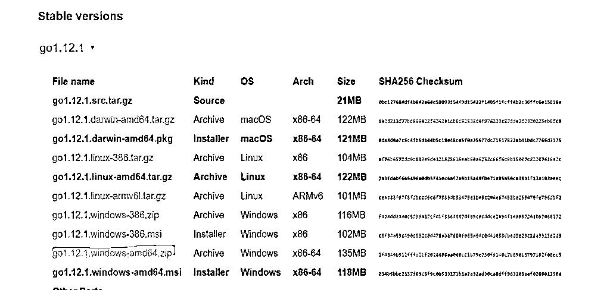
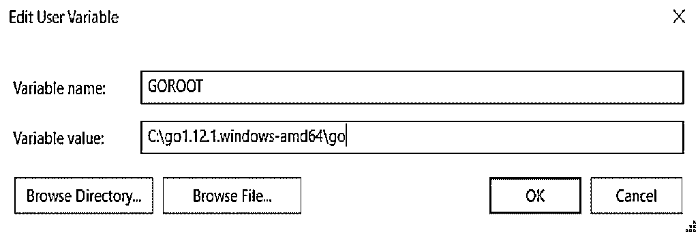
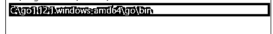
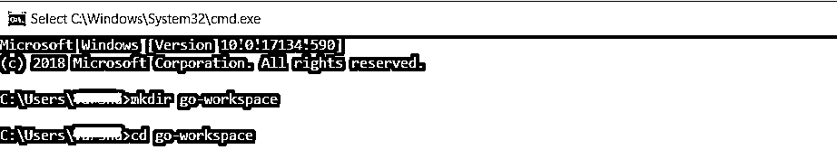
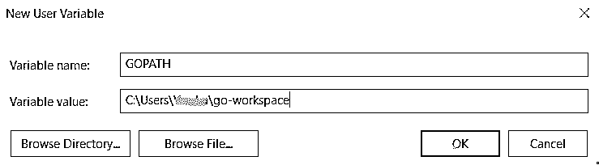
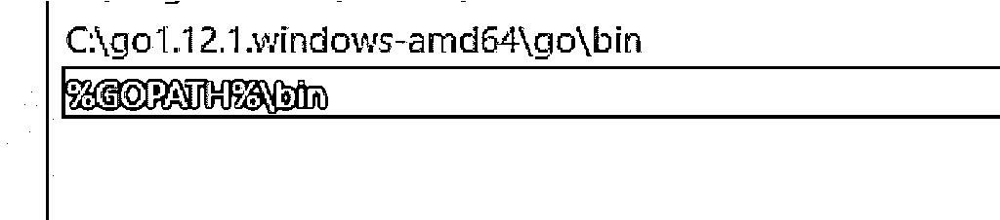
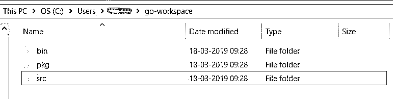
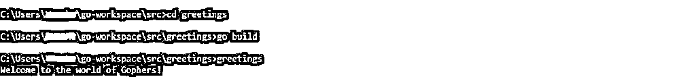

# 如何安装 Go？

> 原文：<https://www.educba.com/install-go/>

## 如何安装 Go？

以下文章提供了如何安装 Go？虽然编码很有趣，但对于我们许多人来说，从初始设置和开发环境开始可能看起来像火箭科学。但是不要慌；只是在完成之前看起来很难。

### 安装 Go 的步骤

我们编制了一套步骤来设置您的 Go 环境。

<small>网页开发、编程语言、软件测试&其他</small>

#### 步骤 1:为你的操作系统下载 Go 的二进制文件

*   我们从官方网站——https://go.dev/dl/.下载 Go 的二进制发行版开始
*   根据您使用的操作系统和处理器特性，下载最新版本的 Go 二进制版本。
*   为我的 64 位 windows 下载了下面存档的二进制文件。

*   您也可以从以下来源安装 Go——https://go.dev/doc/install/source.

#### 第二步:在你的系统上安装 Go

*   下载完成后，将存档文件夹解压缩到系统上的一个目录中。

**视窗:**

*   对于 Windows，安装 Go 的默认目录是 C:\ <go_package>。请记住打开一个新的终端，以便能够查看新的更改。</go_package>
*   接下来，设置两个环境变量。如果您在设置环境变量方面需要帮助，可以点击此链接

https://docs.microsoft.com/en-us/windows/desktop/procthread/environmentvariables

**GOROOT 变量:**

*   这有助于定位 GO 的安装位置。

**路径变量:**

*   将下面的值添加到您的 Path 变量中，该变量应该与您的%GOROOT%\bin 相同。

**Linux 还是 Mac:**

*   Ubuntu 或 Linux 和 Mac 用户的默认安装目录是/usr/local/go。因此，GOROOT 环境变量应该设置为/usr/local/go/bin。
*   在 Ubuntu 中，如果你希望你的目录是一个不同的而不是默认的目录，你可以编辑你的~。/bash_profile。在 bash_profile 文件中添加以下条目:export GOROOT = /usr/local/ <newpath>。您可以使用“go 版本”来检查您的 go 安装。</newpath>

#### 步骤 3:创建 Go 工作区

运行命令:` go env`。您会看到您的 GOPATH 是空白的。那么 GOPATH 是什么呢？在此之前，我们先了解一下什么是 Go 工作区。

*   Go 程序员使用 Go 工作区来组织 Go 项目。工作区遵循一个类似目录的结构，Go 在其中查找源代码、构建文件并解析包依赖关系。

**视窗:**

*   当 Go 遇到一个 import 语句时，它首先尝试在 GOROOT/src 中查找这个包。如果在这里没有找到，它将在 GOPATH/src 中查找相同的内容。

*   让我们现在设置我们的 GOPATH。首先，创建一个表示您的 Go 工作区的目录。工作区通常创建在 C:\ Users \ % Username % \ goworkspace。

*   现在，在您的环境变量中创建 GOPATH 变量，和我们之前做的一样。添加工作空间的路径作为值。

*   将工作区的 bin 路径添加到 path 变量中。

**Linux 和 Mac OS**

*   对于 Linux 和 Mac 系统，我们需要遵循以下步骤。首先，打开一个终端。接下来，编辑你的~。/bash_profile 文件。请记住，您可能需要在 Ubuntu 系统中添加 sudo 关键字来授予管理员权限。

打开文件后，在文件中添加以下变量:

*   首先，设置 GOPATH 环境变量，指向您的 Go 工作区:export GOPATH = $HOME/go。
*   接下来，我们需要在~中设置我们的 GOPATH/bin 变量。/bash_profile。这个变量有助于运行编译好的 Go 程序:export PATH = $PATH:$GOPATH/bin。

#### 步骤 4:创建 Go 项目所需的文件夹结构

*   我们的下一步是测试我们是否已经完美地设置了我们的 Go 编译器和变量。我们将使用 Go 工具来管理我们的源代码和构建我们的 Go 项目。你可以从这里——https://golang.org/cmd/go/.了解更多关于 Go 工具的信息
*   Go 工具要求您以特定的结构组织源代码。
*   让我们现在创建这个结构。导航到您的 go 工作区。创建三个文件夹，分别命名为 bin、pkg 和 src。
*   src 包包含了所有的源代码和包。pkg 文件夹只是源代码的打包版本，扩展名为. a。bin 文件夹是所有可执行命令所在的位置。

#### 步骤 5:执行您的第一个 Go 程序并测试您的安装

*   现在是时候写我们的第一个围棋程序了。
*   在我们刚刚在 Go 项目工作区中创建的 src 文件夹中创建一个新目录，并将其命名为 greetings。
*   接下来，在 greetings 目录中创建一个文件 greeting.go。
*   使用任何您喜欢的编辑器，如 Sublime Text 或 Atom，在 greetings.go 文件中键入以下代码。你可以从这里——https://www.sublimetext.com/3.下载 Sublime

**代码:**

`package main
import "fmt"
func main() {
fmt.Printf("Welcome to the world of Gophers!")
}`

*   现在，我们需要构建我们的 Go 项目。我们使用“go build”命令来帮助我们。
*   在 greetings 目录下打开命令提示符，并运行 go build 命令。这个命令将为您构建一个名为 greetings.exe 的可执行文件。你可以在你的问候文件夹中看到这个。
*   我们现在只需要执行这个可执行文件。我们通过在命令提示符下键入可执行文件的名称来实现这一点。
*   您应该看到消息“欢迎来到地鼠的世界！”在你屏幕上。如果您看到它，这意味着您的安装工作正常！很简单，不是吗？

### 卸载 Go

*   如果您的系统上已经安装了一个版本的 Go，在安装新版本之前卸载它是很重要的。
*   我们可以通过从您的系统中删除 Go 目录来做到这一点。就像我们已经说过的，所以你安装 Go 的默认目录是 C:\ <go_version>for windows。对于 Linux 和 Mac 系统，您需要删除/user/local/go 目录来实现这一点。</go_version>
*   不要忘记删除在 PATH 环境变量中设置的 Go 的 bin 目录。

对于 Windows，您可以检查–https://docs.microsoft.com/en- us/Windows/desktop/proc thread/environment-variables。对于 Linux 用户，应该编辑$HOME/。配置文件或/etc/profile。同样，对于 MacOs 用户来说，应该删除/etc/paths.d/go 文件。

干得好，伙计们！我们已经准备好了我们的 Go 环境。那么，下一步是什么？你可以通过 https://tour.golang 进行更多的 Go 实验。你可以使用任何你选择的编辑器来输入 Go 代码。

如果你有任何进一步的疑问，你可以查看任何一个围棋论坛，比如 https://forum.golangbridge.org。

### 推荐文章

这是如何安装 Go 的指南？这里我们已经讨论了基本概念，安装 Go 的步骤，并解释了卸载 Go。您也可以阅读以下文章，了解更多信息——

1.  [安装角度](https://www.educba.com/installing-angular/)
2.  [安装引导程序](https://www.educba.com/install-bootstrap/)
3.  [安装 phpMyAdmin](https://www.educba.com/install-phpmyadmin/)
4.  [安装 NumPy](https://www.educba.com/install-numpy/)

