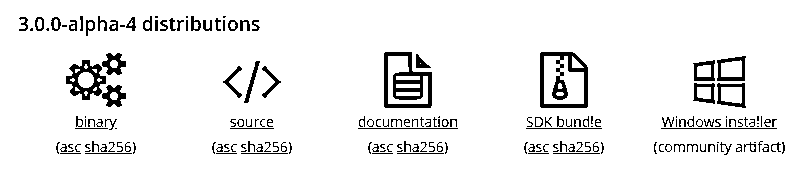
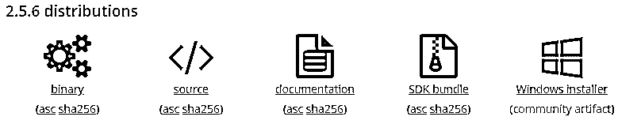
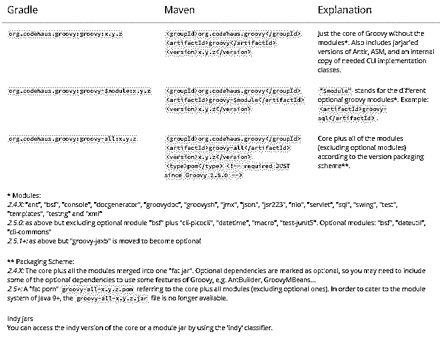
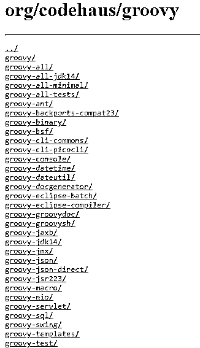
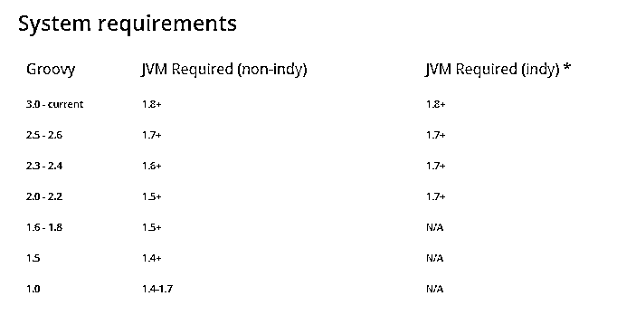
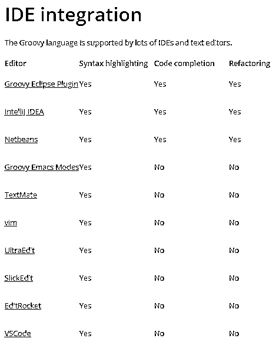
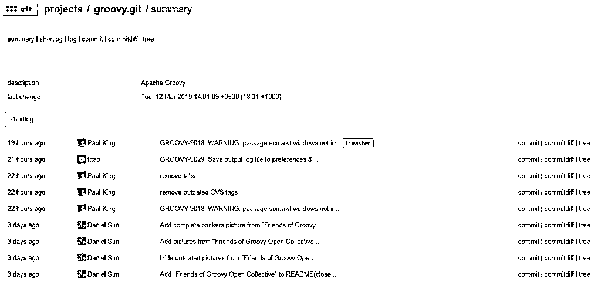
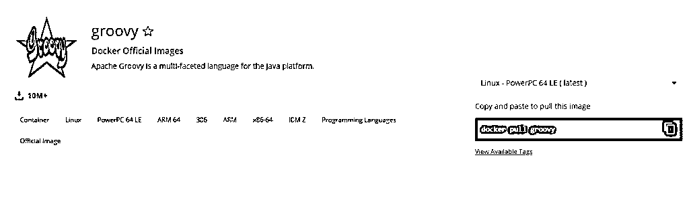
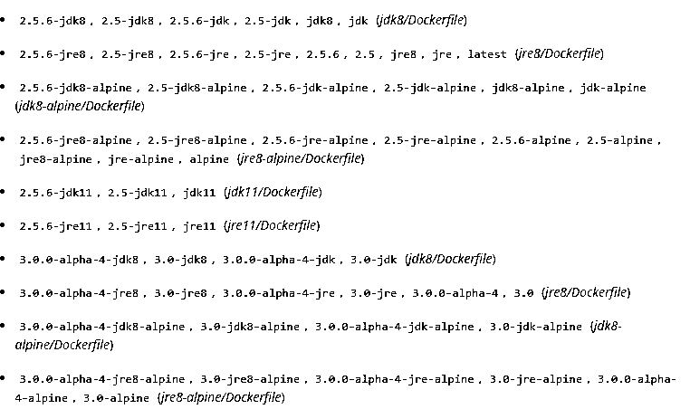

# 如何安装 Groovy？

> 原文：<https://www.educba.com/install-groovy/>

## 如何安装 Groovy？

Apache Groovy 是一种面向对象的语言，具有 Java 平台和语法兼容性。它是一种静态和动态形式的语言，具有与 Ruby、Python、Smalltalk 和 Perl 非常相似的特性。其主要特点在于，它既可以用作脚本语言，也可以用作 Java 平台的编程语言。像 Java 一样，它也被编译成 JVM 字节码，可以在许多其他基于 Java 的库之间互操作。它还利用了花括号这种语法结构，类似于 Java。附加特性包括多行字符串、闭包和嵌入在字符串中的表达式。

groovy 语言提供了对许多标记语言的内置支持，如 [HTML 和 XML](https://www.educba.com/html-vs-xml/) ，这是使用 DOM(文档对象模型)语法完成的。与 Java 编程语言不同，如果基于 Groovy 的源代码文件包含类定义之外的代码段，那么它可以作为未编译的脚本来执行。因此，可以说 Groovy 脚本在实际执行之前是可以被充分编译、解析和生成的。下面是一些关于下载和安装 Groovy 的步骤。

<small>网页开发、编程语言、软件测试&其他</small>

有几种不同的方法可以下载这种语言:

**下载二进制或源代码分发包:**分发包是构建或使用 Groovy 语言所需的源文件或类文件的包或包。所有 Apache 项目都提供了源代码 zip，这有助于从头开始创建软件。事实上，源代码 zip 可以作为每一个可能版本的权威工件。除此之外，还提供了二进制、SDK 和可下载的文档。与此相关的有多个版本。
Groovy edge 3.0 版本是其中最新的一个。

Another latest stable version is the 2.6 version.

**

I**

Groovy 以前还有许多其他的稳定版本。这些版本不提供任何担保。

### 安装 Groovy 的步骤

描述 Groovy 二进制发行版安装的一些说明:

**步骤 1:** 第一步是下载二进制发行集，并将其解压缩到本地文件系统上的另一个文件中。

**第 2 步:**下一步是将 GROOVY_HOME 环境变量设置到解压缩的发行目录中。

**第三步:**在 Windows 的环境变量部分，将 GROOVY_HOME/bin 添加到你的路径位置。

**步骤 4:** 确保您没有错过设置 JAVA_HOME 环境变量，该变量指向您的 JAVA 开发工具包。一般来说，在 OS X 上，这是/Library/Home/Java，在其他基于 [Unix](https://www.educba.com/career-in-unix/) 的操作系统上，这是/usr/java。如果您之前已经安装了诸如 Maven 或 Ant 之类的构建工具，这意味着您必须已经设置了这个 PATH 变量。

**第五步:**一旦确定正确安装了 Groovy。您可以通过编写以下命令来检查它:

这个命令会给你一个交互式的 groovy shell 库，让你通过编写 **groovy AnyScript** 来键入和执行你自己的 groovy 命令

### 安装 Groovy 的命令

利用操作系统的包管理器或包:上面解释的方法是安装 Groovy 的一种便捷方式。如果您不想相信 GUI，想要一种更简单的方法，可以考虑使用 CLI 和这些命令。

*   SDKMAN: 它是一个工具，用于管理几乎每个基于 Unix 的系统上的多个 SDK 的并行版本。

**

** 

*   这是一个为 macOS 设计的软件包管理器。

**

** 

*   **MacPorts:** 这是另一个系统，用来管理 macOS 上的工具。

**

** 

*   Scoop: 这是一个基于命令行的安装程序，适用于 Windows，是 HomeBrew 的灵感来源。

*   **Chocolatey:** 用于提供 Windows 上的托管软件。

对于 Linux 用户来说，通过使用首选的操作系统语言及其系统包管理器，Groovy 也是可用的。比如 dpkg，apt，Pacman 等。

### 时髦的罐子

适当的 Groovy jar 也可以从构建工具中获得:为了将 Groovy 作为依赖项添加到您的项目中，请考虑参考项目构建文件描述符的 Groovy jars 部分:

Groovy 发布的 jar 是 Maven Central 或 JCenter 的一部分。

### IDE 安装 Groovy 的插件

您可以为您的 IDE 选择最新的插件，并按照相应的说明安装 Groovy。

**

** 

与之相关的最新代码可以在 GIT 资源库或 GITHub 镜像上找到。

**

** 

### 用于 Groovy 安装的 Docker Hub

Groovy 安装也作为 Docker 的一部分提供。所以您也可以利用 Docker Hub 进行 Groovy 安装。
使用的命令将是 **docker pull groovy。**

**

** 

有几个受支持的标签和其他与 docket 文件相关的链接。

**

** 

**启动 Groovysh:**docker run-it–RM groovy。

**如何运行一个 Groovy 脚本:**docker run–RM-v " $ PWD ":/home/hardik/Groovy/scripts-w/home/hardik/Groovy/scripts Groovy Groovy<script><script-args>

**重用 grapes 缓存:**本地 grapes 缓存可以在容器内部和容器之间重用，只需创建一个卷并挂载到/home/hardik/groovy/中。美味的/葡萄。

docker 卷创建-命名 grapes-cache

docker run–RM-it-v grapes-cache:/home/hardik/groovy/。太棒了/葡萄太棒了

**图像变体:**groovy 图像在许多情况下都会派上用场，特别是为它们的用例设计的。

**groovy : < version > :** 当你不确定是否真的需要或者想使用它的时候，它就是事实上的图像。它可以用作一次性容器。

### 结论

Groovy 不仅仅是一种[面向对象的编程语言](https://www.educba.com/object-oriented-programming-in-java/)；它也是一种函数式编程语言，因为它提供了诸如闭包、JSON 和 XML 处理、curry、字符串插值、抽象语法树转换、采用、特征、IDE 支持等特性。本质上，如果您的业务需要，您可以使用这种语言。在这篇文章中，我们已经非常详细地向你解释了 Groovy 的基本特性、用法、下载以及如何安装 Groovy 供你使用。

### 推荐文章

这是如何安装 Groovy 的指南。在这里，我们已经讨论了在系统上以简单易行的方式安装 Groovy 的不同方法。您也可以阅读以下文章，了解更多信息——

1.  [安装打字稿](https://www.educba.com/install-typescript/)
2.  [安装 Ubuntu 服务器](https://www.educba.com/install-ubuntu-server/)
3.  [安装詹金斯](https://www.educba.com/install-jenkins/)
4.  [安装 Django](https://www.educba.com/install-django/)

