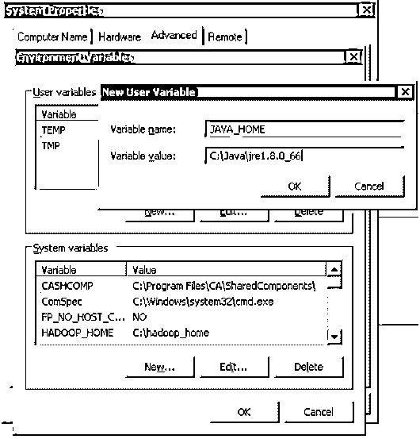
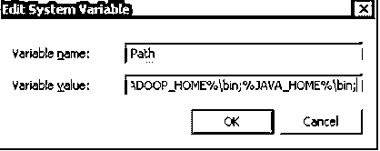
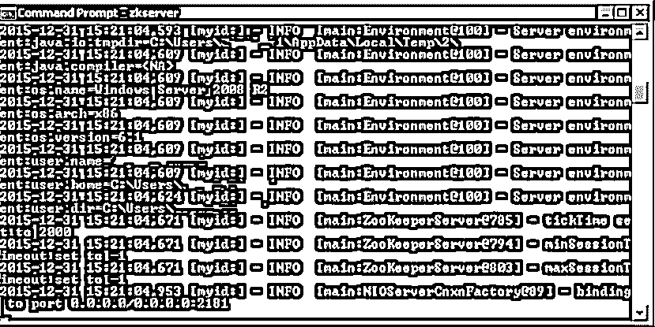
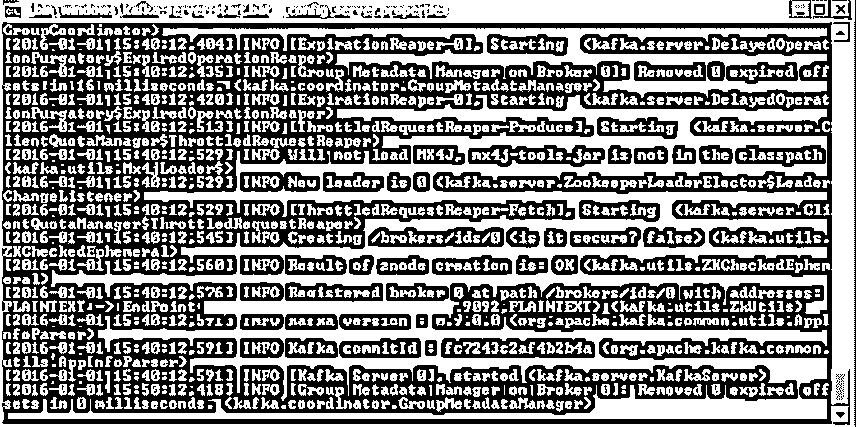

# 如何安装卡夫卡？

> 原文：<https://www.educba.com/install-kafka/>

## 如何安装卡夫卡？

Kafka 是一个分布式流媒体平台。它有助于发布和订阅记录流。Kafka 通常用于构建实时流数据管道，在不同的系统和应用程序之间可靠地获取数据。它还可以帮助构建实时流应用程序，帮助转换或更改数据流。 [Kafka 能够存储](https://www.educba.com/what-is-kafka/)不同类别的记录流，称为主题。每个记录由一个键、一个值和一个时间戳组成。它有四个主要组件，如生产者 API、消费者 API、流 API 和连接器 API。它使用了 [TCP 协议](https://www.educba.com/what-is-tcp-protocol/)，这是客户端和高性能服务器之间的良好通信。为了安装 Kafka，可以遵循以下步骤。

### 在 Windows 操作系统上安装 Kafka

要在 Windows 上安装 Kafka，请遵循以下步骤:

<small>Hadoop、数据科学、统计学&其他</small>

**第一步:**从以下链接下载 Zookeeper:[HTTP://Zookeeper . Apache . org/releases . html](https://zookeeper.apache.org/releases.html)

一旦完成，请点击链接下载卡夫卡:[https://kafka.apache.org/downloads.html](https://kafka.apache.org/downloads.html)。

另外，根据您的操作系统和 CPU 架构，从下面的链接下载 JRE:[https://www.oracle.com/java/technologies/downloads/#java8](https://www.oracle.com/java/technologies/downloads/#java8)。

**第二步:** JDK 设置

启动 JRE 安装，然后单击“更改目标文件夹”复选框。现在，点击安装。

完成后，将目录更改为文件夹名称中没有空格的任何路径。

**步骤 3:** 完成后，从控制面板- >系统- >高级系统设置- >环境变量中打开环境变量。

**步骤 4:** 在用户变量选项卡中点击新用户变量，然后在变量名中键入 JAVA_HOME。在变量值部分输入您的 JRE 路径。

应该如下所示:

**第五步:**现在点击，OK。

**步骤 6:** 在打开的“环境变量”对话框的“系统变量”部分搜索路径变量。

**第七步:**编辑路径和类型”；%JAVA_HOME%\bin "的文本已经写在那里了，就像下图一样:

**步骤 8:** 要检查 Java 是否安装正确，请进入命令提示符并键入‘Java–version’。安装的 Java 版本将显示在屏幕上。

如果你在命令提示符上看到了上面的细节，那么从 Java 方面来说你是好的。

一旦 Java 安装完毕，你就可以开始安装 Zookeeper 了。

#### 安装 Zookeeper:

按照以下步骤在您的系统上安装 Zookeeper:

*   打开 Zookeeper 配置目录所在的目录。可以是 C:\zookeeper-3.4.7\conf。
*   现在将文件“zoo_sample.cfg”重命名为“cfg”
*   在记事本中打开这个重命名的文件。
*   查找并编辑以下内容:dataDir =/tmp/zookeeper to \ zookeeper-3 . 4 . 7 \ data。
*   就像我们给 Java 加了一个环境变量一样，给 Zookeeper 加一个环境变量。
*   将系统变量 path 设置为:dataDir =/tmp/zookeeper to:\ zookeeper-3 . 4 . 7 \ data
*   编辑名为“Path”的系统变量并添加；% ZOOKEEPER _ HOME % \ bin
*   Zookeeper 的默认端口是 2181，可以转到 zoo.cfg 文件将其更改为任何其他端口。
*   运行 Zookeeper，打开一个新的 cmd 并输入' zkserver '。您将看到以下详细信息。

一旦你看到这个屏幕，你应该确定 Zookeeper 已经安装成功。

#### 建立卡夫卡:

一旦 Java 和 Zookeeper 在你的系统上运行，你就可以开始安装 Kafka 了。

*   转到 Kafka 配置目录。
*   编辑文件“server.properties”。
*   完成后，您可以找到并编辑您看到的行:dirs=/tmp/Kafka-logs 到" log . dir = C:\ Kafka _ 2.11-0 . 9 . 0 . 0 \ Kafka-logs
*   如果您的 Zookeeper 在其他机器上运行，那么您可以将这个路径“zookeeper.connect:2181”更改为一个定制的 IP 和端口 id。
*   Kafka 的默认端口是 9092，要连接到 Zookeeper，它是 2181。

#### 运行 Kafka 服务器:

一旦初始设置完成，您就可以轻松运行 Kafka 服务器了。

在运行 Kafka 服务器之前，必须确保 Zookeeper 实例已经启动并正在运行。

1.转到 Kafka 安装目录:C:/kafka_2.11-0.9.0.0

2.打开命令提示符，并按下 Shift+右键，并选择'在这里打开命令窗口'选项。

3.现在打字。\ bin \ windows \ Kafka-server-start . bat。\config\server.properties 并按 Enter 键。

一旦你运行这个，一切正常，那么你的屏幕应该如下所示:

4.现在，您的 Kafka 服务器已经启动并运行。您可以创建自己的主题来存储不同的消息。一旦完成，您就可以生成和使用 Java 或 Scala 代码数据，或者直接从命令提示符下运行。

### 在 Linux 上安装 Kafka

按照以下步骤在 Linux 上安装 Kafka:

**第一步:**下载并解压 Kafka 二进制文件，存放在目录中。

**第二步:**使用 tar 命令提取您下载的[文件。](https://www.educba.com/tar-command-in-linux/)

**步骤 3:** 要配置 Kafka，请转到 server.properties，使用 nano 命令打开该文件，并在文件底部添加以下内容。

**代码:**

`nano ~/Kafka/config/server.properties`

`delete.topic.enable = true`

**步骤 4:** 一旦完成，用户将必须为 Kafka 服务创建系统单元文件。这有助于执行常见的服务操作，如启动、停止和持续重启 Kafka [和其他 Linux](https://www.educba.com/install-linux/) 服务。Zookeeper 是 Kafka 用来管理其集群和配置的服务。

**步骤 5:** 为 Zookeeper 创建一个单元文件如下:

**代码:**

`sudo nano /etc/systemd/system/zookeeper.service`

**第六步。一旦创建了这个 zookeeper 文件，将下面的内容粘贴到其中:**

**代码:**

`[Unit] Requires=network.target remote-fs.target
After=network.target remotefs.target
[Service] Type=simple
User=kafka
ExecStart=/home/kafka/kafka/bin/zookeeper-server-start.sh /home/kafka/kafka/config/zookeeper.properties
ExecStop=/home/kafka/kafka/bin/zookeeper-server-stop.sh
Restart=on-abnormal
[Install] WantedBy=multi-user.target`

这里的[Unit]部分指定 Zookeeper 需要在启动之前准备好网络和文件系统。

[Service]部分让系统知道 zookeeper-server-start.sh 和 zookeeper-server-stop.sh 文件用于启动和停止服务。

**第七步。**现在用户应该为 Kafka 创建一个系统文件，如下所示:

**代码:**

`sudo nano /etc/system/system/Kafka.service`

**第八步。**在此文件中，粘贴以下内容:

**代码:**

`[Unit] Requires=zookeeper.service
After=zookeeper.service
[Service] Type=simple
User=kafka
ExecStart=/bin/sh -c '/home/kafka/kafka/bin/kafka-server-start.sh
/home/kafka/kafka/config/server.properties >
/home/kafka/kafka/kafka.log 2>&1'
ExecStop=/home/kafka/kafka/bin/kafka-server-stop.shRestart=on-abnormal
[Install] WantedBy=multi-user.target`

这里的[Unit]指定了单元文件依赖于 zookeeper.service。这确保了 zookeeper 在 Kafka 启动之前启动。

**步骤 9:** 您现在需要启用 Kafka 并重启服务器。运行:sudo systemctl 启用 Kafka。

**第十步:**测试安装。

您可以通过创建一个主题并将其发布给消费者来测试您的 Kafka 安装。

**创建主题的方式:**~/Kafka/bin/Kafka-topics . sh–Create–zookeeper localhost:2181–replication-factor 1–partitions 1–topic tutorial topic。

贴这个；用户可以创建生产者和消费者，然后发布特定主题的任何数据。

### 推荐文章

这是安装卡夫卡的指南。这里我们讨论了在 Windows 和 Linux 上安装 Kafka 的不同步骤。您也可以阅读以下文章，了解更多信息——

1.  [安装 Java 8 的步骤](https://www.educba.com/install-java-8/)
2.  [如何安装 C 语言](https://www.educba.com/install-c/)
3.  【Ruby 安装指南
4.  [卡夫卡的应用](https://www.educba.com/kafka-applications/)

