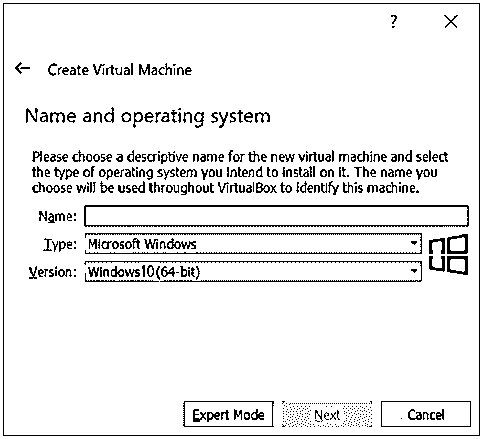
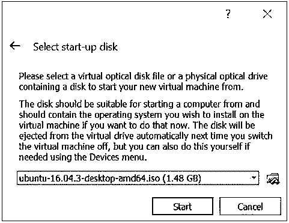
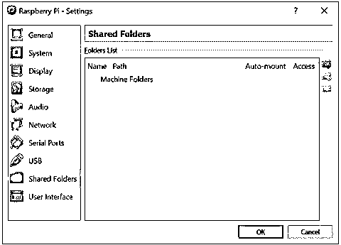
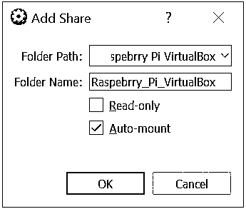

# 如何安装树莓派

> 原文：<https://www.educba.com/how-to-install-raspberry-pi/>

## 安装 Raspberry Pi 简介

以下文章概述了如何安装 Raspberry Pi。Raspberry Pi 是一款小型电脑，可以使用标准键盘或鼠标轻松插入电脑显示器和电视。它完成用户期望计算设备完成的每一项任务。除此之外，它还有巨大的能力。

*   它可以和外界互动。
*   支持物联网的设备。
*   增强设备，如照相机、探测器和仪器。

### 关于树莓派的快速知识

既然我们已经明白了[树莓 Pi 是一台拥有无数可能性的小型电脑](https://www.educba.com/what-is-raspberry-pi/)，那我们就来看看与之相关的一些事实。首先，微处理器对任何计算设备都至关重要，所以让我们从这些开始。自 70 年代初问世以来，微处理器已经取得了长足的进步。RAM 统计数据与树莓 Pi 的比较。

<small>网页开发、编程语言、软件测试&其他</small>

*   apple II–4kb 内存
*   ZX 频谱–16 至 48 kb 内存
*   ATARI 800 XL–64kb 内存
*   树莓 Pi–256 MB 内存

**组件**

*   ARM/CPU
*   GPIO
*   中非共和国
*   音频输出
*   发光二极管的
*   通用串行总线
*   高清晰度多媒体接口
*   力量
*   SD Cardslot
*   以太网

在这篇如何安装 raspberry pi 的文章中，我们将讨论安装 Raspberry Pi 时遇到的问题。这个博客将展示如何使用电脑和运行你的树莓派。

**Note: **The simplest way to get Raspberry Pi running is to install the OS, but there is a problem in doing that as it requires having a dedicated computer to it, or at least the user has to do the hard drive partition. An effective approach is to run your Raspberry Pi on a Virtual Machine – and this is what we are going to cover in this article.

### 安装树莓 Pi 的步骤

下面给出了安装 Raspberry Pi 所需的步骤:

#### 第一步:

下载安装树莓派的虚拟盒子。

首先，了解什么是虚拟机器，虚拟机器(VB 的首字母缩写)是能够在其中运行多种操作系统类型的软件。这是我们给读者最好、最有效的定义。

它能够运行如下操作系统:

*   基于 Linux 操作系统
*   基于 Windows 的操作系统
*   基于 Solaris 的操作系统
*   基于 IDM 的操作系统

用户可以通过将操作系统虚拟引导至虚拟磁盘来实现这一点。因此，我们必须下载一个 Oracle 虚拟机虚拟机箱。这是一款面向企业和家庭的强大 x86 和 AMD64/Intel64 虚拟化产品。

总之，你需要根据你的操作系统选择正确的版本。有两个版本可供选择——windows 和 macOS。一旦你下载了可执行文件，继续安装虚拟盒子。这一点我们已经提供了相关的屏幕和指导，有助于完全新手用户。

#### 第二步:

下载 Debian 的树莓 Pi 桌面。

用户必须从 raspberry pi foundation 站点下载 Raspberry Pi 桌面映像文件才能安装。他们负责创建一个现场光盘，运行，甚至安装过程成功在您的电脑上。

#### 第三步:

启动虚拟机器并建立新的虚拟机。

既然我们已经下载了 VB 和 Raspberry Pi desktop，现在我们可以启动 VB 并在其中创建一个新的虚拟机。如果您单击“new”按钮，您将看到一个屏幕，就像我们演示的那样。

用户必须在“名称”字段中提供不同的名称，然后从下拉菜单中选择带有版本详细信息(如 32 位或 64 位)的操作系统类型(我们选择了 Windows)。然后，单击下一步。

在下一个屏幕中，用户必须根据他们正在使用的 Raspberry Pi 版本(Pi 2 或 Pi 3 或任何其他型号)选择内存大小。

现在向新虚拟机添加一个硬盘；点击创建按钮。此后，在后续屏幕上再次单击下一步。最后，用户可以选择硬盘的大小。一般来说，8GB 是用户推荐的。如果准备好了，请单击创建。

在这之后，我们就有了虚拟机的设置。

#### 第四步:

在你的桌面上安装树莓派。

单击“开始”开始安装过程。

以下屏幕显示相关信息:

用户必须浏览到保存树莓文件的图像文件的相应文件夹。您必须选择文件并单击“开始”这样，用户将会看到标题为“Windows installer 启动菜单”的菜单。

选择您的首选项并安装。在下一个屏幕上，按 enter 键选择您喜欢的键盘布局。如果您已经完成了磁盘分区，请将更改写入磁盘。

这样，安装向导将提示用户:“将 GRYB 引导加载程序安装到主引导记录吗？您必须选择“是”并选择/dev/sda。

安装向导安装完成后，您将在屏幕上看到以下详细信息:

#### 第五步:

让你的虚拟机具有交互性。

如果您已经完成了这一步，您会注意到虚拟机将运行 raspberry pi desktop fine。有一种设置称为虚拟机来宾添加；这一新增功能使用户可以更容易地根据我们的需要调整屏幕，在我们的 PC 和我们想要使用的虚拟机之间共享文件。

在你做一件事之前，用这些小命令行快速检查你的系统更新:

这样，您就可以准备好进行来宾添加设置了。

#### 第六步:

共享文件夹设置。

要设置共享文件夹，右键单击您的虚拟机名称和设置，或者您甚至可以使用快捷方式(Ctrl+S)。这样，选择“共享文件夹”

这些步骤类似于在系统中安装软件。该设置将指导用户下一步该做什么。

此后，用户必须再次启动虚拟机，并启动文件管理器。这些详细信息将反映在共享驱动器位置中。这样，您就可以在 PC 或笔记本电脑上的虚拟机上运行 Raspberry Pi。

### 推荐文章

这是一个如何安装树莓派的指南。这里我们已经讨论了安装 Raspberry Pi 的指令、组件和步骤。您也可以阅读以下文章，了解更多信息——

1.  [安装 MongoDB](https://www.educba.com/install-mongodb/)
2.  [安装 Github](https://www.educba.com/install-github/)
3.  [安装 Linux](https://www.educba.com/install-linux/)
4.  [安装 WordPress](https://www.educba.com/install-wordpress/)

