# 如何安装 WiX

> 原文：<https://www.educba.com/install-wix/>

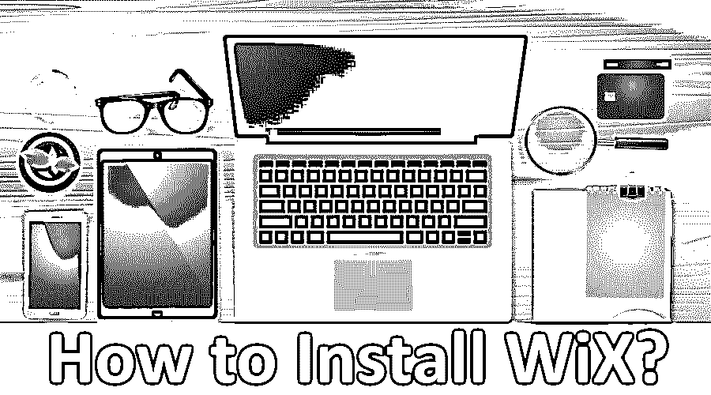

## 如何在 Windows 上安装 WiX

[WIX](https://www.educba.com/what-is-wix/) 代表 windows installer XML 是一个工具集，支持从 XML 文件中的源代码构建 windows 安装包。WIX 还支持命令行，因此开发人员可以将命令行集成到为 Windows 环境构建 MSI 和 MSM 包的构建过程中。有了 WiX 中可用的 bootstrapper，我们可以创建一个安装构建，它将安装一些先决条件，如. NET framework 和运行时需要的其他相关软件。WiX 软件开发工具包包括托管和本机库，允许开发人员编写将与 Windows installer 一起工作的代码和应用程序。

### 在 Windows 上安装 WiX 的步骤

让我们讨论安装 WiX 所需的步骤。

<small>网页开发、编程语言、软件测试&其他</small>

**第一步:**要在 windows 上下载安装 WiX，进入 WiX 官方网站如下【https://wixtoolset.org/releases T2】选择推荐的 build 号，这里我们选择了 V3.11.1，点击下载按钮。

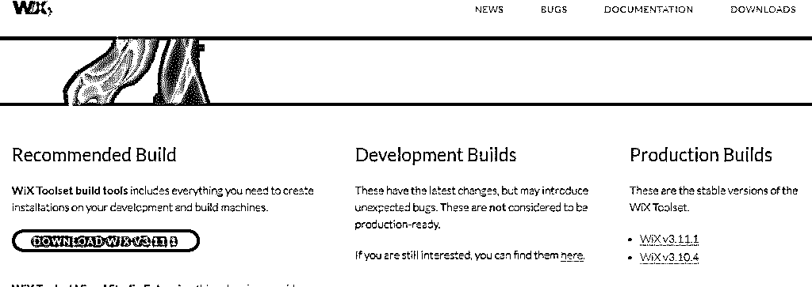

**步骤 2:** 您将被重定向到版本控制系统 GIT 中的源代码，我们需要选择合适的。exe 文件，然后单击下载。在这里，我们选择了 wix311.exe，点击它，然后它将被下载。

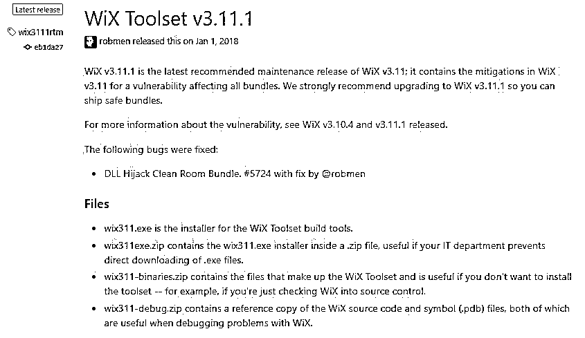

**第三步:**下载完成后，点击下载的文件/运行。exe 文件，我们得到一个错误说。需要首先安装. NET Framework 3.5.1，如下所示:

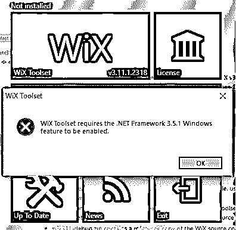

步骤 4: 现在，我们将安装。NET framework for Windows，这样我们就可以进一步安装 WiX 和 type。NET framework 3.1.5 for windows，然后点击下面的第一个链接

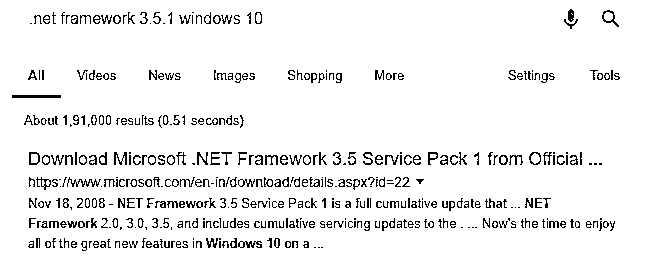

**第 5 步:**现在选择合适的语言并点击下载按钮，如下所示

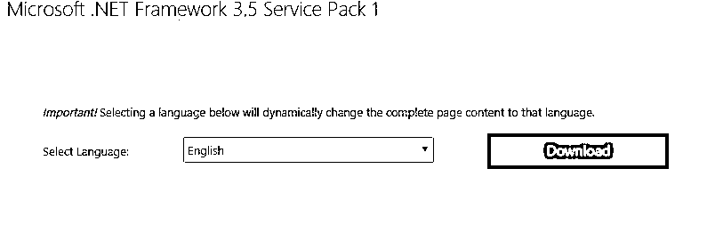

**步骤 6:** 下载完成后，运行。exe 文件，这样它将搜索所需的文件并下载所需的文件，然后完成安装，如下所示:

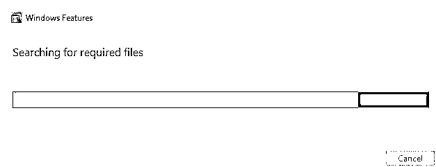

**第七步:**为了将下载的 windows 功能安装为。NET framework 3.1.5，我们需要[启用 windows](https://www.educba.com/windows-interview-questions/) 功能，可以这样做:

首先，选择控制面板，然后在控制面板搜索中，键入 windows 功能，然后你会得到选项，然后点击它，然后你会得到如下:

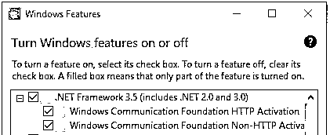

勾选您要启用的期货的方框，然后单击确定并应用。以便安装下载的 windows 功能。

**第 8 步:**安装完 Wix 所需的 windows 特性后。现在点击。exe 文件并运行它，然后单击安装，它将提示是或否并选择是选项，它将配置并完成如下安装过程:

**第九步:**我们已经在 Windows 10 操作系统上成功安装了 WiX，现在如果我们想访问 WiX 主网站，那么你只需要点击上图中的 WiX 工具集，它就会重定向到 WiX 主网站【http://wixtoolset.org/。

**步骤 10:** 如果我们想看一看许可证并阅读它，那么我们可以点击许可证页面，然后它将如下所示打开并阅读协议，示例输出如下:

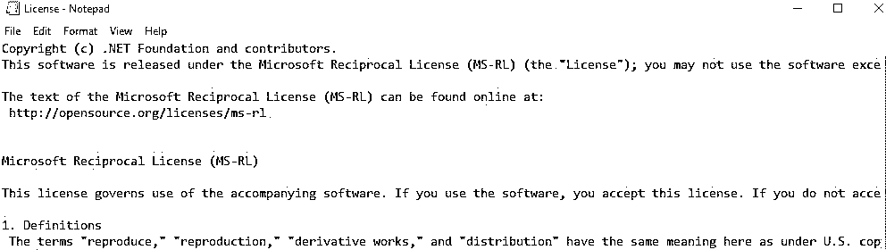

### WiX 的 Visual Studio 集成

*   在 Windows 机器上成功安装 WiX 后，如果我们想要配置 WiX 并将其与 visual studio 集成，那么我们需要遵循以下步骤:首先，我们需要点击“点击此处查看可用扩展”来查看 visual studio 与 [WiX 扩展](https://www.educba.com/wix-alternatives/)的集成，然后它将重定向到 WiX 下载和发布网站，然后我们需要从可用扩展中选择所需的 visual studio 扩展，如下所示:

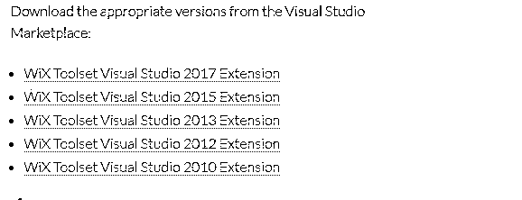

现在，我们已经选择了 WiX 工具集 Visual Studio 2017 扩展，然后它将重定向到 Visual Studio 市场，然后我们需要单击下载并安装，如下所示:

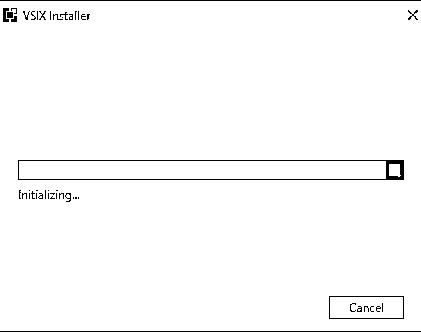

*   在成功初始化并检查了系统需要安装的所有要求后，它将提示如下，我们需要单击 install 按钮，以便 visual studio integration with WiX extension package 将安装如下:

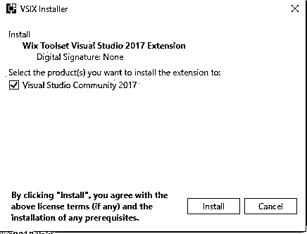

*   单击 install 按钮后，它将检查我们系统上现有的 visual studio 版本，并通过下载所需的包来修改安装，然后安装 Microsoft。WiX 工具集 visual studio 扩展。

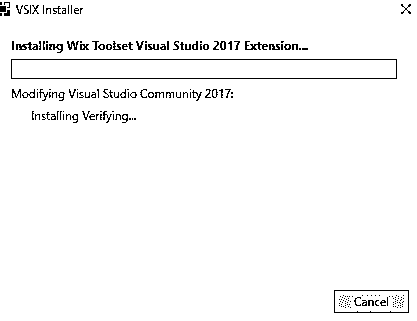

*   由于 WiX 创建 MSI 包，WiX 使用 Windows installer 引擎，而 WiX 可以使用 Visual Studio 扩展以其他方式安装，但不如原始 WiX 好，因为它只有基本功能和许多限制。所以最好继续安装 WiX，如果有需求，我们可以使用 visual studio WiX 集成。

### 如何在 Windows 上使用命令行安装 WiX

*   可以在 Windows 上使用命令行或 Power shell 使用以下命令安装 WiX，如下所示:

虫火谷安装 WiX 工具集。

以上命令将使用命令行在 Windows 机器上安装 WiX 工具集。

*   在 Windows 上，可以通过命令行使用以下命令将 WiX 更新到最新版本，如下所示:

**虫火谷升级 wixtoolset**

上述命令将通过命令行或 Power Shell 将 WiX 工具集更新到 Windows 平台的最新版本。

*   使用 WiX 安装程序的优点是我们可以实现事务、合并模块、自动化、API、包验证、重启管理和[本地化](https://www.educba.com/localization-vs-internationalization/)。
*   WiX 安装程序的缺点是由于它的复杂性、升级、命令行、架构、陡峭的学习曲线、没有拖放选项以及没有自动的依赖包含。

*   WiX toolset 将提供将源文件转换为 MSI 包的工具和带有文档的实用程序。

*   votive 是一个 visual studio 扩展，它将 WiX 工具集与 Visual Studio 集成在一起，并将拥有 WiX 项目模板和智能感知。

### 结论

最后，概述了如何使用命令行在 windows 上安装 WiX，并从 WiX 主网站下载可执行文件。我们还看到了如何将 WiX 工具集与 Visual Studio 集成。我希望在阅读完本文后，您能够毫无问题地在您的机器上安装 WiX。

### 推荐文章

这是如何安装 WiX 的指南？.这里我们讨论了基本概念、visual studio 集成以及使用 Windows 命令行安装 Wix 的不同步骤。您也可以阅读以下文章，了解更多信息——

1.  [安装 WordPress](https://www.educba.com/install-wordpress/)
2.  [安装 MongoDB](https://www.educba.com/install-mongodb/)
3.  [安装 Github](https://www.educba.com/install-github/)
4.  [Wix 备选方案](https://www.educba.com/wix-alternatives/)

