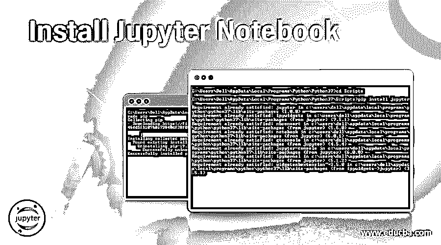
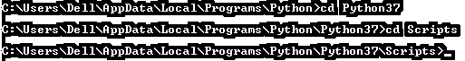
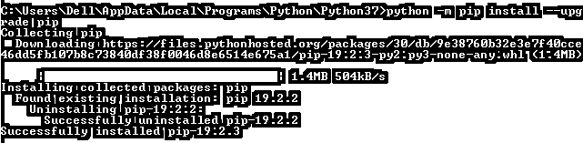
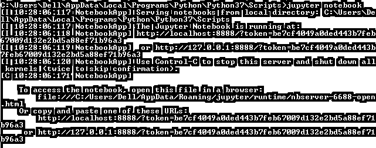
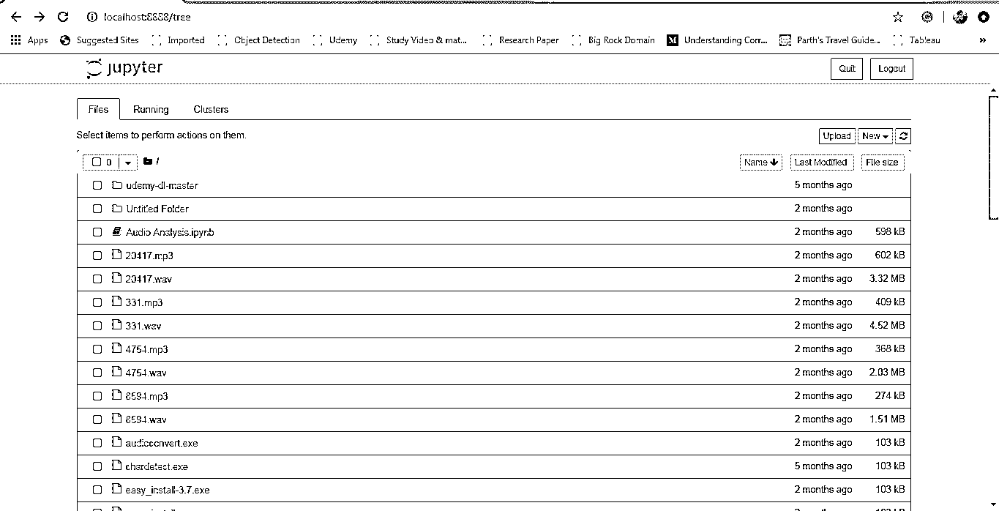
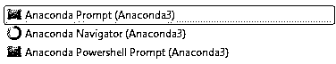
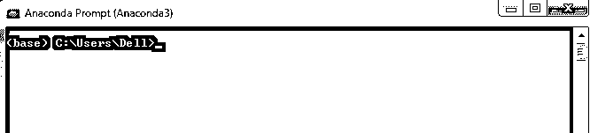
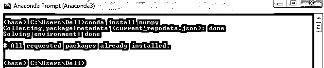
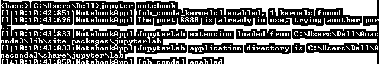
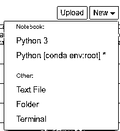

# 安装 Jupyter 笔记本

> 原文：<https://www.educba.com/install-jupyter-notebook/>

## Jupyter 笔记本是什么？

这篇文章将有一个安装 Jupyter 笔记本的近距离观察，但首先，研究 Jupyter 笔记本。Jupyter 项目旨在开发开源软件，并提供跨不同类型编程语言的交互式计算服务。Jupyter 主要支持 3 种核心编程语言:Julia、Python 和 r。它提供了 Jupyter Web 应用程序、Jupyter Python Web 服务器和 Jupyter 文档格式。

整个 Jupyter 笔记本是一个基于 JSON 的文档，包含输入和输出单元；这些单元格可以包含代码、文本、数学函数、绘图。 [Jupyter 笔记本](https://www.educba.com/what-is-juypter-notebook/)另存为。ipynb 扩展格式。Jupyter(。ipynb)还将文档转换成标准格式，如 HTML、演示幻灯片、PDF、Markdown、Python。Jupyter 笔记本广泛应用于数据科学领域。

<small>网页开发、编程语言、软件测试&其他</small>

### Jupyter 笔记本的安装

There are mainly two ways to Install Jupyter Notebook.Following are the steps to Install:

*   直接使用 Python
*   使用蟒蛇

#### 1.直接使用 Python

*   打开命令提示符(cmd)并授予管理员访问权限。
*   然后打开 python 的安装目录。如果您已经将 Python 添加到环境变量中，那么就没有必要在目录中查找 Python 文件夹。

*   对于安装，我们将使用 pip 命令。为了安装，pip 应该升级。如果您有最新的 pip 版本，那么直接进入下一步。或者使用下面的命令升级您的 pip。

**代码:**

`python –m pip install –upgrade pip`

*   进入脚本文件夹>后，运行下面的 cmd 命令:

**代码:**

`‘pip install jupyter.’`

*   然后它将开始下载 Jupyter，并安装 Jupyter 笔记本。
*   完成后，让我们使用以下命令运行 Jupyter 笔记本:

**代码:**

`jupyter notebook.’`

*   之后，它会在你的默认浏览器中打开 Jupyter 笔记本。
*   你也可以使用下面的链接打开 Jupyter 笔记本:“http://localhost:8888/tree。”

*   然后，必须在命令提示符下启动 Jupyter，只有这样，您才能在浏览器中访问它。
*   这是使用和安装 Jupyter 笔记本的第一种方式。

#### 2.安装 Jupyter 笔记本用的是 Anaconda

*   第一步是下载 Anaconda。使用以下链接下载该软件。
*   来源链接:[https://www.anaconda.com/products/individual](https://www.anaconda.com/products/individual)
*   下载适当的版本和操作系统。
*   Anaconda 还提供了一个内置的 python 版本。所以也要查一下 python 的最新版本。
*   并开始安装软件。
*   安装后，您将看到新的软件选项，如下所示:

*   打开 Anaconda 提示终端。它的工作方式与 cmd 命令提示符相同。

*   但是它特别适用于 python 和 python 相关库的安装。
*   要在 anaconda 中安装任何东西，我们将使用' **conda** '关键字。如下图所示:

#### 3.现在开始安装 Jupyter 笔记本

*   对于安装，我们将使用以下 conda 命令:

**代码:**

`‘conda install Jupyter’`

*   它将开始安装 Jupyter 笔记本，如果它已经安装，那么没有必要安装。

#### 4.运行 Jupyter 笔记本

*   要运行该笔记本，请在 Anaconda 提示符下使用以下命令。

**代码:**

`‘jupyter notebook.’`

*   这将在默认浏览器中打开您的 Jupyter 笔记本。
*   您也可以使用以下链接打开 Jupyter 笔记本:“http://localhost:8888/tree。”
*   但是必须在 Anaconda 提示符下运行 Jupyter notebook 命令；没有它，您将无法访问笔记本。一旦你运行这个命令，你就可以从任何地方使用上面的链接访问 Jupyter 笔记本。
*   在上面的链接中，我们可以看到 Jupyter 笔记本运行在您系统中的 8888 端口号上。

现在我们知道安装已经完成。知道时间就知道如何阻止朱庇特笔记本。

#### 5\. Stop Jupyter notebook

有两种方法可以停止运行 Jupyter 笔记本。

*   使用命令提示符/Anaconda 提示符，使用 control + c-command for windows 停止 Jupyter 服务器。
*   直接来自朱庇特笔记本。选中右侧顶部的“退出”按钮。这将停止 Jupyter 服务器。

### 木星笔记本的特点

右侧有一个“新”选项。

它将提供 4 个选项来创建不同类型的文件:

*   python3
*   文本文件
*   文件夹
*   末端的

#### 

#### 1.Python 3

文件它将打开一个笔记本，其中包含:

*   **Markdown:** 是可以用来写简单文字的单元格。主要是开发人员使用这个单元格作为注释来解释代码。
*   **代码:** Cell 是一个 python 单元，整个 python 代码都写在这里，我们可以把这些单元作为一个单独的单元来运行。对代码的错误调试很有帮助。
*   Raw NBConvert: 这是一个命令行工具，主要用于将您的笔记本转换为不同的文件格式。
*   **标题:**用于给笔记本的不同部分加标题。使用“#”为笔记本指定标题。这是一个简单的大字体文本。

#### 2.文本

该文件将给出一个简单的空白页，用于创建文本文件。

#### 3.文件夹

选择在 Jupyter 笔记本的目录中创建一个文件夹。根据您的要求重命名和删除文件夹。

#### 4.末端的

终端的工作方式与它在本地机器上的工作方式完全一样，比如 Mac、Linux 或 windows 中的 cmd。不局限于 python 语言，我们也可以写 R，Julia，JavaScript 程序。它在 Jupyter notebook 中提供了一个交互式仪表板的功能。这意味着它还提供了添加小部件功能的选项。如果我们使用了一个文本小部件，那么文本可以被存储或者在下一个单元格中使用。

### 结论

Jupyter notebook 是一个被开发人员社区广泛使用的 web 应用程序，它帮助开发人员编写和共享代码文档。开发人员可以轻松访问他们的代码和数据。使用它运行，查看代码单元的即时输出并可视化数据。笔记本是数据科学家手中非常灵活、交互、有用和强大的工具。

### 推荐文章

这是一个安装 Jupyter 笔记本的指南。在这里，我们分别讨论以两种形式安装 jupyter 笔记本的基本概念及其功能。您也可以浏览我们的其他相关文章，了解更多信息-

1.  [在 Windows 上安装 Python](https://www.educba.com/install-python-on-windows/)
2.  [安装 UNIX](https://www.educba.com/install-unix/)
3.  [安装 Bugzilla](https://www.educba.com/install-bugzilla/)
4.  [安装 Hadoop](https://www.educba.com/install-hadoop/)

