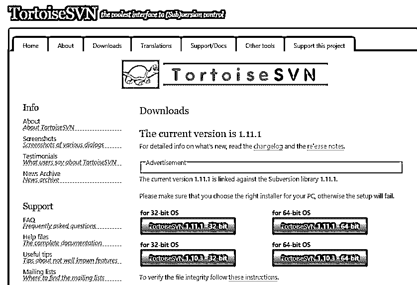
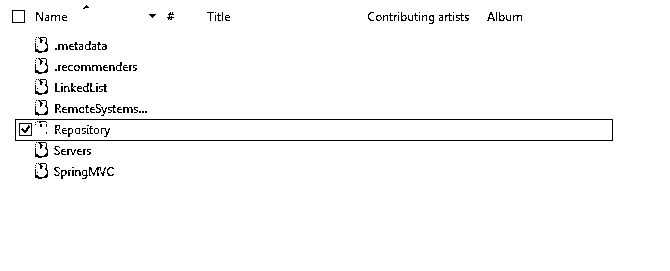
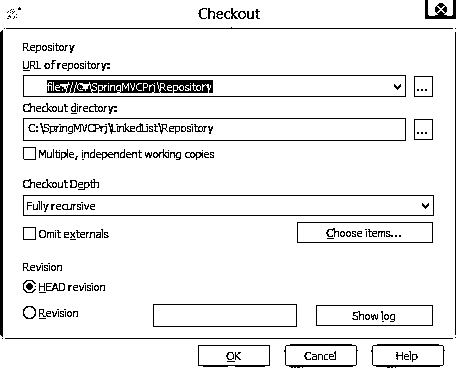
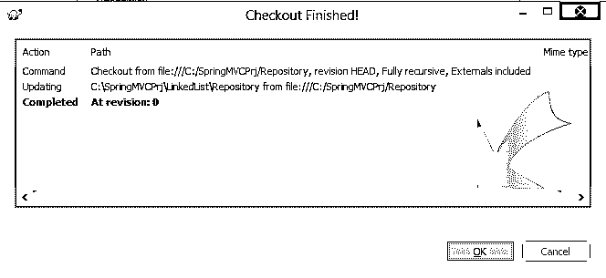
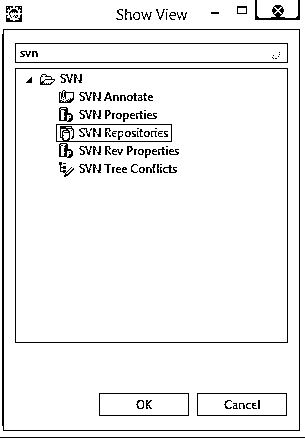
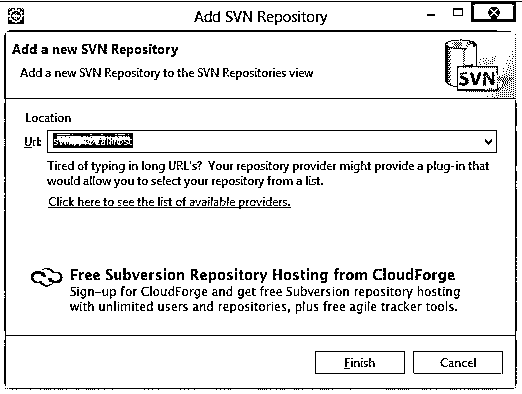

# 如何安装 SVN

> 原文：<https://www.educba.com/install-svn/>

## 安装 SVN 简介

SVN 是 Apache 开发的一个有价值的工具[，用于软件版本和修订的编程领域。这是一个开源的集中式系统。当多个开发人员在一个应用程序上工作时，SVN 就派上了用场，他们希望在一个地方维护他们的代码，并跟踪针对每个文件创建的版本，每个文件的提交历史。](https://www.educba.com/install-apache/)

如果你的客户想要你的代码中的一些文档/进程，或者想把你的代码导出到客户位置，这可能是管理所有这些事情的最简单的平台。您可以根据您的内容类型或其他特定的区分标准创建任意数量的存储库。您可以在这个存储库分支中创建任意数量的文件夹，因此也非常清晰。

<small>网页开发、编程语言、软件测试&其他</small>

### SVN 的好处

*   SVN 处理存储库，主要是存放你提交的代码和版本历史的地方。存储库通常依赖于运行 Subversion 服务器程序并向 Subversion 客户端提供内容的文件服务器。
*   想在同一个文件/服务类/存储库上添加代码吗？只要完成你的代码部分，并在 SVN 提交/推送。一旦你这样做了，一个跟踪版本将被分配给相应的文件，其他开发人员可以更新他们已经从 SVN 库签出代码，这样你的工作就不会再受到阻碍。
*   在不同的模块上工作并想在以后合并代码？嗯！!SVN 为此提供了分支机构；你可以从主分支中剪下一个分支，并将你的模块/代码集放入其中。当您希望在多个 sprints 中交付部分代码时，分支就派上了用场(一种敏捷范例)。
*   开发人员实际上从主开发发生的目录中取出检查，它被称为 **'** 主干 **'** 。

### SVN 的重点

*   使用存储库时，请记住进行定期备份，以便在服务器出现故障时，您可以访问文件的最新版本。

请运行以下命令进行备份创建。

`svnadmin hotcopy path/to/repository path/to/backup`

### 安装 SVN 的步骤

让我们讨论安装 SVN 所需的步骤如下。

**第一步:**到 https://tortoisesvn.net/downloads.html[下载显示选项中合适的版本，如下(请选择你要下载的时候出现的稳定版本):](https://tortoisesvn.net/downloads.html)

**步骤 2:** 使用以下步骤标记您想要创建存储库的文件夹

现在右键点击仓库-> TortoiseSVN ->在这里创建仓库

**第三步:**标记创建存储库的文件夹后，会出现一个对话框；请确保在您的便利贴上复制蓝色的网址，以供以后参考。

**步骤 4:** 现在选择您想要的项目文件夹，它必须被跟踪，右键单击并单击 SVN 签出选项。通过这样做，你是在告诉 SVN 跟踪我们将要在代码中做的改变。

确保单选按钮“Head revision”处于选中状态；在此之后，一旦按下“确定”,就会出现以下对话框:

因此，您可以在这里看到修订号似乎是 0；此外，您将看到一个. svn 文件夹将在签出文件夹中创建。

**第五步:**现在，我们来看看与 eclipse 的集成；如果 eclipse 不包含插件，那么 subclipse 必须按照以下导航路径安装:

进入**帮助-【http://subclipse.tigris.org/update_1.10.x.】安装新软件……**

点击添加选项；一旦你这样做了，Subclipse 的复选框将会出现(如你在添加上面的 URL 时所命名的)，完成这个过程。这使得日蚀与 SVN 融为一体。

要进行同样的检查，请遵循给定的步骤:

“窗口”“>“打开透视图”“>“其他……”，一个名称选项现在将开始出现在这里。

**步骤 6:** 使用 eclipse 创建 SVN 存储库

进入窗口->显示视图->搜索 SVN，然后选择 SVN 仓库选项。

**步骤 7:** 在如图所示的 SVN 存储库窗口中，执行以下步骤

右键单击，选择 New -> Repository Location，然后在 URL 框中键入 svn://localhost，如下所示，然后单击 finish。

如果在这样做之后出现一些错误(例如，如果在 eclipse 控制台上出现任何错误)，那么一定要处理代理设置(有关参考，只需在 stackoverflow.com 上搜索错误)。

**步骤 8:** 完成后，进入导航窗格，右键点击项目- >“团队- >“共享项目”，然后选择 SVN - >“下一步- >完成。一旦你点击完成按钮，你会看到 SVN 安装在您的系统中

**步骤 9:** 现在你可以继续编辑你的程序文件，eclipse 可以跟踪这些文件，要跟踪所做的更改，在 eclipse 的项目浏览器中右键单击“项目”，然后转到“团队”，然后选择“与存储库同步”。它将给出所有出现在那里的更改，第一次，你可以简单地选择文件集中的文件提交，然后 SVN 将生成一个相同的修订号。

请确保仅使用这种方式提交文件，因为无论何时提交批量文件/文件夹，都会生成修订号。

让我们用一个例子来说明一下:

如果您正在开发一个包含 10 个文件的模块，并且它们是相互关联的，以至于它们被计划在同一个版本中交付，那么请确保在一个修订头中提交所有这些文件，以便万一您的客户告诉恢复变更，而不是简单地通过恢复修订号，您可以确信所有相关的内容都被恢复了。

**步骤 10:** SVN 还提供了查找给定文件历史的机会；如果你愿意的话，你也可以直接用那些版本替换你当前的代码。

这里总结一下，SVN 可以像 Visual Studio 代码一样与 IDE 集成。所以对于并行开发，为了满足基于敏捷的工作时间限制，SVN 是一个很好的集中化工具。

### 推荐文章

这是一个如何安装 SVN 的指南。这里我们已经讨论了在我们的系统上安装 SVN 的基本概念和步骤。您也可以阅读以下文章，了解更多信息——

1.  [安装詹金斯](https://www.educba.com/install-jenkins/)
2.  [安装 SQL Server](https://www.educba.com/install-sql-server/)
3.  [安装 MATLAB](https://www.educba.com/install-matlab/)
4.  [安装 phpMyAdmin](https://www.educba.com/install-phpmyadmin/)

