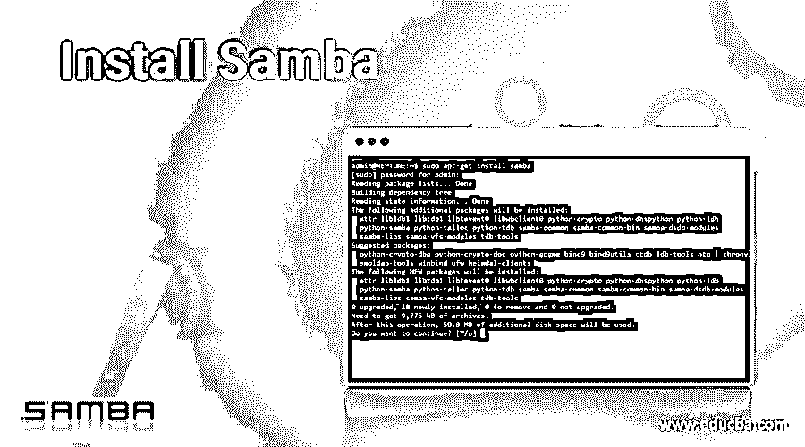

# 安装 Samba

> 原文：<https://www.educba.com/install-samba/>

## 安装 Samba 简介

在我们进入安装步骤之前，让我们先简单介绍一下 Samba，以及当我们选择主要使用 Linux 或 Unix 系统时，它能为我们提供什么。

1.Samba 是开源软件，为 Linux 和 Unix 提供了 windows 互操作性程序套件。

<small>网页开发、编程语言、软件测试&其他</small>

2.Samba 为使用 SMB 和 [CIFS 协议](https://www.educba.com/cifs-protocol/)的客户端提供安全、稳定、快速的文件和打印服务，就像所有版本的 DOS、Windows、Linux 等。

3.Samba 为网络管理员提供了设置、配置和选择系统和设备的灵活性。

4.Samba 由两个主要程序组成，即 smbd 和 nmbd。他们应该实施四项 CIFS 服务

*   文件和打印服务
*   认证和授权
*   名字解析
*   服务公告(浏览)

5.Smbd 还处理共享模式和用户模式验证和授权，通过要求密码来保护共享文件和打印服务。

6.Nmbd 处理上面提到的四个组件的名称解析和浏览部分，这是在 NetBIOS 的帮助下完成的

7.Samba 提供了以下实用程序

*   **SMB client**–用于从 Unix 系统连接到远程 SMB 共享、文件传输等
*   用于查找网络上的 NetBIOS 名称，查看它们的 IP 地址。
*   **Swat**–代表 Samba Web 管理工具，用于通过 Web 浏览器远程配置 Samba。

8.这些天一直在用 Samba 3.0。

### 安装步骤

安装前，有以下先决条件

*   ubuntu lts
*   局域网文件共享的目的。

**Note:** It is better to install it using a binary package, which is easier than installing it from the source package. Its because all the pre-compilation configuration is already done, and the package maintainer is also taking care of configuration issues.

有三种流行的二进制包分发方法

#### 步骤 1:二进制 tarball(主要是通用 tarball)

*   **安装 Tarball**

Samba 的源代码是分布式的 tarball 形式，用于从二进制 tarball 中提取数据的工具与用于处理包含源代码的 tarball 的工具相同:tar 和压缩程序，如 gzipor bzip2

使用以下命令从根目录中解压缩 tarball。

`tar -xvzf /path/to/samba-version.tar.gz`

注意，在第一次安装 samba 时，tarball 不会产生问题。

*   **安装 FreeBSD 软件包**

FreeBSD 附带存储为 tarballs 的软件包。要直接安装其中一个包，包括 Samba 包，请使用 pkg_add 或 sys install 实用程序。

`pkg_add samba-version.tbz`

如果没有弹出错误，这意味着 samba 已经正确安装。

#### 第二步:rpm

*   **安装 RPM**

二进制 rpm 基本上是压缩的 cpio 档案，添加了一些额外的位。这些额外的特性帮助操作系统保持一个已安装软件包和文件的数据库，类似于 FreeBSD 在软件包工具的帮助下维护的数据库。

用于通过 RPM 安装 samba 的命令如下

`rpm -Uvh samba-version-minor version.arch.rpm`

#### 第三步:Debian 软件包

Debian GNU/Linux 及其衍生工具包含了相当于 RPM 工具的包管理工具。Debian 下包安装的核心工具是 dpkg。

我们可以使用以下命令通过 dkpg 安装 samba:

`dpkg -i samba_version-minorversion.deb`

使用 apt-get 包管理器的 Samba 安装可以通过以下步骤完成:

这个命令应该定位并安装 samba 包以及它所依赖的任何包，比如 samba-common。

`apt-get install samba`

不过，只有在正确配置了高级包工具(APT)实用程序的情况下，该命令才会起作用。基本配置包括编辑/etc/apt/sources。列表文件，以参考安装光盘或一些适当的 FTP 站点。

因此，上述步骤可以用来安装 samba。

现在让我们看看下一步。

#### 配置和运行 Samba

1.samba 的配置文件是/etc/samba/smb.conf。请确保根据安装在您系统中的 samba 版本更新该文件。

2.它还建议备份该文件，可以参考的命令是

`cp -pf /etc/samba/smb.conf /etc/samba/smb.conf.bak`

3.当您第一次安装 samba 时，请编写以下命令

*   nmbd -D
*   smbd -D

-D 指的是运行的恶魔模式。

4.要验证服务器是否正在运行，请执行以下命令

`ps ax | grep mbd`

5.如果您看不到输出或者只看到 grep 命令本身，那么 Samba 可能找不到它的配置文件 smb.conf。您可以使用 find 命令来实现这一点，如下所示

`find / -name "smb.conf"`

现在让我们来看一下 samba 主浏览器:

*   **分配主浏览器:**每个网段(特别是 IP 子网)有一台计算机充当主浏览器。
*   **定位主浏览器:**客户端必须能够定位主浏览器计算机。
*   **跨子网:**SMB/CIFS 用来实现浏览的一些机制在跨子网时不太好用。
*   **整合客户端、网络、服务器资源:**包括微软 Windows 在内的一些客户端，试图在单一列表中呈现本地、全网、服务器资源，在用户眼中模糊了这些类型资源之间的界限。客户端执行这种集成，但是所涉及的协议必须提供足够的覆盖范围，不能留下任何空隙。
*   **解决用户界面问题:**使用网络浏览的客户端必须有某种方式向用户呈现这些信息。这不是协议问题，但是协议设计决策确实会影响客户端的用户界面。

### 推荐文章

这是安装 Samba 的指南。这里我们讨论了安装 Samba class="word "的基本概念、先决条件、配置和步骤。您也可以浏览我们推荐的其他文章，了解更多信息——

1.  [安装对接器](https://www.educba.com/install-docker/)
2.  [安装 Magento](https://www.educba.com/install-magento/)
3.  [安装 phpMyAdmin](https://www.educba.com/install-phpmyadmin/)
4.  [安装角度](https://www.educba.com/installing-angular/)

