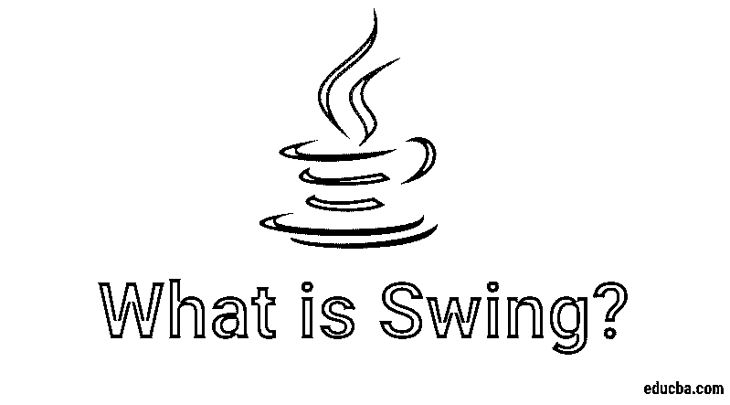
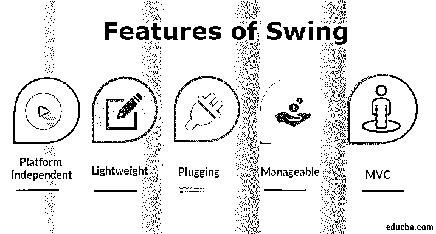

# 什么是 Swing？

> 原文：<https://www.educba.com/what-is-swing/>




## Swing 简介

Swing 是 Java 程序的用户界面组件的集合。它是被称为 JFC 的 Java 基础类的一部分。简而言之，Swing 是一个图形用户界面工具包，用于开发基于 windows 的 java 应用程序或程序。它是 AWT 的继承者，被称为 Java 的抽象窗口工具包 API，AWT 组件主要是重量级的。

与 AWT 组件相比，这些组件是轻量级的。它为所有平台的用户提供了一个优秀的界面。它不是专门针对一个平台的。这些组件是用 Java 编写的，并且与平台无关。Java 基础类最早出现于 1997 年，后来被称为 Swing。在 java 中使用 swing。需要使用或导入一个 swing 包。它也被称为 Java Swing。

<small>网页开发、编程语言、软件测试&其他</small>

### 挥杆的特点

秋千的特点如下:




1.  **平台无关:**是平台无关的；用于构建程序的 swing 组件不是特定于平台的。它可以在任何平台和任何地方使用。
2.  轻量级: Swing 组件是轻量级的，这有助于创建更轻量级的 UI。swings 组件允许它插入操作系统用户界面框架，包括屏幕或设备的映射以及其他用户交互，如按键和鼠标移动。
3.  **pluging:**它有一个强大的组件，可以扩展以提供对用户界面的支持，这有助于为应用程序提供良好的外观和感觉。它指的是高度模块化的架构，允许它插入其他定制的实现和用户界面框架。它的组件通过一个名为 java.swing 的包导入。
4.  **易管理:**易于管理和配置。它的机制和组合模式也允许在运行时更改设置。可以向用户界面提供统一的改变，而无需对应用程序代码进行任何改变。
5.  **MVC:** 他们主要遵循 MVC 的概念，也就是[模型视图控制器](https://www.educba.com/what-is-mvc/)。在此帮助下，我们可以在不影响或触及其他组件的情况下对一个组件进行更改。它也被称为松耦合架构。
6.  **可定制:**可以轻松定制 Swing 控件。它是可以改变的，组件应用程序的视觉外观独立于其内部表示。

### 挥杆的例子，

主要使用 component 类，其中一些方法是经常使用的，比如在另一个组件中添加一个组件(add (Component a))并相应地设置组件的大小、布局和可见性。

下面是一个例子:

```
import javax.swing.*;
public class Test extends JFrame {
public Test() {
super("Test");
setDefaultCloseOperation(WindowConstants.EXIT_ON_CLOSE);
add(new JLabel("Test, Application!"));
pack();
setVisible(true);
}
public static void main(final String[] args) {
new Test();
}
}
```

显示按钮的其他示例:

```
import javax.swing.*;
public class Swing {
public static void main(String[] args) {
JFrame f=new JFrame();//creating instance of JFrame
JButton b=new JButton("Submit Button");//creating instance of JButton
b.setBounds(120,90,90, 35);//x axis, y axis, width, height
f.add(b);//adding button in JFrame
f.setSize(400,500);//400 width and 500 height
f.setLayout(null);//using no layout managers
f.setVisible(true);//making the frame visible
}
}
```

### Swing 和 AWT 的区别

Swing 和 AWT 之间区别如下:

| **基本对比** | **摇摆** | **AWT** |
| 体系结构 | 它遵循模型视图控制器架构。 | 它不遵循模型-视图架构。 |
| 用户界面 | 它确实支持 UI 的可插拔外观 | 它不支持可插拔的外观 |
| 成分 | 它为 UI 提供了许多组件。 | 与 Swing 相比，它的组件更少。 |
| 自主的 | 它是平台独立的。 | 它依赖于平台。 |
| 重量 | 它的部件很轻。 | 它的组件是重量级的。 |
| 速度 | 如果组件用得比较多，可能会比较慢。 | 如果部件用得多，它的速度就正常了。 |

### 优势

其优点如下:

1.  java swing 主要提供内置的双缓冲。
2.  新组件内置于 swing 中，为调试提供支持。
3.  Swing 组件主要根据所使用的包来改变它们的外观、UI 的外观和感觉。
4.  它主要比 AWT 消耗更少的资源，这就是它被称为轻量级的原因。
5.  它提供了其他组件，如图标、装饰边框、工具提示等。
6.  由于遵循 MVC 设计模式的概念，它主要提供灵活的用户界面。
7.  它提供了额外的功能和其他组件来替代 AWT 组件。
8.  这些组件和应用程序可以在任何平台上使用或运行。

### 不足之处

缺点如下:

1.  这些组件需要 Java 1.2 版和其他单独的 jar 文件来使用。
2.  可以比 AWT 慢。
3.  要在 swing 中开发应用程序，个人必须非常小心地进行编程。
4.  有时，组件没有出现在它们应该出现的地方。

### 结论

它是用于为 Java 构建基于 windows 的应用程序的框架。它是为解决 AWT 中的问题而开发的。它提供了更多的工作组件，并使用可扩展的组件来开发应用程序。包或库中有许多组件来执行和定义项目或应用程序的外观。

它被称为为 Java 程序开发的下一代 GUI。Java Swing 是一个 GUI 控件库，类不依赖于平台，并且重量更轻，因为它们不创建对等组件。它主要提供了跨所有平台的应用程序的一致外观。

### 推荐文章

这是关于什么是 Swing 的指南？这里我们讨论关键概念、特性、优点和缺点。您也可以浏览我们推荐的其他文章，了解更多信息——

1.  [什么是 Maven 插件？](https://www.educba.com/what-is-maven-plugins/)
2.  [Python 是什么](https://www.educba.com/what-is-python/)
3.  [Java EE vs Spring](https://www.educba.com/java-ee-vs-spring/)
4.  [Java 设计模式](https://www.educba.com/design-patterns-in-java/)


