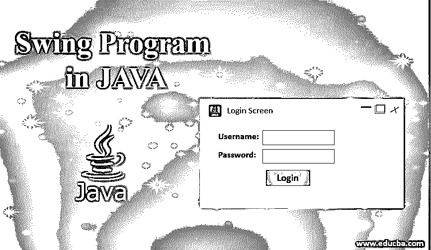
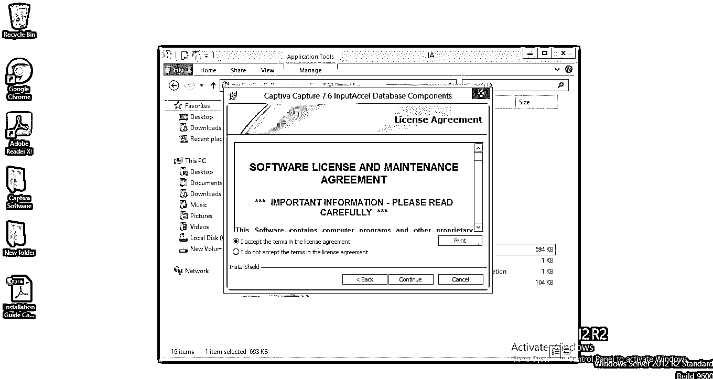
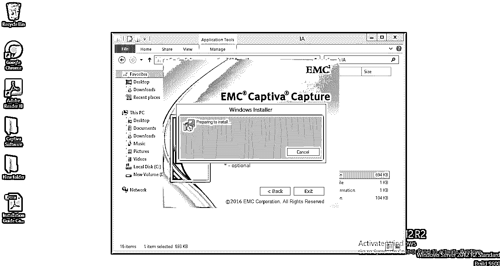
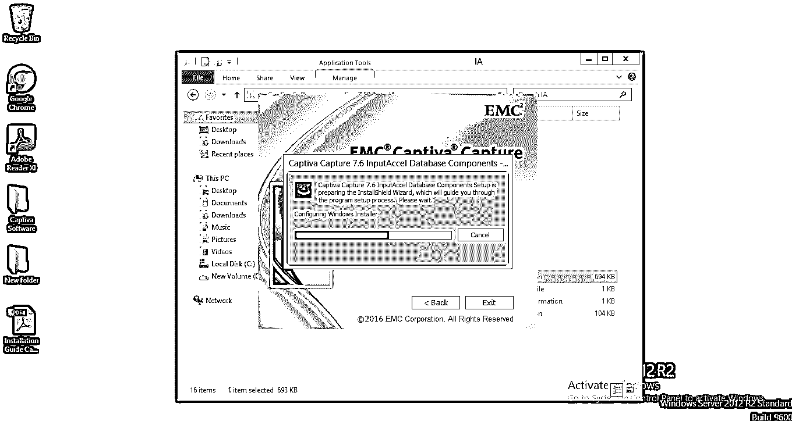
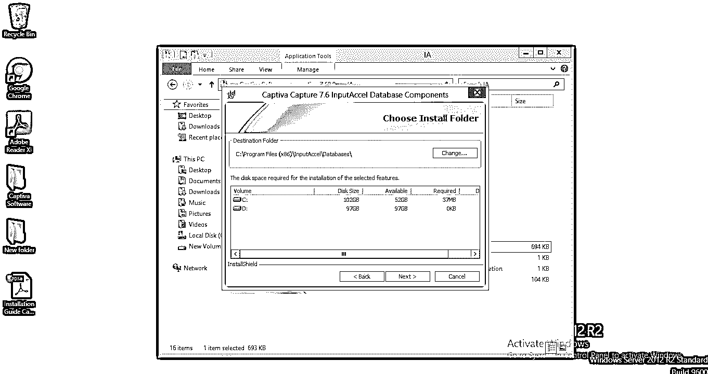
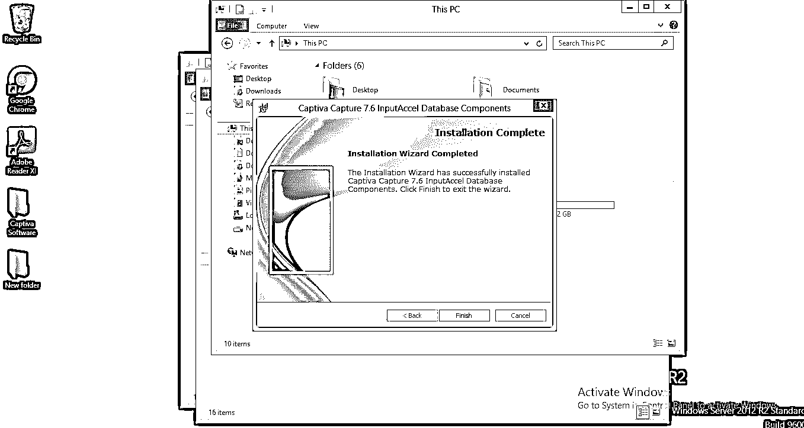
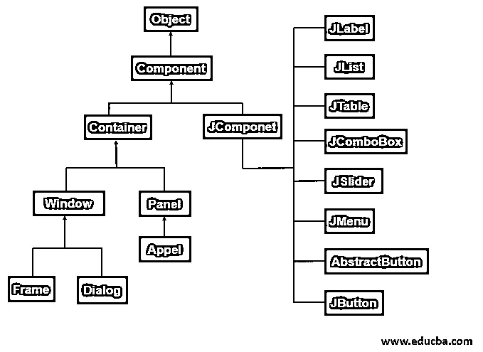
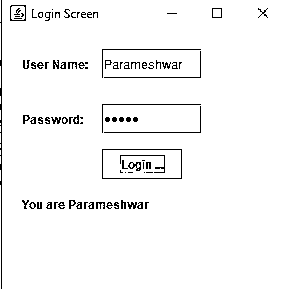

# JAVA 中的 Swing 程序

> 原文：<https://www.educba.com/swing-program-in-java/>




## JAVA Swing 程序简介

在本文中，我们将学习 JAVA 中的 Swing 编程。Java Swing 是 Java 基础类(JFC)的一部分，用于构建基于窗口的应用程序。像 AWT 一样，Java Swing 提供了平台相关的轻量级组件。javax.swing 包为 java swing API 提供了 JButton、JTextField、JTextArea、JRadioButton、JCheckbox、JMenu、JColorChooser 等类。

### 为什么我们要继续荡秋千？

下面是我们转向 swing 的原因:

<small>网页开发、编程语言、软件测试&其他</small>

#### AdvancedWasteTreatmentofwater 高次废水处理

*   最初，我们有一个 GUI ( [图形用户界面](https://www.educba.com/what-is-gui/))子系统，如 AWT(抽象 Windows 工具包)。这个 AWT 将所有图形界面组件转换成它们相应的平台相关的特定等价物。因此，它变得依赖于平台。
*   AWT 之所以重量级，是因为利用了本土资源。
*   为了解决这个问题，软件工程师提出了一个新的框架，叫做 Swing in Java。

#### 摇摆

*   Swing 不使用本地资源，所以它是轻量级的。
*   swing 用户界面不依赖于任何特定的平台，因此 swing 是独立于平台的。
*   Swing 用于开发独立的桌面应用程序。

### 实时示例

在 windows 中安装任何应用程序都属于桌面应用程序。下面的一些图片说明了示例概念。
















**Swing 的包:**Swing 中的所有包都存在于 javax.swing 中

**Note: *** indicates sub-packages of swing.

### Swing API 的层次结构

以下是 swing api 的完整层次结构:




### Swing 中的组件和容器

它包含两个主要项目组件和容器。以下是对两者的详细解释:

#### 成分

*   正如我们在上面的层次结构中看到的，Swing 组件派生自 JComponent。它支持应用程序的外观。
*   JComponent 也与 AWT 组件兼容，因为它继承了 AWT 类容器和组件。
*   组件包括:JApplet、JButton、JCheckBox、JComboBox、JComponent、JDailog、JLabel、JFrame、JList、JFileChooser、 [JMenu](https://www.educba.com/jmenu/) 、jmenubar、jmenuitem、JOptionPane、JPanel、jpasswordfield、jpopupmenu、jprogressbar、JRadioButton

**Note:** All swing components start with prefix letter J. It because varies all AWT components from Swing developers used this convention.

#### 容器

它包含两种类型的容器:

*   顶级容器
*   轻型容器

**1。顶层容器**

*   这些不从 JComponent 继承。但是，这些顶级容器继承自上面层次结构中的组件和容器。
*   JFrame、JApplet、JWindow 和 JDailog 等。是顶级容器的一些例子。
*   这是 swing 中的重量级组件，而其他组件是轻量级的。

**2。轻型容器**

*   这些是从 JComponent 继承的。
*   所有轻量级组件都属于轻量级容器。
*   JPanel，JButton，JScrollBar 等。是一些例子。

### 摆动工作原理

*   Swing 框架是 Java 基础类(JFC)的一部分。JFC 用于在实时环境中创建基于窗口的应用程序。它构建在 AWT API 之上。Swing 完全是只用 Java 语言开发的。
*   Swing 主要工作[在 MVC](https://www.educba.com/what-is-mvc/) (模型视图控制器)的原理上。
*   该模型给出了 swing 组件的信息状态，如 JButton、JPasswordField、JLabel、JTextField 等。**示例:**在组合框的情况下，该模型包含一个字段，该字段确定该框是多选还是单选，还是未从下拉列表中选择。视图显示组件或容器在屏幕上的显示方式。
*   控制器告诉你指定的组件如何对用户做出反应。**举例:**如果有一帧由用户名、密码、标签等组成。使用登录按钮，如下面的 swing 示例所示。一旦我们点击登录按钮，用户必须去的地方由这个控制器决定(意味着下一个动作必须去的地方)。

### 用 JAVA 实现 Swing 程序

下面是用 java 实现 swing 的例子:

**代码:**

```
package educba.swing.com;
import java.awt.event.ActionEvent;
import java.awt.event.ActionListener;
import javax.swing.JButton;
import javax.swing.JFrame;
import javax.swing.JLabel;
import javax.swing.JPasswordField;
import javax.swing.JTextField;
public class SwingIntroduction {
public static void main(String[] args) {
JFrame frame=new JFrame("Login Screen"); //Line 1
JLabel label = new JLabel();//Line 2
label.setBounds(20,150, 200,50);  //Line 3
final JPasswordField value = new JPasswordField();//Line 4
value.setBounds(100,75,100,30);
JLabel userNameLabel=new JLabel("User Name:");//Line 5
userNameLabel.setBounds(20,20, 80,30);
JLabel paswordLabel=new JLabel("Password:");//Line 6
paswordLabel.setBounds(20,75, 80,30);
JButton loginButton = new JButton("Login Here");//Line 7
loginButton.setBounds(100,120, 80,30);
final JTextField text = new JTextField();//Line 8
text.setBounds(100,20, 100,30);
frame.add(value);   //Line 9
frame.add(userNameLabel); //Line 9
frame.add(label); //Line 9
frame.add(paswordLabel); //Line 9
frame.add(loginButton); //Line 9
frame.add(text);  //Line 9
frame.setSize(300,300);
frame.setLayout(null);    //Line 10
frame.setVisible(true);     //Line 11
loginButton.addActionListener(new ActionListener() {  //Line 12
public void actionPerformed(ActionEvent e) {
String userNameDisplay = "You are " + text.getText();//Line 13
label.setText(userNameDisplay);     //Line 14
}
});
}
}
```

**输出:**




**示例演示:**

*   第 1 行用于创建一个登录框架，在其中包含所需的组件。
*   第 2 行用于在框架中创建一个标签，用于添加必要的字段，如用户名、密码字段等。
*   第 3 行用于设置边界(长度、宽度等。)与适当的值进行比较。
*   第 4 行用于创建密码字段(如果使用密码字段，输入的值将被隐藏)。
*   第 5 行用于创建用户名标签。
*   第 6 行用于创建密码标签。
*   第 7 行用于创建一个名为“Login Here”的按钮。
*   第 8 行用于创建一个文本字段，以便向其中添加一些文本。
*   第 9 行用于添加所有组件，如字段、标签等。
*   第 10 行用于通过设置空值来制作没有任何布局的框架
*   第 11 行用于通过设置值使用户界面可见
*   第 12 行用于登录按钮操作方法，如果我们单击此处的登录按钮，它将执行什么操作。
*   当我们单击 login here 按钮时，它会显示用户名文本字段中输入的名称。

### 我们真的需要记住所有的秋千组件吗？

不，因为所有的组件都是以它们的功能命名的，所以如果我们知道需求，那么组件几乎都是以那个前缀开始的。

**举例:**

如果我们想要创建一个按钮，那么组件名是 JButton，如果我们想要一个菜单栏，而不是 JMenuBar，如果我们想要标签，密码字段，文本字段，而不是 JLabel，JPasswordField 和 JTextField。因此，不需要记住所有的组件名称。

### 结论–JAVA 中的 Swing 程序

如果你想开发平台无关的轻量级桌面应用，你可以直接使用 Swing 而不是 AWT，因为我们知道 AWT 是平台相关的和重量级的。

### 推荐文章

这是一个用 JAVA 编写 Swing 程序的指南。这里我们讨论一下基本概念，为什么我们需要一个秋千？swing 中的类型与工作原理和程序实现。您也可以浏览我们的其他相关文章，了解更多信息——

1.  [Java Swing 中的定时器](https://www.educba.com/timer-in-java-swing/)
2.  [Java 中的 Swing 组件](https://www.educba.com/swing-components-in-java/)
3.  [什么是秋千？](https://www.educba.com/what-is-swing/)
4.  [Java 监控工具](https://www.educba.com/java-monitoring-tool/)


