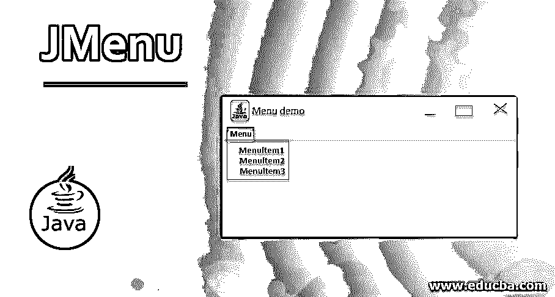
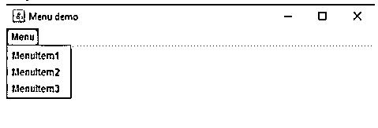
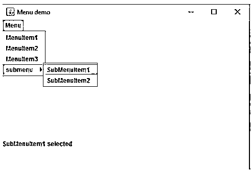

# 你叫什么名字

> -= the last fantasy =-荣誉出品本字幕仅供学习交流，严禁用于商业途径




## 名称简介

JMenu、JMenuBar 和 JMenuItems 是 Java Swing bundle 的一部分。JMenuBar 是一个菜单栏的执行。JMenuBar 包含至少一个 JMenu 对象。当选择这些对象时，它们会显示一个弹出窗口，演示至少一个 JMenuItems。它本质上是对着菜单说话。它包含几个 JMenuItem 对象。它可能同样包含 JMenu 对象(或子菜单)。菜单类与下拉菜单部分对话，下拉菜单部分是从菜单栏发送的。JMenuItem 类处理菜单中的真实内容。菜单中的所有东西都应该从 JMenuItem 类或它的一个子类中获取。

**语法:**

<small>网页开发、编程语言、软件测试&其他</small>

1.类声明(JMenuBar)

```
public class JMenuBar extends JComponent implements MenuElement, Accessible
```

2.类声明(JMenu)

```
public class JMenu extends JMenuItem implements MenuElement, Accessible
```

3.类声明(JMenuItem)

```
public class JMenuItem extends AbstractButton implements Accessible, MenuElement
```

4.在 Java Swing 中创建 JMenuBar 的语法

```
JMenuBar <JMenuBar_name>=new JMenuBar ();
```

5.在 holder 的最高点创建 JMenuBar 的语法

```
setJMenuBar (<JMenuBar_name>);
```

6.创建不同菜单并将菜单添加到 JMenuBar 的语法结构

```
JMenu <JMenu_name>=new JMenu ("menu name");
<JMenuBar_name>. add(<JMenu_name>);
```

7.制作菜单项的语法

```
JMenuItem <JMenuItem_name>=new JMenuItem ("menu name ");
```

### JMenu 的构造函数

以下是不同的构造函数:

**1。JMenuBar ():** 它将制作另一个菜单栏。

**语法:**

```
public JMenu ()
import javax.swing.JMenu; (Import from swing JMenu)
import javax.swing.JMenuBar; (Import from swing JMenuBar)
import javax.swing.JMenuItem; (Import from swing JMenuItem)
```

**2。JMenu ():** 它将创建并制作另一个没有内容的菜单。

**语法:**

```
public JMenu ()
import javax.swing.JMenu; (Import from swing JMenu)
import javax.swing.JMenuBar; (Import from swing JMenuBar)
import javax.swing.JMenuItem; (Import from swing JMenuItem)
```

**3。JMenu(字符串名称):**用预先确定的名称制作另一个菜单。

**语法:**

```
public JMenu (String s)
import javax.swing.JMenu; (Import from swing JMenu)
import javax.swing.JMenuBar; (Import from swing JMenuBar)
import javax.swing.JMenuItem; (Import from swing JMenuItem)
```

**4。JMenu (String name，Boolean b):** 创建另一个具有预定名称的菜单，Boolean establish 决定它是否是一个移除菜单。分离菜单可以从其父菜单栏或菜单中打开和拖动。

**语法:**

```
public JMenu (String s, boolean x)
import javax.swing.JMenu; (Import from swing JMenu)
import javax.swing.JMenuBar; (Import from swing JMenuBar)
import javax.swing.JMenuItem; (Import from swing JMenuItem)
```

**通常使用的技术:**

*   **add (JMenu c):** 将菜单添加到菜单栏。将 JMenu 项添加到菜单栏。
*   **添加(组件 c):** 将零件添加到 JMenu 的结尾
*   **add (Component c，int list):** 将段添加到 JMenu 的预定义列表中
*   **add (JMenuItem menuItem):** 在菜单中尽可能地添加菜单项
*   **add (String s):** 用指定的字符串创建一个菜单项，并将其尽可能地添加到菜单中。

### 例子

下面是一些例子:

#### 示例#1

Java 代码构建菜单栏添加菜单项。

**代码:**

```
import java.awt.*;
import javax.swing.*;
import java.awt. event. *;
public class menu extends JFrame {
// Menu Bar declaration
static JMenuBar xb;
// JMenu declaration
static JMenu x;
// Menu items
static JMenuItem x1, x2, x3;
// frame creation declaration
static JFrame y;
public static void main()
{
// frame creation using new keyword
y = new JFrame ("Menu Demo");
// menu bar creation using new keyword
mb = new JMenuBar ();
// menu creation using new keyword
z = new JMenu("Menu");
// menu item creation using new keyword
x1= new JMenuItem("MenuItem1");
x2= new JMenuItem("MenuItem2");
x2= new JMenuItem("MenuItem3");
// add menu items to menu
x.add(x1);
x.add(x2);
x.add(x3);
// add menu to menu bar
xb.add(z);
// add menubar to frame
y.setJMenuBar(xb);
// set the size of the frame
y.setSize(500, 500);
y.setVisible(true);
}
}
```

**输出:**

**

** 

#### 实施例 2

Java 代码，包括一个菜单栏，包括菜单项，子菜单的东西，此外还添加了 ActionListener 菜单的东西。

**代码:**

```
public class menu1 extends JFrame implements ActionListener {
// Menu Bar declaration
static JMenuBar xb;
// JMenu declaration
static JMenu x, q1;
// Menu items
static JMenuItem x1, x2, x3, y1,y2;
// frame creation declaration
static JFrame y;
// label declaration
static JLabel l;
public static void main ()
{
// create an object of the class menu1
menu1 m = new menu1();
// create a frame
z = new JFrame ("Menu demo");
// creating a label
z1= new JLabel ("no task ");
// creating a menu bar
xb = new JMenuBar ();// creating a menu
x = new JMenu("Menu");
q1 = new JMenu("submenu");
// creating menu items
x1 = new JMenuItem("MenuItem1");
x2 = new JMenuItem("MenuItem2");
x3 = new JMenuItem("MenuItem3");
y1 = new JMenuItem("SubMenuItem1");
y2 = new JMenuItem("SubMenuItem2");
// adding ActionListener to the menu Items used
x1.addActionListener(m);
x2\. addActionListener(m);
x3\. addActionListener(m);
y1.addActionListener(m);
y2.addActionListener(m);
// adding menu items to menu lined up
x.add (x1);
x.add (x2);
x.add (x3);
q1.add(y1);
q1.add(y2);
// adding submenu in the list
x.add(q1);
// adding menu to menu bar
xb.add(x);
// adding menu bar to frame
setJMenuBar(xb);
y.add(l);
setSize (500, 500);
y.setVisible(true);
}
public void action Performed (ActionEvent d)
{
String s1 = d. getActionCommand ();
// set the label to the menu Item that is selected
l.setText(s1 + " used");
}
}
```

**输出:**




### 结论

在本文中，我们展示了 Java Swing 编码中使用的所有必要的 JMenu 以及其他操作符。我们已经了解了 JMenu 中使用的各种构造函数集合，它支持将对象合并到联接中。到目前为止，我们看到的大部分模型只包含了基本的核信息。

### 推荐文章

这是一本关于 JMenu 的指南。在这里，我们讨论介绍，构造函数，常用的技术和适当的代码和输出的例子。您也可以看看以下文章，了解更多信息–

1.  [JAVA 中的 Swing 程序](https://www.educba.com/swing-program-in-java/)
2.  [Java 中的 JTabbedPane](https://www.educba.com/jtabbedpane-in-java/)
3.  [JPopupMenu](https://www.educba.com/jpopupmenu/)
4.  [Java 中的 JDialog](https://www.educba.com/jdialog-in-java/)


