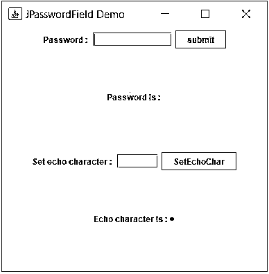
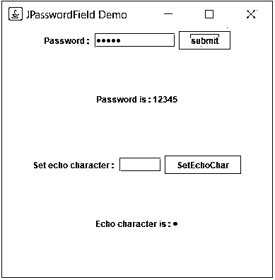
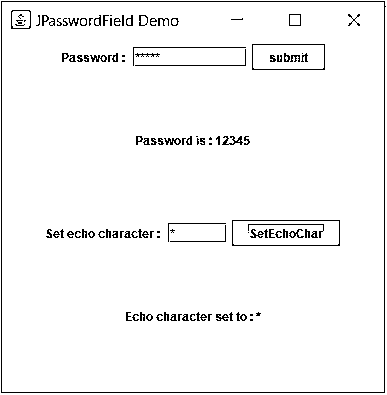
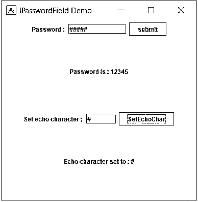

# jpassword field(jpassword 字段)

> 原文：<https://www.educba.com/jpasswordfield/>


## JPasswordField 简介

JPasswordField 是一个 Swing 组件，也是一个便于用户输入密码的输入字段。你一定在登录脸书或 Gmail 等网站时见过这样的字段，当你在提供的文本框中键入密码时，它会显示“*”或任何其他字符。JPasswordField 也是一样的。

**Jpasswordfield 的声明:**

<small>网页开发、编程语言、软件测试&其他</small>

```
public class JPasswordField extends JTextField
```

正如你所看到的，这个类是 JTextField 的子类，它继承了文本字段的所有属性以及它自己的功能，比如屏蔽输入的字符。

### 构造者细节

*   **JPasswordField():** 这是最简单的构造函数，它创建一个密码字段，使用默认文档，零列宽，没有(null)起始文本字符串。
*   **JPasswordField(Document doc，String txt，int columns):** 这个构造函数用指定的文档、指定的列宽和指定的默认密码创建一个密码字段。
*   **JPasswordField(int columns):**这个构造函数创建一个具有指定列宽的密码字段。
*   **JPasswordField(字符串文本):**这个构造函数用指定的默认密码创建一个密码字段。
*   **JPasswordField(String text，int columns):** 该构造函数创建一个具有指定列宽和指定默认密码的密码字段。

### 方法详细信息

*   **char[] getPassword():** 这是 JPasswordField 类的一个重要且最有用的方法，它以字符数组的形式返回在 JPasswordField 中输入的密码。
*   **String getText():** 这个方法以字符串的形式返回在这个 JPasswordField 中输入的密码。但是这种方法在 Java 2 平台 v1.2 中被弃用，取而代之的是 getPassword()方法。
*   **String getText(int offs，int len):** 这个方法以字符串的形式返回在这个 JPasswordField 中输入的密码的一部分。但这种方法在 Java 2 平台 v1.2 中已被弃用，取而代之的是 getPassword()方法。
*   **void copy():** 该方法调用当前外观上的 provideErrorFeedback，这将启动一个错误提示。
*   **void cut():** 该方法对当前的外观和感觉调用 provideErrorFeedback，这将启动一个错误提示。
*   **boolean echoCharIsSet():** 如果一个字符被设置为回显到这个 JPasswordField，这个方法返回 true。否则为假。
*   **char getEchoChar():** 该方法返回设置为 JPasswordField 的字符，用于回显。
*   **void setEchoChar(char c):** 这个方法将回送字符设置到这个密码字段。
*   **String getUIClassID():** 该方法返回呈现该组件的外观类的名称。
*   **受保护的字符串 paramString():** 这个方法返回这个密码字段的字符串表示。
*   **void updateUI():** 这个方法重新加载这个密码字段的可插拔 UI。
*   **AccessibleContext getaccessible context():**这个方法返回与这个 JPasswordField 关联的 accessible context。

### Jpasswordfield 示例

以下是 Jpasswordfield 的示例:

**代码:**

```
package application;
import java.awt.GridLayout;
import java.awt.event.ActionEvent;
import java.awt.event.ActionListener;
import javax.swing.JButton;
import javax.swing.JFrame;
import javax.swing.JLabel;
import javax.swing.JPanel;
import javax.swing.JPasswordField;
import javax.swing.JTextField;
public class JPasswordFieldDemo {
public static void main(String[] args) {
JFrame app = new JFrame("JPasswordField Demo");
app.setLayout(new GridLayout(4, 0));
app.setSize(400, 400);
JPanel panel1 = new JPanel();
JPanel panel2 = new JPanel();
JPanel panel3 = new JPanel();
JPanel panel4 = new JPanel();
JLabel label = new JLabel("Password : ");
JPasswordField passwordField = new JPasswordField(10);
JButton submit = new JButton("submit");
panel1.add(label);
panel1.add(passwordField);
panel1.add(submit);
JLabel status = new JLabel("Password is : ");
panel2.add(status);
JLabel label2 = new JLabel("Set echo character : ");
JTextField textFieldForEchoChar = new JTextField(5);
JButton setEchoCharButton = new JButton("SetEchoChar");
JLabel statusOfSetEchoChar = new JLabel("Echo character is : " + passwordField.getEchoChar());
panel3.add(label2);
panel3.add(textFieldForEchoChar);
panel3.add(setEchoCharButton);
panel4.add(statusOfSetEchoChar);
app.add(panel1);
app.add(panel2);
app.add(panel3);
app.add(panel4);
app.setVisible(true);
ActionListener actionListener = new ActionListener() {
@Override
public void actionPerformed(ActionEvent e) {
String command = e.getActionCommand();if (command.equals("submit")) {
String password = new String(passwordField.getPassword());
status.setText("Password is : " + password);
}
if (command.equals("SetEchoChar")) {
char echoChar = textFieldForEchoChar.getText().charAt(0);
passwordField.setEchoChar(echoChar);
statusOfSetEchoChar.setText("Echo character set to: " + echoChar);
}
}
};
submit.addActionListener(actionListener);
setEchoCharButton.addActionListener(actionListener);
}
}
```

**说明:**

这是一个简单的应用程序，展示了 JPasswordField 及其功能。

*   顶部有一个 JFrame，这是我们的应用程序。
*   在这个 JFrame 中，添加了四个面板。
*   在第一个面板中，添加了一个 JPasswordField，以便用户可以在这里输入密码。
*   并添加了一个按钮来提交密码。
*   在第二个面板中，添加了一个 JLabel 来显示用户输入的密码。当用户点击第一个面板中的提交按钮时，这个状态将会改变，并显示最新的密码。
*   第二个面板中的状态是使用添加到提交按钮的动作监听器更新的。
*   当用户键入密码时，密码不会显示在 JPasswordField 中，而是显示回显字符，并且密码是隐藏的。
*   有一个默认回显字符。此外，我们可以为密码字段设置回显字符。现在我们要这么做了。
*   在第三个面板中，添加了一个文本框和一个按钮。这个文本框将从用户处获取 echo41char。
*   用户必须输入一个字符并按下按钮，echo char 将被设置为密码字段。
*   在第四个面板中，用户可以看到密码字段的当前回显字符或新设置的回显字符。这是通过在第三个面板中的按钮上添加一个 JLabel 和一个动作监听器来实现的。

**输出:**

1.在这个应用程序中，用户可以输入密码，查看输入的密码，更改密码字段的回显字符，并查看当前的回显字符:




2.现在用户输入密码(“12345”)并点击提交按钮。然后，用户输入的密码会显示在密码字段下方的状态中。此外，您可以在底部看到密码字段的当前(默认)回显字符:




3.现在，用户想要更改密码字段的回显字符。为此，用户在第二个文本框中输入“*”，然后按下“SetEchoChar”按钮，密码字段中的回显字符会自动更改。




4.类似地，用户将回显字符设置为“#”:




### 结论–Jpasswordfield

JPasswordField 是 Swing 中的一个重要组件，它使用户能够输入密码，而无需将密码暴露给其他人。这个文件可以用来开发任何应用程序的登录和注册页面。这增加了应用程序的安全性，并使它们看起来和感觉起来更好。还有，开发者可以设置自己喜欢的 echo char！

### 推荐文章

这是一个 Jpasswordfield 的指南。这里我们讨论 Jpasswordfield 可以用来开发任何应用程序的登录和注册页面。您也可以阅读以下文章，了解更多信息——

1.  [Java 中的 Swing 组件](https://www.educba.com/swing-components-in-java/)
2.  [Java 中的 JComponent](https://www.educba.com/jcomponent-in-java/)
3.  [Java 中的 JFrame](https://www.educba.com/jframe-in-java/)
4.  [Java 中的 card layout](https://www.educba.com/cardlayout-in-java/)


