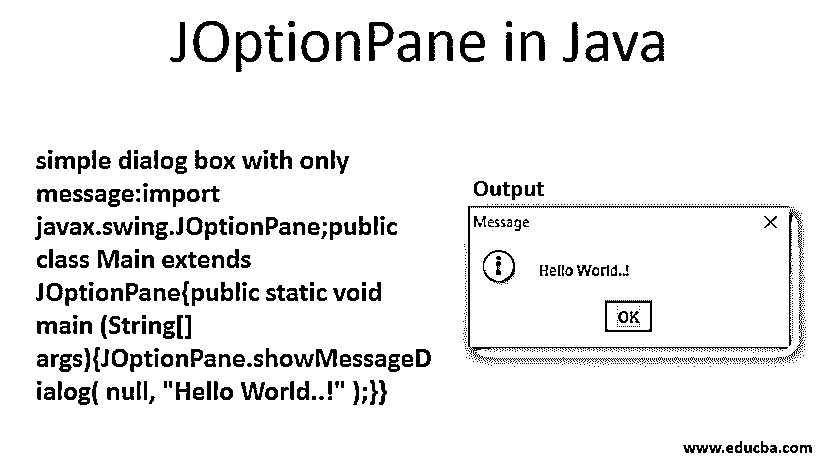

# JOptionPane in Java

> 原文：<https://www.educba.com/joptionpane-in-java/>




## Java 中的 JOptionPane 简介

JOptionPane 是一个用于提供标准对话框的类。它是 Java Swing 的一部分，用于创建基于窗口的应用程序。JOptionPane 是 Java Swing 的一个组件，专门处理对话框。对话框可以是任何类型，如确认对话框、消息对话框或输入对话框。这些对话框可用于向用户显示信息或获取用户的输入。

**语法:**

<small>网页开发、编程语言、软件测试&其他</small>

```
public class JOptionPane extends JComponent implements Accessible
```

JComponent 是 [Swing 组件](https://www.educba.com/swing-components-in-java/)的基类，Accessible 是 accessibility 包的主接口。它们都提供了支持 swing 架构所需的标准机制。

### JOptionPane 构造函数

下面是如下的构造函数:

*   **JOptionPane():** 创建一个带有默认文本消息的 JOptionPane 实例。
*   **JOptionPane(Object message，int messageType):** 创建一个 JOptionPane 的对象，该对象将显示一条消息，该消息具有指定的消息类型和用户界面提供的默认选项。
*   **JOptionPane(Object message):**它创建了一个 JOptionPane 的对象，该对象将显示一条消息，消息类型为普通消息，默认选项由用户界面提供。
*   **JOptionPane(Object message，int messageType，int option type):** 它创建一个 JOptionPane 的实例，该实例将显示一个具有指定消息类型和选项的消息。
*   **JOptionPane(Object message，int messageType，int optionType，Icon icon):** 显示指定消息类型、选项类型和图标的消息。

### Java 中 JOptionPane 的方法

虽然 JOptionPane 类中有大量方法，但它们都符合 showXxxDialog 的格式，如下所示:

*   **showInputDialog:** 提示用户进行一些输入。
*   **showMessageDialog:** 向用户显示带有消息的对话框。
*   **显示确认对话框:**询问用户确认问题，如是/否/取消。
*   **showOptionDialog:** 以上三者的组合。

所有这些方法也有 showInternalXXX 风格，它将使用一个内部框架来保存对话框。下面是 JOptionPane 类中常用的方法:

|  **Sr 号** | **方法&描述** |
| 1. | **JDialog****create dialog****(****String****title):**此方法用于创建一个无父 JDialog 的新实例，在参数中提供标题。JDialog 是创建对话窗口的主要类。 |
| 2. | **JDialog****create dialog****(****Component****parent Component，****String****title):**该方法用于使用参数中提供的标题创建一个新的 JDialog 实例，该方法还为我们正在创建的对话框提供父组件。JDialog 以 parent component 框架中提供的父组件为中心。 |
| 3. | **静态 void showMessageDialog(** **组件** **parentComponent，** **对象** **message):** 该方法弹出一个信息消息对话框，标题为“消息”。默认情况下，标题是“消息”。它还有我们可以传递的父组件。对话框将以此父组件为中心。参见下面的示例 1。 |
| 4. | **static void showMessageDialog(****Component****parent Component，** **Object** **message，** **String** **title，int messageType):** 该方法将显示带有附加可定制参数的信息消息。它允许我们指定对话框的标题并选择显示的消息类型。消息的选项类型将自动选择对话框上的显示图标。参见下面的示例 2。 |
| 5. | **静态字符串显示 InputDialog(组件父组件，对象消息):**该方法会弹出一个问题-消息对话框，指定消息。这里，我们也有通过父组件的规定。这个方法将返回用户提供的输入。我们可以将相同的输入进一步用于业务逻辑。参见下面的示例 3。 |
| 6. | **static int showconfirm dialog(Component parent Component，Object message):** 该方法会弹出一个确认消息对话框，有是、否、取消三个选项。每个选项分别代表一个整数值 0、1 和 2。这里有两个参数，一个是父组件，另一个是要显示的消息。然后，该方法将根据用户选择的选项返回适当的整数值。见下面的例子 4。 |
|  Seven | **showOptionDialog****(****Component****parent Component，** **Object** **message，** **String** **title，int optionType，int messageType，** **Icon** **icon，** **Object** **【选项，****Object****initial value):**在这里，开发人员可以灵活地传递参数，如父组件、消息、对话框标题、选项类型、消息类型、图标。初始值表示对话框中选项的默认选择。 |

JOptionPane 类中几乎所有的方法都是静态方法。大多数情况下，我们会直接访问它们，而不需要创建 JOptionPane 的实例。

### Java 中的 JOptionpane 示例

下面是下面的例子:

#### 1.showMessageDialog()

**代码:**

只有消息的简单对话框:

```
import javax.swing.JOptionPane;
public class Main extends JOptionPane
{
public static void main (String[] args)
{
JOptionPane.showMessageDialog( null, "Hello World..!" );
}
}
```

这里，父组件作为 null 传递，这意味着对话框没有父组件，字符串参数是文本消息，它将作为信息显示在对话框上给用户。

**输出:**


#### 2.showMessageDialog()

与示例 1 相同，但增加了标题和消息类型作为参数:

**代码:**

```
import javax.swing.JOptionPane;
public class JOptionPaneExample
{
public static void main( String[] args )
{
JOptionPane.showMessageDialog( null, "Something Went Wrong.." , "Error as Title",
JOptionPane.ERROR_MESSAGE );
}
}
```

**输出:**


#### 3.showInputDialog()

接受用户的输入并显示在对话框上。

**代码:**

```
import javax.swing.JOptionPane;
public class JOptionPaneExample extends JOptionPane
{
public static void main( String[] args )
{
String name = JOptionPane.showInputDialog( "Provide User Name:" );
JOptionPane.showMessageDialog(null, name);
}
}
```

**输出:**


#### 4.showConfirmDialog()

**代码:**

```
package swing.demo.dialogBox;
import javax.swing.JOptionPane;
public class JOptionPaneExample
{
public static void main( String[] args )
{
int input = JOptionPane.*showConfirmDialog*(null, "Are you Sure?");
// 0=yes, 1=no, 2=cancel
System.*out*.println(input);
}
}
```

**输出:**


### 结论

在基于 windows 的应用程序中，Java Swing 使得开发它们变得非常容易，并且它是一个非常强大的 API。JOptionPane 作为它的一部分，以一种简单的方式简化了对话框的创建。它提供了标准对话框，如输入对话框、确认对话框和消息对话框。我们也可以创建自己的自定义对话框。由于 JOptionPane 提供了标准的对话框，所以非常有用。

### 推荐文章

这是 Java 中 JOptionPane 的使用指南。这里我们讨论 java 中 JOptionPane 的构造函数、方法和例子。您也可以浏览我们的其他相关文章，了解更多信息——

1.  [Java 中的 JTextField](https://www.educba.com/jtextfield-in-java/)
2.  [Java 中的 jscrollpand](https://www.educba.com/jscrollpane-in-java/)
3.  [Java 中的 JDialog](https://www.educba.com/jdialog-in-java/)
4.  [Java 中的 JComboBox](https://www.educba.com/jcombobox-in-java/)


