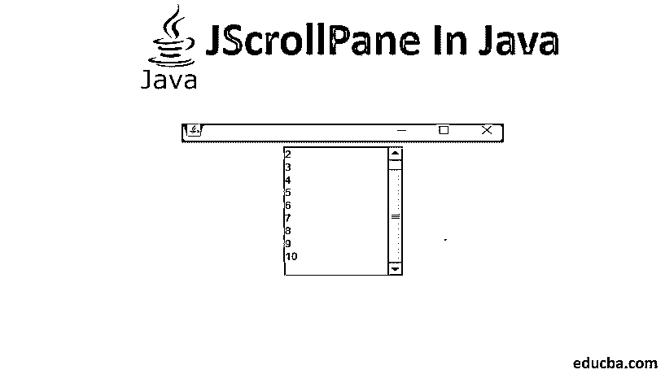
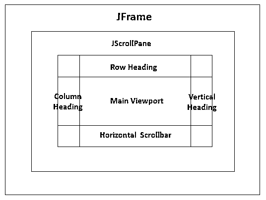
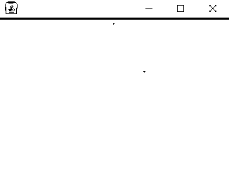
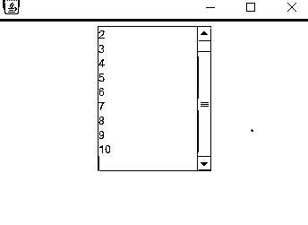
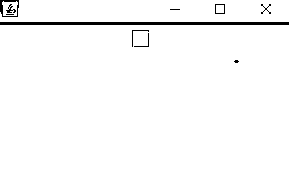
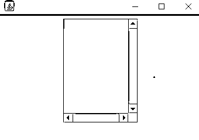
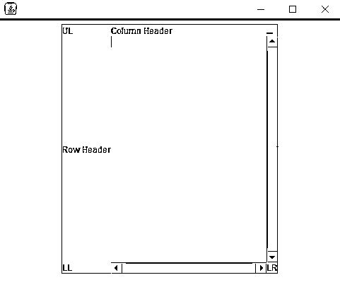
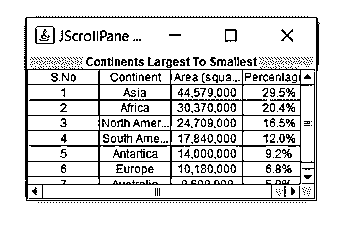

# JScrollPane in Java

> 原文：<https://www.educba.com/jscrollpane-in-java/>




## Java 中的 JScrollPane 概述

JScrollPane 用于为组件提供一个可滚动的视图。当屏幕尺寸很小或有限时，我们可以使用滚动窗格来展示一个大组件或一个尺寸动态变化的组件。该组件应该是轻量级的，如图像，表格，文本，文本区等。JScrollPane 组件应该像 JFrame 或 JPanel 一样在容器内部。它是图形编程中的一个重要组成部分，尤其是你需要处理和显示大量数据的时候。在这个主题中，我们将学习 Java 中的 JScrollPane。当我们的屏幕尺寸有限时，我们需要在以下两种情况下使用滚动窗格:

1.  显示大型组件。
2.  显示大小可动态变化的组件。

JScrollPane 类是视口和滚动条的组合。它将把我们的视窗和滚动条连接起来。我们可以通过使用滚动条显示策略属性[来控制滚动条的外观:verticalScrollbarPolicy 和 horizontalScrollbarPolicy。](https://www.educba.com/scrollbar-color/)

<small>网页开发、编程语言、软件测试&其他</small>

这两个属性的值可以是“按需”、“总是”或“从不”。它还有两个附加视口:

1.  **行标题—**用于水平滚动
2.  **列标题—**用于垂直滚动




### 构造器

这个类的构造函数的唯一目的是创建一个滚动窗格。它的维数受到这些构造函数的输入值(即参数)的影响。JscrollPane 类的构造函数有参数化和非参数化两种类型，进一步分类如下:

#### 1.JScrollPane()

创建一个空的滚动窗格(无视窗)。需要时，它可以有垂直和水平滚动条。

**举例:**

```
import java.awt.*;
import javax.swing.BorderFactory;
import javax.swing.JFrame;
import javax.swing.JPanel;
import javax.swing.JScrollPane;
import javax.swing.JTextArea;
public class Jscrollpane {
public static void main(String[] args) {
JFrame frame = new JFrame();
frame.setDefaultCloseOperation(JFrame.EXIT_ON_CLOSE);
JPanel panel = new JPanel();
panel.setLayout(new FlowLayout());
JScrollPane scrollPane = new JScrollPane();
panel.add(scrollPane);
frame.setContentPane(panel);
frame.setSize(500, 500);
frame.setLocationByPlatform(true);
frame.setVisible(true);
}
}
```

**输出:**




#### 2.JscrollPane(组件 c)

用指定的组件创建滚动窗格。当组件内容大于视图时，会出现水平和垂直滚动条。

**举例:**

```
import java.awt.*;
import javax.swing.JFrame;
import javax.swing.JPanel;
import javax.swing.JScrollPane;
import javax.swing.JTextArea;
public class Jscrollpane {
public static void main(String[] args) {
JFrame frame = new JFrame();
frame.setDefaultCloseOperation(JFrame.EXIT_ON_CLOSE);
JPanel panel = new JPanel();
panel.setLayout(new FlowLayout());
JTextArea tArea = new JTextArea(10,10);
JScrollPane scrollPane = new JScrollPane(tArea);
panel.add(scrollPane);
frame.setContentPane(panel);
frame.setSize(500, 500);
frame.setLocationByPlatform(true);
frame.setVisible(true);
}
}
```

**输出:**




#### 3.jscrollpan(int vspolicy、int hsPolicy)

使用指定的滚动策略创建滚动窗格。

**举例:**

```
import java.awt.*;
import javax.swing.JFrame;
import javax.swing.JPanel;
import javax.swing.JScrollPane;
import javax.swing.JTextArea;
public class Jscrollpane {
public static void main(String[] args) {
JFrame frame = new JFrame();
frame.setDefaultCloseOperation(JFrame.EXIT_ON_CLOSE);
JPanel panel = new JPanel();
panel.setLayout(new FlowLayout());
JScrollPane scrollPane = new JScrollPane(JScrollPane.VERTICAL_SCROLLBAR_ALWAYS,JScrollPane.HORIZONTAL_SCROLLBAR_ALWAYS);
panel.add(scrollPane);
frame.setContentPane(panel);
frame.setSize(500, 500);
frame.setLocationByPlatform(true);
frame.setVisible(true);
}
}
```

**输出:**




#### 4.JScrollPane(组件 c，int vsPolicy，int hsPolicy)

用指定的组件创建滚动窗格。组件位置由一对滚动条控制。

**举例:**

```
import java.awt.*;
import javax.swing.JFrame;
import javax.swing.JPanel;
import javax.swing.JScrollPane;
import javax.swing.JTextArea;
public class Jscrollpane {
public static void main(String[] args) {
JFrame frame = new JFrame();
frame.setDefaultCloseOperation(JFrame.EXIT_ON_CLOSE);
JPanel panel = new JPanel();
panel.setLayout(new FlowLayout());
JTextArea tArea = new JTextArea(10,10);
JScrollPane scrollPane = new JScrollPane(tArea,JScrollPane.VERTICAL_SCROLLBAR_ALWAYS,JScrollPane.HORIZONTAL_SCROLLBAR_ALWAYS);
panel.add(scrollPane);
frame.setContentPane(panel);
frame.setSize(500, 500);
frame.setLocationByPlatform(true);
frame.setVisible(true);
}
}
```

**输出:**




### JscrollPane 类中的方法

下面是 JscrollPane 类中的方法。

1.  **setColumnHeaderView(Component)–**为参数中指定组件的滚动窗格设置列标题。
2.  **setRowHeaderView(Component)–**它为参数中指定组件的滚动窗格设置行标题。
3.  **setCorner(字符串键，组件)–**为参数中指定的组件设置滚动窗格的角度。String key 参数与下面的一起:
    JScrollPane。左上角，JScrollPane。右上角，JScrollPane。左下角，JScrollPane。右下角，JScrollPane。LOWER_LEADING_CORNER，JScrollPane。LOWER_TRAILING_CORNER，JScrollPane。UPPER_LEADING_CORNER，JScrollPane。上 _ 尾 _ 角
4.  **get corner(Component)–**获取参数中指定组件的滚动窗格的角。

### Java 中 JScrollPane 的示例

下面是一些例子。

#### 1.JscrollPane 的示例程序

**代码:**

```
import java.awt.*;
import javax.swing.JFrame;
import javax.swing.JLabel;
import javax.swing.JPanel;
import javax.swing.JScrollPane;
import javax.swing.JTextArea;
public class Jscrollpane {
public static void main(String[] args) {
JFrame frame = new JFrame();
frame.setDefaultCloseOperation(JFrame.EXIT_ON_CLOSE);
JPanel panel = new JPanel();
panel.setLayout(new FlowLayout());
JTextArea tArea = new JTextArea(20,20);
JLabel labelColumn = new JLabel("Column Header");
JLabel labelRow = new JLabel("Row Header");
JLabel label1 = new JLabel("UL");
JLabel label2 = new JLabel("UR");
JLabel label3 = new JLabel("LL");
JLabel label4 = new JLabel("LR");
JScrollPane scrollPane = new JScrollPane(tArea);
scrollPane.setHorizontalScrollBarPolicy(JScrollPane.HORIZONTAL_SCROLLBAR_ALWAYS);
scrollPane.setVerticalScrollBarPolicy(JScrollPane.VERTICAL_SCROLLBAR_ALWAYS);
scrollPane.setColumnHeaderView(labelColumn);
scrollPane.setRowHeaderView(labelRow);
scrollPane.setCorner(JScrollPane.UPPER_LEFT_CORNER ,label1);
scrollPane.setCorner(JScrollPane.UPPER_RIGHT_CORNER ,label2);
scrollPane.setCorner(JScrollPane.LOWER_LEFT_CORNER ,label3);
scrollPane.setCorner(JScrollPane.LOWER_RIGHT_CORNER ,label4);
panel.add(scrollPane);
frame.setContentPane(panel);
frame.setSize(500, 500);
frame.setLocationByPlatform(true);
frame.setVisible(true);
}
}
```

**输出:**




#### 2.带有 JScrollPane 的 JTable 示例

**代码:**

```
import javax.swing.*;
import java.awt.*;
import <u>j</u>avax.swing.table.TableModel;
import javax.swing.table.DefaultTableModel;
import javax.swing.table.DefaultTableCellRenderer;
public class JScrollDemo {
public static void main(String[]  args) {
{
String[] index = new String[] { "S.No", "Continent", "Area (square.km)",
"Percentage Total Mass"  };
JFrame frame = new JFrame("JScrollPane with JTable");
JLabel label = new JLabel("Continents Largest To Smallest", JLabel.CENTER);
Object[][] data = new Object[][] {
{ "S.No", "Continent", "Area (square.km)",  "Percentage Total Mass"  }
{ "1", "Asia", "44,579,000", "29.5%" },
{ "2", "Africa", "30,370,000", "20.4%" },
{ "3", "North America", "24,709,000", "16.5%" },
{ "4", "South America", "17,840,000", "12.0%" },
{ "5", "Antartica", "14,000,000", "9.2%" },
{ "6", "Europe", "10,180,000", "6.8%" },
{ "7", "Australia", "8,600,000", "5.9%" }, };
// creating a DeFaultTableModel object, which is subclass of
// TableModel
DefaultTableModel TableModel = new DefaultTableModel(data, index);
// Initializing a JTable from DefaultTableModel.
JTable table = new JTable(TableModel);
// Adjusting the contents of each cell of JTable in CENTER
DefaultTableCellRenderer tableCellRenderer = new DefaultTableCellRenderer();
// Aligning the table data centrally.
tableCellRenderer.setHorizontalAlignment(JLabel.CENTER);
table.setDefaultRenderer(Object.class, tableCellRenderer);
// Creating a JPanel, setting it layout to BorderLayout and adding
// JTable to it.
JPanel panel = new JPanel(new BorderLayout());
panel.add(table, BorderLayout.CENTER);
// Creating a JScrollPane and adding its functionalities to JPanel
JScrollPane scrollPane = new JScrollPane(panel);
// Adding a JLabel and JScrollPane to JFrame.
frame.add(label, BorderLayout.NORTH);
frame.add(scrollPane, BorderLayout.CENTER);
frame.setSize(320, 200);
frame.setVisible(true);
}
}
}
```

**输出:**




### 结论

当屏幕大小有限时，我们需要使用滚动窗格来显示大型组件或大小可以动态变化的组件。

### 推荐文章

这是一个 Java 中 JScrollPane 的指南。这里我们讨论 Java 中 JScrollPane 的基本概念、构造函数、方法和例子。您也可以看看以下文章，了解更多信息–

1.  [Java 中的 JPanel](https://www.educba.com/jpanel-in-java/)
2.  [Java 中的 JFrame](https://www.educba.com/jframe-in-java/)
3.  [JLabel in Java](https://www.educba.com/jlabel-in-java/)
4.  [Java 中的流程布局](https://www.educba.com/flowlayout-in-java/)


