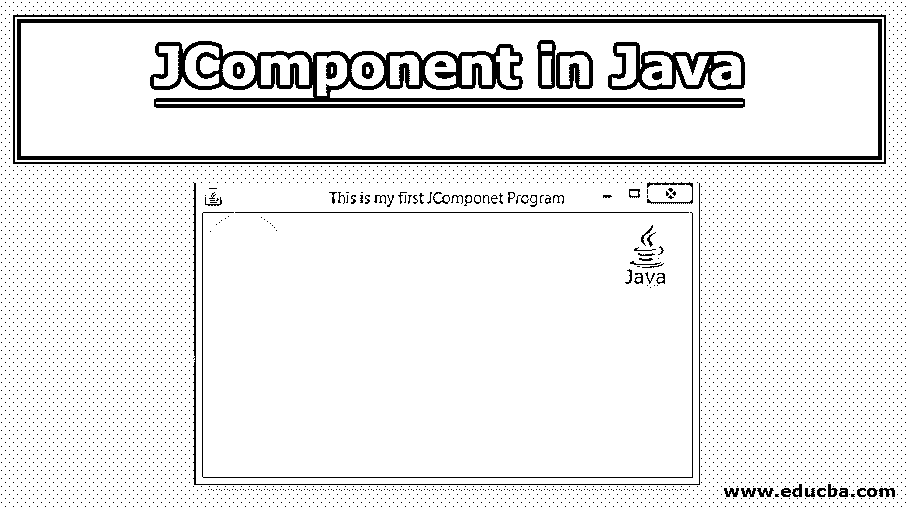
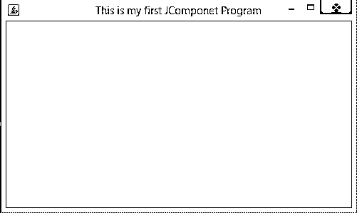

# Java 中的 JComponent

> 原文：<https://www.educba.com/jcomponent-in-java/>




## Java 中的 JComponent 简介

众所周知，几乎所有的 [Swing 组件](https://www.educba.com/swing-components-in-java/)像 JButton、JPanel、JTable 等等。，是 Swing 应用程序开发中使用的基本构建块。它们扩展了 JComponent 类，扩展了容器类，容器类又扩展了 Java 的容器类。Swing 组件在扩展容器类时也自带 AWT 功能。这样，就遵循了 Swing 类的层次结构。像 JDialog 和 JFrame 这样的顶级组件不继承 JComponent，因为它们是顶级容器的子级。

**语法:**

<small>网页开发、编程语言、软件测试&其他</small>

Java 中没有 JComponent 的这种语法。任何类都只能继承 JComponent 的一个默认构造函数。下面给出的是 JComponent 的基本声明:

```
public abstract class JComponent
extends Container
implements Serializable
```

**JContainer 的使用方式如下:**

```
public class Myclass extends JComponent{
public void method()
{ }
}
```

### Java 中用于 JComponent 的类型和修饰符

下表显示了 Java 中用于 JComponent 的类型和修饰符:

| **修饰符或类型** | **字段** | **描述** |
| 静态字符串 | 工具 _ 提示 _ 文本 _ 关键字 | 它也称为“值提示”、“浮动标签”，用于在光标位于组件上时显示 |
| 静态 int | 未定义 _ 条件 | 一些 API 基本上使用这个常量，以便提到没有指定/定义条件的情况 |
| 静态 int | 聚焦时 | 这个常量意味着当组件获得焦点时应该调用命令，并且基本上用于 registerKeyboardAction |
| 静态 int | 当 _ 祖先 _OF_FOCUSED_COMPONENT | 这个常数用于聚焦分量的情况。它用于 registerKeyboardAction，这意味着当它本身是一个焦点组件或者接收组件是焦点组件的祖先时，将调用该命令。 |
| 静态 int | 当焦点在窗口中时 | 该常量通常用于 registerKeyboardAction。如果接收组件出现在当前聚焦的窗口上或者本身就是聚焦的组件，将调用该命令。 |
| 受保护组件 UI | 用户界面 | 这个组件是外观和感觉的代表 |
| 受保护的事件列表 | 听众列表 | 这个组件类用于保存事件侦听器的完整列表。 |
| 受保护的可访问上下文 | 可访问上下文 | AccessibleContext 与这个 JComponent 相关联。 |

### Java 中 JComponent 的方法

下面给出了 Java 中 JComponent 的一些最常用的方法:

| **方法名** | **修改器类型** | **描述** |
| 设置背景(彩色背景) | 空的 | 此方法用于设置该组件的背景 |
| 设置前景(彩色 fg) | 空的 | 该方法用于设置该组件的前景 |
| setMaximumSize(Dimension maxSize) | 空的 | 此方法用于将此组件的最大尺寸设置为给定的最大尺寸值。 |
| setMinimumSize(尺寸最小化) | 空的 | 此方法用于将此组件的最小大小设置为给定的值。 |
| addAncestorListener(AncestorListener listener) | 空的 | 此方法用于添加一个 AncestorListener，以便当它的任何祖先被移动或变得可见/不可见时，它将接收所有的 AncestorEvents |
| firePropertyChange(字符串属性名，布尔旧值，布尔新值) | 布尔型 | 此方法用于报告布尔属性的绑定属性更改 |
| getAccessibleContext() | 可访问上下文 | 该方法用于获取与 JComponent 相关联的可访问上下文。 |
| getAncestorListeners() | AncestorListener[] | 该方法用于返回向该组件注册的所有祖先侦听器的数组。 |
| getToolTipText() | 线 | 此方法用于返回工具提示的字符串，该字符串由 setToolTipText()方法设置 |
| getWidth() | （同 Internationalorganizations）国际组织 | 此方法用于获取组件的当前宽度。 |
| getTopLevelAncestor() | 容器 | 该方法返回该组件的顶级祖先。如果组件尚未添加到任何容器中，它将返回 null。 |
| isRequestFocusEnabled() | 布尔型 | 如果这个 Jcomponent 应该获得焦点，这个方法返回 true，否则返回 false。 |
| 进程鼠标事件(鼠标事件 e) | 受保护的空隙 | 此方法通过将鼠标事件分派给任何已注册的 MouseListener 对象来处理在此组件上发生的任何鼠标事件。 |
| isLightweightComponent(组件 c) | 静态布尔 | 如果该组件是轻量级组件，则该方法返回 true，否则返回 false。 |
| getActionForKeyStroke(击键，击键) | 动作监听器 | 这个方法基本上返回一个对象，这个对象将为给定的击键执行一个动作。 |
| getAccessibleContext() | 可访问上下文 | 这个方法用于获取与这个 JComponent 相关联的可访问上下文 |
| getBorder() | 边境 | 该方法返回组件的边框，如果组件没有边框，则返回 null |

### 用 Java 实现 JComponent 的程序:

下面的程序用 Java 实现了 JComponent:

**代码:**

```
import java.awt.BorderLayout;
import java.awt.Color;
import java.awt.Graphics;
import javax.swing.JComponent;
import javax.swing.JFrame;
public class DrawCircle {
public static void main(String[] args) {
new DrawCircle();
}
public DrawCircle() {
// creating a new JFrame using new keyword
JFrame fr = new JFrame("This is my first JComponet Program");
// setting the layout of the above created frame
fr.setLayout(new BorderLayout());
// adding the Circle in the frame
fr.getContentPane().add(new Circle(100,100,20));
// We can also get the background of frame using fr.setBackground(Color.blue)
method
fr.pack();
fr.setLocationRelativeTo(null);
// setting visibility of frame
fr.setVisible(true);
fr.setDefaultCloseOperation(JFrame.EXIT_ON_CLOSE);
// setting the size of frame
fr.setSize(500, 300);
}
}
class Circle extends JComponent
{
private static final long serialVersionUID = 1L;
public Circle() { }
public Circle(int b, int c, int dia)
{
// setting the location of Circle in Frame
super();
this.setLocation(b, c);
this.setSize(dia, dia);
}
@Override
public void paint(Graphics g)
{
super.paint(g);
// setting the color of circle
g.setColor(Color.yellow);
g.fillOval(0, 0, 80, 80);
}
}
```

**Output:** 执行上面的程序会产生下面提到的输出。




### 结论

上面对 JComponent 的描述清楚地解释了 JComponent 是什么，以及 JComponent 中使用的各种方法和修饰符。JComponent 是处理图形时最重要的主题之一。因为 JComponent 使用了许多用于不同目的的方法。所以在使用它们之前，程序员应该彻底理解它们。

### 推荐文章

这是 Java 中 JComponent 的指南。这里我们讨论 Java 中 JComponent 的类型、修改方法和程序实现。您也可以浏览我们的其他相关文章，了解更多信息-

1.  [Java 中的 JTextField](https://www.educba.com/jtextfield-in-java/)
2.  [Java 中的 JDialog](https://www.educba.com/jdialog-in-java/)
3.  [Java 中的 JFrame](https://www.educba.com/jframe-in-java/)
4.  [Java 中的 JTable](https://www.educba.com/jtable-in-java/)


