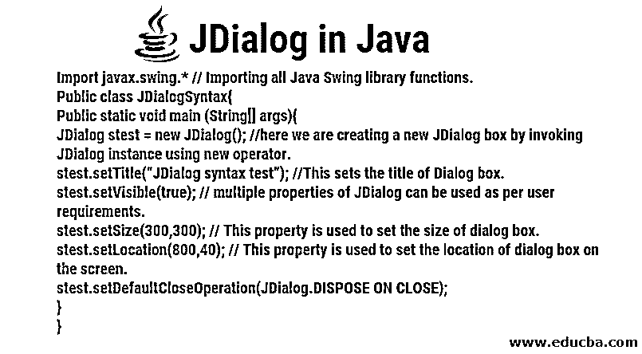

# Java 中的 JDialog

> 原文：<https://www.educba.com/jdialog-in-java/>




## Java 中的 JDialog 简介

Java Swings 是当今的一个时髦词，它包含了几个为桌面应用程序提供交互式 UI(用户界面)的功能。JDialog 控件是 Java Swings 的一部分。这个控件最初是在 JAVA JDK 1.2 引入之后出现的，它在工具包中添加了多个其他控件。

Java Swing 有一个轻量级和重量级容器(主要是轻量级的),这使得它在灵活性和交互性方面比它的前身 Java AWT 更有优势。与 swing 相关的轻量级组件意味着 Swing 代码独立于本机/机器代码运行，而重量级组件依赖于本机代码。轻量级组件使得 Swing 应用程序可移植且快速。

<small>网页开发、编程语言、软件测试&其他</small>

Swing 有 4 个顶级重量级容器。下面提到了它们:

1.  JFrame
2.  JApplet
3.  我的天啊
4.  窗户

这些容器的目的是将所有轻量级组件集中在一个窗口中。JDialog 类是一个通用的对话框，作为一个基础拥有多个轻量级组件。JDialogs 的超类是 java.awt.Dialog，JRootPane 是它的容器，所以提供了一个默认的窗口“关闭”按钮，没有可重新调整大小的按钮。JDialog 类可以总结为 3 个容器的总和:

Windows 常量+根窗格容器 java.awt 中的对话框-> Swings 中的 JDialog

### Java JDialog 的使用

在一些应用中，信息只需要显示“确定”按钮，以便从他那里得到确认(例如，在提交任何考试表格之前显示确认弹出窗口)。)而有些应用程序需要高级功能，如文本编辑器、复选框、单选按钮。使用 JDialogs 可以满足这些要求。

### JDialog 的语法

下面借助一个例子解释 Java 中 JDialog 的语法:这里我们需要从 master 类 Swing 导入 JDialog 类库。可以使用“new”运算符创建 JDialog 的新实例。在本例中，stest 是创建的 JDialog。我们可以为这个新的 JDialog 框分配各种属性。

```
import javax.swing.* // Importing all Java Swing library functions.
public class JDialogSyntax{
public static void main (String[] args){
JDialog stest = new JDialog(); //here we are creating a new JDialog box by invoking JDialog instance using new operator.
stest.setTitle(“JDialog syntax test”); //This sets the title of Dialog box.
stest.setVisible(true); // multiple properties of JDialog can be used as per user requirements.
stest.setSize(300,300); // This property is used to set the size of dialog box.
stest.setLocation(800,40); // This property is used to set the location of dialog box on the screen.
stest.setDefaultCloseOperation(JDialog.DISPOSE ON CLOSE);
}
}
```

JDialog 可以声明为:

```
public class JDialog extends Dialog implements WindowConstants, Accessible, RootPaneContainer
```

### Java JDialog 的构造函数

为了给 JDialog 框分配不同的特征，我们必须调用构造函数。JDialog 的构造函数有三种类型。下面提到了这些:

*   **public JDialog( ):** 在这种类型的构造函数中，我们传递一个空值作为参数。这个构造函数创建一个没有父框架的新对话框，因为没有任何东西作为参数传递给它。
*   **public JDialog(对话框所有者、字符串标题、布尔模态、图形配置 gc):** 这将创建一个新的对话框，带有所有者对话框、对话框标题、模态设置的布尔值(0 或 1)和图形配置设置。
*   **public JDialog(框架所有者、字符串标题、布尔模态、图形配置 gc):** 这将创建一个新的对话框，带有所有者框架、对话框标题、模态设置的布尔值(0 或 1)和图形配置设置。

GraphicsConfiguration 设置允许用户选择当应用程序在多个屏幕上运行时，对话框应该显示在哪个设备上。

### Java JDialog 中的常用方法

JDialog 的一些常用方法解释如下:

*   **public JDialog create Dialog(Component parent Component，String title):** 该方法创建一个新的对话框，其中[包含 JOptionPane](https://www.educba.com/joptionpane-in-java/) 。输入字符串用作对话框的标题。该帧的父帧是作为参数接收的组件。这是所有其他静态方法(如“显示对话框”方法)调用最多的方法之一。
*   **public int showDialog(Component parent Component，String showButtonText):** 该方法用于使对话框可见。该方法根据用户输入的的[返回值为 ACCEPT_OPTION、CANCEL_OPTION 或 ERROR_OPTION。这些分别用于用户接受、取消或关闭对话框。showDialog()可用于创建一个定制的对话框，其输出文本由用户为 OK 按钮指定。](https://www.educba.com/java-user-input/)
*   **public int showOpenDialog(Component parent Component):**我们可以用这个方法在 approve 按钮上打开一个带有 open 的对话框。这些对话框根据父组件进行操作。
*   **public int showSaveDialog(Component parent Component):**我们可以用这个方法打开一个对话框，在 approve 按钮上保存。这些对话框根据父组件进行操作。

### Java JDialog 示例

以下示例是用 Netbeans IDE 8.2 编写的:

```
import java.awt.event.*;
import javax.swing.*;
class test extends JFrame implements ActionListener {
static JFrame frame;
public static void main(String[] args)
{
frame = new JFrame("JFrame");
test t = new test();
JPanel panel = new JPanel();
JButton button = new JButton("click here to see dialog box");
button.addActionListener(t);
panel.add(button);
frame.add(panel);
frame.setSize(400, 400);
frame.show();
}
@Override
public void actionPerformed(ActionEvent e)
{
String s = e.getActionCommand();
if (s.equals("click here to see dialog box")) {
JDialog dialog = new JDialog(frame, "JDialog Box");
JLabel lab = new JLabel("This is a dialog box inside frame..");
dialog.add(lab);
dialog.setSize(300, 300);
dialog.setVisible(true);
}
} }
```

**输出:**


### Java JDialog 的属性

JDialog 也可以是非模型。非模型意味着即使运行 JDialog box，用户也可以与其他应用程序窗口进行交互。没有必要关闭 JDialog，然后访问其他应用程序。

JDialog 具有下列多个属性:

*   defaultCloseOperation
*   你叫什么名字
*   情态的
*   rootPane
*   标题
*   父母

defaultCloseOperation 描述了窗口关闭时对话框的行为。此处列出的 parent 和 title 属性可以根据用户偏好在 JDialog 构造函数中设置。可以在 JDialog 构造函数中将 Modal 属性设置为 yes 或 no。如果我们必须在对话框中包含菜单栏和菜单，可以使用 JMenuBar 属性。

### 结论

JDialog 是 JAVA Swing 的重要特性之一，有助于基于桌面的交互式应用程序。这被用作顶层容器，在其上可以放置多个轻量级的 JAVA swing 组件以形成基于窗口的应用程序。

### 推荐文章

这是 Java 中的 JDialog 指南。在这里，我们以 Java 中的 JDialog 为例，讨论它的用途、语法、结构、属性和常用方法。您也可以阅读以下文章，了解更多信息——

1.  [Java 中的析构函数](https://www.educba.com/destructor-in-java/)
2.  [Java 中的堆排序](https://www.educba.com/heap-sort-in-java/)
3.  [Python 中的堆排序](https://www.educba.com/heap-sort-in-python/)
4.  [JLabel in Java](https://www.educba.com/jlabel-in-java/)


