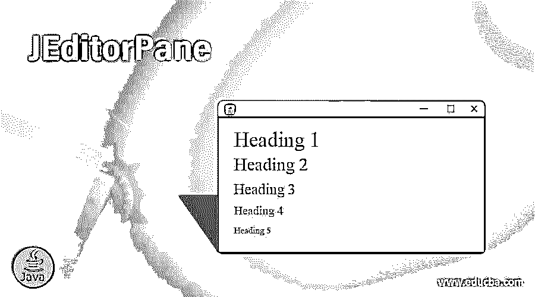
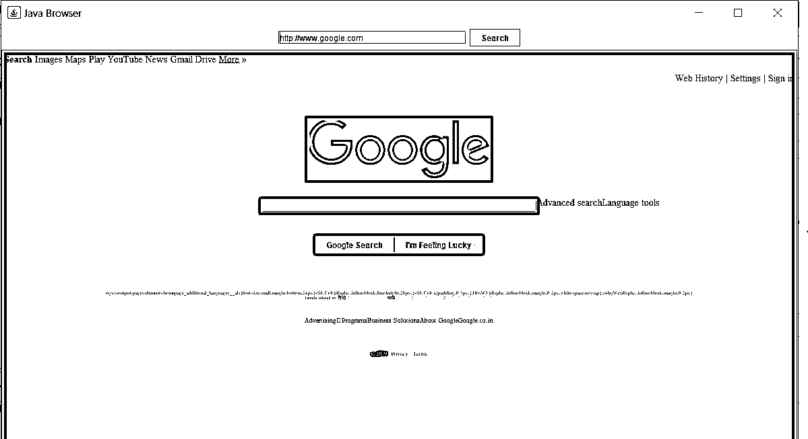

# 杰迪托尔帕内

> 原文：<https://www.educba.com/jeditorpane/>




## JEditorPane 简介

java 中的 JEditorPane 类用于显示文本组件，可以处理不同类型的带有样式的文本。默认情况下，它只能处理 HTML、纯文本和富文本格式(RTF)。JEditorPane 主要用于显示带有有限基本 HTML 标签的 HTML 内容。

为了实现这种行为，该组件使用了 EditorKit 的实现。美妙之处在于，无论提供哪种内容，它都会自动调整到合适的文本编辑器。当前安装的 EditorKit 用于确定编辑器在任何给定时间绑定的内容。例如，如果一个组件的内容被设置为一个新的 URL，那么它的类型被用来确定应该预先安装的 EditorKit 以加载内容。

<small>网页开发、编程语言、软件测试&其他</small>

**语法:**

```
public class JEditorPane extends JTextComponent
```

默认情况下，此类预配置为以下三种类型的内容:

*   **text/plain:** 纯文本，不识别内容时默认的类型。这里使用的工具包是 DefaultEditorKit 的扩展，它将生成一个包装的纯文本视图。
*   **文本/HTML:** HTML 文本。这里使用的工具包是类 javax . swing . text . html . HTML editor kit，它将提供对 HTML(版本。3.2).
*   **文本/RTF:** RTF 文本。这里使用的工具包是类 javax . swing . Text . rtf . rtfeditorkit，它将提供有限的富文本格式支持。

### JEditorPane 的建造者

以下是 JEditorPane 的构造函数:

1.  **JEditorPane( ):** 这种类型的构造函数将简单地创建一个新的 JEditorPane。
2.  **JEditorPane(String URL):** 这种类型的构造函数将基于包含 URL 规范的参数中的字符串创建一个 JEditorPane。
3.  **JEditorPane(URL 初始页面):**这个构造函数将根据输入参数中指定的 URL 创建 JEditorPane。
4.  **JEditorPane( String type，String text ):** 这个构造函数将创建一个 JEditorPane，它已经被初始化为参数中给定的文本。

### jeditorpane 类的一些有用方法

下面是下面的方法:

1.  **void setText(String text):** 该方法将使用输入中给定的指定文本来设置组件的文本，该文本应该与编辑器中的内容类型相同。
2.  **Void getText( ):** 该方法将返回编辑器指定内容类型内的组件文本。
3.  **Void setPage(URL 页面):**该方法将触发 JEditorPane 将指定的 URL 显示为当前页面。
4.  **Void setContentType(字符串类型):**该方法用于设置编辑器可以处理的内容类型。
5.  **Void addHyperlinkListener(hyperlink listener):**该方法将向组件添加一个超链接监听器，当链接或超链接被点击或选择时，该监听器将帮助通知。

### JEditorPane 类的示例

以下是 JEditorPane 的例子:

在这个例子中，我们将使用 java 中的 JEditorPane 创建一个网页阅读器。我们也不能认为它是一个网页浏览器，因为 JEditorPane 只能用来显示 HTML 内容，它不能[显示任何 CSS](https://www.educba.com/what-is-css/) 或任何其他样式的内容，但仍然可以通过该示例访问一些包含 HTML 内容的网页，我们也可以打开保存在本地 PC 上的任何 HTML 文件。

在这里，为了构建一个 web 页面查看器，我们将首先创建一个编辑器窗格来显示 HTML 内容，然后[创建一个 JTextfield](https://www.educba.com/jtextfield-in-java/) 来填充 URL，以及一个 [JButton](https://www.educba.com/jbutton-in-java/) 来搜索 web 上的 URL。向按钮和超链接侦听器添加一个操作，该操作可用于 HTML 页面上的任何超链接。最后，将所有组件添加到面板中，并将面板添加到框架中。设置框架的大小，并将网页设置为只读，这样使用 setEditable 方法将无法进行任何更改。

**代码:**

```
import java.awt.BorderLayout;
import java.awt.event.ActionEvent;
import java.awt.event.ActionListener;
import java.io.IOException;
import javax.swing.JEditorPane;
import javax.swing.JFrame;
import javax.swing.JOptionPane;
import javax.swing.JPanel;
import javax.swing.JScrollPane;
import javax.swing.JTextField;
import java.net.MalformedURLException;// Thrown when a URL doesn't contain http://
import java.net.URL;
import javax.swing.JButton;
import javax.swing.event.HyperlinkEvent;// Provides information on events triggered
import javax.swing.event.HyperlinkListener;// Monitors user activity with links
public class JEditorPaneExample extends JFrame implements HyperlinkListener, ActionListener {
public static void main(String[] args) {
new JEditorPaneExample("http://www.google.com");
}
String defaultURL;
JPanel panel = new JPanel();
JTextField theURL = new JTextField(25);
JButton search = new JButton("Search");
JEditorPane htmlPage;
public JEditorPaneExample(String defaultURL) {
JFrame frame = new JFrame("Java Browser");
frame.setDefaultCloseOperation(JFrame.EXIT_ON_CLOSE);
this.defaultURL = defaultURL;
// If the user interacts with the JButton then actionPerformed method is called
search.addActionListener(this);
// Set the default text in the JTextField
theURL.setText(defaultURL);
// Add the text field to a panel
panel.add(theURL);
panel.add(search);
// Add the panel to the northern quadrant of a frame
frame.add(panel, BorderLayout.NORTH);
try {
htmlPage = new JEditorPane(defaultURL);
// If the user interacts with the JEditorPane actions are triggered.
htmlPage.addHyperlinkListener(this);
// Display webpage in read-only mode
htmlPage.setEditable(false);
JScrollPane scroller = new JScrollPane(htmlPage);
// Add Scroll pane and JEditorPane to the frame
frame.add(scroller, BorderLayout.CENTER);
}
// If something goes wrong with locating the html page this will handle that error
catch (IOException e) {
e.printStackTrace();
}
frame.setSize(1200, 800);
frame.setVisible(true);
}
public void hyperlinkUpdate(HyperlinkEvent e) {
// Checks if the link was clicked
if (e.getEventType() == HyperlinkEvent.EventType.ACTIVATED) {
try {
// Set the URL to be displayed
htmlPage.setPage(e.getURL());
// toExternalForm creates a String representation of the URL
theURL.setText(e.getURL().toExternalForm());
}
catch (IOException e1) {
e1.printStackTrace();
}
}
}
public void actionPerformed(ActionEvent e) {
String pageURL = "";
if (e.getSource() == search) {
pageURL = theURL.getText();
}
else {
pageURL = defaultURL;
// Opens an alert box when there is an error
JOptionPane.showMessageDialog(JEditorPaneExample.this,
"Please Enter a Web Address", "Error",
JOptionPane.ERROR_MESSAGE);
}
try {
// Sets the URL to be displayed
htmlPage.setPage(new URL(pageURL));
theURL.setText(pageURL);
} catch (MalformedURLException e2) {
JOptionPane.showMessageDialog(JEditorPaneExample.this,
"Please use http://", "Error",
JOptionPane.ERROR_MESSAGE);
} catch (IOException e1) {
e1.printStackTrace();
}
}
}
```

**输出:**




### 结论

JEditorPane 类可用于显示普通的 HTML、富文本格式内容或带一点样式的纯文本。JEditorPane 类提供了优于[JTextPane 的优势，用于提供](https://www.educba.com/jtextpane/)文本组件，因为 JEditorPane 类为您提供了从 URL 初始化编辑器窗格的构造函数，而 JTextPane 没有这样的承包商。

### 推荐文章

这是杰迪托尔潘的指南。这里我们讨论 JEditorPane 中的构造函数、方法和例子。您也可以浏览我们的其他相关文章，了解更多信息——

1.  [Java 中的 jscrollpand](https://www.educba.com/jscrollpane-in-java/)
2.  [Java 中的 JTextField](https://www.educba.com/jtextfield-in-java/)
3.  [Java 中的 JPanel](https://www.educba.com/jpanel-in-java/)
4.  [Java 中的 JFrame](https://www.educba.com/jframe-in-java/)


