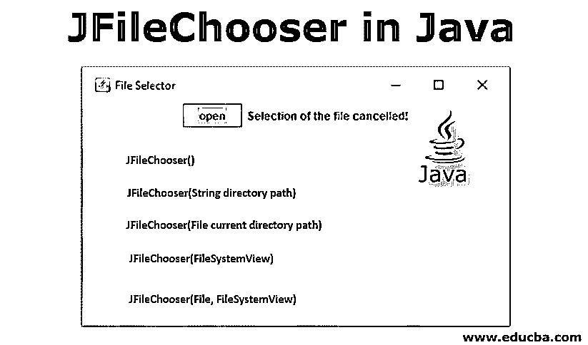
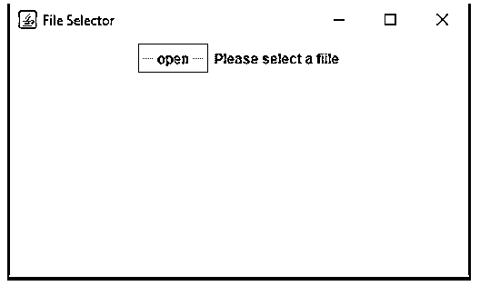
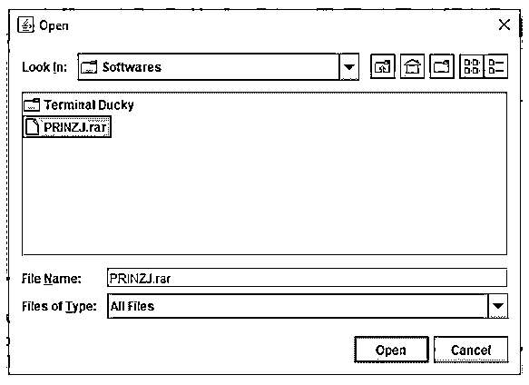
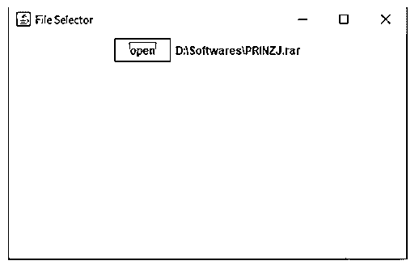
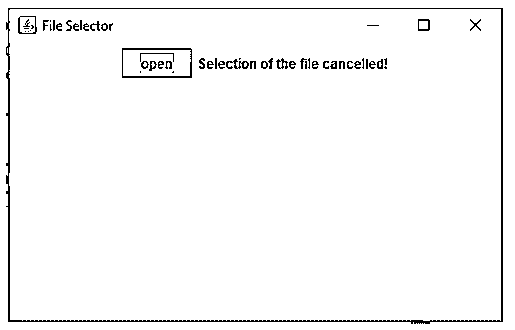
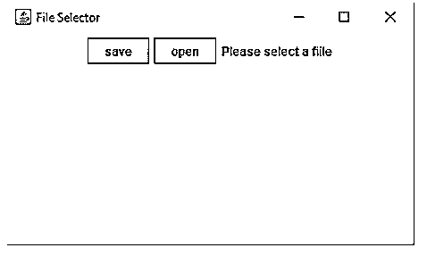
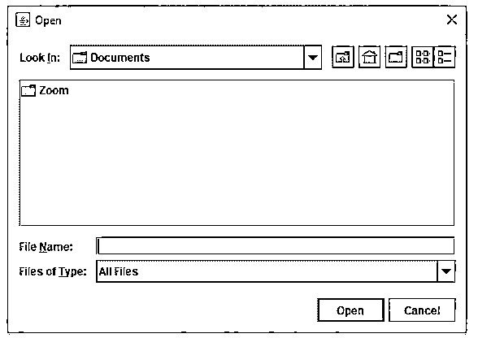
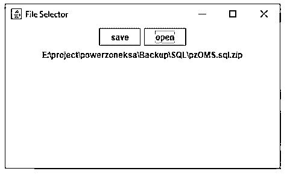
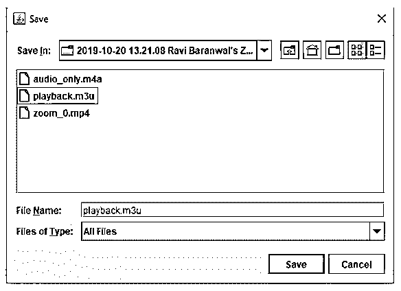

# Java 中的 JFileChooser

> 原文：<https://www.educba.com/jfilechooser-in-java/>




## Java 中的 JFileChooser 简介

JFileChooser 是 Java 中的一个 swing 库类。它用于由用户选择文件、文件夹。它提供了一种选择文件的机制。应用程序用户可以通过这种机制选择和保存文件。使用 JFileChooser 在新窗口对话框中选择文件。JFileChooser 方法的 showOpenDialog()提示用户选择指定路径的文件/文件夹。JFileChooser 继承了 JComponent。JComponent 也是 swing 库的基础级组件。

语法:下面给出的声明显示了 JFileChooser 在程序中的用法。

<small>网页开发、编程语言、软件测试&其他</small>

```
public class JFileChooser
extends JComponent
implements Accessible
```

### Java 中 JFileChooser 的构造函数

JFileChooser 类提供了特定的参数来设置文件选择对话框的属性。

#### 1.JFileChooser()

JFileChooser()构造函数提示选项，通过对话框选择文件/文件夹。该对话框在默认路径下打开。用户可以选择默认路径上的文件或文件夹。

**语法:**

```
JFileChooser jFC = new JFileChooser();
```

#### 2.JFileChooser(字符串目录路径)

带有字符串参数的 JFileChooser()在构造函数中提示选择文件/文件夹的对话框。该对话框在默认路径下打开。用户可以在构造函数参数中给定的指定路径上选择文件或文件夹。

**语法:**

```
JFileChooser jFC = new JFileChooser(String directoryPath);
```

#### 3.JFileChooser(文件当前目录路径)

带有文件参数的 JFileChooser()将提示一个带有指定文件目录路径的对话框。

**语法:**

```
JFileChooser jFC = new JFileChooser(File  currrentDirectoryPath);
```

#### 4.JFileChooser(文件系统视图)

JFileChooser()构造函数，将参数作为 FileSystemView 中的对象，在指定的文件系统视图中提示一个对话框。

**语法:**

```
JFileChooser jFC = new JFileChooser(FileSystemView);
```

#### 5.JFileChooser(文件，文件系统视图)

JFileChooser()构造函数，带有参数文件路径& FileSystemView，如在带有指定文件路径& file-system view 的构造函数提示对话框中所指定。

**语法:**

```
File f = new File("C:\Users\infor\Documents");
JFileChooser JFC = new JFileChooser(f, FileSystemView);
```

在下面给出的构造函数中，我们可以看到 JFileChooser 提示选项是如何根据构造函数的参数选择的。这些参数为程序员提供了限制用户选择文件和文件系统视图的灵活性。

### Java 中 JFileChooser 的优势

使用 JFileChooser 有很多优点，例如:

1.  事件监听器外部的 JFileChooser()声明也可以在事件监听器内部使用。
2.  JFileChooser 返回值，描述文件是否被选中。
3.  给 JFileChooser 的下面的方法提供的参数可以很容易地限制用户选择文件或文件夹或两者。

**语法:**

```
//creating instance of the JFileChooser class
JFileChooser jFC = new JFileChooser();
jFC.setFileSelectionMode(JFileChooser.FILES_ONLY);
jFC.setFileSelectionMode(JFileChooser.DIRECTORIES_ONLY);
jFC.setFileSelectionMode(JFileChooser.FILES_AND_DIRECTORIES);
```

JFileChooser 还提供了一种一次选择多个文件的方法。

**语法:**

```
JFileChooser jfc = new JFileChooser();
//Enables multiple file selection
jfc.setMultiSelectionEnabled(true);
```

### 例子

1.在下面给出的例子中，JFileChooser 类是其中一个类，即用于从指定的路径中选择一个文件。一些其他的类被导入到程序中来处理与事件相关的动作。

**代码:**

```
import java.awt.event.*;
import java.io.*;
import javax.swing.*;
import javax.swing.JFileChooser.*;
class fileSelectExample extends JFrame implements ActionListener {
static JLabel jL;
fileSelectExample(){
}
public static void main(String args[])
{
// This will be title for the frame
JFrame jF = new JFrame("File Selector");
//given width & height will set up the modal width & height
jF.setSize(420, 250);
jF.setVisible(true);
jF.setDefaultCloseOperation(JFrame.EXIT_ON_CLOSE);
//creating object of the current class
fileSelectExample fse = new fileSelectExample();
JButton buttonOpen = new JButton("open");
buttonOpen.addActionListener(fse);
JPanel jP = new JPanel();
jP.add(buttonOpen);
jL = new JLabel("Please select a fiile");
jP.add(jL);
jF.add(jP);
jF.show();
}
public void actionPerformed(ActionEvent ae)
{
String flag = ae.getActionCommand();
if (flag.equals("open")) {
JFileChooser jC = new JFileChooser();
int dialogVal = jC.showOpenDialog(null);
if (dialogVal == JFileChooser.APPROVE_OPTION)
{
jL.setText(jC.getSelectedFile().getAbsolutePath());
}
else{
jL.setText("Selection of the file cancelled!");
}
}
}
}
```

在上面给出的例子中，我们可以看到 JFileSelector 类是如何在程序中使用的。




在上面给出的屏幕截图中，用户给出了选择文件的按钮；一旦用户点击上面的链接，它会提示一个选择文件的选项。如果启用了多重选择，则用户可以一次选择多个文件。下面给出的截图显示了如何打开对话框来选择文件。




一旦用户选择文件并点击“打开”按钮，所选择的文件保持选中状态，如下图所示。




在上面给出的截图中，我们可以看到用户在对话框窗口中选择了如何文件。所选文件具有完整的路径和文件名。




此外，如果用户在没有选择任何文件的情况下点击“打开”按钮并点击对话窗口中的“取消”按钮，则输出将显示消息“文件选择已取消”，如上面的屏幕截图所示。

2.在下面给出的例子中，我们可以看到两个方法 showOpenDialog()和 showSaveDialog()是如何工作的。这些方法是 JFileChooser 类的内置方法。showOpenDialog()方法提示用户选择文件、文件夹的选项，而 showSaveDialog()方法提示对话框通过输入文件/文件夹的名称来保存文件。

**代码:**

```
import java.io.*;
import java.awt.event.*;
import javax.swing.*;
import javax.swing.JFileChooser.*;
class fileSaveExample extends JFrame implements ActionListener {
static JLabel jL;
fileSaveExample(){
}
public static void main(String args[])
{
// This will be title for the frame
JFrame jF = new JFrame("File Selector & Save");
//given width & height will set up the modal width & height
jF.setSize(420, 250);
jF.setVisible(true);
jF.setDefaultCloseOperation(JFrame.EXIT_ON_CLOSE);
//creating object of the current class
fileSaveExample fse = new fileSaveExample();
JButton buttonSave = new JButton("save");
JButton buttonOpen = new JButton("open");
buttonOpen.addActionListener(fse);
buttonSave.addActionListener(fse);
JPanel jP = new JPanel();
jP.add(buttonSave);
jP.add(buttonOpen);
jL = new JLabel("Please select a fiile");
jP.add(jL);
jF.add(jP);
jF.show();
}
public void actionPerformed(ActionEvent ae)
{
String flag = ae.getActionCommand();
if (flag.equals("open")) {
JFileChooser jC = new JFileChooser();
int dialogVal = jC.showOpenDialog(null);
if (dialogVal == JFileChooser.APPROVE_OPTION)
{
jL.setText(jC.getSelectedFile().getAbsolutePath());
}
else{
jL.setText("Selection of the file cancelled!");
}
}
if (flag.equals("save")) {
JFileChooser jC = new JFileChooser();
int dialogVal = jC.showSaveDialog(null);
if (dialogVal == JFileChooser.APPROVE_OPTION)
{
jL.setText(jC.getSelectedFile().getAbsolutePath());
}
else{
jL.setText("Selection of the file cancelled!");
}
}
}
}
```

在上面给出的截图中，我们可以看到如何保存和打开一个按钮是不同于对方的行动。




单击“打开”按钮，系统会提示以下对话框，用户可以在其中选择文件和文件夹




在对话框中选择文件后，一旦用户点击“打开”链接，所选文件将显示在前一个窗口中，如下图所示。




现在转到下一步，当用户点击“保存”选项时，下面的对话框将会打开。




在上面的截图中，我们可以看到一个不同的对话框是如何打开的，并带有相应的打开和保存文件的选项。

### 结论

JfileChooser 是 swing 库提供的用于文件选择选项的类之一。使用 JFileChooser 程序员可以限制用户查看某些类型的文件。JFileChooser 还提供了一些有用的方法来选择文件/文件夹、多文件选择、限制用户访问文件等。JFileChooser 也有一个由用户保存文件的方法。

### 推荐文章

这是 Java 中 JFileChooser 的指南。这里我们讨论 Java 中 JFileChooser 的简介、构造函数以及 Java 中 JFileChooser 的优点，并附有例子。您也可以浏览我们推荐的其他文章，了解更多信息——

1.  [JAVA 中的 Swing 程序](https://www.educba.com/swing-program-in-java/)
2.  [Java 中的 Swing 组件](https://www.educba.com/swing-components-in-java/)
3.  [JLabel in Java](https://www.educba.com/jlabel-in-java/)
4.  [Java 中的 JTree](https://www.educba.com/jtree-in-java/)


