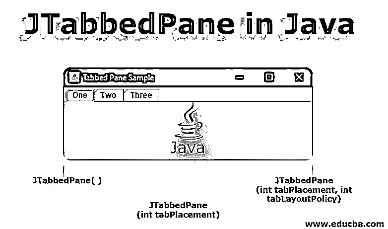
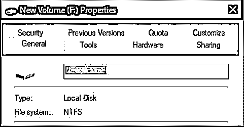
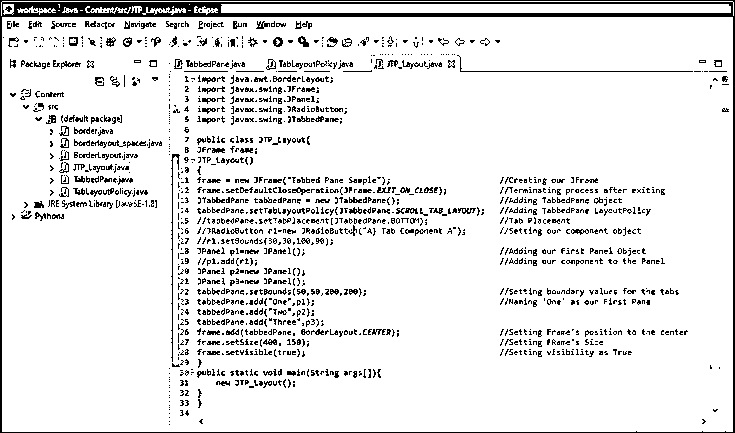
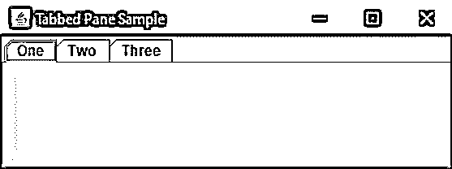
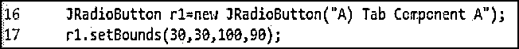
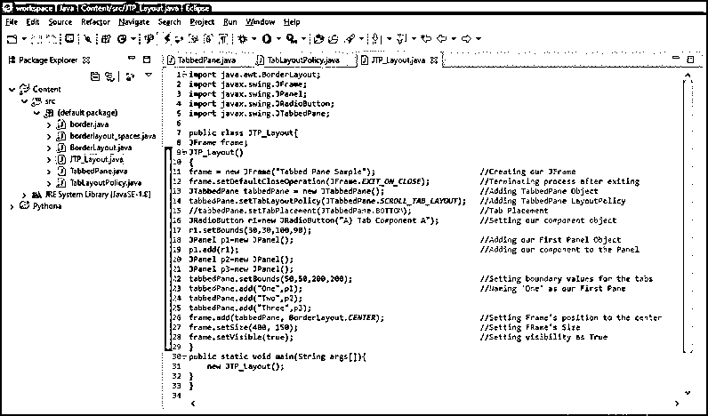
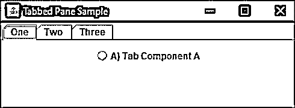
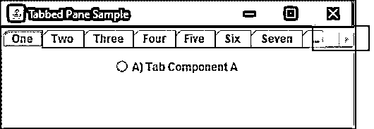
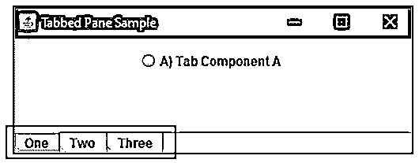

# JTabbedPane in Java

> 原文：<https://www.educba.com/jtabbedpane-in-java/>




## Java 中的 JTabbedPane 简介

JTabbedPane 类是' javax.swing' [java 包为 java swing APIs 提供](https://www.educba.com/java-package-example/)的众多类(如 JButton、JTextArea、JMenu、JTextField 等)中的一个。Java Swing 包是 Java 的基础类 JFCs 的一部分。这些基础类用于创建图形用户界面，即使用可用 GUI 组件的基于窗口的应用程序，这使得程序员更容易开发桌面应用程序。它们完全是在 AWT，抽象 Windows Toolkit 的 java 顶层编写的。

但与 AWT 相反，Java Swing 包提供了平台无关的组件。这些组件的重量也相对较轻。在本文结束时，您将能够将类似 JTabbedPane 的 Swing JComponents 添加到 AWT 容器中。您还可以设置面板和框架的位置。您还将学习如何创建可滚动的选项卡面板。

<small>网页开发、编程语言、软件测试&其他</small>

### 什么是 JTabbedPane？

JTabbedPane 是 java 中 swing 包提供的类之一。它非常有用，因为它为用户提供了在他希望看到的不同组件组之间切换的灵活性，只需点击其中一个选项卡。选项卡可以有不同的标题或图标。

这是这样一个窗口的日常例子，它有几个标签，可以通过点击标签来访问。




你的计算机系统上的本地磁盘的一个简单的“属性”窗口(这里是本地磁盘 F:我的系统上的属性窗口)有多个标签，名为“常规”、“工具”、“硬件”等，你可以通过点击其中一个来访问，这是标签窗格的一个完美例子。

换句话说，JTabbedPane 帮助您让几个组件共享同一个位置。用户可以通过选择或点击所需的选项卡来轻松选择他想要查看的组件。

### JTabbedPane 选项卡索引和放置

选项卡由索引表示，索引是根据添加选项卡的位置决定的。

为了理解这一点，让我们假设您添加了第一个选项卡。那么它的索引将等于“0”，你的下一个标签的索引将等于“1”，按照惯例，你最后添加的标签的索引将等于“标签计数减 1”。

选项卡式窗格类使用单一选择模型，表示“一组选项卡索引”以及“当前选定的索引”，即选定选项卡的索引。

默认情况下，选项卡放在顶部位置，正如您在上面窗口的属性选项卡窗格中看到的。通过使用名为 setTabPlacement 方法的方法，可以将该选项卡的位置更改为任何方向，如左、右或下。

### Java 中的 JTabbedPane 构造函数

在使用 JTabbedPane 时，我们也将使用它的构造函数，这些构造函数根据它们提供的特权而有所不同。

下面列出了使用 JTabbedPane 时常用的构造函数:

#### 1.JTabbedPane()

构造函数 JTabbedPane()创建了一个空的 TabbedPane。当我们使用构造函数 JTabbedPane()时，它会创建一个没有任何放置说明的窗格。因此选项卡被放置在默认位置，即上面使用 JTabbedPane.TOP 讨论过的顶部。

#### 2.JTabbedPane (int tabPlacement)

此构造函数创建一个空的 TabbedPane。它提供了决定窗格方向或位置的特权。当使用 JTabbedPane 指定方向时，放置完成。托普，JTabbedPane。底部，JTabbedPane。左，或 JTabbedPane .右

#### 3.JTabbedPane (int tabPlacement，int tabLayoutPolicy)

使用此构造函数时，会创建一个空的选项卡式窗格。这提供了决定选项卡窗格位置的特权，与 JTabbedPane (int tabPlacement)构造函数相同。

它还让程序员决定选项卡布局策略。这允许程序员控制标签的显示方式。选项卡布局策略被设置为 JTabbedPane。SCROLL_TAB_LAYOUT 或 JTabbedPane。WRAP_TAB_LAYOUT 默认情况下，该策略为 settoWRAP_TAB_LAYOUT。

当策略设置为 SCROLL_TAB_LAYOUT 时，选项卡变得可滚动，并且用于左右或上下滚动选项卡的按钮显示在选项卡式窗格中。

### JTabbedPane 示例

这里，我们详细讨论 Java 中 JTabbedPane 的例子:

最后一些练习，我们开始吗？

这是我们将尝试在 JFrame 中添加选项卡式窗格的部分。我们将使用 javax.swing.JTabbedPane 包为我们提供在框架上添加选项卡的功能。

下面是一个示例代码，使用 JTabbedPane 在我们的框架中创建选项卡。

```
import java.awt.BorderLayout;
import javax.swing.JFrame;
import javax.swing.JPanel;
import javax.swing.JRadioButton;
import javax.swing.JTabbedPane;
public class JTP_Layout
{
JFrame frame;
JTP_Layout()
{
//Creating our JFrame
frame= newJFrame("Tabbed Pane Sample");
//Terminating process after exiting
frame.setDefaultCloseOperation(JFrame.EXIT_ON_CLOSE);
//Adding TabbedPane Object
JTabbedPanetabbedPane = new JTabbedPane();
//Adding TabbedPane LayoutPolicy
tabbedPane.setTabLayoutPolicy(JTabbedPane.SCROLL_TAB_LAYOUT);
//TabPlacement
//tabbedPane.setTabPlacement(JTabbedPane.BOTTOM);
//Setting our componentobject
//JRadioButton r1=new JRadioButton("A) Tab Component A");
//r1.setBounds(30,30,100,90);
//Adding our First Panel Object
JPanel p1=new JPanel();
//Adding our component to the Panel
//p1.add(r1);
JPanel p2=new JPanel();
JPanel p3=new JPanel();
//Setting boundary values for the tabs
tabbedPane.setBounds(50,50,200,200);
//Naming 'One' asour First Pane
tabbedPane.add("One",p1);
tabbedPane.add("Two",p2);
tabbedPane.add("Three",p3);
//Setting Frame'sposition to the center
frame.add(tabbedPane, BorderLayout.CENTER);
//Setting FRame'sSize
frame.setSize(400, 150);
//Setting visibility asTrue
frame.setVisible(true);
}
public static void main(String args[])
{
new JTP_Layout();
}
}
```




When the above program runs, we get the following window as the output.




在上面的例子中，我们在 JFrame 上添加了选项卡，并给选项卡取了不同的名字，如“One”、“Two”等。我们还可以在不同的选项卡下添加不同的组件，使用一个简单的代码行，如下所示。

我们为单选按钮 r1 创建了一个对象，然后这个对象[用于将单选按钮](https://www.educba.com/javafx-radio-button/)添加到面板 1，即 p1。







And the ‘Radio Button’ component will appear under our first panel, where we added it.




### 使用 JTabbedPane 构造函数

我们已经在程序中使用了 JTabbedPane (int tabPlacement)或 JTabbedPane (int tabPlacement，int tabLayoutPolicy)这样的构造函数，但是我们仍然没有看到它的效果。

明白了这一点，我们为自己创建了 Java 类，然后调用我们的构造函数 JTP _ 布局(见代码)。然后，我们使用类的对象将 setTabLayoutPolicy 等参数设置为 SCROLL_TAB_LAYOUT。

如上所述，当 tablayout 策略设置为 SCROLL 时，它允许用户使用按钮向一个方向滚动选项卡。

为了便于说明，我增加了程序中选项卡的数量，并将策略设置为滚动，请看效果:




您可以在右上角看到一个滚动按钮，允许用户使用该按钮从左向右移动。

添加到我们的构造函数中的另一个参数是 setTabPlacement，如上所述，默认情况下它被设置为 TOP。但是我们的构造函数通过将标签位置设置为底部、左侧或右侧来帮助我们决定这一点。

我们的程序中已经有这样的代码离线了，但是加了注释(见代码)，当注释被移除时，就看到效果了。




请注意，当我们使用 tab bepane . set tab placement(JTabbedPane。底部)，我们的标签重新定位到框架的底部。

这里，需要注意的是，不需要任何“错误处理”，我们的 JTabbedPane 对象处理你的鼠标和键盘敲击或事件。但是，如果您想要类似的功能，而不需要选项卡式界面，您可以使用卡片布局来代替选项卡式窗格。

最后，如果用简单的话来说，为了创建我们的选项卡式窗格，实例化 JTabbedPane，然后创建要显示的组件，然后将这些组件添加到您想要的选项卡中。

就这样，很简单，对吧？

### 推荐文章

这是 Java 中 JTabbedPane 的指南。这里我们讨论 JTabbedPane 和 JTabbedPane 构造函数的介绍及其例子。你也可以看看下面的文章来了解更多-

1.  [Java 中的 jscrollpand](https://www.educba.com/jscrollpane-in-java/)
2.  [Java 中的 JComboBox](https://www.educba.com/jcombobox-in-java/)
3.  [Java 中的 JDialog](https://www.educba.com/jdialog-in-java/)
4.  [Java 中的 JFrame](https://www.educba.com/jframe-in-java/)


