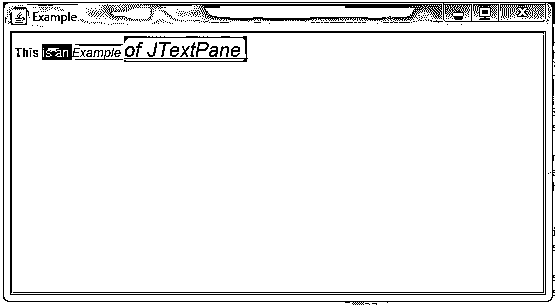

# JTextPane

> 原文：<https://www.educba.com/jtextpane/>


## JTextPane 简介

JTextPane 用于对文档进行样式化和图形化表示，并嵌入了图像和其他组件。它是 JEditorPane 的一个子类，构成了 Java Swing 包提供的文本样式组件的基础。这也可用于添加自定义文本格式，对于无样式文本，使用普通文本区域。JTextPane 使用 StyledDocument 接口作为其模型来使用样式化的文档。文档接口是派生 StyledDocument 接口的父接口。文档接口也是 JTextPane 的默认模型。

### JTextPane 的构造函数

1.  **public JTextPane()** :这个构造函数显示一个新的空白文本区域。这将创建 StyledEditorKit 的新实例，并将文档模型设置为 null。这个构造函数继承自父接口 JEditorPane。
2.  **public JtextPane(styled document doc)**:用这里的关键字 doc 指定的文档模型新建一个 JtextPane。这个构造函数继承自父接口文档。

### JTextPane 的方法

JTextPane 中实现了固定但无数的方法。下面列出了一些主要的方法:

<small>网页开发、编程语言、软件测试&其他</small>

#### 1.风格

此方法可用于将新样式合并到逻辑样式层次结构中。下面是从 Style 派生的一些子方法:

**addStyle:** 这是用来给层次添加一个新的样式[。这里提到的属性是以自下而上的方法解析的，这样赋予子节点的属性将自动覆盖父节点的相同属性。](https://www.educba.com/hierarchy-in-tableau/)

**语法:**

```
public Style addStyle (String str, Style par)
```

str 参数是其集合中唯一样式的名称。当样式未命名时，名称变为空。par 是指定的父样式。addStyle 方法返回新的样式。

**removeStyle:** 用于删除之前添加到文档中的非空样式。

**语法:**

```
public void removedStyle(String str)
```

str 是要移除的样式的名称

**getStyle:** 用于获取之前添加的非空样式名。

**语法:**

```
public Style getStyle (String str)
```

str 是要检索的样式的名称

**setLogicalStyle:** 用于设置从当前插入符号位置开始使用段落的样式。

**语法:**

```
public void setLogicalStyle (Style log)
```

日志是给予段落的逻辑样式

**getLogicalStyle:** 用于在当前插入符号位置检索给定段落集的逻辑样式，并返回样式。

**语法:**

```
public Style getLogicalStyle()
```

#### 2.属性集()

有许多子类用于检索位于插入符号当前位置的字符属性。它们如下:

*   **public attributeset()getCharacterAttributes():**返回当前插入符号位置的属性。
*   **public attributes set getParagraphAttributes():**用于从当前插入符号位置检索当前段落属性。
*   **public attributes set setParagraphAttributes(Attribute ATR，boolean new):** 用于将作为参数传递的属性应用于段落。在选择的情况下，它将属性应用于与此选择相交的段落。并且在没有选择的情况下，它被应用于当前插入符号位置处出现的段落。atr 是传递的属性，如果新参数为真，它首先替换已经存在的属性。
*   **public mutable attributeset getInputAttributes():**用于获取窗格的输入属性。
*   **public void setcharacter attributes(AttributeSet ATR，boolean new):** 用于将传递的属性应用到字符内容。当选择存在时，属性被应用于所选范围，如果选择不存在，则属性被应用于插入的任何新文本。如果为真，则返回现有属性
*   **public attributes set getcharacter attributes():**检索当前插入符号位置或 null 处的字符属性。

#### 3.StyledDocument()

它用于检索与编辑器相关联的模型。

**语法:**

```
public StyledDocument getStyledDocument()
```

#### 4.setDocument

用于将编辑器与应属于 StyledDocument 的文本文档相关联。它覆盖了 JTextComponent 中的 setDocument 类。因此，要求要编辑的文档应该能够转换为 StyledDocument，否则会引发 IllegalArgumentException。

**语法:**

```
public void setDocument(Document new)
```

–new 是要显示或更改的文档。

#### 5.setEditorKit

用于设置当前安装的用于处理内容的套件。这是用于建立编辑器内容类型的属性。它重写了 JEditorPane 类中的 setEditorKit。如果套件不属于 StyledEditorKit，这也会引发 IllegalArgumentException。

**语法:**

```
public final void setEditorKit (EditorKit edit)
```

–编辑是必需的套件行为。

#### 6.paramString

这将返回 JTextPane 的字符串表示。

**语法:**

```
protected String paramString()
```

–此方法主要用于调试，其返回的内容因不同的实现而异。返回的字符串可以为空，但不能为 null。

### 实现 JTextPane 的程序

**代码:**

```
//Importing all the dependancies of Java awt used for GUI purpose
import java.awt.BorderLayout;
import java.awt.Color;
import java.awt.Container;
import java.awt.Font;
//Importing all the dependancies of Java swing package also used for GUI purpose and has many built-in functions
import javax.swing.JFrame;
import javax.swing.JScrollPane;
import javax.swing.JTextPane;
import javax.swing.text.BadLocationException;
import javax.swing.text.Document;
import javax.swing.text.SimpleAttributeSet;
import javax.swing.text.StyleConstants;
public class JTextPaneTest {
//Handling BadLocationException to report such bad locations in the document model
public static void main(String args[]) throws BadLocationException {
//The string name we give here is displayed as the document name
JFrame jfr = new JFrame("Example of JTextPane");
// Makes the application to exit preventing it from running in the background
jfr.setDefaultCloseOperation(JFrame.EXIT_ON_CLOSE);
Container con = jfr.getContentPane();
JTextPane jpan = new JTextPane();
SimpleAttributeSet attrSet = new SimpleAttributeSet();
StyleConstants.setBold(attrSet, true);
// Attributes are set just before adding the text
jpan.setCharacterAttributes(attrSet, true);
jpan.setText("This ");
// Few of the other examples of attributes and features present in JTextPane
attrSet = new SimpleAttributeSet();
StyleConstants.setAlignment(attrSet, 1);
// Required colors can be set from the range of fixed available choices
StyleConstants.setForeground(attrSet, Color.yellow);
StyleConstants.setBackground(attrSet, Color.magenta);
Document doc = jpan.getStyledDocument();
doc.insertString(doc.getLength(), "is an ", attrSet);
attrSet = new SimpleAttributeSet();
StyleConstants.setItalic(attrSet, true);
StyleConstants.setForeground(attrSet, Color.RED);
StyleConstants.setBackground(attrSet, Color.cyan);
doc.insertString(doc.getLength(), "Example ", attrSet);
StyleConstants.setUnderline(attrSet, true);
StyleConstants.setFontSize(attrSet, 20);
doc.insertString(doc.getLength(), "of JTextPane ", attrSet);
// Scroll Pane is used to display a component and to change its size dynamically
JScrollPane scrollPane = new JScrollPane(jpan);
con.add(scrollPane, BorderLayout.CENTER);
jfr.setSize(550, 300);
jfr.setVisible(true);
}
}
```

**输出:**




### 结论

因此，JTextPane 总是在文档需要图形化表示的情况下使用。附加了逻辑样式的段落的所有属性都有默认值，如果它们没有被覆盖，将应用这些默认值。与编辑器窗格相比，JTextPane 的优势在于它有许多易于调用和使用的内置方法。不需要任何 HTML 或 RTF 文件来嵌入图像，因为 JTextPane 类中提供了 API。

### 推荐文章

这是 JTextPane 的指南。这里我们讨论实现 JTextPane 的方法、构造函数和程序，以及语法和输出。您也可以阅读以下文章，了解更多信息——

1.  [Java 中的 JTextField](https://www.educba.com/jtextfield-in-java/)
2.  [Java 中的 JPanel](https://www.educba.com/jpanel-in-java/)
3.  [Java 中的 JButton](https://www.educba.com/jbutton-in-java/)
4.  [JSplitPane](https://www.educba.com/jsplitpane/)


