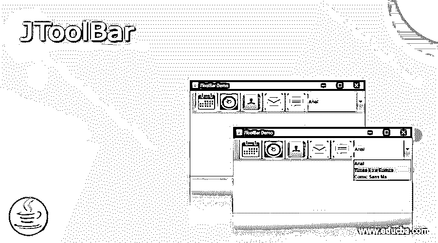
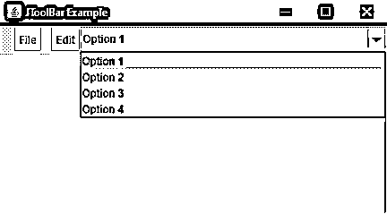
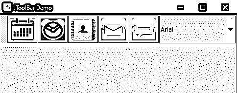
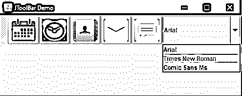

# JToolBar

> 原文：<https://www.educba.com/jtoolbar/>




## JToolBar 简介

在 SWING Package 的许多其他可用组件中，它是另一个添加在顶部的糖。顾名思义，它用于实现支持一组组件的窗口工具栏，例如，下拉菜单、按钮等。它也可以由用户拖动。它允许程序员分组几个组件，像按钮或只是它们的图标，按行或按列。如果您希望显示一个可以向用户提供动作、按钮或控件的组件，这是最好的选择。工具栏通常位于菜单栏之下，充当其他组件的容器，如前面所讨论的按钮、组合框和菜单等。工具栏被添加到框架的顶部，作为用户的选择工具，允许他们更快地访问应用程序的功能。工具栏包含应用程序中常用操作或命令的按钮。

### 如何创建 JToolBar？

让我们讨论一下如何创建 JToolbar:

<small>网页开发、编程语言、软件测试&其他</small>

*   使用 JToolBar 组件，工具栏可以放置在框架或面板的四个边中的任何一个。如上所述，通过将名为“可浮动”的属性设置为 True，可以使工具栏可拖动，并且用户可以将工具栏拖出，放入单独的面板中。
*   在程序中，我们可以使用 JButtons 和 passing 图标作为参数。此外，我们可以为图标添加一个“翻转”属性，当鼠标滑过工具栏时，该属性会改变图标。
*   创建工具栏时，我们使用 Swing 包中的一个名为“JToolBar”的类。这个类支持水平和垂直方向。对于垂直和水平方向，它使用 BoxLayout，这有助于在两个方向上排列组件。可以通过对每个组件使用 setAlignmentY()和 set alignment()来调整对齐。
*   组件的创建，无论是水平的还是垂直的，都是有序的，并且这个顺序在内部使用整数来索引，也就是说，第一个添加的组件由索引 0 来确定，以此类推。

### 用 Java 实现 JToolBar 的程序

下面是一个使用 Swing 包的 JToolBar 类创建的工具栏的简单示例:

#### 示例#1

我们将创建一个简单的工具栏，它有两个按钮和一个组合框，下面有一些选项。参见这个例子的源代码。

**代码:**

```
import java.awt.BorderLayout;
import java.awt.Container;
import javax.swing.JButton;
import javax.swing.JComboBox;
import javax.swing.JFrame;
import javax.swing.JScrollPane;
import javax.swing.JTextArea;
import javax.swing.JToolBar;
public class Java_JToolBar
{
public static void main(final String args[])
{
//creating frame object
JFrame F = new JFrame("JToolBar Example");
//setting exit on close property
F.setDefaultCloseOperation(JFrame.EXIT_ON_CLOSE);
//adding tool bar object
JToolBar TB = new JToolBar();
TB.setRollover(true);
//creating a button with text as File
JButton button = new JButton("File");
//adding our File button
TB.add(button);
//adding a separator
TB.addSeparator();
//adding another button named Edit
TB.add(new JButton("Edit"));
//adding a combo box with three options
TB.add(new JComboBox(new String[]
{"Option 1","Option 2","Option 3","Option 4"}));
Container contentPane = F.getContentPane();
contentPane.add(TB, BorderLayout.NORTH);
JTextArea textArea = new JTextArea();
JScrollPane P = new JScrollPane(textArea);
contentPane.add(P, BorderLayout.EAST);
//setting frame size and frame visibility property
F.setSize(450, 250);
F.setVisible(true);
}
}
```

**输出:**




*   这只是一个简单的程序，让我们给它添加一些有趣的东西。在下一个示例代码中，我们将使用图标而不是文本来显示按钮。
*   在下面的例子中，我们添加了五个通用动作和一个包含子项的组合框。这个程序的输出看起来更加优雅美观。看一看。

**Note:** The comments written after a double forward-slash (**//**).

#### 实施例 2

示例程序的源代码。

**代码:**

```
import javax.swing.*;
import java.awt.*;
class demo
{
//constructor being used
demo()
{
//creating our Frame object
JFrame frame = new JFrame("JToolBar Demo");
//creating out tool bar object
JToolBar toolbar = new JToolBar("Applications");
//adding button icons instead of text
JButton btnCalendar = new JButton(new ImageIcon("simg/Calendar1.png"));
JButton btnClock = new JButton(new ImageIcon("simg/Clock1.png"));
JButton btnContacts = new JButton(new ImageIcon("simg/Contacts1.png"));
JButton btnMail = new JButton(new ImageIcon("simg/Mail1.png"));
JButton btnMessages = new JButton(new ImageIcon("simg/Message1.png"));
//creating combo box object
JComboBox fonts=new JComboBox();
//adding combo box items
fonts.addItem("Arial");
fonts.addItem("Times New Roman");
fonts.addItem("Comic Sans Ms");
//adding combo box and buttons to our tool bar
toolbar.add(btnCalendar);
toolbar.add(btnClock);
toolbar.add(btnContacts);
toolbar.add(btnMail);
toolbar.add(btnMessages);
toolbar.add(fonts);
//setting properties for the Frame
frame.setLayout(new BorderLayout());
frame.getContentPane().add(toolbar, BorderLayout.PAGE_START);
frame.setDefaultCloseOperation(JFrame.EXIT_ON_CLOSE);
frame.setSize(500, 200);
frame.setVisible(true);
}
public static void main(String args[]) throws Exception
{
//calling our class
new demo();
}
}
```

**输出 1:**




**Output 2:**




### 构造器

有几个构造函数与我们的主类 JToolBar 一起使用。除了 JToolBar()默认构造函数之外，以下是也可以使用的其他构造函数:

*   JToolBar (): 这个构造函数创建了一个默认方向的工具栏。它面向水平方向。
*   **JToolBar(int orientation):**这个构造函数用程序员指定的方向创建一个新的工具栏。它将我们的工具栏特别对准程序员提到的那一边。
*   **JToolBar (String name):** 当我们需要为工具栏提供一个特定的名称时，就会用到这个构造函数。因此，此构造函数使用参数创建具有指定标题的工具栏。
*   **JToolBar (String name，int orientation):** 允许程序员使用参数创建具有指定名称或标题的新工具栏的构造函数，以及工具栏的方向，在代码本身中特别提到。

### 常用方法

有几种方法可以与我们的 JToolBar 类结合使用。下面列出了一些突出的例子:

*   **JButton add (Action a):** 这个方法帮助添加一个按钮来初始化一个指定的动作。
*   **void add separator(dimension d):**为了给工具栏中的一组相关组件添加分隔符，我们使用了这个方法，它将一个分隔符附加到工具栏的末尾。分隔符的尺寸由该函数中传递的参数定义。
*   **void addSeparator ()** :这个方法的工作方式类似于 addSeparator(维度 d)。不同之处在于，这里没有明确给出尺寸参数，而是默认给出尺寸。
*   **Component getComponentAtlndex(int index)**:该方法返回程序员使用参数给定的索引处的组件。
*   **int getComponentindex(Component c)**:该方法返回使用参数指定的组件的索引。
*   **void remove(Component c)** :该方法简单地从工具栏中删除使用参数指定的组件。

因此，以上是 setUI()或 getUI()或 setOrientation()等方法，如果需要，它们可以与我们的 JToolBar 类一起使用。

### 结论

我们看到了如何使用 SWING 包的 JToolBar 类创建工具栏。这些工具栏用于显示用户常用的操作或控件。SWING 的 JToolBar 提供了一些组件，允许程序员轻松地完成一些通常需要的动作，比如对齐、定位、字体改变等等。

### 推荐文章

这是一个 JToolBar 的指南。这里我们讨论创建工具栏，代码和输出的例子，构造函数和一些 JToolBar 的方法。您也可以浏览我们的其他相关文章，了解更多信息——

1.  [Java 中的 jscrollpand](https://www.educba.com/jscrollpane-in-java/)
2.  [JavaScript 中的数组方法](https://www.educba.com/arrays-methods-in-javascript/)
3.  [Java 中的 string buffer](https://www.educba.com/stringbuffer-in-java/)
4.  [Java 中的 JFrame](https://www.educba.com/jframe-in-java/)


