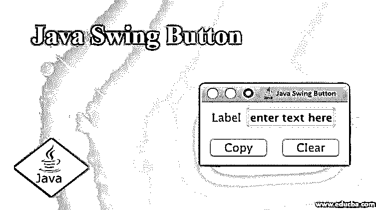
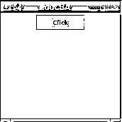
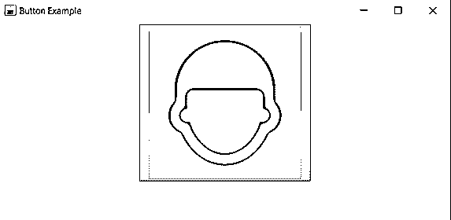

# Java Swing 按钮

> 原文：<https://www.educba.com/java-swing-button/>




## Java Swing 按钮介绍

Button 是一个组件，用户每次单击都会触发 click 事件，相应的方法称为 Java Swing Button。是 java swing 应用中触发事件或动作、提交表单最常用的组件。在 Java 中 button 类使用 JButton 抽象类。这个抽象类 AbstractButton 扩展了 JComponent 类。许多类型的按钮可以通过使用从 AbstractButton 派生的类来实例化。不同类型的按钮是 AbstractButton 的子类，如下所示:

*   **常用按钮:**使用 JButton 类创建，该按钮触发的事件类型为 ActionEvent。
*   **ToggleButton:** 用于在真值或假值之间切换。
*   **CheckBox:** 用于生成一个名为 ItemEvent 的事件。
*   **RadioButton:** 它还用于生成一个名为 ItemEvent 的事件。

如何为 javax.swing.JButton 声明类:

<small>网页开发、编程语言、软件测试&其他</small>

```
class JButton extends AbstractButton implements Accessible{}
```

### Java Swing 按钮的构造函数和方法

这里我们将讨论 java swing button 的构造函数和方法:

#### 构造器

构造函数用于实例化 JButton 类的对象:

*   创建并实例化一个没有设置文本或图标的按钮。
*   **JButton(Event e):** 用提供的事件创建并实例化一个按钮，属性也取自提供的动作。
*   **JButton(String s):** 创建并实例化一个按钮，其文本带有所提供的字符串 s。
*   **JButton(Icon i):** 创建并实例化一个带有图标 I 的按钮。
*   **JButton(String s，Icon i):** 创建并实例化一个按钮，初始文本分别为一个字符串和一个图标。

#### 方法

用于 JButton 的常用方法:

*   **void setText(String s):** 将提供的文本设置为创建的按钮。
*   **String getText():** 获取按钮上的文本。
*   **void setAction(Action a):** 根据提供的动作设置按钮属性。
*   **Action getAction():** 获取与按钮中呈现的动作相关的按钮属性。
*   **void setIcon(Icon i):** 设置按钮未按下时显示的图标或图像。要在按下的按钮上设置图标，使用 void setPressedIcon(图标 I)
*   **Icon getIcon():** 获取按钮未被按下或选择时显示在按钮上的图标。使用 Icon getPressedIcon()从被按下或选中的按钮获取图标。
*   **void addActionListener(action listener a):**添加监听按钮生成的动作事件的对象。
*   **action listener removeActionListener():**删除监听按钮生成的动作事件的对象。
*   **void addActionListener(action listener a):**将 listenes 的对象添加到按钮生成的动作事件中。
*   **action listener removeActionListener():**删除由按钮生成的动作事件的对象。将对象设置为由按钮生成的动作的侦听器。微调 JButton 的外观:
*   **void additem listener(item listener a):**将 listenes 的对象添加到按钮生成的项目事件中。
*   **item listener remove item listener():**删除侦听到按钮生成的项目事件的对象。
*   **void Set selected(boolean):**将按钮设置为选中模式或按下模式。
*   **boolean isSelected():** 获取按钮是否被选中的值 AbstractButton 提供了对齐图标位置和按钮上文本位置的方法
*   **void sethorizontal alignment(int alignment):**设置图标和文本的水平对齐方式。AbstractButton 的默认值是 SwingConstants.CENTER。
    *   摇摆常数。正确
    *   摇摆常数。左边的
    *   摇摆常数。主要的
    *   摇摆常数。蔓延的
*   void setVerticalAlignment(内部对齐):
    *   设置图标和文本的垂直对齐方式。
    *   可以提供的一些其他对齐方式:
    *   SwingConstants.TOP
    *   摇摆常数。底部
    *   摇摆常数。居中(默认)
*   **int gethorizontal alignment():**返回图标和文本的水平对齐方式。
*   **int getvertical alignment():**返回图标和文本的垂直对齐方式。

void setHorizontalTextPosition(int)和 void setVerticalTextPosition(int):用于设置按钮的水平和垂直位置。对于水平方向，位置有:右、左、前导、尾随(默认)、居中。对于垂直，位置有:顶部、中心(默认)和底部。

*   **int getHorizontalTextPosition()和 int getVerticalTextPosition():**用于获取按钮的水平和垂直位置。

### Java Swing 按钮示例

下面是一些例子:

#### 示例 1–简单的 JButton 代码

**代码:**

```
import java.awt.*;
import javax.swing.*;
public class Main {
Main(){
JFrame newFrame=new JFrame("eduCBA");
// Creating Button
JButton b=new JButton("Click");
b.setPreferredSize(new Dimension(100,30));
newFrame.add(b);
newFrame.setSize(250,250);
newFrame.setLayout(new FlowLayout());
newFrame.setVisible(true);
newFrame.setDefaultCloseOperation(JFrame.EXIT_ON_CLOSE);
}
public static void main(String[] args) {
new Main();
}
}
```

**输出:**




#### 示例 2–向按钮添加图像

**代码:**

```
import java.awt.*;
import javax.swing.*;
public class JButtonExample {
public static void main(String[] args) {
JFrame frame=new JFrame("Button Example");
JButton b=new JButton(new ImageIcon("C:\\custom.png"));
frame.add(b);
frame.setSize(500,500);
frame.setLayout(new FlowLayout());
frame.setVisible(true);
}
}
```

**输出:**




### 推荐文章

这是一个 Java Swing 按钮指南。这里我们讨论 java swing 按钮的构造函数和方法，以及不同的例子和代码实现。您也可以阅读以下文章，了解更多信息——

1.  [Java 中的布局管理器](https://www.educba.com/layout-manager-in-java/)
2.  [Java Swing 布局](https://www.educba.com/java-swing-layout/)
3.  [Java ItemListener](https://www.educba.com/java-itemlistener/)
4.  [Java 中的 Swing 组件](https://www.educba.com/swing-components-in-java/)


