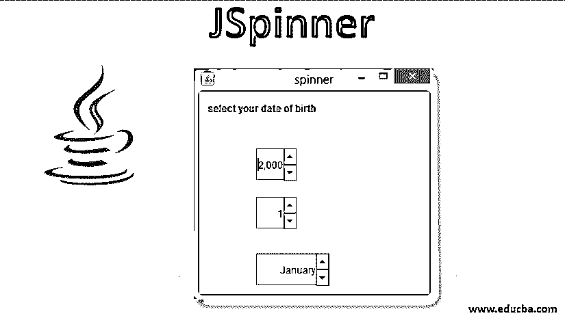
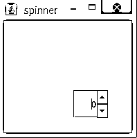
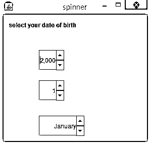

# JSpinner

> 原文：<https://www.educba.com/jspinner/>




## JSpinner 简介

JSpinner 是一个组件，它允许我们从输入字段的有序序列中选择一个可以是对象或数字值的输入。JSpinner 是一个类，可以在 javax.swing 包中找到。就像它的名字暗示的那样，它在向上和向下的方向上旋转它的值；它不包含用于选择输入的下拉列表。它基本上包含向上和向下的箭头。当我们尝试按下箭头时，它会根据我们的要求显示输入。

### JSpinner 的构造函数

JSpinner 包含两个构造函数，工作方式如下:

<small>网页开发、编程语言、软件测试&其他</small>

1.  JSpineer(): 它创建一个空的微调器，默认值设置为零。它是一种没有参数的默认构造函数。
2.  **JSpineer(SpineerModel model):**它以 SprineerModel 为自变量，决定其序列值。

### Jspineer 类的语法

```
public class JSpinner extends JComponent
implements Accessible
```

JSpinner 类扩展了 [JComponent 类](https://www.educba.com/jcomponent-in-java/)并实现了可访问接口。这里，JComponent 是所有 swing 组件的超类。任何名称以“J”开头的类都是 Jcomponent 的子类。Jcomponent 进一步扩展了容器类。这个类为我们提供了向容器添加组件的支持。现在，可访问接口为我们提供了各种类和接口，用于定义辅助技术和可访问应用程序之间的契约。它返回 AccessibleContext 对象的对象，该对象提供关于其他组件的信息。

### jspinner 方法

JSpineer 中提供了不同的方法:

*   **SpineerNumberModel(int value，int max，int min，int step):** 这个方法有四个参数。微调器初始值是在“值”参数中设置的值。现在，我们可以为 spineer 指定一个最大值，即“max”参数，也可以定义一个最小值，即“min”参数，最后一个参数是“step ”,它负责以指定的差值增加或减少 spineer 值。
*   **SpineerListModel(List I):** 用 List 的元素创建一个 spineer 模型对象。它只需要传递一个参数。
*   getPreviousValue(): 这个方法可以说是这个类的一个 getter，用来获取 spinner 的前一个值。
*   **getnextValue():** 这个方法作为一个 getter 来获取 spineer 的下一个值。
*   **setValue(Object v):** 这个方法充当 setter 方法来设置作为参数传递的对象的值。
*   **getValue():** 这也是一个 getter 方法，返回 spineer 的当前值。

### jspinner 的示例

现在让我们来看一些例子。

#### 示例#1

在这个例子中，我们将为初学者创建一个基本的 JSpineer。我们将创建一个简单的 java 类来扩展其中的 JFrame。我们需要创建 JFrame 的对象，这两个类都在 javax.swing 包中。我们可以通过调用带四个参数的 setBounds()方法来设置微调器的边界。然后我们需要通过调用 setLayout()来定义框架的布局。最后，我们需要将我们的 JSpinner 组件添加到 frame 对象中，最后，我们将通过调用 setSize()来定义框架的大小，它将接受两个参数。

下面你可以找到 JSpinner 的例子。

```
import javax.swing.JFrame;
import javax.swing.JSpinner;
public class SpineerDemo extends JFrame {
// frame
static JFrame frame;
// default constructor
SpineerDemo()
{
}
// main class
public static void main(String[] args)
{
// create  a new frame
frame = new JFrame("spinner");
// create a JSpinner
JSpinner spineer = new JSpinner();
// set Bounds for spinner
spineer.setBounds(100, 100, 50, 40);
// set layout for frame
frame.setLayout(null);
// add panel to frame
frame.add(spineer);
// set frame size
frame.setSize(400, 400);
frame.show();
}
}
```

只要运行它作为一个 java 应用程序，一个新的窗口将弹出，其中将包含您的 Jspineer 在框架内。在下面找到附加的输出。




现在，我们可以按下箭头来更改微调器的值。

#### 实施例 2

现在我们将看到另一个从 Jspineer 中选择出生日期的例子。

```
package com.cont.article;
import javax.swing.JFrame;
import javax.swing.JLabel;
import javax.swing.JSpinner;
import javax.swing.SpinnerListModel;
import javax.swing.SpinnerNumberModel;
import javax.swing.event.ChangeEvent;
import javax.swing.event.ChangeListener;
public class DateOfBirthSpinner extends JFrame implements ChangeListener {
// frame
static JFrame frame;
// define label
static JLabel label, label1;
// define spinner
static JSpinner spineer, spineer1, spineer2;
// default constructor for class
DateOfBirthSpinner()
{
}
// main class
public static void main(String[] args)
{
// createing an object of the class
DateOfBirthSpinner sp1 = new DateOfBirthSpinner();
// create  a new frame
frame = new JFrame("spinner");
// create a label
label = new JLabel("select your date of birth");
label1 = new JLabel("1 October 2010");
// create a JSpinner with a minimum, maximum and step value
spineer = new JSpinner();
spineer1 = new JSpinner(new SpinnerNumberModel(1, 1, 31, 1));
// setvalue of year initializing year
spineer.setValue(2000);
// store the months create array
String months[] = { "January", "February", "March",
"April", "May", "June", "July", "August",
"September", "October", "Novemeber", "December" };
// create a JSpinner with list of values
spineer2 = new JSpinner(new SpinnerListModel(months));
// adding change listener to spinner
spineer.addChangeListener(sp1);
spineer1.addChangeListener(sp1);
spineer2.addChangeListener(sp1);
// set Bounds for all three spinner
spineer.setBounds(70, 70, 50, 40);
spineer1.setBounds(70, 130, 50, 40);
spineer2.setBounds(70, 200, 90, 40);
// setbounds for all label
label.setBounds(10, 10, 150, 20);
label1.setBounds(10, 300, 150, 20);
// set layout for frame
frame.setLayout(null);
// add label to frame object
frame.add(label);
frame.add(label1);
frame.add(spineer);
frame.add(spineer1);
frame.add(spineer2);
// add panel to frame object
frame.add(spineer);
// set frame size
frame.setSize(300, 300);
frame.show();
}
// if the state is changed for spinner set value to label
public void stateChanged(ChangeEvent e)
{
label1.setText(spineer1.getValue() + " " + spineer2.getValue() + " " + spineer.getValue());
}
}
```

下面你可以找到上面程序的输出。




这里我们为年、月和日定义了三个微调器。因此，我们将在这里定义三个微调器。

### 结论–JSP inner

JSpinner 可以用在序列或顺序中需要数字或对象类型输入的地方。它可以是增量或减量，并且值的顺序要保持不变。在这种情况下，我们可以选择 JSpineer。

### 推荐文章

这是一本关于 JSpinner 的指南。这里我们讨论 JSpinner 的构造函数、语法和方法，以及不同的例子和代码实现。您也可以阅读以下文章，了解更多信息——

1.  [Java 中的 JTextField](https://www.educba.com/jtextfield-in-java/)
2.  [Java 中的 JDialog](https://www.educba.com/jdialog-in-java/)
3.  [Java 中的 jscrollpand](https://www.educba.com/jscrollpane-in-java/)
4.  [JLabel in Java](https://www.educba.com/jlabel-in-java/)


