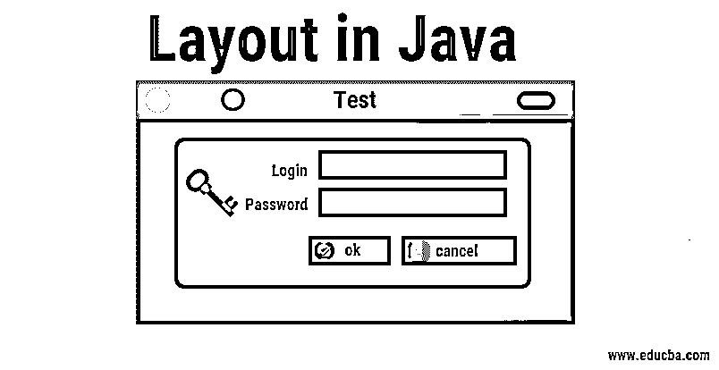

# Java 中的布局

> 原文：<https://www.educba.com/layout-in-java/>

## Java 中的布局介绍

*   在当今世界，尤其是在这个快速发展的 IT 世界，掌握编程语言的知识非常重要，而 Java 是开发领域中使用最广泛的语言之一。虽然 Java 的学习范围很广，但是从概念上理解它还是很容易的。Java 因其 OOPs 概念的引入而闻名，我们现在几乎在所有开发的应用程序中都使用这个概念。类似地，Java 中的 Layouting 是那些重要而有趣的概念之一。
*   如果用外行的话来讲，布局就是部件的零件排列的方式；组件可以是任何东西，从文本到图像等等。让我们举一个页面布局意味着什么的例子；它实际上意味着文本、图像和不同对象在页面上的排列。类似地，在 Java 中，组件在容器内特定位置的排列被称为布局。在 Java 中，容器内组件的布局由布局管理器自动控制。幸运的是，我们在 Java 中有几个[布局管理器，它们根据大小、形状和组件排列模式而各不相同。](https://www.educba.com/layout-manager-in-java/)
*   Java 中的布局概念使我们的任务变得如此简单，因为现在我们不必再做处理这么多具有不同属性的组件的繁琐工作，请记住，如果一个组件的大小发生变化，它也会影响其他组件，两个组件之间的空间也会受到影响。
*   此外，通过硬编码调整容器内组件的大小是非常具有挑战性的，而当涉及到布局时，组件可以通过其布局管理器轻松地调整大小，布局管理器将每个元素放置在其中。布局管理器还确保了可重用性，这意味着中的其他容器可以使用现有的组件结构。
*   让我们来谈谈布局管理器是如何实现的或者它的实际需求是什么。布局管理器广泛用于图形编程。布局管理器是需要由布局管理器类实现的接口。构成图形用户界面(GUI)应用程序结构基础的两个重要容器是 [JPanel](https://www.educba.com/jpanel-in-java/) 和 Content Panes，它们分别属于 FlowLayout 和 [BorderLayout](https://www.educba.com/borderlayout-in-java/) 类。

### 表示各种布局管理器的类

下面提到的是代表各种布局管理器的一些类:

1.  awt。边界布局
2.  awt。流程布局
3.  awt。网格布局
4.  awt。卡片布局
5.  awt。GridBagLayout
6.  摇摆起来。box layout-方块配置
7.  挥棒。群组布局
8.  挥棒。弹簧布局

我们可以看到，java.awt 是一个被多次使用的包，那么它是什么呢，Java AWT 是一个用于开发 windows 应用程序的应用程序编程接口(API ), Java . AWT 是一个包含 awt API 类的包，如 TextField、Label、TextArea、Radio Button 等。Java Swing 也用于创建基于 windows 的应用程序，javax.swing 包为 swing API 提供了类，如 [JButton](https://www.educba.com/jbutton-in-java/) 、 [JTextField](https://www.educba.com/jtextfield-in-java/) 、 [JTextArea](https://www.educba.com/jtextarea-in-java/) 、JRadioButton 等。

<small>网页开发、编程语言、软件测试&其他</small>

Swing 和 AWT 的区别在于，Swing 提供了独立于平台的特性，而且组件是轻量级的，不像 AWT。

### 选择布局管理器的提示

尽管我们有大量的布局管理器，并且每个管理器都有其自身的特征和属性，并且存在特定布局管理器工作的特定场景。建议使用构建器工具创建布局管理器，如 NetBeans IDE Matisse GUI builder，而不是手动使用编码管理器。让我们详细了解一下不同的布局管理器以及它们的使用场景:

1.  **边框布局:**边框布局基本上是在我们需要将组件排列在北、东、西、南、中五个区域时使用。每个区域仅包含一个组件。这是框架/窗口的默认布局。
2.  **网格布局:**Java 中的网格布局用于当我们想要将大小相等的组件分成矩形网格中所需的行和列，就像计算器中输入的数字一样。
3.  **流程布局:**是每个的默认布局。当我们想要将组件一个接一个地排列在一行中时，就像流一样，我们使用流布局。
4.  **卡片布局:**当我们想要在一个容器中有不同的组件，但一次只需要一个组件或卡片可见时，就使用卡片布局。
5.  **GridBag 布局:**网格中需要动态分配对象时，使用 GridBag 布局。这是最灵活的布局之一。它允许对象占据一个或多个单元格，并且网格可以有不同的高度，而网格列在一个容器中可以有不同的宽度。
6.  **Box layout:** 当我们需要以行或列的形式显示组件时，使用 Box layout，它们之间的空间大小和自定义大小不同
7.  **分组布局:**分组布局分别作用于水平和垂直维度。在这个布局中，每个组件需要定义两次，但是使用组布局很容易，因为我们只需要在一个轴上工作，不需要担心其他的。
8.  **弹簧布局:**当需要指定组件边缘之间的精确关系时，例如，一个特定组件的右边缘应该与另一个组件的左边缘相距一定距离，弹簧布局在这些情况下非常有用

上面提到的场景清楚地描述了开发 GUI 应用程序时布局管理器的重要性和用法。虽然我们可以不使用布局管理器而在 Java 中执行布局，但这是通过将容器的布局属性设置为' null '来完成的。

从长远来看，管理不同属性(如大小、容器中的空间等)的不同组件变得很困难。

此外，我们需要手动指定每个组件的大小和空间，这个概念被称为“绝对定位”。当组件数量增加并且需要调整主容器大小时，绝对定位会带来问题。

### 结论

因此，在用 Java 开发任何 GUI 应用程序时，应该对布局管理器及其在不同场景中的使用有深入的了解。图形编程是目前 IT 领域的趋势，在其开发中使用布局管理器。

### 推荐文章

这是一个 Java 布局指南。在这里，我们讨论介绍，各种布局管理器和使用它们的场景。您也可以浏览我们推荐的其他文章，了解更多信息——

1.  [Java 中的网格布局](https://www.educba.com/grid-layouts-in-java/)
2.  [Java 中的 API 是什么？](https://www.educba.com/what-is-api-in-java/)
3.  [Java 中的 group layout](https://www.educba.com/grouplayout-in-java/)
4.  [Java 中的 spring layout](https://www.educba.com/springlayout-in-java/)

