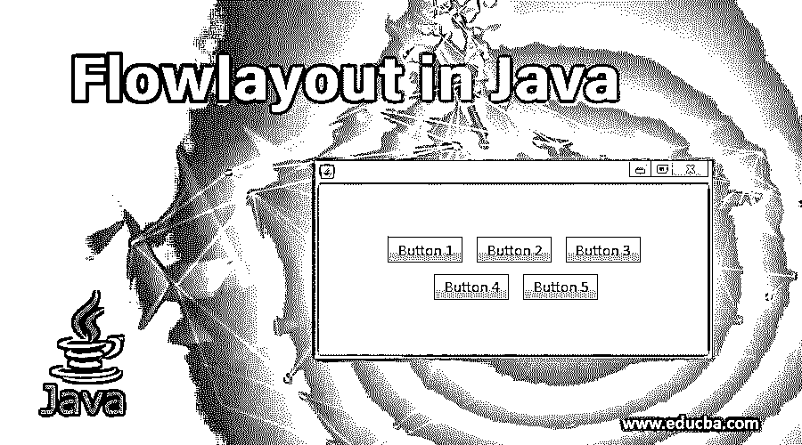

# Java 中的流程布局

> 原文：<https://www.educba.com/flowlayout-in-java/>




## Java 中的 FlowLayout 简介

*   FlowLayout 是 AWT 的布局管理器[之一，用在 applet](https://www.educba.com/what-is-awt-in-java/)中，以从左到右的方式排列组件，就像段落中的单词一样。
*   当组件数量增加超过窗口大小时，默认情况下，Java 会启用 FlowLayout 来排列组件以适合窗口窗格。
*   FlowLayout 是布局管理器提供的默认布局。当您不选择任何布局时，布局将被设置为流动。
*   FlowLayout 使用一些默认设置，比如居中对齐，组件之间水平和垂直间隔为 5 个像素。

“align”属性确定对齐方式。和对齐字段如下:

*   **LEFT:** 向左对齐组件。
*   **RIGHT:** 它将组件向右对齐。
*   **居中:**将组件居中对齐。
*   **前导:**它将位于容器的前导边缘，即从左到右方向的左侧。
*   **尾部:**它将位于容器的尾部边缘，即从左到右的右侧

### Java 中 Flowlayout 的基本概念

在深入 Java 细节中的 FlowLayout 之前，让我们复习一下 FlowLayout 所需的一些基本主题:

<small>网页开发、编程语言、软件测试&其他</small>

**Java AWT** : AWT 是一个用于构建 [GUI](https://www.educba.com/gui-testing/) 或基于窗口的应用程序的 API。

关于 AWT 层次结构的一些基本概念如下:

**1。Container** : Container 是一个类，包含了按钮、textfield、标题栏、菜单栏等所有组件。

**2。组件**:组件是 GUI 对象，比如按钮、标签、文本字段、清单。

有一些基本的组件功能，例如:

*   public void adds (Component c):在这个组件上添加一个组件。
*   public void setSize(int width，int height):设置组件的宽度和高度。
*   public void set layout(layout manager m):定义组件的布局管理器。
*   public void setVisible(布尔状态):定义组件的可见性；默认情况下，它是假的。

**3。Panel** : Panel 是一个容器类。它为应用程序创造了一个空间，所有的组件都可以放入其中。它继承了容器类。

面板不包含菜单栏或标题栏，但可以包含其他组件，如 textfield 和 buttons。

**4。Frame** : Frame 是一个容器类。它包含菜单栏和标题栏，也可以包含其他组件。

**5。布局管理器**:[布局管理器](https://www.educba.com/layout-manager-in-java/)是一个对象，它实现 Layout Manager 接口来确定组件在容器中的大小和位置。

布局管理器有多种类型，每种都有自己的功能和特定任务:

*   流程布局。
*   BorderLayout。
*   卡片布局。
*   BoxLayout。
*   网格布局。
*   GridBagLayout。
*   GroupLayout。
*   SpringLayout。

### FlowLayout 的常用功能

*   **setAlignment(int align):** 为容器的布局设置各自的对齐方式。
*   **getAlignment():** 获取容器布局的对齐方式。
*   **addLayoutComponent():** 将特定组件添加到布局中。
*   **setTitle(字符串文本):**用给定的文本设置容器的标题。

### FlowLayout 中的构造函数

*   **FlowLayout():** 构造一个居中对齐的 FlowLayout 实例，组件之间有 5 个像素的间距。
*   **FlowLayout(int align):** 用给定的对齐方式构造一个 FlowLayout，组件之间有 5 个像素的间距。
*   **FlowLayout(int align，int horizontalGap，int verticalGap):** 使用给定的对齐方式和组件之间给定的水平和垂直间距构建一个 FlowLayout。
*   该构造函数将通过指定的 align 字段进行右对齐、左对齐或居中对齐，并且还提供了在组件之间添加水平间距和垂直间距的选项。

### Java 中的流程布局示例

以下是 java 中的流程布局示例:

**代码:**

```
import java.awt.*;
import java.awt.event.*;
import javax.swing.*;
public class Layout extends JFrame
{
private JButton lb;
private JButton rb;
private JButton cb;
private FlowLayout layout;
private Container container;
public Layout()
{
super("the title");
layout = new FlowLayout();
container = getContentPane();
setLayout(layout); //left alignment
lb = new JButton("left");
add(lb);
lb.addActionListener(
new ActionListener()
{
public void actionPerformed(ActionEvent event)
{
layout.setAlignment(FlowLayout.LEFT);
layout.layoutContainer(container);
}
}
);
//right alignment
rb = new JButton("right");
add(rb);
rb.addActionListener(
new ActionListener()
{
public void actionPerformed(ActionEvent event)
{
layout.setAlignment(FlowLayout.RIGHT);
layout.layoutContainer(container);
}
}
);
//center alignment
cb = new JButton("center");
add(cb);
cb.addActionListener(
new ActionListener(){
public void actionPerformed(ActionEvent event)
{
layout.setAlignment(FlowLayout.CENTER);
layout.layoutContainer(container);
}
}
);
}
}
```

**Java 中流程布局的主要方法:**

```
import javax.swing.*;
public class Test
{
public static void main(String[] args)
{
Layout l = new Layout();
l.setDefaultCloseOperation(JFrame.EXIT_ON_CLOSE);
l.setSize(300, 100);
l.setVisible(true);
}
}
```

**输出:**


**上述代码的解释:**

*   在上面的代码中，我们在 JButton 的帮助下将 3 个按钮声明为 lb、rb 和 cb。
*   当创建类实例时，我们需要看到按钮，所以将按钮添加到类构造函数本身的容器中。
*   我们扩展了 JFrame 类
*   使用 setLayout()函数，我们将布局设置为 flowlayout。
*   当我们单击名为“left”的按钮进行左对齐时，窗格上的按钮应该向左对齐。
*   为此，特定的按钮被添加到窗口面板上，并且在该按钮的点击事件中，布局将被设置为左。
*   在上面的代码中，setAlignment(FlowLayout。LEFT)会将面板布局对齐设置为左对齐。流程布局。左边是可用于对齐的字段。同理，FlowLayout。对，流程布局。中心，流程布局。尾随，流布局。“行距”是用于设置对齐方式的一些其他字段。
*   请注意，这些对齐字段会将所有组件向左、向右或居中对齐。
*   它不取决于你的窗口的大小。它将调整和对齐您的组件与指定的对齐分别。
*   就像我们对左对齐所做的一样，我们开发了中心和右对齐。最后，我们开发了测试类，用于编写 main 方法来测试我们的 FlowLayout Java 代码。
*   通过在 main 方法中创建 Layout 类的实例，我们将窗口大小和组件可见性设置为 true。

### 结论

本教程向您介绍了为什么 Java 有 FlowLayout 及其功能的基本概念。由于其易用性和对齐精度，FlowLayout 是默认布局。记住，当你编码和实践时，每个概念都会变得更加清晰。让错误出现在你的代码中，不要犹豫，继续编码，准确理解这个概念。

### 推荐文章

这是 Java 中的 Flowlayout 指南。这里我们讨论一下 FlowLayout 的基本概念、构造函数和常用函数。您也可以阅读以下文章，了解更多信息——

1.  [Java 中的 JPanel](https://www.educba.com/jpanel-in-java/)
2.  [Java 中的交换](https://www.educba.com/swapping-in-java/)
3.  [Java 中的阶乘](https://www.educba.com/factorial-in-java/)
4.  [Java 中的排序](https://www.educba.com/sorting-in-java/)


