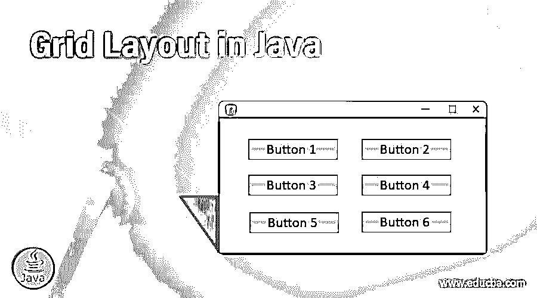

# Java 中的网格布局

> 原文：<https://www.educba.com/grid-layouts-in-java/>




## Java 网格布局简介

回到大多数程序基于命令行界面的时代，用户显示器的大小并不重要。但是随着 GUI 的流行，操作系统提供了在屏幕上调整应用程序大小的能力，我们发现我们需要设计能够相应地适应窗口大小的程序。在这个主题中，我们将学习 Java 中的网格布局。

Grid Layout 就是这样一个系统，它允许我们在一个窗口内安排内容，当窗口变得更小或更大时，所表示的数据不会混乱。

<small>网页开发、编程语言、软件测试&其他</small>

### 什么是网格布局？

windows 的网格布局是使用网格布局类在 Java 中制作的。它代表一个布局管理器，可以在窗口的矩形网格中拥有程序员指定数量的列和行。我们将每个网格布局容器分成矩形，每个都有相同的大小。稍后，我们可以将应用程序的一个组件放入网格布局中的每个矩形中。每个组件将填充其整个单元格。

一旦网格及其单元格内容被布局好，当用户改变容器的大小时，里面的矩形也会相应地改变它们的大小。

以下是网格布局类的构造函数:

1.  **GridLayout():** 这个构造函数可以用来创建一个网格布局，每个组件在一行中有一列。
2.  **GridLayout( int rw，int cl):** 这里 rw 是网格中的行数，cl 表示网格中的列数。一旦使用，构造函数将创建一个具有指定数量的列和行的网格。

在这里，您可以将行数或列数设置为零，这意味着在行或列中可以放置任意数量的对象。请记住，您不能将行数和列数都设置为零。

3.  **GridLayout( int rw，int cl，int hgap，int vgap):** 这里 rw 和 cl 前面是一样的。hgap 是水平间隙，vgap 用于垂直间隙。一旦使用，这个构造函数将使用用户指定的行和列创建一个网格布局。这些行和列之间也会有构造函数中给定的间隙。

此处，垂直间隙将放置在各行之间以及顶部和底部边缘。水平间隙将放置在列之间以及左右边缘。

和前面一样，可以将行数或列数指定为零，但不能同时指定为零和列数。

### 类方法

现在我们已经看了构造函数，让我们看看一些更常用的类方法:

*   **void addLayoutComponent(String name，Component comp):** 该方法将指定的组件和指定的名称一起添加到程序中的网格布局中。
*   **int getColumns():** 这个方法得出网格布局中的列数。
*   **int getRows():** 类似于 getColumns()方法，我们可以用它来获取网格布局中存在的行数。
*   **int getVgap():** getVgap()方法用于查找网格组件之间的垂直间隙。
*   **int getHgap():** 得到网格组件之间的水平间隙。
*   **void setVgap(int vertical gap):**组件之间的垂直间隙可以用 setVgap()类方法设置。
*   **Void set columns(int columns):**用于分配布局中的列数。
*   **Void setRows ( int rows):** 类似于 setColumns()，用于设置网格布局中的行数。
*   **void setVgap( int vgap):** 用于指定组件之间的垂直间隙。
*   **void layout Container(Container pr):**这个方法可以对指定的容器进行布局。
*   **Dimension preferred lay outsize(Container pr):**用于使用网格布局设置容器参数的首选大小。
*   **Dimension minimumLayoutSize(容器 pr):** 用于设置使用网格布局的容器参数的最小尺寸。
*   **void removeLayoutComponent(Component compo):**这个类方法可以用来从网格布局中移除指定的组件。
*   **String toString():**toString()以字符串形式返回网格布局的值。

### 使用网格布局的 Java 程序示例

让我们借助一个例子来看看:

```
package com.exmplegrid.gui;
import java.awt.*;
import java.awt.event.*;
public class GridLayoutExample {
private Frame themainframe;
private Label headLabel;
private Label lable_Status;
private Panel control_panel;
private Label messsagelabel;
public GridLayoutExample()
{
prepareGUI();
}
public static void main(String[] args) {
GridLayoutExample  gridLayoutExample = new GridLayoutExample();
gridLayoutExample.showGridLayoutDemo();
}
private void prepareGUI() {
themainframe = new Frame("Java Grid Examples");
themainframe.setSize(500,500);
themainframe.setLayout(new GridLayout(3, 1));
themainframe.addWindowListener(new WindowAdapter() {
public void windowClosing(WindowEvent windowEvent) {
System.exit(0);
}
} );
headLabel = new Label();
headLabel.setAlignment(Label.CENTER);
lable_Status = new Label();
lable_Status.setAlignment(Label.CENTER);
lable_Status.setSize(350,100);
messsagelabel = new Label();
messsagelabel.setAlignment(Label.CENTER);
messsagelabel.setText(" This is an example of Grid Layout in Java.");
control_panel = new Panel();
control_panel.setLayout(new FlowLayout());
themainframe.add(headLabel);
themainframe.add(control_panel);
themainframe.add(lable_Status);
themainframe.setVisible(true);
}
private void showGridLayoutDemo() {
headLabel.setText("GridLayout");
Panel panel = new Panel();
panel.setBackground(Color.white);
panel.setSize(300,300);
GridLayout layout = new GridLayout(0,3);
layout.setHgap(10);
layout.setVgap(10);
panel.setLayout(layout);
panel.add(new Button(“ This is the button 1"));
panel.add(new Button(“ This is the button 2"));
panel.add(new Button(“ This is the button 3"));
panel.add(new Button(“ This is the button 4"));
panel.add(new Button(“ This is the button 5"));
control_panel.add(panel);
themainframe.setVisible(true);
}
}
```

### 结论

能够创建能够自动调整大小的窗口将有助于您确保 java 程序能够在任何屏幕尺寸上工作。grid Layout 类提供了一种简单的方法来开始这项工作，并在单元格中正确地布置对象。

### 推荐文章

这是 Java 中网格布局的指南。这里我们讨论了 Java 中的构造函数、类方法和网格布局的例子。您也可以浏览我们推荐的其他文章，了解更多信息——

1.  [Java 集合面试问题](https://www.educba.com/java-collection-interview-questions/)
2.  [Java 中的布局](https://www.educba.com/layout-in-java/)
3.  [什么是 JVM？](https://www.educba.com/what-is-jvm/)
4.  [Java WindowListener](https://www.educba.com/java-windowlistener/)


