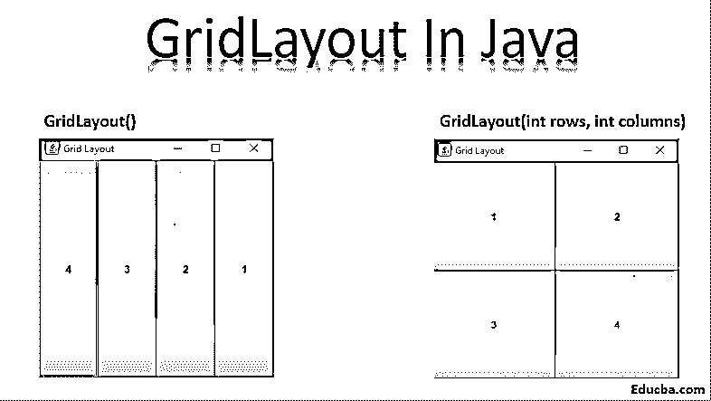
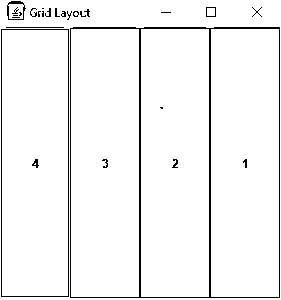
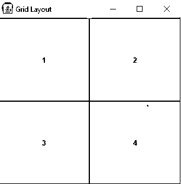
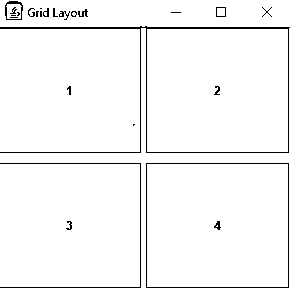
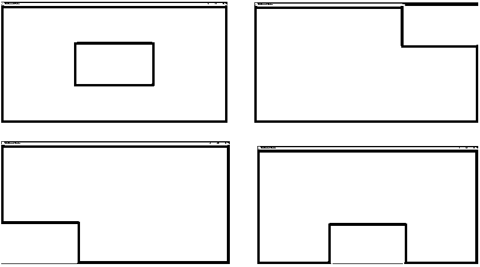

# Java 中的 Gridlayout

> 原文：<https://www.educba.com/gridlayout-in-java/>




## Java 中的 GridLayout 简介

布局管理器在图形编程中用于以特定的方式排列组件。它们用于确定容器中组件的大小和位置。有不同类型的布局管理器可用。 [GridLayout](https://www.educba.com/grid-layouts-in-java/) 就是其中之一。Java 中的 GridLayout 将容器划分为一个由称为行和列的单元格组成的网格。它将组件排列在一个矩形网格中。每个单元只能容纳一个大小相等、间距相等的组件。

**示例:** 3 行 4 列

<small>网页开发、编程语言、软件测试&其他</small>

| One | Two | Three | Four |
| Five | Six | Seven | Eight |
| Nine | Ten | Eleven | Twelve |

### 常见步骤 Java 中的 Gridlayout

以下是一些常见的步骤 java 上的 gridlayout:

1.使用 JFrame 构造函数设置容器:

```
JFrame frame = new JFrame();
```

2.使用 JPanel 构造函数设置面板的布局管理器[:](https://www.educba.com/jpanel-in-java/)

```
JPanel panel = new JPanel();
```

3.向容器添加组件:

```
panel.add(button);frame.add(panel);
```

4.设置组件方向:

```
panel.setComponentOrientation(ComponentOrientation.LEFT_TO_RIGHT);
```

ComponentOrientation 属性的默认值是组件的方向是水平的，从左到右。

### 带示例的构造函数类型

下面是带有示例和代码的构造函数的类型。

#### 1.GridLayout()

在单行中每个组件有一列的空构造函数。

**代码:**

```
import java.awt.*;
import javax.swing.*;
public class GridLayoutDemo {
public static void main(String[] args) {
JFrame frame = new JFrame("Grid Layout");
frame.setVisible(true);
frame.setDefaultCloseOperation(JFrame.EXIT_ON_CLOSE);
frame.setSize(200,200);
JPanel panel = new JPanel();
panel.setLayout(new GridLayout());JButton button1 = new JButton("1");
JButton button2 = new JButton("2");
JButton button3 = new JButton("3");
JButton button4 = new JButton("4");
panel.setComponentOrientation(ComponentOrientation.RIGHT_TO_LEFT);
panel.add(button1);
panel.add(button2);
panel.add(button3);
panel.add(button4);
frame.add(panel);
}
}
```

**输出:**




#### 2.GridLayout(int rows，int columns)

构造函数，具有指定的行数和列数。

**参数:** 

*   **行数-** 行数(值为零表示任意行数)。
*   **列-** 列数(值为零表示任意列数)。

**代码:**

```
import java.awt.*;
import javax.swing.*;
public class GridLayoutDemo {
public static void main(String[] args) {
JFrame frame = new JFrame("Grid Layout");
frame.setVisible(true);
frame.setDefaultCloseOperation(JFrame.EXIT_ON_CLOSE);
frame.setSize(200,200);
JPanel panel = new JPanel();
panel.setLayout(new GridLayout(2,2));
JButton button1 = new JButton("1");
JButton button2 = new JButton("2");
JButton button3 = new JButton("3");
JButton button4 = new JButton("4");
panel.setComponentOrientation(ComponentOrientation.LEFT_TO_RIGHT);
panel.add(button1);
panel.add(button2);
panel.add(button3);
panel.add(button4);
frame.add(panel);
}
}
```

**输出:**




#### 3.GridLayout(int rows，int columns，int horizontal gap，int vertical gap)

构造函数，具有指定的行数和列数，以及行和列之间的水平和垂直间距。

**参数:** 

*   **行数-** 行数(值为零表示任意行数)。
*   **列-** 列数(值为零表示任意列数)。
*   **每列之间的水平间隙-**
*   **每行之间的垂直间隙-**

**抛出:**

IllegalArgumentException-如果行和列的值都设置为零。

**代码:**

```
import java.awt.*;import javax.swing.*;
public class GridLayoutDemo {
public static void main(String[] args) {
JFrame frame = new JFrame("Grid Layout");
frame.setVisible(true);
frame.setDefaultCloseOperation(JFrame.EXIT_ON_CLOSE);
frame.setSize(200,200);
JPanel panel = new JPanel();
panel.setLayout(new GridLayout(2,2,5,10));
JButton button1 = new JButton("1");
JButton button2 = new JButton("2");JButton button3 = new JButton("3");
JButton button4 = new JButton("4");
panel.setComponentOrientation(ComponentOrientation.LEFT_TO_RIGHT);
panel.add(button1);
panel.add(button2);
panel.add(button3);
panel.add(button4);
frame.add(panel);
}
}
```

**输出:**




### 实施示例

**案例:**在下面的程序中，每当鼠标经过一个网格的单元格时，它的颜色就会从黑色变成白色。

**代码:**

```
import java.awt.*;
import javax.swing.*;
import java.awt.event.MouseAdapter;
import java.awt.event.MouseEvent;
public class gridLayout extends JPanel{
public gridLayout() {
super(new GridLayout(3,3));
JLabel label1, label2, label3, label4, label5, label6, label7, label8, label9;
//create the lables
label1 = new JLabel();
label2 = new JLabel();
label3 = new JLabel();
label4 = new JLabel();
label5 = new JLabel();
label6 = new JLabel();
label7 = new JLabel();
label8 = new JLabel();
label9 = new JLabel();
//set the background color for each label
label1.setBackground(Color.BLACK);
label1.setOpaque(true);
label2.setBackground(Color.BLACK);
label2.setOpaque(true);
label3.setBackground(Color.BLACK);
label3.setOpaque(true);
label4.setBackground(Color.BLACK);
label4.setOpaque(true);
label5.setBackground(Color.BLACK);
label5.setOpaque(true);
label6.setBackground(Color.BLACK);
label6.setOpaque(true);
label7.setBackground(Color.BLACK);
label7.setOpaque(true);
label8.setBackground(Color.BLACK);
label8.setOpaque(true);
label9.setBackground(Color.BLACK);
label9.setOpaque(true);
//add mouse listeners for each label
label1.addMouseListener(new MouseAdapter() {
public void mouseEntered(MouseEvent me) {
label1.setBackground(Color.WHITE);
}
public void mouseExited(MouseEvent me) {
label1.setBackground(Color.BLACK);
}
});
label2.addMouseListener(new MouseAdapter() {
public void mouseEntered(MouseEvent me) {
label2.setBackground(Color.WHITE);
}
public void mouseExited(MouseEvent me) {
label2.setBackground(Color.BLACK);
}
});
label3.addMouseListener(new MouseAdapter() {
public void mouseEntered(MouseEvent me) {
label3.setBackground(Color.WHITE);}
public void mouseExited(MouseEvent me) {
label3.setBackground(Color.BLACK);
}
});
label4.addMouseListener(new MouseAdapter() {
public void mouseEntered(MouseEvent me) {
label4.setBackground(Color.WHITE);
}
public void mouseExited(MouseEvent me) {
label4.setBackground(Color.BLACK);}
});
label5.addMouseListener(new MouseAdapter() {
public void mouseEntered(MouseEvent me) {
label5.setBackground(Color.WHITE);
}
public void mouseExited(MouseEvent me) {
label5.setBackground(Color.BLACK);
}});
label6.addMouseListener(new MouseAdapter() {
public void mouseEntered(MouseEvent me) {
label6.setBackground(Color.WHITE);
}
public void mouseExited(MouseEvent me) {
label6.setBackground(Color.BLACK);
}
});
label7.addMouseListener(new MouseAdapter() {
public void mouseEntered(MouseEvent me) {
label7.setBackground(Color.WHITE);
}
public void mouseExited(MouseEvent me) {
label7.setBackground(Color.BLACK);
}
});
label8.addMouseListener(new MouseAdapter() {
public void mouseEntered(MouseEvent me) {
label8.setBackground(Color.WHITE);
}
public void mouseExited(MouseEvent me) {
label8.setBackground(Color.BLACK);
}
});label9.addMouseListener(new MouseAdapter() {
public void mouseEntered(MouseEvent me) {
label9.setBackground(Color.WHITE);
}
public void mouseExited(MouseEvent me) {
label9.setBackground(Color.BLACK);
}
});
//add the labels
add(label1);
add(label2);
add(label3);
add(label4);
add(label5);
add(label6);
add(label7);
add(label8);
add(label9);
}
private static void createAndShowGUI() {
//create and setup the container
JFrame frame = new JFrame("Gridlayout Demo");
frame.setDefaultCloseOperation(JFrame.EXIT_ON_CLOSE);
frame.setSize(300,300);
//add content to the container
frame.add(new gridLayout());
//display the container
frame.pack();
frame.setVisible(true);
}public static void main(String[] args) {
createAndShowGUI();
}
}
```

**输出:**




### 结论

当你想在一个容器中制作网格时，Java 中的 Gridlayout 是很有用的。
还有其他可用的方法也如下所述:
**1 .getRows()**–获取行数。
2**。Set rows(int I)**–将行数设置为指定值。
**3。Get columns()**–获取列数。
**4。Set columns(int I)**–将列数设置为指定值。
**5。geth gap()**–获取组件之间的水平间距。
⑥**⑥。Seth gap(int I)**–将组件之间的水平间隙设置为指定值。
**7.getVgap()-** 获取组件之间的垂直间隙。
**8。setVgap(int I)**–将组件之间的垂直间隙设置为指定值。
**9。addLayoutComponent(String name，Component comp)**–将具有指定名称的指定组件添加到布局中。
10**。removeLayoutComponent(Component comp)-**从容器布局中删除指定的组件。
11**。preferredLayoutSize(容器父级)-** 确定容器的首选大小。
12**。minimumLayoutSize(容器父级)-** 决定容器的最小尺寸。
13**。layoutContainer(容器父级)-** 布局指定的容器。
14**。toString()**–返回网格布局值的字符串表示形式。

### 推荐文章

这是 Java 中 Gridlayout 的指南。这里我们讨论了基本概念，构造函数的类型和例子，代码和实现。您也可以浏览我们的其他相关文章，了解更多信息——

1.  [Java 中的合并排序](https://www.educba.com/merge-sort-in-java/)
2.  [Java 中的布局](https://www.educba.com/layout-in-java/)
3.  [HTML 布局](https://www.educba.com/html-layout/)
4.  [Java 中的布局管理器](https://www.educba.com/layout-manager-in-java/)


