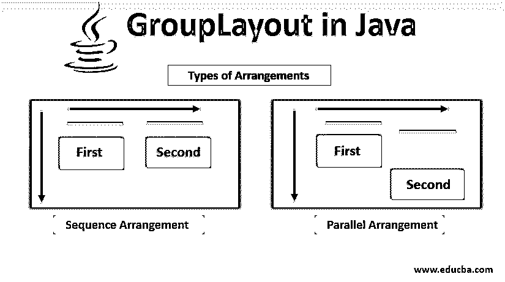
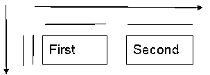
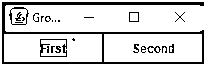
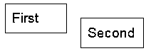
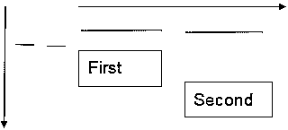
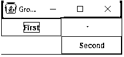
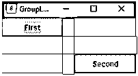
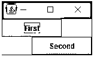
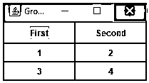

# Java 中的 GroupLayout

> 原文：<https://www.educba.com/grouplayout-in-java/>




## Java 中的 GroupLayout 简介

在 java 的 GroupLayout 中，布局管理器就像是 Java 组件的不同类型的“自动换行”。与字处理程序中的“自动换行”功能将文本字符换行到下一行的方式相同，布局管理器将“Swing 组件”换行到 JFrame 或 JApplet 的可视区域。布局管理器源自 AWT 包。GroupLayout managers 是一个布局管理器，它将组件分组并排列在 JFrame 或 JApplet 中。它用于开发图形用户界面。

对于组件，GroupLayout 使用两种类型的排列:

<small>网页开发、编程语言、软件测试&其他</small>

*   **顺序排列:**在这种排列中，组件按顺序一个接一个地排列。
*   **平行排列:**在这种排列中，组件平行放置在同一位置。

当它们分层嵌套时，这两种排列变得更加强大，因为 GroupLayout 定义了布局组。组可以是平行的，也可以是顺序的，并且可以包含元件、其他组和间隙。

*   **顺序组的大小:**一个容器中包含的所有组件的大小之和。
*   **平行组尺寸:**容器内最大部件的尺寸。

### Java 中 GroupLayout 类的构造函数

下面是 grouplayout 类的构造函数:

**GroupLayout(容器主机):**对于指定的容器，创建一个 GroupLayout。

**举例:**

```
import java.awt.*;
import javax.swing.*;
public class GroupLayoutExample extends JFrame{
JPanel grpPanel = new JPanel();
GroupLayout grpLayout = new GroupLayout(grpPanel);
}
```

**定义布局:**通过组合顺序的&并联组，在 JFrame 或 JApplet 内部排列组件[的方式。](https://www.educba.com/jframe-in-java/)

### 用 Java 实现 GroupLayout 的示例

以下是在 Java 中实现 GroupLayout 的不同示例:

#### 示例#1

让我们从一个简单的例子开始，一行中有两个组件。


我们将使用组来描述这个布局。从水平轴开始，从左到右是两个组件的连续组。从垂直轴开始，具有相同位置的两个组件的平行组。




**代码:**

```
import java.awt.*;
import javax.swing.*;
public class GroupLayoutExample extends JFrame{
JPanel panel = new JPanel();
JButton BFirst = new JButton("First");
JButton BSecond = new JButton("Second");
GroupLayout gl = new GroupLayout(panel);
public GroupLayoutExample() {
panel.setLayout(gl);
SetButton(BFirst,100,30);
SetButton(BSecond,100,30);
SetLayout();
Build();
}
public void SetButton(JButton button, int width, int height) {
button.setMinimumSize(new Dimension(width,height));
}
public void SetLayout() {
gl.setHorizontalGroup(gl.createSequentialGroup()
.addComponent(BFirst)
.addComponent(BSecond));
gl.setVerticalGroup(gl.createParallelGroup()
.addComponent(BFirst)
.addComponent(BSecond));
}
public void Build() {
setContentPane(panel);
pack();
setDefaultCloseOperation(JFrame.EXIT_ON_CLOSE);
setLocationRelativeTo(null);
setTitle("GroupLayout Example");
setVisible(true);
}
public static void main(String[] args) {
new GroupLayoutExample();
}
}
```

**输出:**




#### 实施例 2

假设有如下两个组件:




我们将使用组来描述这个布局。从水平轴开始，从左到右是两个组件的连续组。从垂直轴开始，从左到右是两个组件的连续组。




**代码:**

```
import java.awt.*;
import javax.swing.*;
public class GroupLayoutExample extends JFrame{
JPanel panel = new JPanel();
JButton BFirst = new JButton("First");
JButton BSecond = new JButton("Second");
GroupLayout gl = new GroupLayout(panel);
public GroupLayoutExample() {
panel.setLayout(gl);
SetButton(BFirst,100,30);
SetButton(BSecond,100,30);
SetLayout();
Build();
}
public void SetButton(JButton button, int width, int height) {
button.setMinimumSize(new Dimension(width,height));
}
public void SetLayout() {
gl.setHorizontalGroup(gl.createSequentialGroup()
.addComponent(BFirst)
.addComponent(BSecond));
gl.setVerticalGroup(gl.createSequentialGroup()
.addComponent(BFirst)
.addComponent(BSecond));
}
public void Build() {
setContentPane(panel);
pack();
setDefaultCloseOperation(JFrame.EXIT_ON_CLOSE);
setLocationRelativeTo(null);
setTitle("GroupLayout Example");
setVisible(true);
}
public static void main(String[] args) {
new GroupLayoutExample();
}
}
```

**输出:**




#### 实施例 3

一个缝隙就像一个一定大小的隐形组件。

它们通常用于控制组件之间的距离或距离容器边框的距离。它还将自动间隙定义为相邻零部件之间的首选距离。它在组件或组件和边框之间使用三种类型的间隙:相关的、不相关的和缩进的。序列组独有的东西是间隙。间隙按照指定的像素数来分隔组件。现在我们将给出 20°的水平间隙和 30°的垂直间隙。

**代码:**

```
import java.awt.*;
import javax.swing.*;
public class GroupLayoutExample extends JFrame{
JPanel panel = new JPanel();
JButton BFirst = new JButton("First");
JButton BSecond = new JButton("Second");
GroupLayout gl = new GroupLayout(panel);
public GroupLayoutExample() {
panel.setLayout(gl);
SetButton(BFirst,100,30);
SetButton(BSecond,100,30);
SetLayout();
Build();
}
public void SetButton(JButton button, int width, int height) {
button.setMinimumSize(new Dimension(width,height));
}
public void SetLayout() {
gl.setHorizontalGroup(gl.createSequentialGroup()
.addComponent(BFirst)
.addGap(20)
.addComponent(BSecond));
gl.setVerticalGroup(gl.createSequentialGroup()
.addComponent(BFirst)
.addGap(30)
.addComponent(BSecond));
}
public void Build() {
setContentPane(panel);
pack();
setDefaultCloseOperation(JFrame.EXIT_ON_CLOSE);
setLocationRelativeTo(null);
setTitle("GroupLayout Example");
setVisible(true);
}
public static void main(String[] args) {
new GroupLayoutExample();
}
}
```

**输出:**




#### 实施例 4

但是如果我们想要一个平行组中的间隙呢？

但是间隙不能用在平行组中。所以，一种不同的方法被用来创造一个缺口。它使用并行组和顺序组的组合。它从一个平行组和第一个组件开始。然后，它在并行组内部有一个顺序组。并在该顺序组内添加一个间隙，最后添加第二个组件。垂直组以连续的方式包含两个组件。

**代码:**

```
import java.awt.*;
import javax.swing.*;
public class GroupLayoutExample extends JFrame{
JPanel panel = new JPanel();
JButton BFirst = new JButton("First");
JButton BSecond = new JButton("Second");
GroupLayout gl = new GroupLayout(panel);
public GroupLayoutExample() {
panel.setLayout(gl);
SetButton(BFirst,100,30);
SetButton(BSecond,100,30);
SetLayout();
Build();
}
public void SetButton(JButton button, int width, int height) {
button.setMinimumSize(new Dimension(width,height));
}
public void SetLayout() {
gl.setHorizontalGroup(gl.createParallelGroup()
.addComponent(BFirst)
.addGroup(gl.createSequentialGroup()
.addGap((int)(BFirst.getMinimumSize().getWidth()/2))
.addComponent(BSecond))
);
gl.setVerticalGroup(gl.createSequentialGroup()
.addComponent(BFirst)
.addComponent(BSecond));
}
public void Build() {
setContentPane(panel);
pack();
setDefaultCloseOperation(JFrame.EXIT_ON_CLOSE);
setLocationRelativeTo(null);
setTitle("GroupLayout Example");
setVisible(true);
}
public static void main(String[] args) {
new GroupLayoutExample();
}
}
```

**输出:**




#### 实施例 5

现在我们将创建复合布局。

我们需要创建一个网格布局和 JPanel 来支持该布局，并以(2，2)模式设置四个按钮。首先，我们从水平组中的平行组开始，然后添加网格布局面板。并且在水平方向上按顺序添加这两个按钮。接下来，在垂直组中，从顺序组开始。然后我们将添加网格布局 JPanel。接下来，是两个按钮的平行组。最后，完成的构建方法。

**代码:**

```
import java.awt.*;
import javax.swing.*;
public class GroupLayoutExample extends JFrame{
JPanel grpPanel = new JPanel(), grdPanel = new JPanel();
JButton BFirst = new JButton("First"), BSecond = new JButton("Second"), BGrid[] = new JButton[4];
GroupLayout grpLayout = new GroupLayout(grpPanel);
GridLayout grdLayout = new GridLayout(2,2);
public GroupLayoutExample() {
grpPanel.setLayout(grpLayout);
SetButton(BFirst,100,30);
SetButton(BSecond,100,30);
SetLayout();
Build();
}
public void SetButton(JButton button, int width, int height) {
button.setMinimumSize(new Dimension(width,height));
}
public void SetLayout() {
for(int i=0; i<4; i++) {
BGrid[i] = new JButton(String.valueOf(i+1));
grdPanel.add(BGrid[i]);
}
grdPanel.setLayout(grdLayout);
grpLayout.setHorizontalGroup(grpLayout.createParallelGroup()
.addComponent(grdPanel)
.addGroup(grpLayout.createSequentialGroup()
.addComponent(BFirst)
.addComponent(BSecond))
);
grpLayout.setVerticalGroup(grpLayout.createSequentialGroup()
.addGroup(grpLayout.createParallelGroup()
.addComponent(BFirst)
.addComponent(BSecond))
.addComponent(grdPanel)
);
}
public void Build() {
setContentPane(grpPanel);
pack();
setDefaultCloseOperation(JFrame.EXIT_ON_CLOSE);
setLocationRelativeTo(null);
setTitle("GroupLayout Example");
setVisible(true);
}
public static void main(String[] args) {
new GroupLayoutExample();
}
}
```

**输出:**




### 结论

当您希望将组件按层次分组到一个容器中时，GroupLayout 非常有用。我们在本文中使用的一些有用的方法是:

1.  Java 组布局。createParallelGroup():创建并返回一个并行组。
2.  Java 组布局。createSequentialGroup():创建并返回一个 SequentialGroup。

### 推荐文章

这是一个 Java 中的 GroupLayout 指南。在这里，我们在五个不同的例子中讨论了 grouplayout 类的基本概念和构造函数。您也可以浏览我们的其他相关文章，了解更多信息——

1.  [Java 中的 BorderLayout](https://www.educba.com/borderlayout-in-java/)
2.  [Java 中的 box layout](https://www.educba.com/boxlayout-in-java/)
3.  [Java 中的网格布局](https://www.educba.com/grid-layouts-in-java/)
4.  [Java 中的 card layout](https://www.educba.com/cardlayout-in-java/)


