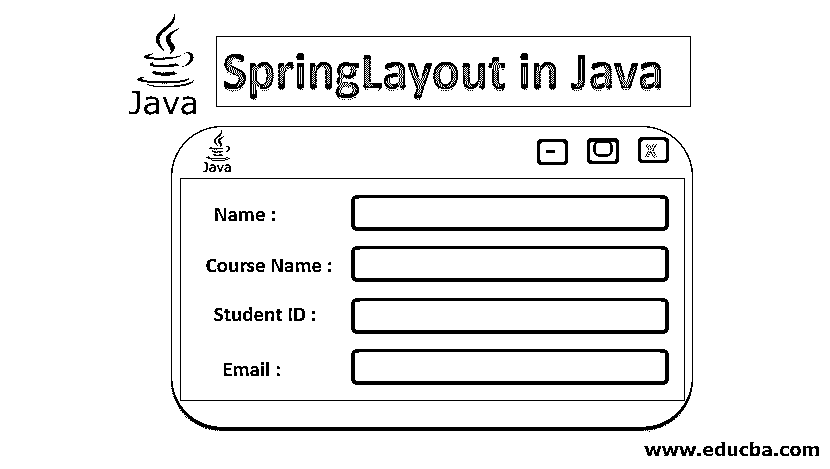
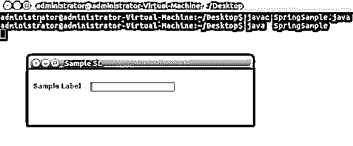

# Java 中的 SpringLayout

> 原文：<https://www.educba.com/springlayout-in-java/>




## Java 中的 SpringLayout 简介

在本文中，我们将了解 Java 最灵活的布局管理器之一，它也继承了其他布局管理器的各种特性。在 AWT([Abstract Window Toolkit](https://www.educba.com/what-is-awt-in-java/))中，一个 SpringLayout 类负责根据一组布局限制将子元素布局到其链接的容器中。

在了解 SpringLayout 之前，我们先来看看 Spring 框架。

<small>网页开发、编程语言、软件测试&其他</small>

简单地说， [Spring Framework](https://www.educba.com/what-is-spring-framework/) 是解决各种障碍的一体化解决方案。为了开发企业应用程序，Spring Framework 使用了众多的[方法，如依赖注入](https://www.educba.com/dependency-injection-in-spring/) (DI)、面向方面编程(AOP)和普通 java 对象(POJO)。Spring 是一个开源的轻量级框架，它让 Java 开发人员可以构建可靠、可伸缩和简单的企业应用程序。Spring 于 2004 年发布，在此期间根据需要进行了重大的修改。

现在，如前所述，SpringLayout 是一个非常灵活的布局管理器，它继承了各种其他布局管理器的功能，是在 1.4 版本中添加的。扩展一下，[布局管理器是一个 java](https://www.educba.com/layout-manager-in-java/) 对象，它实现 layout manager 接口，负责决定位置和大小。Spring Layout 只是定义了组件边缘之间的关系，与其他布局管理器不同，SpringLayout 不会自动设置任何组件的位置。也就是说，SpringLayout 准确地支持 LayoutManager2 契约。SpringLayout 还提供了一些解决方案来解决不能通过干预盒子来解决的问题。

### Java 中 SpringLayout 的构造函数

简单地说，Java 构造函数是一个程序代码块，它初始化一个对象，并与类同名。java 中有各种[类型的构造函数。为了以各种方式创建对象，我们可以重载构造函数，对于编译器，构造函数是根据传递的参数的数量、类型和顺序来区分的。](https://www.educba.com/constructor-in-java/)

public SpringLayout()是一个简单的 Java 构造函数，它基本上构造了一个新的 SpringLayout。

java 编程语言中的每个类都有一个构造函数，如果没有创建，Java 会隐式调用一个值设置为零的默认构造函数。

### Java 中的 SpringLayout 方法

基本上，java 方法是程序语句的集合，类似于上面提到的构造函数，有指定的名称，可以在代码中随时随地调用/调用。一个方法可以被看作一个子程序。与构造函数不同，方法返回一个值。

现在，为了更进一步，SpringLayout 类提供了广泛的方法，下面是几个方法的细节。

**1。void addLayoutComponent(Component com，Object constraints):** 这里我们有一个 void 类型的修饰符，和一个名为 addLayoutComponent 的方法，它有两个参数，string 和 Component。

**2。void layoutContainer(容器父级):**与上面相同的修饰符，名为 layoutContainer，这里的父级是必须布局的容器。

**3。Dimension preferredLayoutSize(Container parent):**这里我们有 Dimension 类，它总结了单个对象中组件的高度和宽度。父级是要布局的容器。

**4。Dimension minimumLayoutSize(容器父级):**对于相同的维度类，minimumLayoutSize 只是计算容器的最小尺寸，父级是要布局的容器。SpringLayout 还提供了 maximumLayoutSize 和 Dimension 类，后者返回最大维度大小。

**5。void removeLayoutComponent(Component Component):**与前面提到的相同的修饰符，将组件的名称作为参数传递。这里，removeLayoutComponent 只是从布局中删除参数中提到的组件。

**6。spring get constraint(String edgeName，Component Component):**get constraint 带两个参数，一个是 edge name，必须是 SpringLayout 中的一个。东边，春城。西，斯普林莱德。北，斯普林莱德。南边，春城。垂直居中，SpringLayout。水平居中或弹簧布局。基线和我们希望其边弹簧的组件的名称。

7 .**。void putConstraint(Str e1，Comp c1，int pad，Str e2，Comp c2):** 这个方法总共需要五个参数。两根弦、两个部件和一个弹簧。简单地说，putConstraint 连接组件 c1 的边 e1 和组件 c2 的边 e2，以及边之间的指定距离。

除了上面提到的方法，SpringLayout 为各种操作提供了广泛的方法，getLayoutAlignmentX 和 getLayoutAlignmentY 返回 0.5f，是 float 类型。

### 用 Java 演示 SpringLayout 的简单 Java 程序

现在我们已经理解了整个 pf SpringLayout 及其类和方法，让我们编写一个简单的程序来演示一个样本布局。我们将有一个单一的基本标签，一个文本框，和一个标题。

下面是一个演示 SpringLayout 类工作的示例程序。

**代码:**

```
import java.awt.Component;
import java.awt.Container;
import javax.swing.JFrame;
import javax.swing.JLabel;
import javax.swing.JTextField;
import javax.swing.SpringLayout;
public class SpringSample {
public static void main(String args[]) {
JFrame Sampleframe = new JFrame("Sample SL");
Sampleframe.setDefaultCloseOperation(JFrame.EXIT_ON_CLOSE);
Container sampleCP = Sampleframe.getContentPane();
SpringLayout SampleSL = new SpringLayout();
sampleCP.setLayout(SampleSL);
Component left = new JLabel("Sample Label");
Component right = new JTextField(15);
sampleCP.add(left);
sampleCP.add(right);
SampleSL.putConstraint(SpringLayout.NORTH, right, 27, SpringLayout.NORTH, sampleCP);
SampleSL.putConstraint(SpringLayout.NORTH, left, 27, SpringLayout.NORTH, sampleCP);
SampleSL.putConstraint(SpringLayout.WEST, left, 12, SpringLayout.WEST, sampleCP);
SampleSL.putConstraint(SpringLayout.WEST, right, 22, SpringLayout.EAST, left);
Sampleframe.setSize(450, 110);
Sampleframe.setVisible(true);
}
}
```

将上述代码保存在一个文件中。java 扩展。用 javac filename.java 编译 java 代码，然后将类文件作为 java 类执行。执行代码后，您将得到具有指定布局、单个标签和文本框的简单输出。参考下面的截图进一步了解。

**输出:**




**代码解释:**我们通过导入所需的包进行初始化。我们从 javax.swing 调用了 JLabel、JTextField、SpringLayout，从 Java 抽象窗口工具包调用了两个包。我们定义了一个类和里面的 main 方法。然后我们定义了一个以“SpringLayout Sample”为标题的框架。然后，我们添加了一个标签，如 JLabel(" Label1 ")，其中 label 1 是标签的标题，一个文本框是 JTextField(15)，15 是指定文本框大小的协议。后来，我们定义了基于所有方向的 SpringLayout，以及 contentPane 的 left 和 right。最后，我们用 setSize(300，100)将帧大小和可见性设置为 true。现在我们有了一个简单的 SpringLayout，只有一个标签和一个文本框。

### 结论

SpringLayout 是一个 java 类，它根据一组限制来设置相关容器的子容器。代表这些限制的对象具有最小值、最大值、首选值和当前值。我们理解了 SpringLayout 类，它的构造函数和方法，以及 SpringLayout 相对于其他布局管理器的优势。

### 推荐文章

这是一个 Java 的 SpringLayout 指南。这里我们讨论 java 中 SpringLayout 的构造函数和方法以及它的代码解释。您也可以阅读以下文章，了解更多信息——

1.  [Java 中的 BorderLayout](https://www.educba.com/borderlayout-in-java/)
2.  [Java 中的 card layout](https://www.educba.com/cardlayout-in-java/)
3.  [Java 中的 Gridlayout](https://www.educba.com/gridlayout-in-java/)
4.  [Java 中的 box layout](https://www.educba.com/boxlayout-in-java/)


