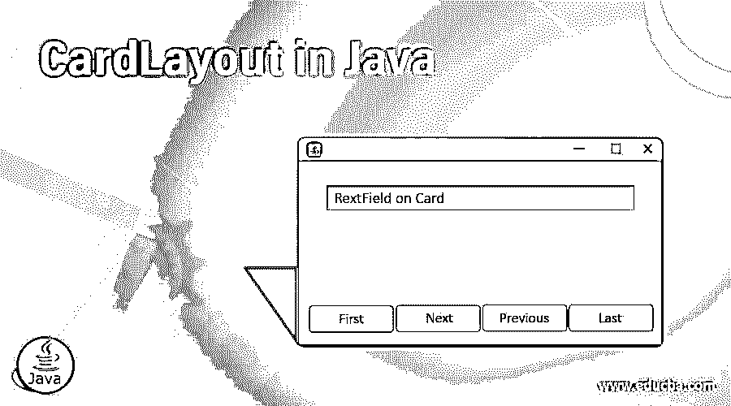
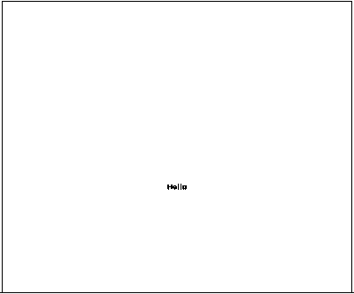
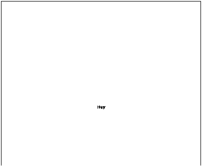
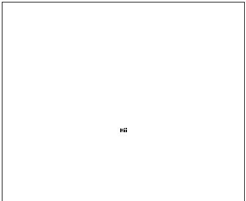

# Java 中的卡片布局

> 原文：<https://www.educba.com/cardlayout-in-java/>




## Java card layout 简介

下面这篇文章 java 中的 CardLayout 提供了 Java 中 card Layout 的不同方法的概要，因为我们知道 Java 中布局的概念，以及不同的[布局管理器](https://www.educba.com/layout-manager-in-java/)如何帮助在一个容器中管理如此多的组件而不影响彼此的定位。卡片布局就是其中之一。与一次显示一个容器组件的其他布局不同，卡片布局，顾名思义，就像一副只有一张牌的扑克牌，即一次只能看到最上面的一张牌。它将容器中的每个组件都视为一张卡片，而容器则充当一堆卡片。容器中卡片的顺序是内部定义的。当容器第一次显示时，它是容器中第一个可见的组件。

### Java 中 CardLayout 的构造函数

CardLayout 是 Java 的一个类，它有一些构造函数。下面给出了 Java 中 CardLayout 的一些构造函数:

<small>网页开发、编程语言、软件测试&其他</small>

#### 卡片布局()

这个 Java 类 CardLayout 的构造函数用于创建一个新的 CardLayout，不同组件之间的间距大小为零(0)。

#### CardLayout(int hgap，int vgap)

Java 的这个构造函数用于创建一个新的 CardLayout，组件之间有水平和垂直的间隙，正如参数中提到的。Hgap 表示水平间隙，而 vgap 表示组件之间的垂直间隙。

### Java 中 CardLayout 类的方法

下面给出了 CardLayout 类的方法列表:

| **方法名** | **方法描述** |
| 公共 void 优先(容器父级) | 用于翻到所提供容器的第一张卡片的方法 |
| 公共 void last(容器父级) | 用于翻到所提供容器的最后一张卡片的方法 |
| 公共 void next(容器父级) | 用于翻到所提供容器的下一张卡片的方法 |
| 公共 void 上一个(容器父级) | 用于翻到所提供的容器的上一张卡片的方法 |
| 公共 void 显示(容器父级，字符串名称) | 用于翻转到具有给定名称的指定容器的方法 |
| getVgap() | 用于获取组件之间垂直间隙的方法 |
| getHgap() | 用于获取组件之间水平间隙的方法 |
| void addLayoutComponent(组件 com，对象约束) | 用于将指定组件添加到卡片布局内部组件表的方法 |
| 浮动 getLayoutAlignmentX(容器父级) | 该方法返回沿 x 轴的对齐方式 |
| 浮动 getLayoutAlignmentX(容器父级) | 该方法返回沿 y 轴的对齐方式 |
| 维度最大布局尺寸(容器目标) | 给定目标容器中的组件，方法返回布局的最大尺寸。 |
| 维度 mimimumLayoutSize(容器目标) | 给定目标容器中的组件，方法返回布局的最小尺寸。 |
| 维度首选 LayoutSize(容器父级) | 在这个方法中，使用卡片布局，确定容器参数的首选大小 |
| void removeLayoutComponent(组件组件) | 此方法从卡片布局中移除指定的组件 |
| toString()字符串 | 这个方法返回这个卡片布局的字符串表示 |
| void invalidateLayout(容器目标) | 该方法使容器失效，表明如果布局管理器已经缓存了一些信息，它是否应该被丢弃。 |

### Java card layout 示例

以下是用 java 实现 cardlayout 的示例:

**代码:**

```
// importing all the necessary packages
import java.awt.*;
import java.awt.event.*;
import javax.swing.JFrame;
import javax.swing.*;
// Class Cardlayout is extending the JFrame and implementing the interface of ActionListener
public class Cardlayout extends JFrame implements ActionListener {
// Declaring the objects of the above mentioned Cardlayout class.
CardLayout cd;
// Declaring the objects of JButton class which we want in our JFrame
JButton jb1, jb2, jb3;
// Declaring the object of the Container class with the name ‘con’.
Container con;
// Using the constructor of the class CardLayout in order to initialise the above objects
Cardlayout()
{
// using the method in order to get the content
con = getContentPane();
// Initializing the object "cd” of CardLayout class with horizontal and vertical spaces as 70 and 50 respectively
cd = new CardLayout(70, 50);
// setting of the layout using the setLayout method
con.setLayout(cd);
// Initialising the object "jb1" of the above JButton class.
jb1 = new JButton("Hello");
// Initialising the object "jb2" of the above JButton class.
jb2 = new JButton("Hey");
// Initialising the object "jb3" of the above JButton class.
jb3 = new JButton("Hii");
// Using this Keyword in order to refers to the current object.
// Adding of Jbutton "jb1" on JFrame using the methods of ActionListener
jb1.addActionListener(this);
// Adding of Jbutton "jb2" on JFrame.
jb2.addActionListener(this);
// Adding of Jbutton "jb3" on JFrame.
jb3.addActionListener(this);
// Adding of the above buttons to the container one by one
// Adding the JButton "jb1" using add method
con.add("a", jb1);
// Adding the JButton "jb2" similar to the above
con.add("b", jb2);
// Adding the JButton "jb3" in the container
con.add("c", jb3);
}
public void actionPerformed(ActionEvent e)
{
// using next method to call the next card
cd.next(con);
}
// Main Method of Java class from where the execution starts
public static void main(String[] args)
{
// Creating Object of CardLayout class.
Cardlayout cl1 = new Cardlayout();
// Setting the title of JFrame
cl1\. setTitle("Checking how Card Layout works");
// Setting the size of JFrame.
cl1.setSize(800, 800);
// Setting the resizable value of JFrame.
cl1.setResizable(false);
// Setting the visibility of JFrame.
cl1.setVisible(true);
// Function to set default operation of JFrame.
cl1.setDefaultCloseOperation(EXIT_ON_CLOSE);
}
}
```

**输出:**

因此，如下所示，输出将是一个 JFrame，其中第一个按钮首先显示名称“Hello ”:




点击它，显示第二个按钮“嘿”:




然后点击它的按钮，“Hii”显示给用户。




**说明:**

在上面的示例中，Cardlayout 是继承 JFrame 并实现 ActionListener 接口的类名。我们试图在一个 JFrame 中安排不同的 JLabel 组件。我们正在[创建 3 个名为 jb1、jb2、jb3 的 jButtons](https://www.educba.com/jbutton-in-java/) ，并将它们添加到 JFrame 中。使用 add()方法将按钮添加到 JFrame 中。在 main 函数中，使用了各种方法，如 setVisible()来设置框架的可见性，setResizable 来设置可调整的大小，setTitle 和 setSize 来设置框架的标题和大小。

### 结论

Java 中有各种类型的布局，每种布局都有自己安排组件的方式。为了在 GUI 应用程序上高效地工作，对于程序员来说，对每一个布局的深刻而实用的理解是非常重要的。图形编程在其开发中也使用布局管理器，这是 IT 行业的趋势。

### 推荐文章

这是一个 Java card layout 的指南。这里我们讨论 Java 中 Cardlayout 的基本概念、构造函数和方法，以及一些例子。您也可以阅读以下文章，了解更多信息——

1.  [Java 中的合并排序](https://www.educba.com/merge-sort-in-java/)
2.  [Java 中的快速排序](https://www.educba.com/quick-sort-in-java/)
3.  [Java 中的 While 循环](https://www.educba.com/while-loop-in-java/)
4.  [HTML 布局](https://www.educba.com/html-layout/)


